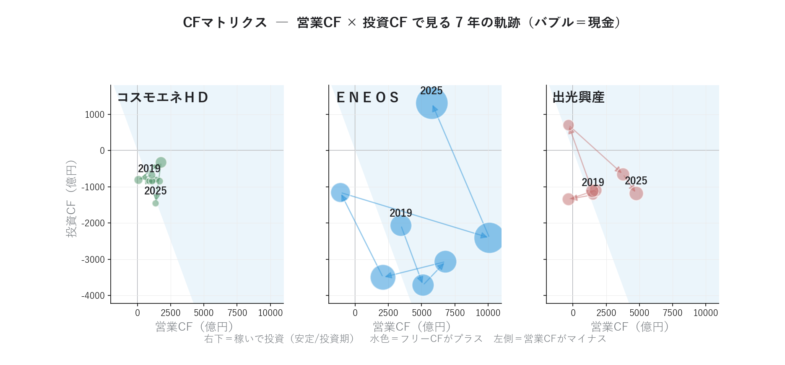

# 決算 XBRL を JSON に変換 ― 「決算そのもの」を分析、元売3社を比較

{width="1280"}

企業が有価証券報告書を金融庁（EDINET）に提出するときは、決算データを XBRL という形式で出します。しかし、XBRL は複雑な構造で、そのまま分析に使うのは現実的ではありません。そのため、**XBRL を JSON という形式に変換**する必要があります。

本記事では、 取得した XBRL を JSON 化し、代表的な財務指標の時系列推移を可視化します。そこで見えてきたのが、ＥＮＥＯＳ のピークアウトです。

データ出典: EDINET API（金融庁）の有報 XBRL（2023〜2025 年提出の 3 本、主要経営指標 5 年表から 2019/3〜2025/3 の 7 期分を構成） / TDnet の決算短信 XBRL。自前パーサで JSON 正規化

<a class="ref-card ref-card--quiet" href="https://developer.mozilla.org/ja/docs/Learn/JavaScript/Objects/JSON" target="_blank" rel="noopener">

JSON とは
構造化データを表す標準のテキスト形式 ― MDN Web Docs

</a>

## XBRL を JSON に変換する

XBRL は、要素（タグ）と文脈（context）で値を表す XML です。ただし同じ「売上高」でも、会計基準や業種でタグが違います。

| 課題 | 例 |
| --- | --- |
| 会計基準でタグが違う | 売上 ＝ `NetSales`（日本基準）/ `RevenueIFRS`（IFRS） |
| 業種別タクソノミがある | 石油・ガス業は `jpigp_cor:` の独自タグ |
| 文脈が分離される | 当期 / 前期 / 連結 / 個別が context の組み合わせで決まる |
| 1 ファイルに数百タグ | 必要な財務項目はそのうち 40 程度 |

そこで対応表を作成して、**分析できるかたちの「JSON」** に変換します。JSON に変換した後は、Python の数行で全銘柄を横串分析できます。

## JSON 化した有報で、元売 3 社の 7 年を読む

有報 XBRL は過去年度分も無料で取得でき、業績指標の時系列を表現できます。ここでは、2023〜2025 年提出の有報 3 本（主要経営指標 5 年表）を重ねて 2019/3〜2025/3 の 7 期分を構成し、代表的な業績指標を使って石油元売 3 社のチャートを作成しました。後の連載では、JSON 化したデータを使い、アクルーアル分析やセグメント分析など、さらに深い分析を行っていきます。

### 規模は回復、財務体質はむしろ改善

売上高（左）と自己資本比率（右）を、同じ 7 年で重ねたチャートです。

<i class="fa-solid fa-expand"></i> クリックで拡大

使用データ: 売上高・自己資本比率＝有価証券報告書の XBRL（2019〜2025年3月期の7期分、主要経営指標の時系列で構成）

{width="1200"}

- 売上高はＥＮＥＯＳ・コスモが 2021 年を底に、出光も 2021 年を谷に回復し、規模では ━ **ＥＮＥＯＳ** が突出
- 自己資本比率は **3 社とも上昇** ― 規模を取り戻しながら財務体質はむしろ強化
- とくに ━ **コスモエネＨＤ** は 2020 年 15% → 2025 年 27% へ大幅改善、ＥＮＥＯＳ・出光も 30% 台へ
- 「規模（売上）」と「体質（自己資本比率）」を重ねると、1 期の損益では見えない安定度まで読める

### 3 社とも 2022 がピーク ― そして直近ピークアウト

純利益（左）と ROE（右）の 7 年推移です。

<i class="fa-solid fa-expand"></i> クリックで拡大

使用データ: 純利益・ROE＝有価証券報告書の XBRL（2019〜2025年3月期の7期分、主要経営指標の時系列で構成）

{width="1200"}

<small>※ コスモエネＨＤ・出光興産の 2020 年 ROE は赤字で報告値が非開示のため、純利益÷自己資本で簡易補完しています。</small>

- 純利益は 3 社そろって **2022 年がピーク**（━ **ＥＮＥＯＳ** 5.4 千億円）― 原油高で在庫評価益が膨らんだ特殊年
- ROE も一時 **20〜35%** まで急騰、しかし直近は優良ライン（ROE 10%）前後まで低下
- **「2022 の記憶」と「足元の実力」のギャップ**が鮮明（2025 はのれん減損などの一時要因も含む）
- 1 期だけ見ると見誤るが、**7 年スパンで並べると構造が一目**

### 営業 CF は健在 ― 利益より「嘘をつきにくい」

営業・投資・財務の 3 つのキャッシュフローを、3 社分並べたチャートです。

<i class="fa-solid fa-expand"></i> クリックで拡大

使用データ: 営業・投資・財務CF＝有価証券報告書の XBRL（2019〜2025年3月期の7期分、主要経営指標の時系列で構成）

{width="1200"}

- この図の ━ の色は会社別ではなく **CF 種別** を表します
- 純利益が落ちても ━ **営業 CF** は概ねプラス基調（ＥＮＥＯＳ 2023、出光 2020・2023 は運転資本要因で一時マイナス）― 本業の現金創出力は健在
- ━ 投資 CF・━ 財務 CF と並べると、稼いだ現金を「投資に回したか／株主に返したか」まで読める
- **利益は会計処理で動くが、現金の出入りは動かしにくい** ― この視点は後の「アクルーアル分析」で深掘り

### CFマトリクス ― 「稼ぐ力 × 投資」で会社の局面を読む

営業CFを横軸・投資CFを縦軸に取り、年ごとの点を結ぶと、会社が「**稼いで投資する**」局面にいるか、それとも「**稼げていない**」局面かが地図のように読めます。これを **CFマトリクス** と呼びます。横軸の右ほど本業で稼ぎ、縦軸の下ほど投資にお金を回している状態です。

<i class="fa-solid fa-expand"></i> クリックで拡大

使用データ: 営業CF・投資CF・現金＝有価証券報告書の XBRL（元売 3 社 × 7 期、2019〜2025 年 3 月期）

{width="1200"}

- 3 社とも平常時は **右下（営業＋・投資−）＝稼いで投資する局面** にいて、フリーCF（水色）もプラス基調 ― 本業で稼ぎ、設備に投じる王道の形
- **ＥＮＥＯＳ 2023 だけ営業CFがマイナスに振れ、左へ大きく外れる** ― ただし運転資本の一時要因で、翌 2024 年は営業CF 1 兆円超で右へ戻る
- 現金（バブル）は 7 年で総じて厚みを増し、営業CFが左へ振れた年も **手元資金で吸収できる体力** がある ― フリーCFがプラスの年に蓄えた現金が効く

## まとめ

- XBRL はタグ・文脈が複雑（会計基準・業種で別タグ）― **対応表で JSON に正規化** すれば、数行で全銘柄を横串分析できる
- 元売 3 社の 7 年：売上は 2021 年を底に回復、**自己資本比率は 3 社とも改善** ― 規模と体質を重ねて読む
- 純利益は 3 社そろって **2022 年がピーク**（在庫評価益の特殊年）― 直近はピークアウトし、ROE は優良ライン前後へ
- **営業 CF は健在** ― 利益より現金は嘘をつきにくい。この視点が 2-3 アクルーアル分析へつながる

## <i class="fa-brands fa-github"></i> Python コード

本記事のチャート画像・アプリ・データ取得・成形スクリプトは、すべて **GitHub に公開**しています。データは提供元の利用規約により再配布できませんが、データを各自取得すれば、本連載と同じものが再現できます（動かし方はリポジトリの README 参照）。

<a class="repo-link" href="https://github.com/minnanosaiban/blog/tree/main/01-03_xbrl_json" target="_blank" rel="noopener">
github.com/minnanosaiban/blog/01-03_xbrl_json
<i class="repo-link-arrow fa-solid fa-arrow-up-right-from-square"></i>
</a>

## 📌 自作アプリ紹介

**― CFマトリクス：複数社を並べて比較する無料アプリ ―**

<a class="repo-link" href="https://github.com/minnanosaiban/blog/tree/main/01-03_xbrl_json" target="_blank" rel="noopener">
github.com/minnanosaiban/blog/01-03_xbrl_json
<i class="repo-link-arrow fa-solid fa-arrow-up-right-from-square"></i>
</a>

証券コードを入力するだけで、本記事の **CFマトリクス（営業CF × 投資CF）を会社ごとにブラウザで並べて**表示する Streamlit アプリ（`app_cf_matrix.py`）です。有報 XBRL（EDINET 公開データ）を読むので、**無料で何社でも比較**できます。

<i class="fa-solid fa-expand"></i> クリックで拡大

{width="1200"}

---
