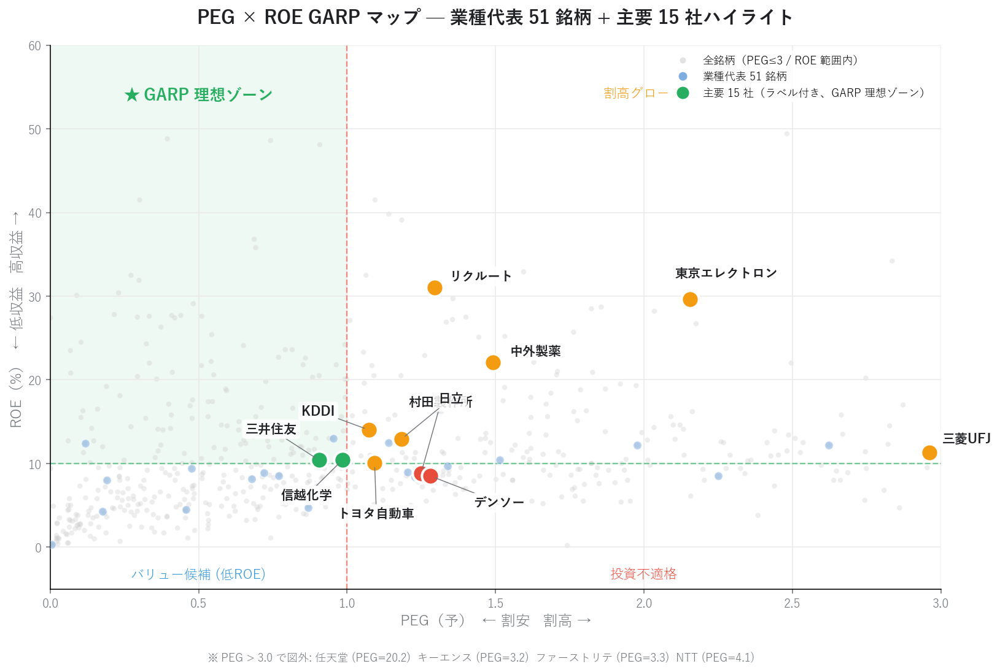
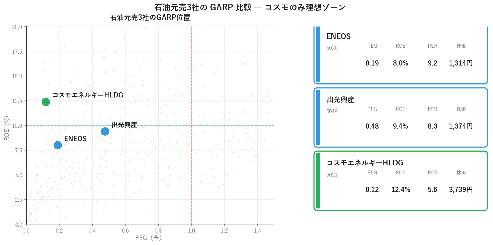
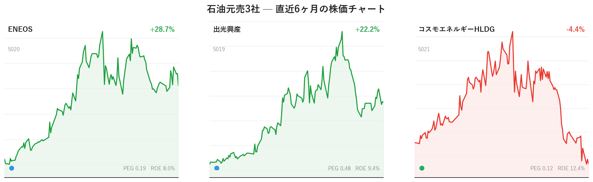
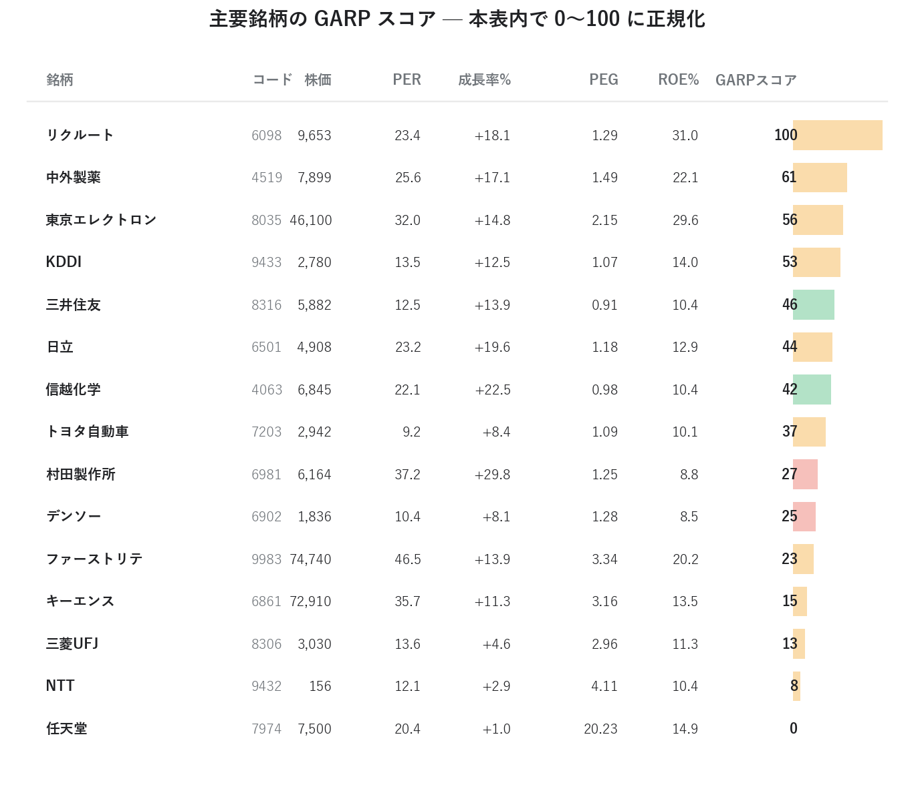
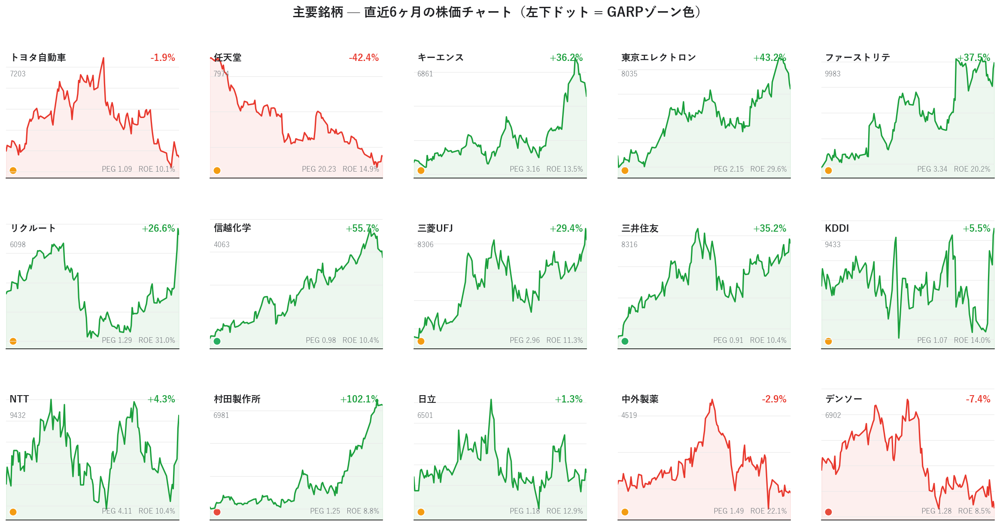

# PEG × ROE で「成長と割安の両立銘柄」を発掘する ― GARP の理論と実践

「PER が低いから割安」 ― この判断には、**成長率を見ていない**という落とし穴があります。

ピーター・リンチが伝説的ファンドを年率 29% で運用した **GARP（Growth At a Reasonable Price）** 戦略は、PEG と ROE の組み合わせで「成長性と割安度を両立した銘柄」を見つけ出します。

本記事では PEG と ROE を yfinance の最新終値から自前計算し、**ＥＮＥＯＳ / 出光興産 / コスモエネＨＤ の石油元売 3 社** や日経 225 主要銘柄 15 社、加えて **業種代表 51 銘柄**（各業種の時価総額トップを機械的に選んだ大型株ユニバース）の現在地を GARP マップに可視化。マップ上の位置と、実際の直近株価の動きを並べて検証します。

<!-- more -->

---

## ■ PEG・ROE・GARP の概要

### PEG（Price Earnings to Growth ratio）

PEG は **PER を「成長率に対する割安度」に変換した指標** です。

```
PEG（予） = PER（予） ÷ EPS成長率(%)
EPS成長率(%) = (予想EPS − 前期実績EPS) ÷ |前期実績EPS| × 100
PER（予） = 株価 ÷ 予想EPS
```

- PEG 1.0 → PER が成長率に対して適正
- PEG 0.5 → 超割安（成長性に対して株価が安すぎ）
- PEG 2.0 → 割高（成長性に対して株価が高すぎ）

「PER 30 倍は高い」と感じても、もし EPS が年率 60% で成長中なら PEG=0.5 で実は超割安。逆に「PER 10 倍は安い」でも、EPS が縮小傾向なら PEG=∞ で罠の可能性があります。

### ROE（Return On Equity）

ROE は **自己資本をどれだけ効率的に利益に変えているか** を示す指標です。

```
ROE = 当期純利益 ÷ 自己資本 × 100 (%)
```

- ROE 10% 以上 → 優良
- ROE 15% 以上 → 超優良（事業の堀がある可能性）
- ROE 5% 以下 → 構造的低収益（バリュートラップ警戒）

### GARP（Growth At a Reasonable Price）

GARP は **PEG が低く（割安）、かつ ROE が高い（高品質）** 銘柄を選ぶ戦略です。

PEG だけ見ると「会計上の成長率」しか確認できないため、**借入で無理に売上を伸ばしている低 ROE 企業** も拾ってしまいます。ROE を併用することで、自己資本を効率的に運用して成長している銘柄に絞り込めます。これが GARP 戦略の **品質保証メカニズム** です。

| 戦略                   | 失敗パターン                                             |
| -------------------- | -------------------------------------------------- |
| グロース投資（PER 高 × 成長率高） | PER 50 倍の銘柄が成長鈍化で PER 20 倍に評価し直されると **株価は 60% 下落** |
| バリュー投資（PER 低）        | 構造的に低収益で永遠に評価されない **バリュートラップ**                     |

GARP はこの中間で、**「成長性は確認しつつ、その成長性に対して妥当な価格」** に絞り込みます。

---

## ■ 分析で分かったこと

東証上場 1,553 銘柄（yfinance 日足データあり）について PEG と ROE を集計し、PEG × ROE 平面（GARP マップ）にプロットしました。

### GARP マップ全体像と主要銘柄の位置

{width="900"}

緑が **GARP 理想ゾーン**（PEG ≤ 1.0 かつ ROE ≥ 10%）です。背景の水色ドットは **業種代表 51 銘柄**（各業種から時価総額トップ 1 社を機械的に選定し、連載 narrative の中核となる石油元売 3 社・任天堂・ソフトバンクＧ・KDDI・三井住友ＦＧを補強した、読み手が知っている大型・有名株のユニバース）です。そのうち **日経 225 主要銘柄 15 社をラベル付きで強調プロット** すると、意外なほど **左上の理想ゾーンに入っているのは三井住友だけ** でした。多くの主要銘柄は PEG 1.0〜1.5 のあたりに集中し、「割安とまでは言えないが、極端な割高でもない」中庸ゾーンに位置しています。業種代表 51 銘柄全体を眺めても、左上ゾーンに入る大型株は数えるほどしか無く、**割安 × 高 ROE の両立が大型株ではいかに稀か** が一目で分かります。

### 石油元売 3 社の GARP と株価の動き

ここで、特定セクター内の銘柄比較を見てみましょう。**石油元売 3 社（ＥＮＥＯＳ / 出光興産 / コスモエネＨＤ）** は、市況・精製マージン・在庫評価など共通の事業構造を持ちながら、GARP マップ上の位置はまったく異なります。

{width="900"}

- **コスモエネＨＤ**: PEG 0.12 / ROE 12.4% → ★GARP 理想ゾーン
- **出光興産**: PEG 0.48 / ROE 9.4% → 惜しい位置（ROE があと一歩）
- **ＥＮＥＯＳ**: PEG 0.20 / ROE 8.0% → バリュー候補だが低収益

数字だけ見ればコスモが圧倒的に魅力的に映ります。しかし直近の株価動向を見ると、印象が逆転します。

{width="900"}

**GARP 理想ゾーンのコスモは −2.0% で唯一の下落**、ROE が劣る ＥＮＥＯＳ は +35.8%、出光は +23.2% と大きく上昇しています。一見矛盾するこの結果は、いくつかの解釈ができます。

1. **市況連動セクター特有の罠**: 石油元売の業績は原油価格・精製マージンに大きく左右される。コスモの予想 EPS 成長率 +47.66% はコンセンサスが楽観的すぎる可能性があり、**次回下方修正で PEG が一気に跳ね上がる**
2. **市場は既に予想を織り込み済み**: ＥＮＥＯＳ / 出光は GARP 的にはイマイチでも、市場は **次の業績予想上方修正** を先取りして買われている。GARP が「過去の予想ベース」の評価であるのに対し、株価は「次の予想変化」を読みに行っている
3. **流動性プレミアム**: ＥＮＥＯＳ は時価総額が大きく機関投資家の資金が入りやすい。コスモは相対的に小型で見落とされやすい

つまり **「GARP マップで光って見える銘柄」と「直近で上がる銘柄」は必ずしも一致しません**。GARP は「割安な良質銘柄を中長期で拾う」スタンスであり、短期株価とは別次元の話 ― これが石油元売 3 社の比較から見えてきます。次回連載02 のマルチファクタースコアボードでは、この乖離をもう一段精緻に分解します。

### 主要銘柄の GARP と株価の動き

次は日経 225 主要銘柄に視野を広げます。GARP スコア（ROE ÷ PEG を本表内で 0〜100 に正規化）で並べると次のとおりです。

{width="900"}

トップは **リクルートＨＤ（GARPスコア 100）** で、ROE 31% という非常に高い資本効率に対し PEG 1.32 と妥当な価格。次いで中外薬・東エレク・ＫＤＤＩ・三井住友が続きます。任天堂と ＮＴＴ は GARP スコアが極端に低いですが、これは PEG が 4〜20 倍と異常に高いためで、「成長率が小さいのに PER が高い」状態を意味します。

実際の株価の動きと並べてみましょう（直近 6 ヶ月）。

{width="900"}

各セル左下のドット色が GARP ゾーン（緑=理想/オレンジ=割高グロース/青=バリュー候補/赤=投資不適格）を表します。**GARP スコア上位の信越化（+60.1%）やリクルートＨＤ（+29.8%）、三菱ＵＦＪ（+35.4%）は実際に大きく上昇** している一方、GARP スコア下位の任天堂（−41.2%）、キーエンス（−41.2%）は **下落** しています。完全に綺麗な相関ではないものの、「GARP マップ上の位置と直近の株価トレンドは緩く一致している」ことが見て取れます。

### GARP の視点で見る優良株

主要 15 社のうち、**GARP 理想ゾーン（左上）に入ったのは三井住友のみ**。次点は信越化（PEG 1.01）、トヨタ（PEG 1.10）、ＫＤＤＩ（PEG 1.07）など、PEG が 1.0 をわずかに超える「ニアGARP」銘柄群です。

| 区分 | 該当銘柄 | コメント |
|---|---|---|
| ★GARP 理想 | 三井住友 | 唯一の左上、PEG 0.91 × ROE 10.4% |
| ニア GARP | 信越化・トヨタ・ＫＤＤＩ・日立 | ROE 閾値超え、PEG わずかに 1.0 超 |
| 高 ROE グロース | リクルートＨＤ・東エレク・中外薬・ファーストリテイ・キーエンス | 高 ROE だが PEG > 1.0、押し目待ち候補 |
| GARP 不適 | 任天堂・ＮＴＴ・三菱ＵＦＪ | PEG 過大 or 成長率小 |

「PEG ≤ 1.0」を厳密に求めると主要銘柄からはほぼ消えますが、**ROE 閾値を維持しつつ PEG 上限を 1.3 程度に緩める** と現実的な候補が広がります。

---

## ■ GARP スコアの計算方法

ここまで GARP スコアの順位で銘柄を比較してきましたが、そのスコアは具体的にどう算出しているのか。本記事では PEG と ROE をひとつの数値に統合するため、シンプルに比をとります。

```
GARP_raw = ROE ÷ PEG
GARPスコア = (GARP_raw − min) ÷ (max − min) × 100   ← 集団内で 0〜100 に正規化
```

意味合いは直感的です。

- ROE が高い → 資本効率が良い
- PEG が低い → 成長性に対して割安
- **両方を満たせば比は大きくなる**

| 銘柄パターン | ROE | PEG | GARP_raw | 解釈 |
|---|---|---|---|---|
| 高ROE × 低PEG | 15% | 0.5 | 30 | ★理想 |
| 中ROE × 適正PEG | 10% | 1.0 | 10 | 平均的 |
| 低ROE × 高PEG | 5% | 2.0 | 2.5 | 低品質・割高 |

正規化を集団内（フィルター後のユニバース）で行うため、**スコア 100 は「相対順位トップ」を意味するだけで、絶対値の魅力を保証するものではない** 点に注意が必要です。市場全体が割高な局面では、スコア 100 でも PEG 2.0 ということがあり得ます。

---

## ■ Python コードの紹介

本分析の中核となるコードを抜粋して紹介します。画像生成の全コードは [`01_PEG_ROE_make_images.py`](../scripts/01_PEG_ROE_make_images.py) を参照してください（執筆者ローカルのモジュール・データに依存しているため、そのままでは動きません。動作要件は [scripts/README](../scripts/README.md) を参照）。

### PEG / EPS 成長率の自前計算

```python
import pandas as pd

def compute_peg(price: float, eps_actual: float, eps_forecast: float) -> dict:
    """株価・前期EPS・予想EPSから PER/成長率/PEG を計算する。

    前期EPS ≤ 0（赤字脱却中）または成長率 ≤ 0（減益予想）の銘柄は
    PEG=NaN として GARP 対象から除外する。
    """
    if eps_forecast is None or eps_forecast <= 0:
        return {"PER": None, "成長率%": None, "PEG": None}
    per = price / eps_forecast
    if eps_actual is None or eps_actual <= 0:
        return {"PER": per, "成長率%": None, "PEG": None}
    growth_pct = (eps_forecast - eps_actual) / abs(eps_actual) * 100
    if growth_pct <= 0:
        return {"PER": per, "成長率%": growth_pct, "PEG": None}
    return {"PER": per, "成長率%": growth_pct, "PEG": per / growth_pct}
```

### GARP マップの描画（散布図 + 主要銘柄ハイライト）

```python
import matplotlib.pyplot as plt

def plot_garp_map(df, majors, peg_th=1.0, roe_th=10.0):
    fig, ax = plt.subplots(figsize=(13, 8))

    # 背景：全銘柄をグレーで薄くプロット
    bg = df.dropna(subset=["PEG", "ROE"])
    bg = bg[(bg["PEG"] > 0) & (bg["PEG"] <= 3.0)]
    ax.scatter(bg["PEG"], bg["ROE"],
               s=18, color="#cccccc", alpha=0.35, edgecolors="none")

    # GARP 理想ゾーンを薄緑で塗る
    ax.axhspan(roe_th, 60, xmin=0, xmax=peg_th/3.0,
               facecolor="#27ae60", alpha=0.07)

    # 基準線
    ax.axvline(peg_th, color="#e74c3c", linestyle="--", alpha=0.6)
    ax.axhline(roe_th, color="#27ae60", linestyle="--", alpha=0.6)

    # 主要銘柄を強調
    for code, name in majors:
        row = df.loc[df["コード"] == code].iloc[0]
        peg, roe = row["PEG"], row["ROE"]
        color = _quadrant_color(peg, roe, peg_th, roe_th)
        ax.scatter(peg, roe, s=200, color=color,
                   edgecolor="white", linewidth=2.0, zorder=5)
        ax.annotate(name, xy=(peg, roe), xytext=(10, 8),
                    textcoords="offset points",
                    fontsize=10.5, fontweight="bold",
                    bbox=dict(facecolor="white", alpha=0.85,
                              edgecolor="none", boxstyle="round,pad=0.25"))

    ax.set_xlabel("PEG（予）  ← 割安   割高 →")
    ax.set_ylabel("ROE（%）  ← 低収益   高収益 →")
    return fig
```

### ミニチャート 1 枚の描画（GARPゾーン色付き）

```python
def draw_minichart(ax, close: pd.Series, name: str, peg, roe, color: str):
    chg = (close.iloc[-1] / close.iloc[0] - 1) * 100
    line_c = "#1a9f3c" if chg >= 0 else "#e8372c"

    # 塗りつぶし + ライン
    ymin, ymax = close.min(), close.max()
    pad = (ymax - ymin) * 0.10
    ax.fill_between(close.index, close.values, ymin - pad,
                    color=line_c, alpha=0.08)
    ax.plot(close.index, close.values, color=line_c, linewidth=1.6)

    # 銘柄ラベル
    ax.text(0.02, 0.95, name, fontsize=11, fontweight="bold",
            ha="left", va="top", transform=ax.transAxes)
    # 騰落率（右上）
    ax.text(0.98, 0.95, f"{chg:+.1f}%", fontsize=11, color=line_c,
            fontweight="bold", ha="right", va="top", transform=ax.transAxes)
    # GARP指標（右下）
    ax.text(0.98, 0.04, f"PEG {peg:.2f}   ROE {roe:.1f}%",
            fontsize=8.5, color="#70757a",
            ha="right", va="bottom", transform=ax.transAxes)
    # GARPゾーンドット（左下）
    ax.scatter([0.04], [0.06], s=80, color=color,
               transform=ax.transAxes, clip_on=False,
               edgecolor="white", linewidth=1.0)

    # 軸装飾を最小化
    ax.tick_params(left=False, labelleft=False,
                   labelbottom=False, bottom=False)
    for spine in ("top", "right", "left"):
        ax.spines[spine].set_visible(False)
```

### 株価データを yfinance で最新化

楽天MS2 のような市販データの「現在値」は手動DL時点で固定されるため、自前で yfinance の最新終値で上書きします。

```python
import pandas as pd

def refresh_with_yfinance(df: pd.DataFrame, parquet_dir) -> pd.DataFrame:
    """各銘柄の「現在値」を yfinance 日足の最終 Close で更新する。"""
    out = df.copy()
    closes = []
    for code in out["コード"]:
        path = parquet_dir / f"{code}.parquet"
        if not path.exists():
            closes.append(None)
            continue
        s = pd.read_parquet(path, columns=["Close"])["Close"].dropna()
        closes.append(float(s.iloc[-1]) if not s.empty else None)
    out["現在値"] = closes
    # parquet が無い銘柄は除外
    return out.dropna(subset=["現在値"]).reset_index(drop=True)
```

---

## まとめ

- PEG = PER ÷ EPS 成長率 によって、PER 単独では分からなかった「成長性に対する割安度」が一目で判定できる
- ROE と組み合わせる（= GARP 戦略）ことで、バリュートラップを避けつつ高品質な割安成長株を選べる
- 主要銘柄 15 社のうち **GARP 理想ゾーン入りは三井住友のみ**。多くは PEG 1.0〜1.5 のニアGARP帯に位置
- 業種代表 51 銘柄を背景プロットすると、**割安 × 高 ROE の両立が大型株では稀** であることが一目で分かる
- 石油元売 3 社の比較では **コスモ（GARP 理想）が −2%、ROE が劣る ＥＮＥＯＳ が +35%** という GARP と株価の逆転現象が観察された。GARP は短期株価と必ずしも一致しない
- 4 象限マップ・ミニチャートグリッド・指標カードを組み合わせると、ファンダメンタルと値動きを同時に語れる可視化になる
- 自前で PEG を計算すれば株価変動が即反映され、計算ロジックも透明化される

次回は **マルチファクター・スコアボード** を実装します。GARP（成長 × 割安）の考え方を、Value / Quality / Growth / Sentiment / Momentum / Risk の 7 ファクターに拡張し、より総合的に銘柄を採点します。

---

*データ出典: 市販の銘柄情報サービスから取得した CSV（ROE / 前期EPS / 予想EPS） + yfinance 日足 Close*
