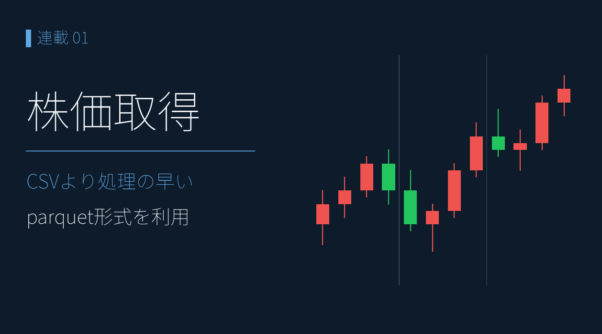

# まずは株価を取得しよう ― yfinance から parquet 保存、そしてチャートへ

{width="1280"}

銘柄分析は、まず株価データを手元に持つことから始まります。yfinance を使えば誰でも無料で取得できます。押さえどころは 2 つ ― **ローカルに保存しておけば、毎回 API を叩くより動作が速い**こと、そして **5分足は直近約 60 日分しか取得できない**ことです。だから取得した株価は **parquet 形式で保存して貯めていきます**。

本記事では、株価の取り方・parquet での保存・貯めた 5分足でチャートを作るところまでを通します。フェーズ1「データ取得編」の出発点です。

<!-- more -->


## なぜ parquet に貯めるのか

yfinance で取れる株価は、足の種類で取得できる期間が大きく違います。

| 足   | 取得できる期間       | 主な用途         |
| --- | ------------- | ------------ |
| 日足  | 10 年以上        | 長期トレンド・テクニカル |
| 5分足 | **約 60 日が上限** | 寄付・引け・場中の動き  |

- 5分足は「**今貯めないと将来取れない**」ので、定期取得して parquet に追記する価値が高い
- parquet は列指向・型保持・高圧縮。CSV より読み書きが速く、ファイルも小さい
- 株式分割をさかのぼって調整する `auto_adjust=True` を **既定** にします（分割の前後で株価が不連続にならない）

> 💡 貯めたデータは定期的に棚卸しを。上場廃止・超低流動性の銘柄が混ざると、騰落率や統計がゆがみます。


## yfinanceで株価を取得する

東証銘柄は `{コード}.T` で指定します（ＥＮＥＯＳ ＝ `5020.T`）。

```python
import yfinance as yf

# 日足（長期）
df_d = yf.download("5020.T", period="2y", interval="1d", auto_adjust=True)

# 5分足（直近のみ・約60日が上限）
df_5 = yf.download("5020.T", period="60d", interval="5m", auto_adjust=True)
```

最新値だけ欲しいときは `fast_info` が高速です。

```python
yf.Ticker("5020.T").fast_info.get("lastPrice")
```


## parquet で保存・追記する

取得した DataFrame は、そのまま parquet に書き出せます。

```python
df_5.to_parquet("data/prices/stocks/5min/5020.parquet")
```

5分足は **日々追記** して貯めます。既存ファイルに連結し、重複行（同じ時刻）を落とすだけ。

```python
import pandas as pd

path = "data/prices/stocks/5min/5020.parquet"
new  = df_5                       # 新しく取得した5分足

old = pd.read_parquet(path)
merged = pd.concat([old, new])
merged = merged[~merged.index.duplicated(keep="last")].sort_index()
merged.to_parquet(path)
```

これを週末バッチで回せば、5分足が途切れず積み上がっていきます。保存・追記の全体像は Appendix の GitHub を参照してください。


## まとめ

- 株価は **yfinance** で無料取得。日足は長期、**5分足は約 60 日が上限**なので貯める価値が高い
- 保存は **parquet**（速い・小さい・型保持）。5分足は重複を落として **日々追記**
- `auto_adjust=True` で株式分割をさかのぼって調整するのが既定

次回は **株価以外のデータ**（有価証券報告書・決算短信の XBRL、決算発表日時、業績指標）の取り方に進みます。


## Appendix ― Python コード <i class="fa-brands fa-github"></i>

本記事のチャートアプリと取得・保存スクリプトは、すべて **GitHub に公開**しています。株価は提供元の利用規約により再配布できませんが、**yfinance** さえあれば、ご自身の銘柄リストで同じ画面を再現できます（動かし方はリポジトリの README 参照）。

> <i class="fa-brands fa-github"></i> **リポジトリ** [`github.com/minnanosaiban/blog/01_chart_5min`](https://github.com/minnanosaiban/blog/tree/main/01_chart_5min)

#### Streamlit アプリ ― 寄付・引け・**窓開け**を一目で確認できるチャート

貯めた 5分足を複数銘柄まとめてローソク足で表示し、右上に日足ライン、下に日次の騰落率テーブルを添える Streamlit アプリ（Plotly）。寄付・引け・**窓開け**を一目で確認できます。

- **株価チャートと騰落率テーブルの日付を揃えて**表示し、値動きと前日比を対応づけて読める
- **縦の境界線**でギャップアップ・ギャップダウンを視覚的に把握しやすく
- 銘柄コードを **カンマ・スペース・改行**で区切って **複数銘柄を入力**できる

株価は、yfinance で取得し、parquet で保存しています。

<small style="color: var(--md-link-color);"><i class="fa-solid fa-expand"></i> クリックで拡大できます</small>

{width="1200"}


---

*データ出典: yfinance 日足・5分足 Close（`auto_adjust=True`）*
