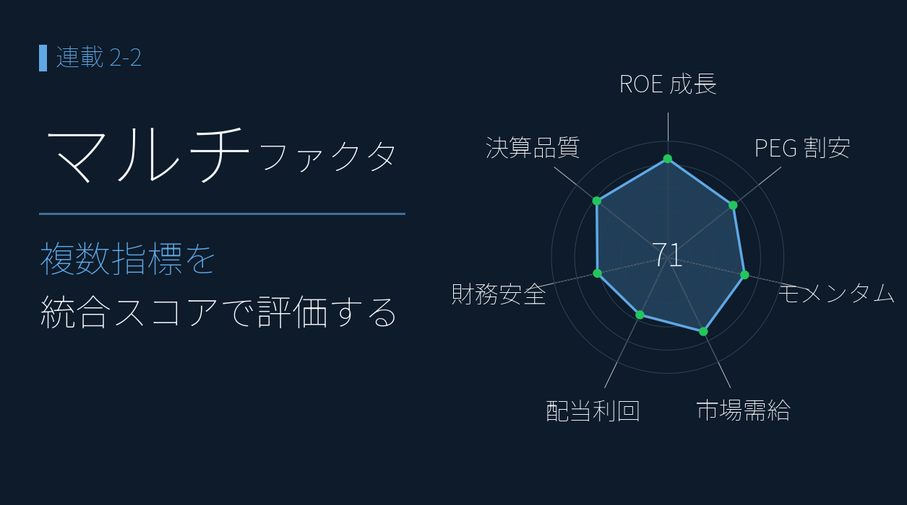
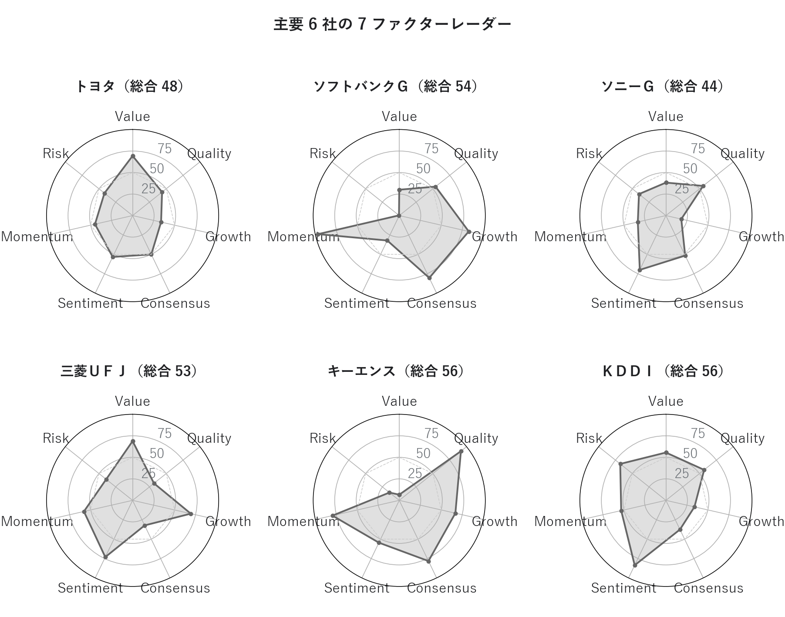
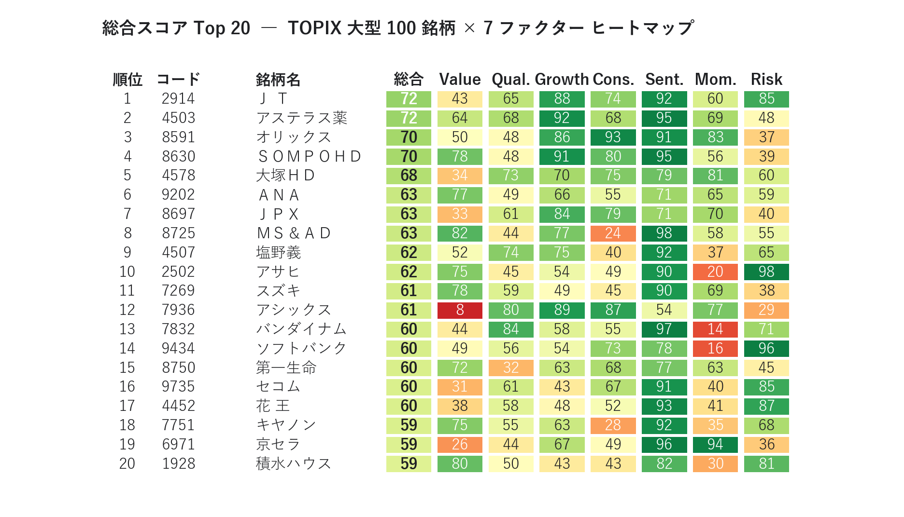
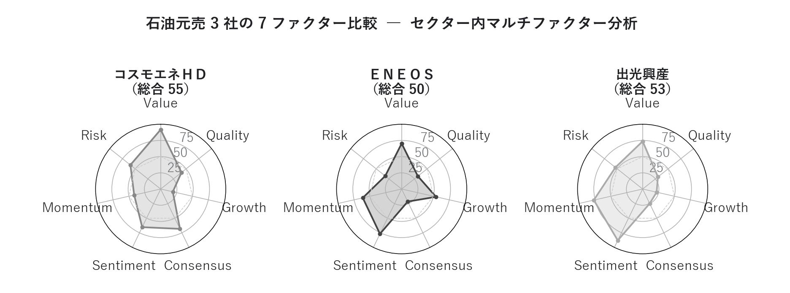

# マルチファクタースコア ― 7軸で「全方位の優等生」を探す

{width="1280"}

「PER が低いから買い」「ROE が高いから買い」 ― 単一指標だけのスクリーニングは、**思わぬ罠**にはまりがちです。

本記事では、**Value / Quality / Growth / Consensus / Sentiment / Momentum / Risk** という 7 ファクターでマルチな評価を行っていきます。割安・高 ROE で評価が高いのに株価は下落、評価が劣るのに上昇 ― そんな **ファンダ評価と株価の逆転現象** を、ファンダ・需給・モメンタムを横並びにして定量的に読み解きます。

データ出典: 証券会社のアプリの 13 指標（EPS / BPS / 配当金 / EV/EBITDA / ROE / ROA / 営業利益率 / 自己資本比率 / 売上高変化率 / 経常利益変化率 / 業績予想修正率(予想) / 経常利益変化率(予想) / 過去3年平均売上高成長率(予想)） + yfinance 日足 Close / Volume

<a class="ref-card ref-card--quiet" href="https://www.ifinance.ne.jp/glossary/investment/inv312.html" target="_blank" rel="noopener">

マルチファクター投資 とは
複数のファクターでリターンを狙う運用（ファクター投資）― iFinance 用語集

</a>

<!-- more -->

## マルチファクターモデルとは ― 7 つの観点を並列で採点し、総合点に合成する

Fama-French、Carhart、Q-factor など機関投資家のクオンツモデルは「複数ファクターを並列スコア化して合成する」という共通構造を持ちます。本ダッシュボードは 7 ファクターを採用します。

| ファクター | 観点 | 主要指標 |
|---|---|---|
| **Value** | 割安度 | PER / PBR / EV/EBITDA / 配当利回り |
| **Quality** | 収益性・財務健全性 | ROE / ROA / 営業利益率 / 自己資本比率 |
| **Growth** | 過去の成長実績 | 売上高変化率 / 経常利益変化率 |
| **Consensus** | 将来予想の改善度 | 業績予想修正率 / 経常利益変化率(予想) / 3年売上成長率(予想) |
| **Sentiment** | 需給の熱量 | 出来高増加率 / 売買代金増加率 |
| **Momentum** | 株価のトレンド | 値上り率 / 52週安値からの上昇率 / MA乖離率 |
| **Risk** | リスク要素（低いほど良い） | 60日ボラティリティ / β（対日経平均） |

**全ファクターが平均以上**の銘柄はオールラウンダー（コア候補）、**一つだけ突出して低い**銘柄はその要因で敬遠する判断材料になる ― これがマルチファクター採点の利点です。

各指標は **パーセンタイルランク化（0–100）**（市場全体の中で何番目かを 0〜100 点に直す）してから単純平均し、総合スコアを合成します（**スコア 70 以上が上位 30% の注目候補**）。

## 主要6銘柄の「銘柄の性格」を見る

7 ファクターを並列で見るにはレーダーチャートが標準です。7 軸の **形のいびつさ** で、銘柄の性格（攻め型・守り型・バランス型）が一目で分かります。

<i class="fa-solid fa-expand"></i> クリックで拡大

使用データ: 7ファクタースコア＝証券会社アプリの13指標（決算短信＝2026年3月期本決算＋翌期会社予想ベース）＋yfinance日足Close/Volume（株価2026年5月末時点）。Value/Quality/Growth/Consensusは決算・予想由来、Sentiment/Momentum/Riskは株価由来

{width="1200"}

- キーエンスは Quality 一点突出の「典型的な高品質・割高銘柄」 ― 形が右上に偏る
- ソフトバンクＧ は Risk 軸だけ極端に凹んだ「高リターン高リスク型」
- ＫＤＤＩ・トヨタは全方位バランス型

| 銘柄 | 総合 | 形状の特徴 |
|---|---|---|
| **ソフトバンクＧ** | 54 | Momentum 99 / Sentiment 92 / Growth 83 と需給・業績が最強。Risk **0** ＝ ほぼ最高ボラティリティが唯一の弱点 |
| **三菱ＵＦＪ** | 53 | Momentum 73 / Sentiment 81 が強く、最近の銀行株上昇を反映。一方 Quality 32（銀行は ROE が構造的に低い） |
| **キーエンス** | 55.7 | Quality **92**（高 ROE で別格）だが Value 6（PER が市場上位 6% = 割高） |
| **ＫＤＤＩ** | 56 | バランス型。Risk 69（低ボラ）で長期保有向き |
| **トヨタ** | 48 | 全ファクターが 34〜70 で突出した強みなし。Sentiment 12 / Momentum 42 から直近モメンタム弱め |
| **ソニーＧ** | 44 | Sentiment 23 / Momentum 42 と需給・モメンタムが低迷。Growth 18 で過去の成長実績も振るわない |

## 大型100銘柄の「全体序列」

レーダーが「個別銘柄の性格」を見るのに対し、**ヒートマップは「全体序列」を見るツール**です。TOPIX 大型 100 銘柄内の総合スコア Top 20 を 7 ファクター別に色分けすると、どのファクターで稼いでいるかが一目で分かります。

<i class="fa-solid fa-expand"></i> クリックで拡大

使用データ: 7ファクタースコア＝証券会社アプリの13指標（決算短信＝2026年3月期本決算＋翌期会社予想ベース）＋yfinance日足Close/Volume（株価2026年5月末時点）。Value/Quality/Growth/Consensusは決算・予想由来、Sentiment/Momentum/Riskは株価由来

{width="1200"}

- ディフェンシブ（ＪＴ・アステラス製薬）と需給・業績の強い銘柄（ＳＯＭＰＯＨＤ・ソフトバンク）が混在
- 業種最大手（ＥＮＥＯＳ など）でも総合 50 で Top 20 圏外 ― 業種大手とマルチファクター評価は別物
- 見るべきは総合スコアの高さより **どのファクターで稼いでいるか** ― ディフェンシブ型・需給型・業績型はリスクの性格が違う

## 元売3社で「ファンダと需給の乖離」

石油元売 3 社は、**割安・高 ROE で評価が高いコスモエネが直近で唯一下落し、評価が劣る ＥＮＥＯＳ が大きく上昇** という、ファンダ評価と株価が逆転した 3 社です。7 ファクターで見直すと、この逆転がより精緻に説明できます。

<i class="fa-solid fa-expand"></i> クリックで拡大

使用データ: 7ファクタースコア＝証券会社アプリの13指標（決算短信＝2026年3月期本決算＋翌期会社予想ベース）＋yfinance日足Close/Volume（株価2026年5月末時点）。Value/Quality/Growth/Consensusは決算・予想由来、Sentiment/Momentum/Riskは株価由来

{width="1200"}

- **コスモエネＨＤ**: ファンダ面では圧倒的（Value 92 / Consensus 68）だが、**Sentiment 22 / Momentum 35 で需給は冷えたまま**。投資家がコンセンサスの強気予想を信用していないか、相対的に小型で資金が回ってきていない状態
- **ＥＮＥＯＳ**: Value 70 / Quality 32 と地味だが、**Growth 54 / Sentiment 57 / Momentum 51 で「動いている」**。経常利益変化率 +408% という実績がモメンタムを支える
- **出光興産**: 中庸型。突出した強みも弱みもなく、3 社の中間に位置する

| 銘柄          | 総合       | Value  | Qual. | Growth | Cons.  | Sent.  | Mom. | Risk |
| ----------- | -------- | ------ | ----- | ------ | ------ | ------ | ---- | ---- |
| **コスモエネＨＤ** | **55** | **92** | 41    | 19     | **68** | **22** | 35   | 59   |
| ＥＮＥＯＳ       | 50     | 70     | 32    | 54     | 22     | 57     | 51   | 32   |
| 出光興産        | 53     | 76     | 30    | 22     | 25     | 45     | 39   | 54   |

> 💡 「コスモはファンダ最良なのに株価は下落」の謎は、**ファンダ（Value 92 + Consensus 68）と需給（Sentiment 22 + Momentum 35）の乖離**で定量的に説明できる ― ファンダだけ・需給だけでは見えない構図が一目で分かるのがマルチファクター採点の価値。

## まとめ

- 単一指標スクリーニングの落とし穴（バリュー・トラップ / 成長停止 / 過熱）を **7 ファクター統合採点** で自動回避できる
- **レーダーチャートが標準的な可視化**。7 軸の形のいびつさで銘柄の性格（攻め型・守り型・バランス型）が一目で分かる
- 石油元売3社では、コスモのファンダ（Value 92 / Consensus 68）と需給（Sentiment 22 / Momentum 35）の **乖離** が、「ファンダ良いのに株価下落」を定量説明
- 使い方は **総合スコアの高さより「どのファクターで稼いでいるか」**（型）を見ること ― ディフェンシブ型・需給型・業績型はリスクの性格が違う

## <i class="fa-brands fa-github"></i> Python コード

本記事のチャート画像・アプリ・データ取得・成形スクリプトは、すべて **GitHub に公開**しています。データは提供元の利用規約により再配布できませんが、データを各自取得すれば、本連載と同じものが再現できます（動かし方はリポジトリの README 参照）。

<a class="repo-link" href="https://github.com/minnanosaiban/blog/tree/main/02-02_multifactor" target="_blank" rel="noopener">
github.com/minnanosaiban/blog/02-02_multifactor
<i class="repo-link-arrow fa-solid fa-arrow-up-right-from-square"></i>
</a>

## 📌 自作アプリ紹介

**― 7 ファクターレーダーをブラウザで並べて見る ―**

<a class="repo-link" href="https://github.com/minnanosaiban/blog/tree/main/02-02_multifactor" target="_blank" rel="noopener">
github.com/minnanosaiban/blog/02-02_multifactor
<i class="repo-link-arrow fa-solid fa-arrow-up-right-from-square"></i>
</a>

7 ファクター（Value / Quality / Growth / Consensus / Sentiment / Momentum / Risk）のレーダーチャートを銘柄ごとにブラウザで並べて表示します。銘柄コードを入力するだけで記事中のスコアボードが自分の環境でそのまま動き、「全方位優等生」候補を対話的に絞り込めます。

<i class="fa-solid fa-expand"></i> クリックで拡大

{width="1200"}

---
