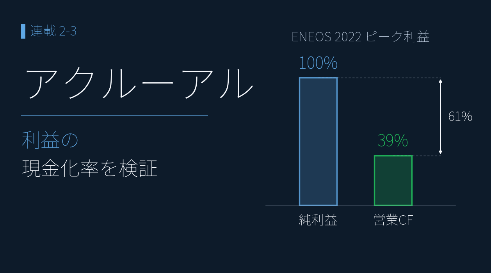
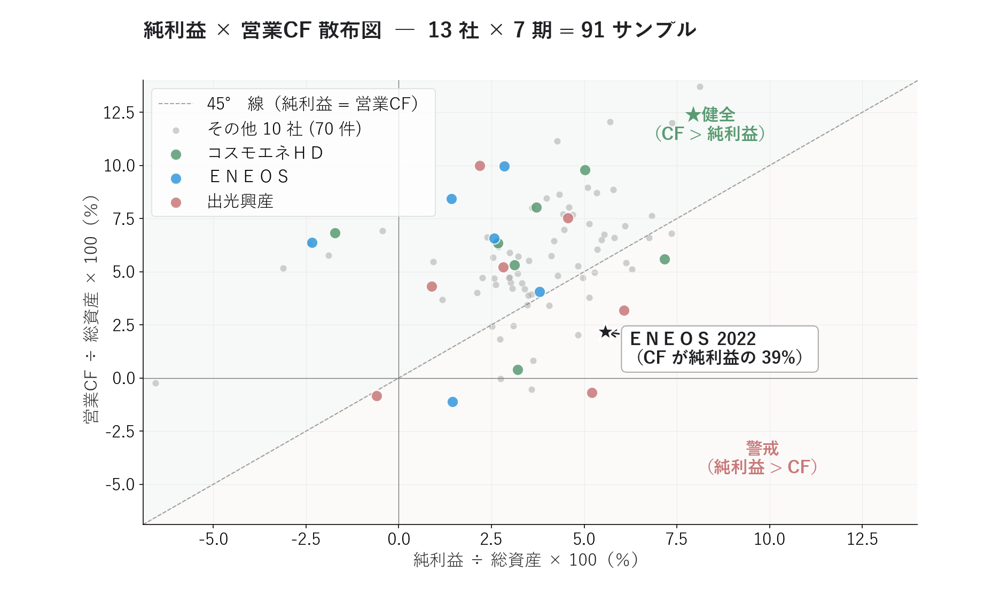
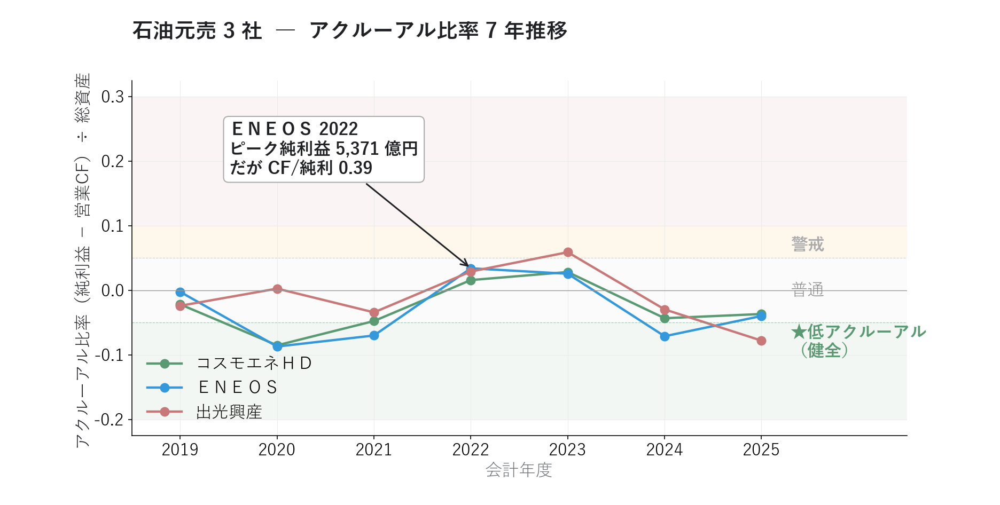
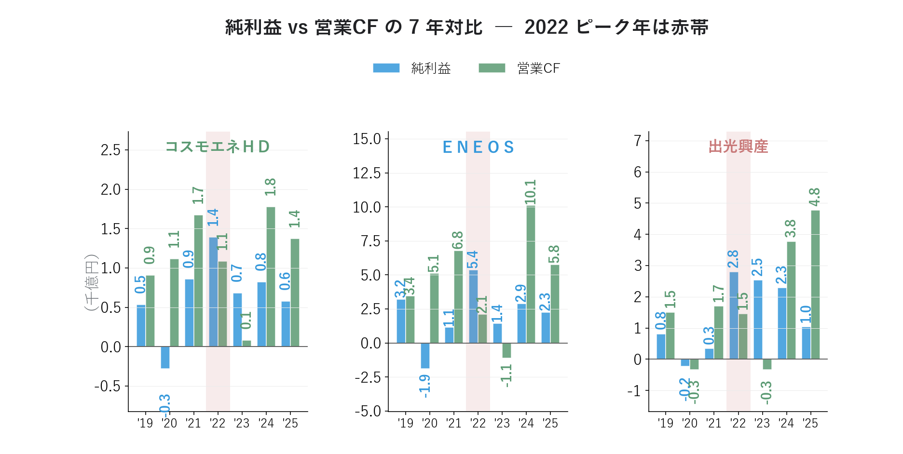
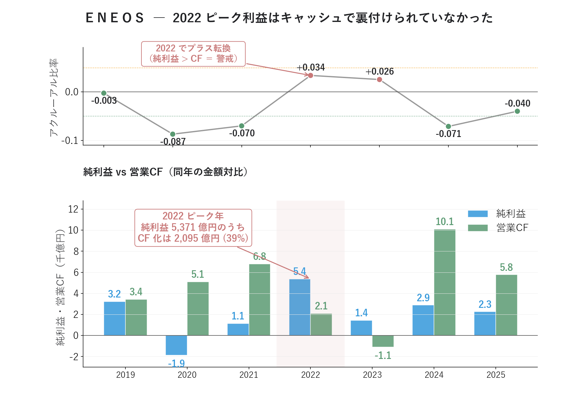

# アクルーアル分析 ― ＥＮＥＯＳの最高益に「現金の裏付け」はあるか

{width="1280"}

「純利益が過去最高 ― だから優良決算」。でも、**その利益はキャッシュを伴っていますか**。

PEG・ROE やマルチファクター採点は、銘柄を「量」と「水準」で評価します。本記事では、**純利益と営業キャッシュフローの差（アクルーアル）** で、利益の "質" を見抜きます。

データ出典 <i class="fa-solid fa-caret-right"></i>EDINET：有報 XBRL（13社 × 7期）

<a class="ref-card ref-card--quiet" href="https://www.ifinance.ne.jp/glossary/account/acc242.html" target="_blank" rel="noopener">

アクルーアル とは
利益とキャッシュフローの差で見る「利益の質」の指標 ― iFinance 用語集

</a>

## アクルーアル分析とは ― 利益がキャッシュを伴うかで「利益の質」を測る

**良い決算において、その利益がキャッシュを伴っているか** 。純利益は会計処理である程度動かせますが、営業キャッシュフローは動かしにくい ― この差が **利益の "質"** を映します。これを定量化したのが、Richard Sloan が 1996 年に実証した **アクルーアル分析** です。

**アクルーアル比率 = (純利益 − 営業 CF) ÷ 総資産** ― 純利益のうち「キャッシュ化されていない部分」の大きさ

| アクルーアル比率 | 判定 |
| --- | --- |
| ≤ −0.05 | ★非常に健全（CF が純利益を上回る） |
| −0.05 〜 0.00 | 健全 |
| 0.00 〜 +0.05 | 普通 |
| +0.05 〜 +0.10 | 警戒（純利益 > CF） |
| ≥ +0.10 | 重大警戒（利益操作疑い） |

**補助指標 CF/純利益 = 営業 CF ÷ 純利益** ― 1.0 なら利益がほぼ現金になっている、0.5 未満は要注意

純利益が営業 CF を大きく上回る主因は、まだ現金として入っていない売掛金や在庫の増加、そして **在庫評価益**（在庫を高値で評価し直しただけの利益）です。これらは **あとで反転しやすい利益** で、業績が正常化する過程ではがれ落ち、業績の下振れ（ネガティブサプライズ）につながりやすい ― 「アクルーアル比率が低い銘柄は、高い銘柄を年率約 10% も上回って値上がりした」という Sloan の発見は、30 年経っても有効です。

>⚠️ 純利益が極端に小さい・マイナスの年は CF/純利益が発散・反転するため、補助指標として使います。

## 商社＋元売 13 社で「業界の健全性」を見る

### 有報 XBRLで分析、13 社の健全だった年の回数

各社の 7 年を「営業 CF ≧ 純利益（＝アクルーアル ≦ 0）だった年数」で数えると、どの会社が構造的に健全かが見えてきます。

| 数   | 銘柄                              |
| --- | ------------------------------- |
| 7 回 | 石油資源開発・INPEX・三菱商事               |
| 6 回 | 豊田通商                            |
| 5 回 | **ＥＮＥＯＳ**・**コスモエネＨＤ**・丸紅・兼松・伊藤忠 |
| 4 回 | **出光興産**・住友商事・双日                |
| 3 回 | 三井物産                            |

- **毎年健全なのは 石油資源開発・INPEX・三菱商事 の 3 社** ― ＥＮＥＯＳ・コスモは 2022・2023 の特需局面だけ崩れ、出光はそれに 2020 を加えた 3 年（4/7）で崩れる
- 元売より **上流（資源開発）の方が安定して健全** ― 元売 3 社よりさらに堅い比較対象が存在する
- 最も振れるのは三井物産 3/7・双日 4/7（最新 +0.041 で警戒）― 同じ商社でも構造の差がある
- 健全さの背景: 在庫・設備投資の運転資本サイクルが定常的にプラス CF を生み、配当で利益を着実に現金化、IFRS 採用が多く（13 社中 12 社）会計が保守的

### ＥＮＥＯＳの 2022 年度は警戒ゾーン

91 サンプル（13 社 × 7 期）を、45° 線（純利益 = 営業 CF）を境に「健全」と「警戒」の 2 ゾーンに分けてみます。

<i class="fa-solid fa-expand"></i> クリックで拡大

使用データ <i class="fa-solid fa-caret-right"></i>EDINET（有報 XBRL）：純利益 / 営業CF / 総資産（13社 × 7期＝91サンプル、2019〜2025年3月期）

{width="1200"}

| ゾーン | 銘柄群 |
|---|---|
| 線上（健全） | 大半の銘柄。営業 CF が純利益を上回る |
| 線下（警戒） | ＥＮＥＯＳ 2022, 2023 / 出光 2022, 2023 / コスモエネＨＤ 2022, 2023 など |

- **ＥＮＥＯＳの 2022 年度は警戒ゾーンの最も奥（★）** ― 純利益が営業 CF を最も大きく上回った 1 点
- 2020 年（コロナ・原油急落）は赤字でも CF はプラスの銘柄が多い ― 「会計の利益 < 実際の現金」で健全に分類
- 逆に **2022 年の特需では元売 3 社がそろって警戒ゾーンに集中** ― 原油急騰による在庫評価益が共通して出た結果

## 元売3社で「特需の共通パターン」

### アクルーアル比率の 7 年推移
3 社のアクルーアル比率を、同じ 7 年で重ねたチャートです。

<i class="fa-solid fa-expand"></i> クリックで拡大

使用データ <i class="fa-solid fa-caret-right"></i>EDINET（有報 XBRL）：純利益 / 営業CF / 総資産（元売3社 × 7期、2019〜2025年3月期）

{width="1200"}

- どの社も **大半の年は健全**（営業 CF ≧ 純利益）なのに、**2022・2023 の 2 年だけ全社がプラス（純利益 > CF）に振れる** 共通パターン
- 原油価格の高騰局面で **「在庫を高値で評価し直しただけの利益」** が 3 社そろって出たため
- 健全な年数は ＥＮＥＯＳ・コスモエネＨＤが 5/7 年、出光興産が 4/7 年（出光が最も崩れたが、最新 2025 は健全に回復）

### 純利益 vs 営業 CF の年次対比

3 社それぞれの純利益と営業 CF を、年ごとに並べたチャートです。

<i class="fa-solid fa-expand"></i> クリックで拡大

使用データ <i class="fa-solid fa-caret-right"></i>EDINET（有報 XBRL）：純利益 / 営業CF（元売3社 × 7期、2019〜2025年3月期）

{width="1200"}

- コスモエネＨＤ 2022: 純利益 1,389 億 / 営業 CF 1,084 億（CF/純利 0.78）
- ＥＮＥＯＳ 2022: 純利益 5,371 億 / 営業 CF 2,095 億（CF/純利 0.39）
- 出光興産 2022: 純利益 2,795 億 / 営業 CF 1,461 億（CF/純利 0.52）
- **ＥＮＥＯＳ 2022 だけ営業 CF が純利益を大きく下回り、ギャップは最大の 3,276 億円** ― 利益の額が大きいぶん「会計上は利益でも現金になっていない額」も最大で、翌 2023 年に営業 CF がマイナスへ転落する伏線に

## ＥＮＥＯＳの「ピーク利益の裏付け」

ＥＮＥＯＳ の 2022 年ピーク純利益 5,371 億円を、7 年分の純利益・営業 CF・CF 化率（CF/純利）に並べたのが下の表です。

<i class="fa-solid fa-expand"></i> クリックで拡大

使用データ <i class="fa-solid fa-caret-right"></i>EDINET（有報 XBRL）：純利益 / 営業CF / 総資産（ＥＮＥＯＳ 7期、2019〜2025年3月期）

{width="1200"}

| 年度 | 純利益（千億円） | 営業 CF（千億円） | CF/純利 | アクルーアル | 解釈 |
|---|---|---|---|---|---|
| 2019 | +3.2 | +3.4 | 1.07 | −0.003 | 普通 |
| 2020 | **−1.9** | +5.1 | −2.72 | **−0.087** | 赤字なのに CF はプラス（健全） |
| 2021 | +1.1 | +6.8 | 5.96 | **−0.070** | CF が純利益の 6 倍（健全） |
| **2022** | **+5.4** | **+2.1** | **0.39** | **+0.034** | **★ピーク利益の CF 化は 39% のみ** |
| 2023 | +1.4 | −1.1 | −0.77 | +0.026 | **CF はマイナス、純利益はプラス** |
| 2024 | +2.9 | +10.1 | 3.51 | **−0.071** | CF が大幅プラス（健全） |
| 2025 | +2.3 | +5.8 | 2.55 | −0.040 | CF が純利益を超過 |

- **2022 年の純利益 5,371 億円のうち、実際に現金として入ったのは 2,095 億円（CF 化 39%）** ― 残り 3,276 億円は在庫評価益や売掛・在庫の増加など、現金を伴わない利益だった可能性が高い
- **翌 2023 年は営業 CF がマイナス（−1,102 億円）なのに、純利益はプラス（+1,438 億円）** ― アクルーアル比率は "普通圏" ぎりぎりだが、現金で見た質は最も低い
- **2024〜2025 年は営業 CF が純利益の 2.5〜3.5 倍** ― 過去の "現金を伴わなかった利益" を回収する局面に入った

つまり 2022 年の特需は **その年には現金になっておらず**、CF 化 39% → 2023 年マイナス → 2024〜25 年で回収、という流れでした。これが有報 XBRL のキャッシュフロー計算書から数字で示せる「利益の質」の実態です。

## まとめ

- **アクルーアル比率 =（純利益 − 営業 CF）÷ 総資産** ― スコアでは見えない「利益の質」を測る（Sloan 1996）。有報 XBRL 91 サンプル（13 社 × 7 期）
- **ＥＮＥＯＳ**：2022 ピーク純利益 5,371 億のうち **CF 化は 39%**、翌 2023 年は営業 CF マイナス転落（在庫評価益の反転）
- ただし **3 年累積では CF が純利益を上回り回収済み（114%）** ― 原油サイクル由来で利益操作ではなく、「単年」か「累積」かで評価が割れる

## <i class="fa-brands fa-github"></i> Python コード

本記事のチャート画像・データ取得・成形スクリプトは、すべて **GitHub に公開**しています。**アクルーアル比率の計算方法**（Sloan 1996 の式・補助指標 CF/純利益・業種特性・ノイズフィルタ・Sloan 戦略のしきい値）は、リポジトリの README にまとめています。データは提供元の利用規約により再配布できませんが、データを各自取得すれば、本連載と同じものが再現できます。

<a class="repo-link" href="https://github.com/minnanosaiban/blog/tree/main/02-03_accrual" target="_blank" rel="noopener">
github.com/minnanosaiban/blog/02-03_accrual
<i class="repo-link-arrow fa-solid fa-arrow-up-right-from-square"></i>
</a>

---
