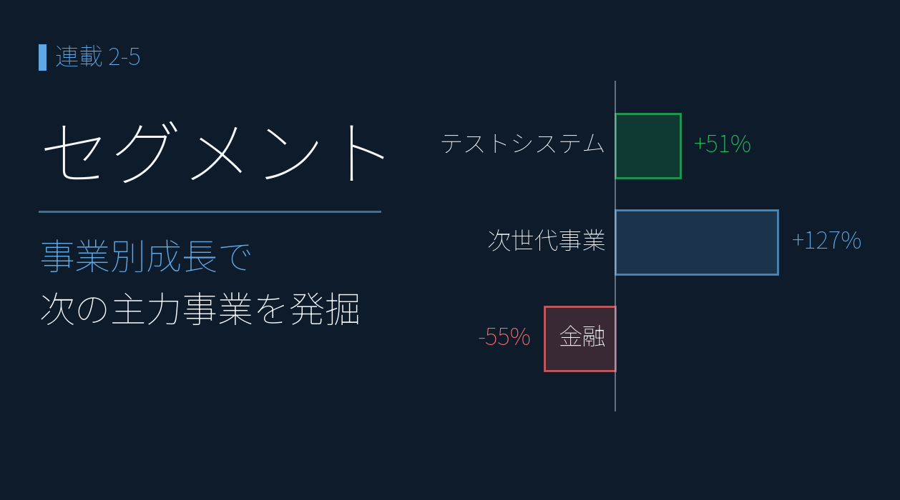
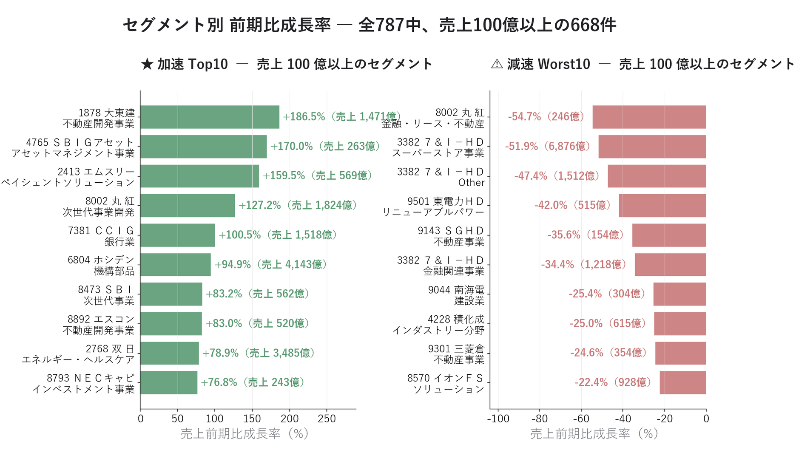
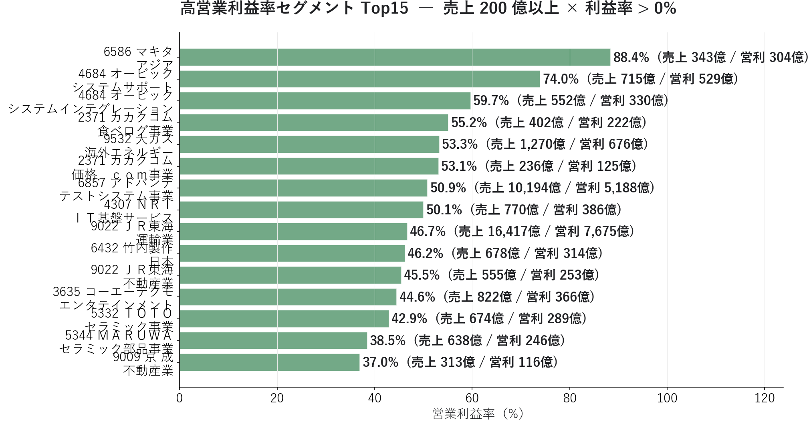

# セグメント分析 ― 連結に埋もれた「強い事業」を発進力スコアで探す

{width="1280"}

「PER 20 倍、ROE 10% ― この会社は割高で高収益」。こうした全社平均では、**裏でどの事業が伸び、どの事業が縮んでいるか** までは見えません。

本記事では、**XBRL を JSON 化した自前パイプライン** で決算を **事業セグメント別** に分解し、「次の主力事業」と「隠れた高収益事業」を発掘します。

データ出典: 自前で構築したパイプラインの `data/statements/*_FY.json` 1,624 ファイル中、セグメント情報を持つ 634 件（400 銘柄）。前期比成長率は 2 年分時系列を持つ 233 銘柄 × 787 セグメントで計算

<a class="ref-card ref-card--quiet" href="https://biz.moneyforward.com/accounting/basic/74240/" target="_blank" rel="noopener">

セグメント情報 とは
売上・利益を事業セグメント別に分解した開示情報 ― マネーフォワード

</a>

<!-- more -->

## セグメント分析とは ― 企業合算に埋もれた事業別の伸び・利益率を分解する

PEG・ROE・アクルーアル・予想検証は、すべて **企業合算** の指標で、その内訳までは見えません。総合電機や商社のような複合企業ほど、決算短信 XBRL の **セグメント別** 分解の価値は大きくなります。

**セグメント発進力スコア = 直近 1 年の成長率 ÷ 過去 5 年平均 CAGR** ― 事業の加速／減速を測る指標

| 発進力スコア | 判定 |
| --- | --- |
| ≥ 1.5 | 加速中 |
| 0.7 〜 1.5 | 横ばい |
| ≤ 0.7 | 減速中 |

ただし決算短信 XBRL は **時系列が 2 年分** しかないので、本記事は上の 5 年版スコアではなく、**前期比成長率の大小**で「加速／減速」を見ます。5〜7 年のトレンドは過去まで遡れる有報 XBRL で取れますが、有報のセグメント読み取りは整備中（筆者の今後の課題）。今回の対象は、短信でセグメントが取れた 233 銘柄 × 787 セグメントです。

>⚠️ ＥＮＥＯＳ は後編（[2-6 コングロマリット](02-06_segment_core_stocks.md)）用に追加取得して 5 セグメントを分析。出光 / コスモエネＨＤ は同期未取得のため対象外です。

---

## セグメント分解で「収益構造」を見る

ここからは、決算短信で 2 年分が取れた全 233 銘柄 × 787 セグメントを俯瞰します。前期比成長率と営業利益率の 2 つの切り口で見ていきます。

### セグメント前期比成長率（加速 / 減速 Top10）

前期比成長率（売上 100 億円以上）の大きい順・小さい順に並べます。

<i class="fa-solid fa-expand"></i> クリックで拡大 ・ 2026.05.31作成

{width="1200"}

<i class="fa-solid fa-star"></i> **加速 Top10**

| 銘柄 | セグメント | 売上前期比 | 当期売上 |
|---|---|---|---|
| 大東建託（1878） | 不動産開発事業 | +186.5% | 1,471 億 |
| ＳＢＩ GAM（4765） | アセットマネジメント事業 | +170.0% | 263 億 |
| エムスリー（2413） | ペイシェントソリューション | +159.5% | 569 億 |
| **丸紅（8002）** | **次世代事業開発** | **+127.2%** | 1,824 億 |
| ＣＣＩグループ（7381） | 銀行業 | +100.5% | 1,518 億 |
| ホシデン（6804） | 機構部品 | +94.9% | 4,143 億 |
| ＳＢＩ HD（8473） | 次世代事業 | +83.2% | 562 億 |
| エスコン（8892） | 不動産開発事業 | +83.0% | 520 億 |
| **双日（2768）** | **エネルギー・ヘルスケア** | **+78.9%** | 3,485 億 |
| ＮＥＣキャピタル（8793） | エネルギー・インベストメント事業 | +76.8% | 243 億 |

<i class="fa-solid fa-triangle-exclamation"></i> **減速 Worst10**

| 銘柄               | セグメント      | 売上前期比      | 当期売上    |
| ---------------- | ---------- | ---------- | ------- |
| **丸紅（8002）**     | 金融・リース・不動産 | **−54.7%** | 246 億   |
| **セブン&アイ（3382）** | スーパーストア事業  | **−51.9%** | 6,876 億 |
| セブン&アイ           | その他（Other） | −47.4%     | 1,512 億 |
| 東京電力（9501）       | リニューアブルパワー | −42.0%     | 515 億   |
| ＳＧHD（9143）       | 不動産事業      | −35.6%     | 154 億   |
| セブン&アイ           | 金融関連事業     | −34.4%     | 1,218 億 |
| 南海電鉄（9044）       | 建設業        | −25.4%     | 304 億   |
| 積水化成品（4228）      | インダストリー分野  | −25.0%     | 615 億   |
| 三菱倉庫（9301）       | 不動産事業      | −24.6%     | 354 億   |
| イオンFS（8570）      | ソリューション    | −22.4%     | 928 億   |

- 加速トップは大東建託 不動産開発 +186.5%（1,471 億）。注目は **丸紅 次世代事業 +127%** と **双日 エネ・ヘルスケア +78.9%** ― 利益の質・予想の信頼性が確認された商社が、セグメントでも新規事業で伸びている
- だが **丸紅は同時に「金融・リース・不動産」が −54.7% で減速ワースト1** ― 次世代 +127% × 既存金融 −55% という二極化は、事業転換期の典型。セグメントに分けて初めて見える
- 最も衝撃的なのは **セブン&アイ スーパーストア −51.9%**（6,876 億）― 大規模再編（イトーヨーカ堂の分離など）の影響とみられ、企業合算では見えない構造変化が一発で表に出た

### 高営業利益率セグメント（隠れた寡占ビジネス）

今度は売上 200 億円以上のセグメントを、営業利益率の高い順に並べます。並ぶのは、全社平均ではならされて見えなくなる「隠れた高収益事業」です。

<i class="fa-solid fa-expand"></i> クリックで拡大 ・ 2026.05.31作成

{width="1200"}

| 銘柄 | セグメント | 営業利益率 | 売上 | 営利 |
|---|---|---|---|---|
| **マキタ（6586）** | アジア | **88.4%** | 343 億 | 304 億 |
| オービック（4684） | システムサポート | 74.0% | 715 億 | 529 億 |
| オービック（4684） | システムインテグレーション | 59.7% | 553 億 | 330 億 |
| カカクコム（2371） | 食べログ事業 | 55.2% | 402 億 | 222 億 |
| 大阪瓦斯（9532） | 海外エネルギー | 53.3% | 1,270 億 | 677 億 |
| カカクコム（2371） | 価格．ｃｏｍ事業 | 53.1% | 236 億 | 125 億 |
| **アドバンテスト（6857）** | **テストシステム事業** | **50.9%** | **10,194 億** | **5,188 億** |
| 野村総研（4307） | ＩＴ基盤サービス | 50.1% | 770 億 | 386 億 |
| 東海旅客鉄道（9022） | 運輸業 | 46.7% | 16,417 億 | 7,675 億 |
| 竹内製作所（6432） | 日本 | 46.2% | 678 億 | 314 億 |

- **アドバンテスト テストシステム：売上 1.02 兆円 × 利益率 50.9% ＝ 営業利益 5,188 億円** ― 半導体テスター世界トップの利益構造。企業合算の ROE では平均化され、「1 兆円規模を利益率 50% で運営」という事実は見えない
- 東海旅客鉄道 運輸業 46.7% / 売上 1.64 兆円 ― 新幹線という社会インフラの利益構造が数字に
- カカクコム 食べログ 55.2% / 価格.com 53.1%（広告の規模の経済）、オービック システムサポート 74.0%（基幹システムは一度入れると替えにくい）、マキタ アジア 88.4% ― いずれも業界での強い地位が利益率に表れている

## まとめ

- 企業合算ではなく **事業セグメント別** に分解 ― 決算短信 XBRL→JSON で **233 銘柄 × 787 セグメント** の前期比成長率を計算（有報セグメントの読み取りは今後対応）
- **加速 Top**：大東建託 不動産開発 +186.5% / 丸紅 次世代 +127% / 双日 エネ・ヘルスケア +79% ― 新規・周辺事業の本格寄与シグナル
- **減速 Worst**：セブン&アイ スーパーストア −51.9% ― 企業合算では見えない再編影響をセグメントで初可視化
- **高営業利益率**：マキタ アジア 88.4% / アドバンテスト 50.9% / 東海旅客鉄道 運輸 46.7% ― 寡占・軽資産の高収益事業を発掘

## <i class="fa-brands fa-github"></i> Python コード

本記事のチャート画像・データ取得・成形スクリプトは、すべて **GitHub に公開**しています。**セグメント分析の計算方法**（JSON スキーマからの抽出・前期比成長率・加速判定・アクルーアルとのクロス）は、リポジトリの README にまとめています。データは提供元の利用規約により再配布できませんが、データを各自取得すれば、本連載と同じものが再現できます。

<a class="repo-link" href="https://github.com/minnanosaiban/blog/tree/main/08_segments" target="_blank" rel="noopener">
github.com/minnanosaiban/blog/08_segments
<i class="repo-link-arrow fa-solid fa-arrow-up-right-from-square"></i>
</a>

---
