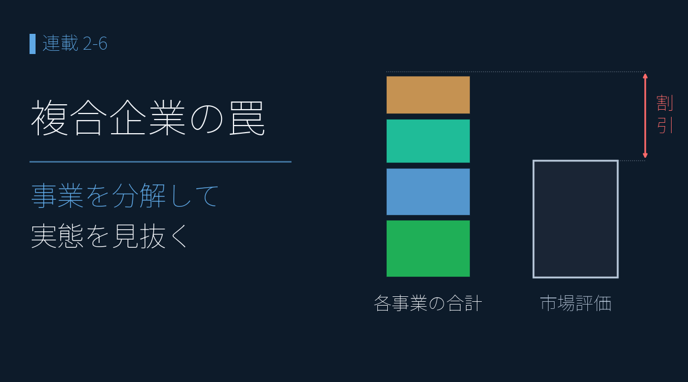
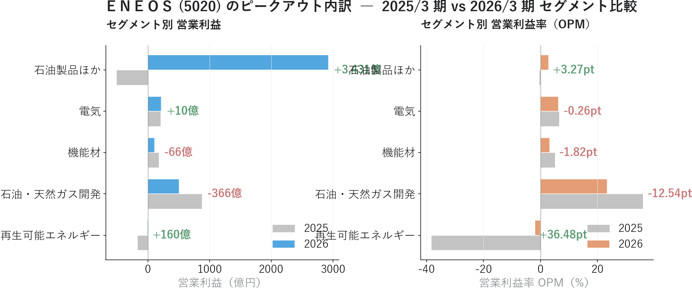

# コングロマリット・ディスカウント ― 総合商社・ＥＮＥＯＳをセグメントで読み解く

{width="1280"}

総合商社のような複合企業は、事業の全体像が見えにくく **実態より低く評価されがち** です（**コングロマリット・ディスカウント**）。セグメントに分解すれば、その割引の“中身”が定量的に見えてきます。

この記事で見ていくのは、次の 2 つです。

1. 利益の質（アクルーアル）・予想の信頼性（予想検証）で健全と確認した **総合商社** は、セグメントでも事業転換に成功しているか
2. 本連載の中核 **ＥＮＥＯＳ** のピークアウトは、どのセグメントで起きているか

どちらも同じ **決算短信 XBRL** で読み解きます。

データ出典 <i class="fa-solid fa-caret-right"></i>TDnet：決算短信 XBRL <i class="fa-solid fa-caret-right"></i>ＥＮＥＯＳ：2026/3期決算短信 XBRL を本記事用に追加取得（5セグメント。出光 / コスモエネＨＤ は同期未取得のため対象外）

<a class="ref-card ref-card--quiet" href="https://www.glossary.jp/sec/management/conglomerate-discount.php" target="_blank" rel="noopener">

コングロマリット・ディスカウント とは
複合企業の評価が各事業価値の合計を下回る現象 ― 証券取引用語集

</a>

## 総合商社の「事業転換」

利益の質（アクルーアル）と予想の信頼性（予想検証）で健全だった総合商社 8 社のうち、セグメントでも **はっきり事業転換が表れたのは丸紅と双日の 2 社** でした（他 6 社は横ばい〜小幅、三菱商事はセグメント売上の開示なし）。

| 銘柄         | アクルーアル （利益の質） | 予想検証 （予想の信頼性）       | **セグメント （本記事）**        |
| ---------- | ---------------- | ---------------------- | ------------------------- |
| 丸紅 8002 | −0.0168 （健全）  | G +7.3%  / C +1.8%  | **次世代事業 +127% × 金融 −55%** |
| 双日 2768 | −0.0009 （健全）  | G +25.8%  / C −4.9% | **エネルギー・ヘルスケア +78.9%**    |

つまり丸紅・双日は、**利益の質・予想・セグメントの 3 つがそろって同じ「健全・前進」を指す** 2 社です。ただし FY2025 確定後の予想検証は、丸紅（G +7.3% / C +1.8%＝強気ガイダンス × 中立コンセンサス）・双日（G +25.8% / C −4.9%＝強気ガイダンス × 懐疑的コンセンサス）へと変化しており、**この 3 分析の足並みがそろい続けるかは継続評価** が必要です。

## ＥＮＥＯＳ の「ピークアウトの内訳」

ＥＮＥＯＳ の 2026/3 期決算短信 XBRL から、セグメント別に当期 vs 前期を比べました（図は売上の開示がない「その他」を除く 5 セグメント、下の表は「その他」も含む）。連結営業利益は前期 1,061 億円から当期 4,666 億円へ、**前期比 +339.8%** の急回復（前期は金属事業＝JX金属を非継続事業に組み替えた継続事業ベース）。在庫影響を除いた実質ベースでも当期 **4,744 億円**（前期比 +3,107 億円の増益）と着地しています。ただしセグメントに分けて見ると、この急回復は 1 つの理由ではなく、いくつもの層が重なっていると分かります。

<i class="fa-solid fa-expand"></i> クリックで拡大

使用データ（在庫評価損益調整なし） <i class="fa-solid fa-caret-right"></i>TDnet（決算短信 XBRL）：セグメント情報（ＥＮＥＯＳ 5020、当期2026年3月期 vs 前期2025年3月期＝同短信内 prior）

{width="1200"}

| セグメント | 当期売上 | 営業利益 | OPM 前期→当期 | 状態 |
|---|--:|--:|:--:|:--|
| **石油製品ほか**（売上92%） | 103,953 億 | 2,924 億 | −0.5% → 2.8% | 🟢 赤字脱却 |
| **石油・天然ガス開発** | 2,167 億 | 508 億 | 36.0% → 23.5% | 🔻 正常化（営利 −42%）|
| **機能材** | 3,390 億 | 111 億 | 5.1% → 3.3% | 🔻 −37%（市況悪化）|
| 電気 | 3,492 億 | 220 億 | 6.6% → 6.3% | ▬ 横ばい |
| 再生可能エネルギー | 487 億 | −9 億 | −38.4% → −1.9% | 🟢 赤字縮小 |
| **その他** | — | **912 億** | — | 金属442 + NIPPO等470 |
| **連結合計** | — | **4,666 億** | — | **前期比 +339.8%**（前期 1,061 億） |

急回復の正体は 2 つです。

- **石油製品（売上 92%）が前期赤字（−507 億）→ 当期黒字（+2,924 億）に転換** ― ただし前期 −507 億は在庫評価損などで沈んだ底で、振れ幅が大きく見えるのは前期の反動。**当期の利益水準自体は在庫の追い風ではなく**、実力ベースでも堅調（在庫影響除き 4,744 億）
- **その他事業 912 億円**（金属 442 + NIPPO・連結調整 470）が連結利益の約 20% を占める

前期の在庫評価損の反転や精製マージン（仕入れと販売の利ざや）の回復など、原油サイクルに連動する要素が大きく、利益の質の分析どおり **2022〜2024 の累積では CF が純利益を上回り回収済み**（一過性ではなく、業態固有のサイクル）。

一方で、**本来の収益エンジンである 2 事業の利益率（OPM＝営業利益率）は低下** しています:

- **石油・天然ガス開発**: 5 セグメント中で唯一 OPM 20% 超だった高収益事業。**OPM 36.0% → 23.5%（−12.5pt）、営業利益 −41.8%**。ただし OPM 23% は今も他業界より高く、原油・ガス価格が高止まりした時期からの **サイクル正常化** とも読めます。「構造的な地盤沈下」か「一時的なサイクル要因」かは 2 年の比較では断定できず、継続観察が必要
- **機能材**: 「高付加価値素材で利益を安定させる」事業とされるが、**OPM 5.1% → 3.3%（−1.8pt）、営業利益 −37.3%**。化学市況の悪化が利益率を圧迫しており、注意が必要

つまり **「連結は急回復、その裏で高収益セグメントは正常化」という二層構造** です。ＥＮＥＯＳ は、見る角度を変えるたびに違う顔が出てきます ― ここまでの連載で見てきた 6 つの角度を、一覧にしておきます。

| 分析の角度 | ＥＮＥＯＳ から見えたこと |
|---|---|
| 割安度（PEG×ROE） | GARP マップで割安・低 ROE。圏外でも +29.7% 上昇 |
| 業績推移（XBRL） | 2022 純利 5,371 億（原油高で在庫評価益が膨らんだ特殊年）→ 2025 2,261 億へ縮小 |
| 利益の質（アクルーアル） | 単年 CF/純利 39% vs 3 年累積 114%（回収済み）|
| 予想の信頼性（予想検証） | EPS +72.9% と経常 ▲0.6% の併存は構造要因（のれん減損 / JX金属IPO / 自社株買い）|
| 市場反応（CAR） | 修正発表で CAR[-1,+20] = −13.89%（主因は構造要因）|
| **セグメント（本記事）** | 開発 OPM 36→23% / 機能材 5→3% の正常化を可視化。連結 4,666 億（前期 1,061 億から +339.8%）|

連結の急回復をうのみにせず、**前期の在庫評価損の反転と精製マージン回復で石油製品が黒字転換した裏で、高収益セグメントは正常化に向かっている** ― これが「全体ピークアウト」の内訳です。「ピークアウトか正常化か」は **CF の累積（114%）** とセグメントの時系列を継続観察して判断します（[GARP の記事](02-01_garp_peg_roe.md) の 4 基準試算を参照）。

なお出光興産 / コスモエネＨＤ は本記事執筆時点で同期 (2026/3 期) の決算短信 XBRL を未取得です。3 社揃えれば「石油元売 3 社の事業構成比較」が可能になり、割安度・マルチファクター分析で観察された 3 社の株価動向の差をセグメントレベルで説明できる見込みです。

## まとめ

- **丸紅・双日 はセグメントでも事業転換に成功** ― 利益の質・予想・セグメントの 3 分析が同じ方向を指す
- **ＥＮＥＯＳ 2026/3 期は連結営業利益 4,666 億（前期比 +339.8%）の急回復** ― 主因は石油製品（売上 92%）の赤字脱却。一方で **主力 2 事業（開発・機能材）は正常化局面**。「ピークアウトか正常化か」は継続観察が必要

## <i class="fa-brands fa-github"></i> Python コード

本記事のチャート画像・データ取得・成形スクリプトは、すべて **GitHub に公開**しています。**セグメント分解の計算方法**（決算短信 XBRL からのセグメント抽出・前期比・OPM 算出・利益の質／予想検証とのクロス）は、リポジトリの README にまとめています。データは提供元の利用規約により再配布できませんが、データを各自取得すれば、本連載と同じものが再現できます。

<a class="repo-link" href="https://github.com/minnanosaiban/blog/tree/main/02-05_segments" target="_blank" rel="noopener">
github.com/minnanosaiban/blog/02-05_segments
<i class="repo-link-arrow fa-solid fa-arrow-up-right-from-square"></i>
</a>

---
