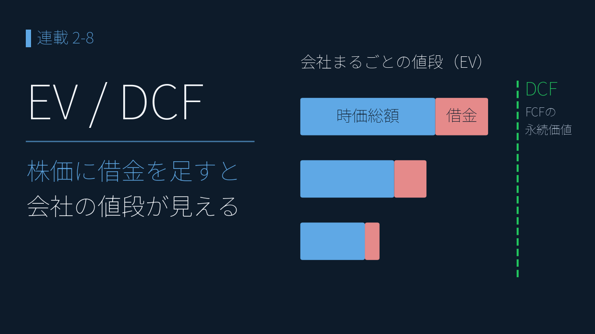
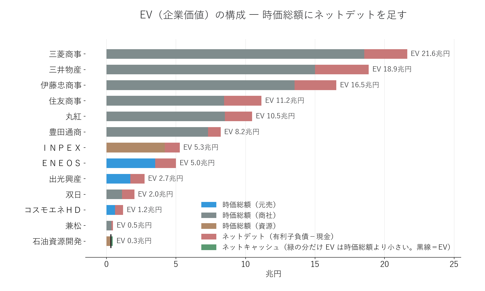
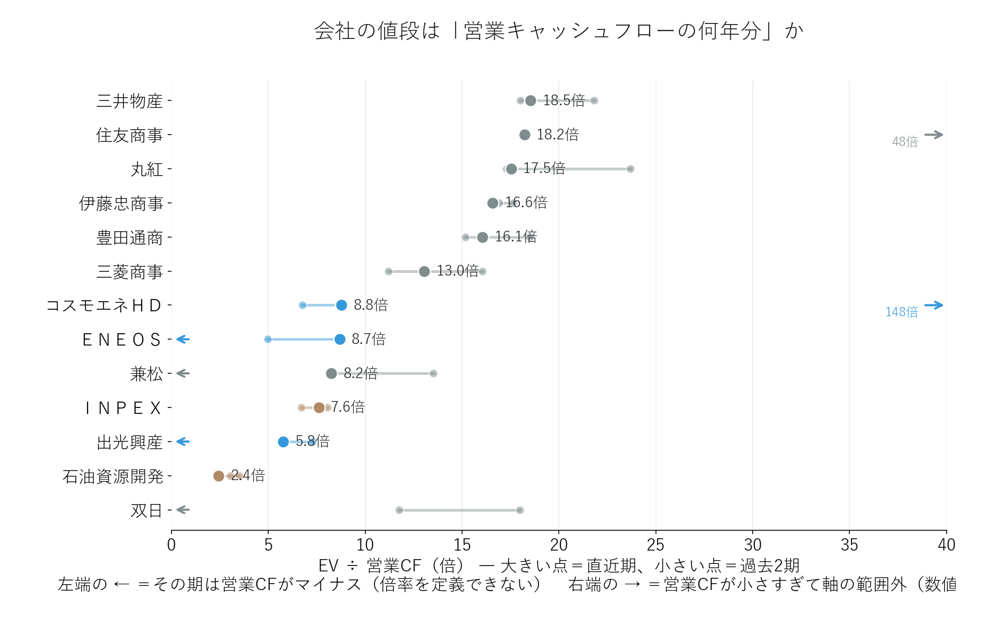
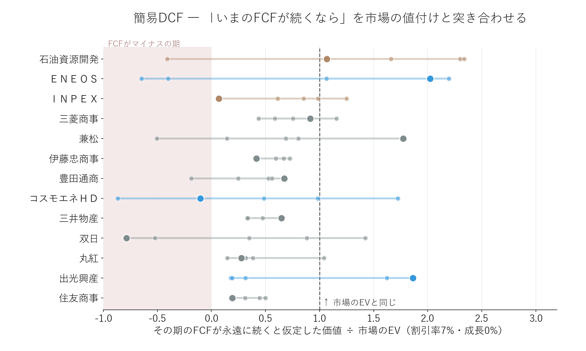

# EVで見る「会社の値段」 ― 元売・商社・資源 13社を簡易DCFで検証

{width="1280"}

株価×株式数（時価総額）は「株主の取り分」の値段であって、会社まるごとの値段ではありません。会社を丸ごと買うなら、借金も引き受けることになるからです。

そこで本記事では、有価証券報告書から抽出した**有利子負債と現金を時価総額に足し引きした EV（企業価値）**を、**元売3社・総合商社8社・資源2社の計13社**で算出します。さらに「会社の値段は稼ぎの何年分か」（EV/営業CF）と、「いまのFCFが続くならいくらか」（簡易DCF）を市場の値付けと突き合わせます。

データ出典: 有価証券報告書 XBRL 13社（2025年3月期末・ＩＮＰＥＸのみ2025年12月期末）、決算短信 XBRL（2026年3月期）、株価は yfinance（2026-05-29終値）。有利子負債・現金・営業CFは自前パーサで抽出し、決算短信と独立に突合検証済み

<!-- more -->

## EV とは ― 株価に「借金」を足すと会社の値段になる

**EV（企業価値）= 時価総額 ＋ ネットデット（有利子負債 − 現金）** ― 会社を丸ごと買うときの実質的な値段

時価総額が同じ2社でも、借金が多い会社は「高い買い物」、現金を貯め込んだ会社は「実質値引き」です。有利子負債は決算短信のサマリーには載っていないため、**有価証券報告書の XBRL から借入金・社債・CP を抽出**しました。

<i class="fa-solid fa-expand"></i> クリックで拡大

使用データ: 時価総額＝株価2026-05-29終値／ネットデット（有利子負債−現金）＝有価証券報告書 2025年3月期末（ＩＮＰＥＸのみ2025年12月期末）

{width="1200"}

- **━ ネットデット**の上乗せは社によって全く違う ― **ＥＮＥＯＳは時価総額3.5兆円に対して＋1.5兆円**（EV 5.0兆円）、時価総額の4割超が「見えない値札」
- **━ 商社**は時価総額の巨大さに対して上乗せは1〜2割台 ― 三菱商事は時価総額18.6兆円＋3.1兆円で **EV 21.6兆円**
- **━ 資源**の石油資源開発は逆に**現金が借金より多く（ネットキャッシュ）**、EV は時価総額より小さい0.3兆円

なお IFRS のリース負債（ＥＮＥＯＳ 0.34兆円など）は開示タグが13社で揃わないため有利子負債に含めず、非支配株主持分も足していません。EV は少し控えめな値です。

## EV/営業CF ― 会社の値段は「稼ぎの何年分」か

**EV ÷ 営業CF ＝ 会社の値段が「本業の現金収入の何年分」か** ― 小さいほど市場の値付けは慎重

定番は EV/EBITDA ですが、**総合商社は損益計算書に営業利益を表示しない**（売上総利益から税前利益へ直行する）ため、EBITDA の定義が13社で揃いません。そこで全社で同じ定義になる **営業CF** で割ります。

<i class="fa-solid fa-expand"></i> クリックで拡大

使用データ: 営業CF＝有価証券報告書の直近3期（2023〜2025年3月期、ＩＮＰＥＸのみ2023〜2025年12月期）／EV＝時価総額（株価2026-05-29終値）＋ネットデット（2025年3月期末・ＩＮＰＥＸのみ2025年12月期末）

{width="1200"}

- **━ 商社は13〜18.5倍**、**━ 元売は6〜9倍**、**━ 資源は2〜8倍** ― 市場は「同じ1円の営業CF」に2倍以上違う値段を付けている
- 石油資源開発は**2.4倍** ― 約2年半の営業CFで EV を回収できる計算。市場が「この稼ぎは続かない」と見ている裏返し
- ただし営業CFは年でブレる ― ＥＮＥＯＳ・出光・兼松は**2023年3月期が営業CFマイナス**（在庫高・運転資本の膨張）、双日は直近期がマイナス。**単年の倍率を鵜呑みにしない**のがこの図の教訓

## 簡易DCF ― 「いまのFCFが続くなら」を市場と突き合わせる

**DCF（割引キャッシュフロー）= FCF ÷ 割引率** ― 毎年のFCFが永遠に続くと仮定した価値（割引率7%・成長0%）

FCF（フリーキャッシュフロー）は**営業CF＋投資CF**で計算し、直近5期それぞれの FCF を永続価値に換算して、市場の EV を1とした比率で並べます。「どの年の自分を信じるか」で評価が何倍も変わることが見どころです。

<i class="fa-solid fa-expand"></i> クリックで拡大

使用データ: FCF（営業CF＋投資CF）＝有価証券報告書の直近5期（2021〜2025年3月期、ＩＮＰＥＸのみ2021〜2025年12月期）／EV＝時価総額（株価2026-05-29終値）＋ネットデット（2025年3月期末・ＩＮＰＥＸのみ2025年12月期末）

{width="1200"}

- **━ 大手商社は5期とも1.0未満に密集**（伊藤忠0.4〜0.8、三井物産0.3〜0.7、住友商事0.2〜0.5） ― いまのFCFの永続価値だけでは市場の EV に届かない。市場は**投資が将来のFCFに化ける前提**（成長）を織り込んでいる
- **━ ＥＮＥＯＳはレンジが−0.7〜2.2倍と最大級**にブレる ― 直近期の2.0倍は **JX金属の売却収入で投資CFがプラスに振れた**一時要因。単年DCFの危うさの見本
- **━ 石油資源開発は中央値が1.0超** ― FCF面でも「割安」に見えるが、これも市場が**資源価格と生産の先細りを織り込んだ値段**という解釈と表裏

DCF は「答えを出す道具」ではなく、**市場の値付けにどんな前提が埋まっているかを逆算する道具**として使うのが安全です。

## まとめ

- **EV ＝ 時価総額 ＋ ネットデット** ― 有価証券報告書から有利子負債を抽出すると「会社まるごとの値段」が見える。ＥＮＥＯＳは時価総額の4割超が借金の上乗せ、石油資源開発は逆にネットキャッシュ
- **EV/営業CF は商社13〜18.5倍 vs 元売・資源2〜9倍** ― 市場は稼ぎの「続きやすさ」に値段を付けている。ただし営業CFがマイナスの期もあり、単年では判断しない
- **簡易DCFは市場の前提を逆算する道具** ― 商社の EV は「いまのFCF」だけでは説明できず成長を織り込む。ＥＮＥＯＳの直近FCFは資産売却で跳ねており、**どの年を「実力」と見るかで評価は何倍も変わる**

## <i class="fa-brands fa-github"></i> Python コード

本記事のチャート画像・データ取得・成形スクリプトは、すべて **GitHub に公開**しています。**有利子負債の抽出**（企業固有の拡張タグへの対応・日本基準とIFRSのタグの違い）と、**有報と決算短信の独立突合による検証**は、リポジトリの README にまとめています。データは提供元の利用規約により再配布できませんが、データを各自取得すれば、本連載と同じものが再現できます。

<a class="repo-link" href="https://github.com/minnanosaiban/blog/tree/main/02-08_enterprise_value" target="_blank" rel="noopener">
github.com/minnanosaiban/blog/02-08_enterprise_value
<i class="repo-link-arrow fa-solid fa-arrow-up-right-from-square"></i>
</a>

---
