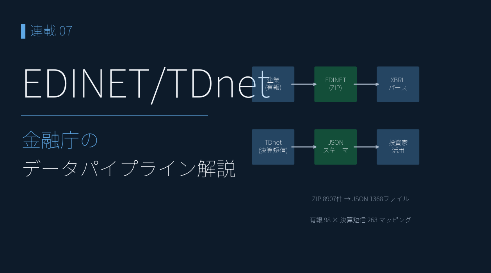

# 株価以外も取得しよう ― EDINET・TDnet・証券会社のアプリを活用

{width="1280"}

株価だけでは決算は語れません。**いつ決算が出たか（発表日時）**、**証券会社のアプリ**、そして **決算書そのもの＝ XBRL**。この 3 系統がそろえば、多角的な分析が行えます。

本記事では株価以外のデータの取り方を一通り押さえ、連載01で紹介したチャートからもう一歩目的をもったチャート作成に進めていきます。

<!-- more -->


## 3 つのデータソース

| 取得元           | 情報                | 形式        |
| ------------- | ----------------- | --------- |
| EDINET 公式 API | 有価証券報告書（有報 XBRL ） | XBRL      |
| TDnet         | 決算短信 XBRL ・決算発表日時 | HTML・XBRL |
| 証券会社のアプリ      | 業績指標              | CSV       |

- **EDINET** ＝ 金融庁公式。長期時系列の有報。公式 API で取得（無料登録）
- **TDnet** ＝ 取引所。決算短信・適時開示。公式 API がないのでスクレイピング
- XBRL の中身（→ JSON 変換と分析）は次回連載03 で扱います。本記事は **取り方** に集中します


## EDINET 公式 API ― 有報 XBRL

決算短信・有報には、人間用の PDF と並んで **必ず XBRL**（タグ付きデータ）が同時提出されています。これが「決算書そのもの」です。この XBRL は EDINET 公式 API で ZIP ファイルで取得できます。

書類インデックスを取得したあと、**`type=5` を設定すると XBRL が取得できます**。

```python
res = requests.get(f"https://disclosure.edinet-fsa.go.jp/api/v2/documents/{doc_id}",
                   params={"type": 5, "Subscription-Key": API_KEY})   # type=5 で XBRL を取得
```

最新の有報 1 つに **過去 5 期分の要約財務**が入っているのが EDINET の強力なところ。だから **ＥＮＥＯＳ の 7 年分は、たった 3 つの有報で揃います**。

業績はヤフーファイナンスや株探などのサービスで確認できますが、期間は3～5年です。有報を遡って足せば **10 年超**の業績時系列も組めます。また、データを取得することで、銘柄の業績を比較した可視化が可能です。


## TDnet ― 決算短信 XBRL ・決算発表日時


**決算短信 XBRL** は、有報 XBRL と違い、公式 API がないため、PDF の URL を ZIP の URL に変換するという方法をとります。

まず、TDnet の適時開示ページから、決算短信のリンクと発表日時を拾います。

```python
import re, requests
from bs4 import BeautifulSoup

url = f"https://www.release.tdnet.info/inbs/I_list_001_{target_date}.html"
soup = BeautifulSoup(requests.get(url, headers={"User-Agent": "Mozilla/5.0"}).text, "html.parser")
# 決算短信のリンクと発表時刻を抽出し、date, time, code の3列で earnings.csv に保存
```

> ⚠️ TDnet は商用利用・データ転売が禁止です。個人の投資判断目的に限り、アクセス間隔を 1 秒以上空けるなどマナーを守って使用してください。


## 証券会社のアプリ ― 業績指標

連載04〜07（PEG × ROE・マルチファクターなど）で「予想」「コンセンサス」として使う指標は、証券会社のアプリ から CSV でエクスポートできます。

- EPS / BPS / 配当 / ROE / ROA / EV/EBITDA / **業績予想修正率(予想)** / 経常利益変化率(予想) など
- 楽天証券・マネックス証券・SBI 証券・会社四季報などが同等の指標を提供

> 本記事以降の「予想」は **アナリストのコンセンサス値** で、企業公式の業績予想とは異なります。


## まとめ

- **EDINET の有報 XBRL** ― 「決算書そのもの」を `type=5` で取得。最新の 1 つに 5 期分が入り、遡って足せば **10 年超の業績時系列**も組める。
- **TDnet** ― 決算短信 XBRL と、株価が大きく動く **決算発表日時** を取得（公式 API が無いためスクレイピング）
- **証券会社のアプリ** ― EPS・ROE・業績予想修正率などの業績指標を CSV でエクスポート

次回は、取得した **XBRL を分析に使えるかたちの JSON に変換**します。


## Appendix ― Python コード <i class="fa-brands fa-github"></i>

取得スクリプトと 2 つのチャートを **GitHub に公開**しています。決算データは再配布できませんが、EDINET / TDnet から取得すれば同じ画面を再現できます（手順はリポジトリの README 参照）。

> <i class="fa-brands fa-github"></i> **リポジトリ** [`github.com/minnanosaiban/blog`](https://github.com/minnanosaiban/blog)

#### 複数銘柄を俯瞰するチャート

連載01 の株価だけでは「チャートを並べる」までですが、ここで取得した **業績指標（PER / PBR / 配当）** を重ねると、銘柄比較が一気に厚くなります。複数銘柄のファンダ指標とチャートを 4 列カードグリッドで **1 画面で俯瞰** する Streamlit アプリです。

<small style="color: var(--md-link-color);"><i class="fa-solid fa-expand"></i> クリックで拡大できます</small>

{width="1200"}

> 🔗 [`app.py`](https://github.com/minnanosaiban/blog/blob/main/02_1_chart_multi/app.py)

#### 決算発表直後の動きを確認するチャート

5分足 parquet と発表日時 `earnings.csv` で、決算発表後の値動きを 5 パターン（🟢上げ / 逆 V 字 / 無風 / V 字 / 🔴下げ）に自動分類する Streamlit アプリです。各銘柄の5分足チャートに、発表時刻の **縦点線**を入れていますので、決算発表直後の激しい株価の動きが確認できます。

<small style="color: var(--md-link-color);"><i class="fa-solid fa-expand"></i> クリックで拡大できます</small>

{width="1200"}

> 🔗 [`app.py`](https://github.com/minnanosaiban/blog/blob/main/02_2_chart_earnings_pattern/app.py)

<!-- TODO: EDINET/TDnet 取得スクリプト（collectors）の公開パスが決まったら #### サブセクションを追加 -->

---

*データ出典: TDnet 適時開示（発表日時）/ 証券会社が無料で提供する銘柄情報シート CSV / EDINET API（金融庁）の有報 XBRL / TDnet の決算短信 XBRL*
