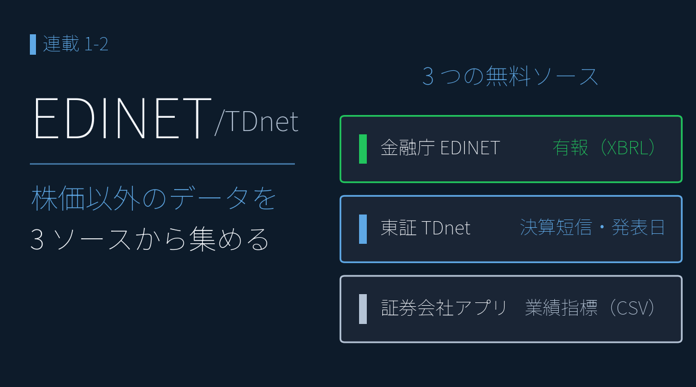

# EDINET・TDnet 等を活用する ― 企業が開示している決算 XBRL は使える

{width="1280"}

株価チャートだけで売買するのは、業績という土台を見ない **ギャンブルに近い** もの。決算データを足せば、銘柄を多角的に評価できます。本記事では、金融庁 EDINET ・ 東証 TDnet ・ 証券会社のアプリから決算書や業績指標を取得します。

これらのデータを使って、複数銘柄を指標と合わせて比較するチャートを作成し、株価チャートからもう一歩、目的をもったチャート作成に進めていきます。

<p class="fig-meta">データ出典: TDnet 適時開示（発表日時）/ 証券会社のアプリの銘柄情報シート CSV / EDINET API（金融庁）の有報 XBRL / TDnet の決算短信 XBRL</p>

<div class="ref-quiet">
<a class="ref-card ref-card--quiet" href="https://www.fsa.go.jp/search/20130917.html" target="_blank" rel="noopener">
<span class="ref-card-body">
<span class="ref-card-title">EDINET とは</span>
<span class="ref-card-desc">有価証券報告書などの開示書類を閲覧できる電子開示システム ― 金融庁</span>
</span>
</a>
</div>


## 3 つのデータソースの概要

| 取得元            | 情報                | 形式        |
| -------------- | ----------------- | --------- |
| **金融庁 EDINET** | 有価証券報告書（有報 XBRL ） | XBRL      |
| **東証 TDnet**   | 決算短信 XBRL ・決算発表日時 | HTML・XBRL |
| **証券会社のアプリ**   | 業績指標              | CSV       |

- 金融庁 EDINET と 東証 TDnet で取得するデータは、 **XBRL** というファイル形式です。XBRL の使い方は次回扱います。本記事では **データの取り方** を解説します。

> ⚠️利用条件はデータソースごとに異なるため、各提供元の規約を確認してください。とくに証券会社のアプリの CSV は再配布できません。アクセス間隔を 1 秒以上空けるなどマナーを守って使用してください。

## 金融庁 EDINET から有報を取得する

有報は、**PDF と XBRL**（タグ付きデータ）の二つの形式で入手することができます。XBRL は EDINET 公式 API で取得できます。`type=1` で XBRL 書類一式、`type=5` で XBRL を CSV 化したデータ一式が取得でき、本連載では `type=5` を使用します。

業績推移はヤフーファイナンスや株探などのサービスで確認できますが、期間は3～5年です。有報を遡って足せば **10 年超**の業績時系列も組めます。また、データを取得することで、銘柄の業績を比較した可視化が可能です。

```python
res = requests.get(f"https://disclosure.edinet-fsa.go.jp/api/v2/documents/{doc_id}",
    params={"type": 5, "Subscription-Key": API_KEY}) 
# type=5 で XBRL の CSV 化データ一式を取得（XBRL 書類一式は type=1）
```


## 東証 TDnet から決算短信を取得する

**決算短信 XBRL や決算発表日時** は、有報 XBRL と違い、TDnet には書類取得の公式 API がありません（JPX の有料 API は別枠）。そこで、一覧ページをスクレイピングして短信 PDF のリンクと発表時刻を取得し、PDF の URL を ZIP の URL に書き換えてダウンロードします。この ZIP に短信 XBRL 一式が入っています。

```python
import requests
from bs4 import BeautifulSoup

url = f"https://www.release.tdnet.info/inbs/I_list_001_{target_date}.html"
soup = BeautifulSoup(requests.get(url, headers={"User-Agent": "Mozilla/5.0"}).text, "html.parser")
# 決算短信のリンクと発表時刻を抽出し、date, time, code の3列で earnings.csv に保存
```


## 証券会社のアプリから業績指標を取得する

後の記事（PEG × ROE・マルチファクター分析など）で「予想」「コンセンサス」として使う指標は、証券会社のアプリ から CSV でエクスポートできます。

- EPS / BPS / 配当 / ROE / ROA / EV/EBITDA / 業績予想修正率(予想) / 経常利益変化率(予想) など様々な指標がそろっています。
- 楽天証券・マネックス証券・SBI 証券・会社四季報などが同等の指標を提供しています。

> ⚠️本記事以降、「予想」と表記されているものは **アナリストのコンセンサス値** で、企業公式の業績予想とは異なります。


## <i class="fa-brands fa-github"></i> Python コード

本記事のチャート画像・アプリ・データ取得・成形スクリプトは、すべて **GitHub に公開**しています。データは提供元の利用規約により再配布できませんが、データを各自取得すれば、本連載と同じものが再現できます（動かし方はリポジトリの README 参照）。

<div class="repo-link-wrap">
<a class="repo-link" href="https://github.com/minnanosaiban/blog/tree/main/02_1_chart_multi" target="_blank" rel="noopener">
<span class="repo-link-path">github.com/minnanosaiban/blog/02_1_chart_multi</span>
<i class="repo-link-arrow fa-solid fa-arrow-up-right-from-square"></i>
</a>
</div>
<div class="repo-link-wrap">
<a class="repo-link" href="https://github.com/minnanosaiban/blog/tree/main/02_2_chart_earnings_pattern" target="_blank" rel="noopener">
<span class="repo-link-path">github.com/minnanosaiban/blog/02_2_chart_earnings_pattern</span>
<i class="repo-link-arrow fa-solid fa-arrow-up-right-from-square"></i>
</a>
</div>

## 📌 自作アプリ紹介


<div class="keypoint" markdown="span">**― 複数銘柄を俯瞰するチャート ―**</div>


<div class="repo-link-wrap">
<a class="repo-link" href="https://github.com/minnanosaiban/blog/tree/main/02_1_chart_multi" target="_blank" rel="noopener">
<span class="repo-link-path">github.com/minnanosaiban/blog/02_1_chart_multi</span>
<i class="repo-link-arrow fa-solid fa-arrow-up-right-from-square"></i>
</a>
</div>


株価だけでは「チャートを並べる」までですが、ここで取得した **業績指標（PER / PBR / 配当）** を重ねると、銘柄比較が一気に厚くなります。複数銘柄のファンダ指標とチャートを 4 列カードグリッドで **1 画面で俯瞰** する Streamlit アプリです。

<p class="fig-meta"><i class="fa-solid fa-expand"></i> クリックで拡大</p>

{width="1200"}


<div class="keypoint" markdown="span">**― 決算発表直後の動きを確認するチャート ―**</div>


<div class="repo-link-wrap">
<a class="repo-link" href="https://github.com/minnanosaiban/blog/tree/main/02_2_chart_earnings_pattern" target="_blank" rel="noopener">
<span class="repo-link-path">github.com/minnanosaiban/blog/02_2_chart_earnings_pattern</span>
<i class="repo-link-arrow fa-solid fa-arrow-up-right-from-square"></i>
</a>
</div>


5分足 parquet と発表日時 `earnings.csv` で、決算発表後の値動きを 5 パターン（🟢上げ / 逆 V 字 / 無風 / V 字 / 🔴下げ）に自動分類する Streamlit アプリです。各銘柄の5分足チャートに、発表時刻の **縦点線**を入れていますので、決算発表直後の激しい株価の動きが確認できます。

<p class="fig-meta"><i class="fa-solid fa-expand"></i> クリックで拡大</p>

{width="1200"}

---
