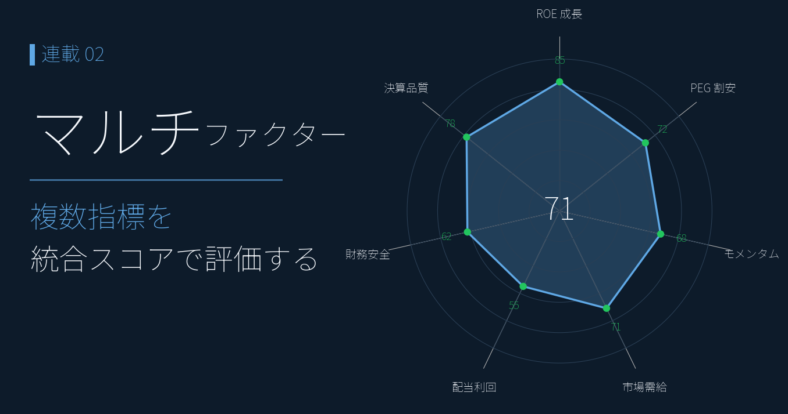
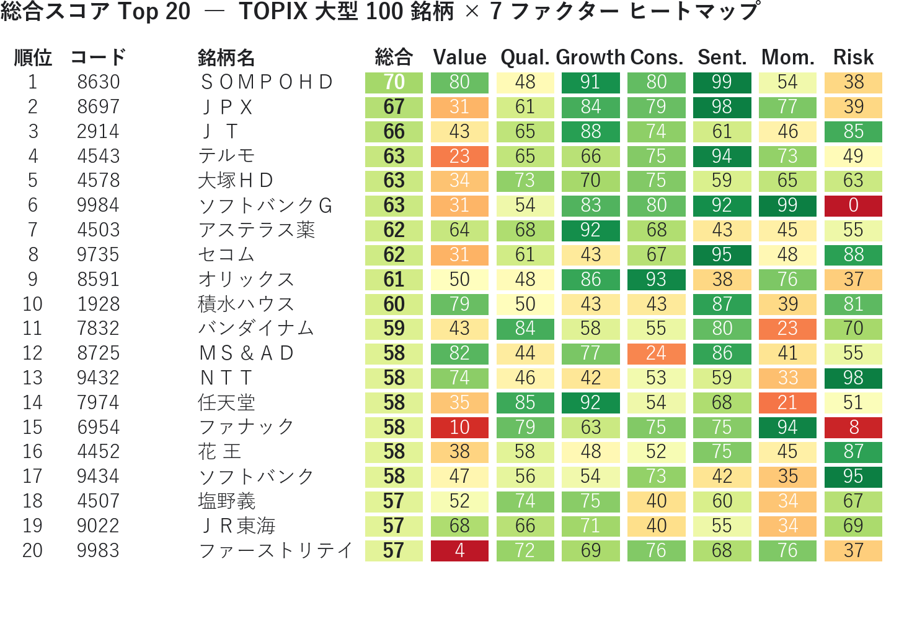
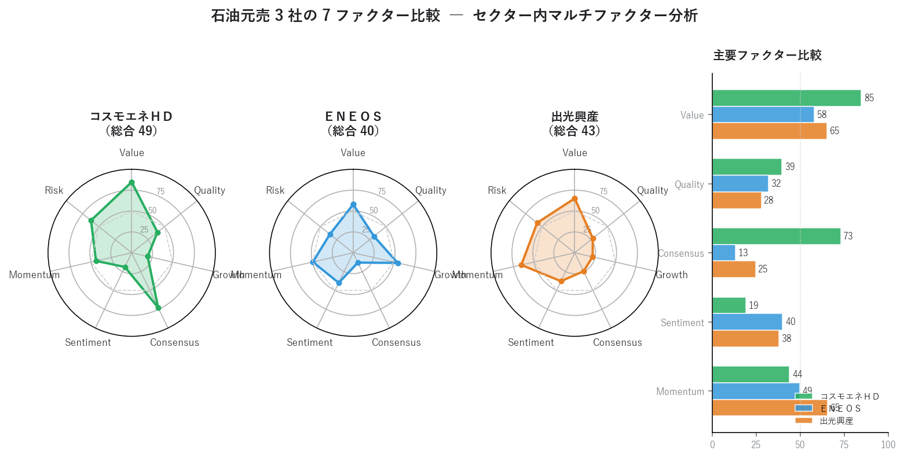
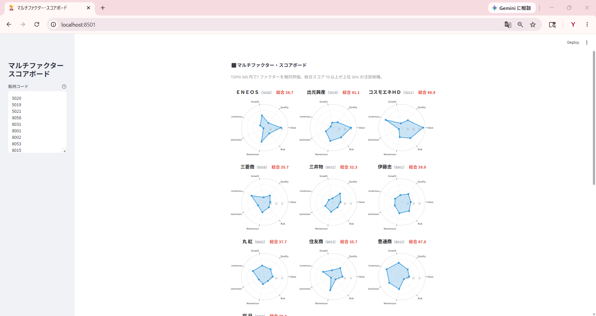

# マルチファクターで銘柄を採点する ― スコアボードで「全方位優等生」を発見する

{width="1280"}

「PER が低いから買い」「ROE が高いから買い」 ― 単一指標スクリーニングには、落とし穴があります。

連載01 の [PEG × ROE 銘柄分析](01_garp_peg_roe.md) の 2 軸を、本記事では **Value / Quality / Growth / Consensus / Sentiment / Momentum / Risk** の 7 ファクターに拡張。連載01 で観察した「GARP 圏外なのに上昇」「GARP 理想なのに下落」という逆転現象を、ファンダ・需給・モメンタムを横並びにして定量的に再検証します。

<!-- more -->

## マルチファクターモデルの概要

Fama-French、Carhart、Q-factor など機関投資家のクオンツモデルは「複数ファクターを並列スコア化して合成する」という共通構造を持ちます。本ダッシュボードは 7 ファクターを採用します。

| ファクター | 観点 | 主要指標 |
|---|---|---|
| **Value** | 割安度 | PER / PBR / EV/EBITDA / 配当利回り |
| **Quality** | 収益性・財務健全性 | ROE / ROA / 営業利益率 / 自己資本比率 |
| **Growth** | 過去の成長実績 | 売上高変化率 / 経常利益変化率 |
| **Consensus** | 将来予想の改善度 | 業績予想修正率 / 経常利益変化率(予想) / 3年売上成長率(予想) |
| **Sentiment** | 需給の熱量 | 出来高増加率 / 売買代金増加率 |
| **Momentum** | 株価のトレンド | 値上り率 / 52週安値からの上昇率 / MA乖離率 |
| **Risk** | リスク要素（低いほど良い） | 60日ボラティリティ / β（対日経平均） |

**全ファクターが平均以上**の銘柄はオールラウンダー（コア候補）、**一つだけ突出して低い**銘柄はその要因で敬遠する判断材料になる ― これがマルチファクター採点の利点です。

各指標は **パーセンタイルランク化（0–100）** してから単純平均し、総合スコアを合成します（**スコア 70 以上が上位 30% の注目候補**）。

## チャートで確認

7 ファクターを並列で見るには **レーダーチャート** が標準です。7 軸の **形のいびつさ** で、銘柄の性格（攻め型・守り型・バランス型）が一目で分かります。

<small style="color: var(--md-link-color);"><i class="fa-solid fa-expand"></i> クリックで拡大できます</small>
<small style="color: var(--md-link-color);">2026.05.22作成</small>

{width="1200"}

| 銘柄 | 総合 | 形状の特徴 |
|---|---|---|
| **ソフトバンクＧ** | 62.8 | Momentum 99 / Sentiment 92 / Growth 83 と需給・業績が最強。Risk **0** ＝ ほぼ最高ボラティリティが唯一の弱点 |
| **三菱ＵＦＪ** | 56.0 | Momentum 73 / Sentiment 81 が強く、最近の銀行株上昇を反映。一方 Quality 32（銀行は ROE が構造的に低い） |
| **キーエンス** | 55.7 | Quality **92**（高 ROE で別格）だが Value 6（PER が市場上位 6% = 割高） |
| **ＫＤＤＩ** | 52.3 | バランス型。Risk 69（低ボラ）で長期保有向き |
| **トヨタ** | 41.7 | 全ファクターが 34〜70 で突出した強みなし。Sentiment 12 / Momentum 42 から直近モメンタム弱め |
| **ソニーＧ** | 37.8 | Sentiment 23 / Momentum 42 と需給・モメンタムが低迷。Growth 18 で過去の成長実績も振るわない |

- キーエンスは Quality 一点突出の「典型的な高品質・割高銘柄」 ― 形が右上に偏る
- ソフトバンクＧ は Risk 軸だけ極端に凹んだ「高リターン高リスク型」
- ＫＤＤＩ・トヨタは全方位バランス型

> 💡 レーダーは **形のいびつさ** で銘柄の性格が分かる。同じ「総合 55」でも一点突出型と全方位平均型では投資判断が変わる。

## ヒートマップで確認

レーダーが「個別銘柄の性格」を見るのに対し、**ヒートマップは「全体序列」を見るツール**です。TOPIX 大型 100 銘柄内の総合スコア Top 20 を 7 ファクター別に色分けすると、どのファクターで稼いでいるかが一目で分かります。

トップは **ＳＯＭＰＯＨＤ（総合 70.0）**、続いて ＪＰＸ・ＪＴ・テルモ・大塚ＨＤ・ソフトバンクＧ。

<small style="color: var(--md-link-color);"><i class="fa-solid fa-expand"></i> クリックで拡大できます</small>
<small style="color: var(--md-link-color);">2026.05.22作成</small>

{width="1200"}

- **ディフェンシブ（ＪＴ・ＮＴＴ）と需給・業績強銘柄（ＳＯＭＰＯＨＤ・ソフトバンクＧ）** が混在
- 業種最大手（ＥＮＥＯＳ など）でも総合 45.3 で Top 20 圏外 ― 業種大手とマルチファクター評価は別物

> 💡 Top 20 を見るときは「総合スコアの高さ」より **どのファクターで稼いでいるか** に注目する。ディフェンシブ型・需給型・業績型はリスクの性格が違う。

## 石油元売 3 社比較

連載01 では同じ 3 社を PEG × ROE 平面で比較し、**「GARP 理想ゾーンのコスモが唯一の下落、ROE が劣る ＥＮＥＯＳ が大きく上昇」** という GARP マップ位置と株価動向の逆転現象を観察しました。7 ファクターで見直すと、この逆転がより精緻に説明できます。

- **コスモエネＨＤ**: ファンダ面では圧倒的（Value 92 / Consensus 68）だが、**Sentiment 22 / Momentum 35 で需給は冷えたまま**。投資家がコンセンサスの強気予想を信用していないか、流動性プレミアム不足で資金が回らない状態
- **ＥＮＥＯＳ**: Value 70 / Quality 32 と地味だが、**Growth 54 / Sentiment 57 / Momentum 51 で「動いている」**。経常利益変化率 +408% という実績がモメンタムを支える
- **出光興産**: 中庸型。突出した強みも弱みもなく、3 社の中間に位置する

<small style="color: var(--md-link-color);"><i class="fa-solid fa-expand"></i> クリックで拡大できます</small>
<small style="color: var(--md-link-color);">2026.05.22作成</small>

{width="1200"}

| 銘柄          | 総合       | Value  | Qual. | Growth | Cons.  | Sent.  | Mom. | Risk |
| ----------- | -------- | ------ | ----- | ------ | ------ | ------ | ---- | ---- |
| **コスモエネＨＤ** | **47.9** | **92** | 41    | 19     | **68** | **22** | 35   | 59   |
| ＥＮＥＯＳ       | 45.3     | 70     | 32    | 54     | 22     | 57     | 51   | 32   |
| 出光興産        | 41.4     | 76     | 30    | 22     | 25     | 45     | 39   | 54   |

連載01 で「コスモは GARP 理想ゾーンなのに下落」した謎は、**ファンダ（Value 92 + Consensus 68）と需給（Sentiment 22 + Momentum 35）のスコアが乖離している** ことで定量的に説明できます。

これがマルチファクター採点の価値です。**ファンダだけ・需給だけでは見えない「乖離」が一目で分かる**。次回 連載03 の EPS リビジョン・モメンタムは、この乖離が縮まる瞬間を時系列で捉えます。

## まとめ

- 単一指標スクリーニングの落とし穴（バリュー・トラップ / 成長停止 / 過熱）を **7 ファクター統合採点** で自動回避できる
- **レーダーチャートが標準的な可視化**。7 軸の形のいびつさで銘柄の性格（攻め型・守り型・バランス型）が一目で分かる
- 石油元売3社では、コスモのファンダ（Value 92 / Consensus 68）と需給（Sentiment 22 / Momentum 35）の **乖離** が、連載01 の「ファンダ良いのに株価下落」を定量説明
- ＥＮＥＯＳ は Growth 54 / Consensus 22 で **過去実績と先行き予想がズレる構造**（詳細・4基準試算は連載01参照）

次回は **EPS リビジョン・モメンタム** を実装します。本ダッシュボードの Consensus / Momentum ファクターを時系列で深掘りし、アナリスト予想の修正動向と株価のズレから「出遅れ買い候補」を発掘します。

## Appendix ― Python コード <i class="fa-brands fa-github"></i>

本記事のアプリ・チャート画像生成スクリプトは、すべて **GitHub に公開**しています。データは提供元の利用規約により再配布できませんが、**yfinance** や **無料コンセンサスデータ** を組み合わせれば、ご自身の銘柄リストで同じ構図のアプリや PNG が生成できます。

> <i class="fa-brands fa-github"></i> **リポジトリ** [`github.com/minnanosaiban/blog/02_multifactor`](https://github.com/minnanosaiban/blog/tree/main/02_multifactor)

#### Streamlit アプリ ― 7 ファクターレーダーをブラウザで並べて見る

「自社・取引先・競合の銘柄を 7 ファクターで並べて、攻め型・守り型・バランス型を視覚比較したい」 ― 本記事のレーダーチャートは Streamlit アプリで表現できます。

<small style="color: var(--md-link-color);"><i class="fa-solid fa-expand"></i> クリックで拡大できます</small>

{width="1200"}

> 🔗 [`github.com/minnanosaiban/blog/02_multifactor`](https://github.com/minnanosaiban/blog/tree/main/02_multifactor) 

#### チャート画像 ― ダブルクリック一発で PNG を作成

本記事の図はすべて **Matplotlib** で生成しています。**デスクトップショートカットからダブルクリック一発で最新データの高解像度 PNG / PDF を再生成**。Windows タスクスケジューラ / cron に登録すれば、毎週・毎月の定点観測を手を動かさず回せます。

> 🔗 [`github.com/minnanosaiban/blog/02_multifactor/02_multifactor_make_images.py`](https://github.com/minnanosaiban/blog/blob/main/02_multifactor/02_multifactor_make_images.py)

---

*データ出典: 証券会社が無料で提供する 13 指標（EPS / BPS / 配当金 / EV/EBITDA / ROE / ROA / 営業利益率 / 自己資本比率 / 売上高変化率 / 経常利益変化率 / 業績予想修正率(予想) / 経常利益変化率(予想) / 過去3年平均売上高成長率(予想)） + yfinance 日足 Close / Volume*
