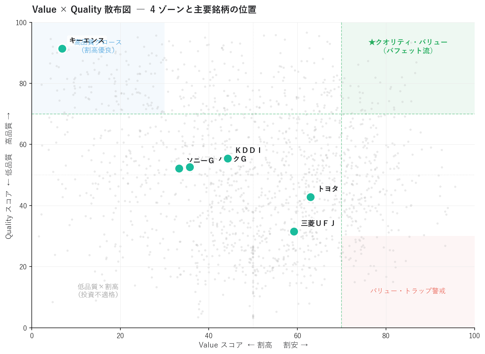
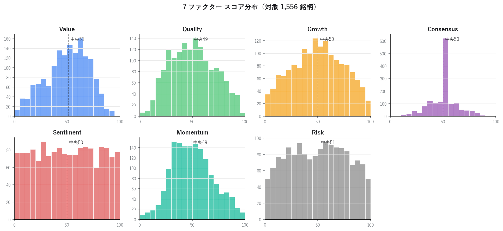

# 7ファクターで銘柄を採点する ― マルチファクタースコアボードで「全方位優等生」を発見する

「PER が低いから買い」「ROE が高いから買い」 ― 単一指標スクリーニングには、落とし穴があります。

連載01 の [PEG × ROE 銘柄分析](01_PEG_ROE銘柄分析.md) の 2 軸を、本記事では **Value / Quality / Growth / Consensus / Sentiment / Momentum / Risk** の 7 ファクターに拡張。1,556 銘柄でパーセンタイル化してスコアを算出し、**業種代表 50 銘柄に絞ったスコア序列** を Top 20 として可視化します。「GARP 圏外なのに +35% 上昇」「GARP 理想なのに −2% 下落」という逆転現象を、7 ファクターで定量的に再検証します。

<!-- more -->

---

## ■ マルチファクターモデルの概要

### 単一指標スクリーニングの落とし穴

個人投資家が陥りやすい典型的な失敗パターンは、**たった一つの指標だけで銘柄を選ぶ**ことから生まれます。

| 単一指標 | 起こりがちな失敗 |
|---|---|
| **PER が低い銘柄を買う** | バリュー・トラップ — 割安に見えるが構造的に低収益、または減益局面にある銘柄を掴む |
| **ROE が高い銘柄を買う** | 成長停止リスク — 高収益だが売上が伸びず、業界縮小に晒される銘柄を掴む |
| **モメンタムが強い銘柄を買う** | 過熱リスク — 既に上昇しきった、戻り売りに襲われる銘柄を掴む |
| **配当利回りが高い銘柄を買う** | 減配リスク — 業績悪化で株価が下落して見かけの利回りが高いだけの銘柄を掴む |

### マルチファクターモデル

学術研究の Fama-French 3 / 5 ファクター、Carhart 4 ファクター、Q-factor モデルなど、機関投資家が使う代表的なクオンツモデルは「複数ファクターを並列スコア化して合成する」という共通構造を持ちます。

本ダッシュボードは 7 ファクターを採用します。

| ファクター | 観点 | 主要指標 |
|---|---|---|
| **Value** | 割安度 | PER / PBR / EV/EBITDA / 配当利回り |
| **Quality** | 収益性・財務健全性 | ROE / ROA / 営業利益率 / 自己資本比率 |
| **Growth** | 過去の成長実績 | 売上高変化率 / 経常利益変化率 |
| **Consensus** | 将来予想の改善度 | 業績予想修正率 / 経常利益変化率(予) / 3年売上成長率(予) |
| **Sentiment** | 需給の熱量 | 出来高増加率 / 売買代金増加率 |
| **Momentum** | 株価のトレンド | 値上り率 / 52週安値からの上昇率 / MA乖離率 |
| **Risk** | リスク要素（低いほど良い） | 60日ボラティリティ / β（対日経平均） |

### 「全方位優等生」というコンセプト

7 ファクターをスコア化したうえで、**すべてのファクターが平均以上** の銘柄は単一指標スクリーニングの落とし穴をすべて回避できる「オールラウンダー」です。長期保有候補としてポートフォリオのコアに据える価値があります。逆に **ある一つだけ突出して低い** 銘柄は、その低スコア要因を理由に敬遠する判断材料になります。これがマルチファクター採点の本質的な利点です。

---

## ■ 分析で分かったこと

東証上場 1,556 銘柄（yfinance 日足あり）について 7 ファクター × 0〜100 のパーセンタイルスコアを算出しました。

### 総合スコア Top 20 ― 業種代表 50 銘柄内の序列

本記事の Top 20 は **業種代表 51 銘柄内のスコア序列** です。各業種から時価総額トップ 1 社（自動車＝トヨタ、銀行＝三菱ＵＦＪ、石油元売＝ＥＮＥＯＳ など）を機械的に選び、連載 narrative の中心である **石油元売 3 社（ＥＮＥＯＳ／出光／コスモエネＨＤ）** と、知名度の高い 任天堂・ソフトバンクＧ・KDDI・三井住友ＦＧ を補強した 51 銘柄を母集団としています。読み手が知っている大型・有名株の中での序列に絞ることで、自分の投資対象銘柄が他業種の代表とどう比較できるかが一目で分かります。

{width="950"}

トップは **オリックス（総合 67.7）** で、Growth 82 / Consensus 84 / Sentiment 81 / Momentum 93 と業績モメンタムと需給の両輪が揃った形。続いてディフェンシブ代表の **ＪＴ（63.5）／ ＮＴＴ（63.5）** が並び、半導体メーカー代表の **キオクシアＨＤ（61.7）** が業績モメンタムで 4 位に食い込みました。続く 5 位には **三井住友ＦＧ（58.1）** で、メガバンク 2 位ながら Sentiment 83 / Momentum 74 と直近の銀行株上昇を素直に取り込んでいます。

業種代表 51 銘柄に絞ったことで、Top 20 の構造的特徴が浮かび上がります。

- **ディフェンシブ（高配当・低ボラ）が上位**: ＪＴ・ＮＴＴは Risk 87/98 と「リスクの低さ」が総合スコアを押し上げる。守りの強い銘柄は単体ファクターで突出しなくても全方位平均で勝つ
- **業績モメンタムで突出**: キオクシアＨＤは Growth 95 / Momentum 99 / Consensus 95 だが Value 28 / Risk 1 と、攻めに偏った高ボラ構成
- **業種 1 位でも下位は普通にある**: ＥＮＥＯＳ（石油元売 1 位）は業種代表 51 内でも Top 20 圏外（総合 43.2）。業種代表性とマルチファクター評価は別物
- **連載 narrative の石油元売 3 社**: コスモエネＨＤが 19 位（48.8）で滑り込み。Value 85 のファンダ強さが Sentiment 19 の需給弱さで相殺された姿（後述の 3 社比較で深掘り）

### 石油元売 3 社のセクター内比較 ― 連載01 の再検証

ここで本記事の核心、石油元売 3 社をマルチファクター視点で再評価します。連載01 では同じ 3 社を PEG × ROE 平面で比較し、**「GARP 理想ゾーンのコスモが −2% で唯一の下落、ROE が劣る ＥＮＥＯＳ が +35.8% で大きく上昇」** という GARP マップ位置と株価動向の逆転現象を観察しました。7 ファクターで見直すと、この逆転がより精緻に説明できます。

{width="950"}

| 銘柄 | 総合 | Value | Quality | Growth | Consensus | Sentiment | Momentum | Risk |
|---|---|---|---|---|---|---|---|---|
| **コスモエネＨＤ** | **48.3** | **85** | 40 | 20 | **73** | **21** | 39 | 62 |
| ＥＮＥＯＳ | 43.2 | 57 | 32 | 55 | 13 | 51 | 60 | 36 |
| 出光興産 | 40.8 | 66 | 28 | 22 | 25 | 37 | 51 | 57 |

3 社の性格の違いがはっきり読み取れます。

- **コスモエネＨＤ**: ファンダ面では圧倒的（Value 85 / Consensus 73）だが、**Sentiment 21 / Momentum 39 で需給は冷えたまま**。投資家がコンセンサスの強気予想を信用していないか、流動性プレミアム不足で資金が回らない状態
- **ＥＮＥＯＳ**: Value 57 / Quality 32 と地味だが、**Growth 55 / Momentum 60 / Sentiment 51 で「動いている」**。経常利益変化率 +408% という実績がモメンタムを支える
- **出光興産**: 中庸型。突出した強みも弱みもなく、3 社の中間に位置する

連載01 で「コスモは GARP 理想ゾーンなのに下落」した謎は、**ファンダ（Value + Consensus）と需給（Sentiment + Momentum）のスコアが乖離している** ことで定量的に説明できます。

```
連載01（2 ファクター）: コスモは Value × Growth 両立 → 買い候補に見える
連載02（7 ファクター）: コスモは Value◎ だが Sentiment✗ Momentum✗
                       → 「ファンダ良いが市場が振り向いていない」
                       → 待つか、需給転換のサインを別に見る必要あり
```

これがマルチファクター採点の本質的な価値です。**ファンダだけ、需給だけでは見えない「乖離」が一目で分かる**。次回連載03 で扱う EPS リビジョン・モメンタムは、まさにこの「ファンダと需給の乖離が縮まる瞬間」を時系列で捉えます。

### 主要 6 社の 7 ファクターレーダー

ENEOS / 出光 / コスモエネＨＤ で見たマルチファクター視点を、連載01 と同じ主要 6 社にも当てはめてみます。

{width="900"}

| 銘柄 | 総合 | 形状の特徴 |
|---|---|---|
| **三菱ＵＦＪ** | 56.0 | Momentum 84 / Sentiment 82 が強く、最近の銀行株上昇を反映。一方 Quality 32（銀行は ROE が構造的に低い） |
| **ＫＤＤＩ** | 49.9 | バランス型。Risk 70（低ボラ）で長期保有向き |
| **ソフトバンクＧ** | 45.9 | Growth 79 / Consensus 86 だが Risk **2.9** ＝ ほぼ最高ボラティリティ |
| **ソニーＧ** | 44.1 | Quality 52 / Momentum 69 と中庸 |
| **キーエンス** | 43.5 | Quality **91**（高 ROE で別格）だが Value 7（PER が市場下位 7%） |
| **トヨタ** | 38.8 | 全ファクターが 25〜64 で突出した強みなし。Sentiment 26 / Momentum 31 から直近モメンタム弱め |

レーダーチャートの **歪み** を見ると、銘柄の個性が一目で分かります。キーエンスは Quality 一点突出の「典型的な高品質・割高銘柄」、ソフトバンクＧ は Risk 軸だけ極端に凹んだ「高リターン高リスク型」というように、性格の違いを視覚化できます。

### Value × Quality 散布図 ― クオリティ・バリュー銘柄の発見

ファクター間散布図で **Value × Quality** をプロットすると、ウォーレン・バフェットが好むとされる「クオリティ・バリュー」銘柄を視覚的に発掘できます。

{width="850"}

右上の緑ゾーン（Value ≥ 70 かつ Quality ≥ 70）は **高品質 × 割安** で、「素晴らしい企業を妥当な価格で買う」というバフェット流の長期投資ゾーンに対応します。今回の 1,556 銘柄のうち、このゾーンに入ったのは **34 銘柄**。総合スコア順の上位は以下のとおりです。

| 銘柄 | Value | Quality | 総合 |
|---|---|---|---|
| エレコム（6750） | 78 | 80 | 70.3 |
| エフティＧ（2763） | 85 | 79 | 69.9 |
| ヨシタケ（6488） | 77 | 72 | 69.5 |
| 電算（3640） | 87 | 87 | 68.7 |
| 円谷フィール（2767） | 86 | 74 | 67.2 |
| ビジョン（9416） | 74 | 86 | 66.7 |
| ミロク情報（9928） | 70 | 79 | 66.0 |
| ドウシシャ（7483） | 75 | 71 | 63.2 |

主要 6 社のうち散布図右上ゾーンに入った銘柄はゼロでした。**メガキャップは「知名度プレミアム」で常に Value スコアが下がる傾向** があり、相対的に過小評価されている中小優良株を見つけたいときに散布図が有効に機能します。

### バリュー・トラップの早期検出

逆に右下（Value 高 × Quality 低、Quality ≤ 30）は **構造的低収益のため永遠に割安評価される** バリュー・トラップ警戒ゾーンです。1,556 銘柄中 **39 銘柄** が該当し、PER の安さに目を奪われて買うと痛い目を見るリスクがあります。

| 銘柄 | Value | Quality | PER | 配当利回り | ROE |
|---|---|---|---|---|---|
| トピー | 93 | 27 | 5.9 | 4.73% | 7.3% |
| 北川鉄 | 85 | 30 | 5.0 | 6.05% | 7.1% |
| かんぽ | 83 | 20 | 10.0 | 2.71% | 4.6% |
| 不二サッシ | 82 | 22 | 4.5 | 4.15% | 8.3% |
| マツダ | 82 | 15 | 19.2 | 5.15% | 1.9% |
| 東北電 | 81 | 25 | 6.0 | 3.93% | 8.1% |
| ＳＵＢＡＲＵ | 80 | 26 | 19.5 | 4.71% | 3.3% |

PER 5 倍の低さに飛びつくと、ROE 7% 台の構造的低収益体質に資金が固定される可能性があります。**「Value 単独」ではなく必ず Quality を併用する** ― これがマルチファクター採点の効果です。

### 過熱銘柄の検出

`Momentum ≥ 90` かつ `Sentiment ≥ 90` かつ `Risk ≤ 20`（高ボラ）の三条件を満たした銘柄は **6 銘柄** ありました。

| 銘柄 | 市場 | Momentum | Sentiment | Risk | 総合 |
|---|---|---|---|---|---|
| アストロスケール | 東G | 98 | 95 | 4 | 43.3 |
| 関電化 | 東P | 98 | 100 | 9 | 56.1 |
| ＱＤレーザ | 東G | 100 | 99 | 2 | 57.2 |
| ＷＳＣＯＰＥ | 東P | 94 | 97 | 9 | 46.3 |
| 太陽誘電 | 東P | 98 | 93 | 6 | 52.7 |
| 岡本硝子 | 東S | 98 | 99 | 8 | 44.7 |

これらは **「天井圏で個人投資家が群がる」典型パターン** に近く、新規エントリーよりも保有銘柄の **利益確定検討** に使うのが定石です。Risk スコアが極端に低い（=ボラティリティが市場上位 5%）ことが共通しています。

### ファクタースコア分布から市場の温度感を読む

各ファクターのヒストグラムを並べると、**市場全体の地合い** が読み取れます。

{width="950"}

ここでひとつ重要な観察があります。**Consensus だけが 50 付近に巨大な棒**を持っています。これはアナリストカバーが無い銘柄（中小型を中心に **1,556 銘柄中 33%**）が **中立スコア 50** で補完されているためです。

これは欠陥ではなく **「コンセンサスデータが薄い銘柄」を不当に低く評価しないための安全装置** ですが、Consensus スコアを使うときは「真に評価された 50」と「データ欠損で 50」が混ざることを念頭に置く必要があります。Top 20 でも Consensus 列に「50」が並んでいた銘柄群がこれに該当します。

ほかのファクターは概ね自然な分布で、Momentum がやや左寄りなのは「直近の市場が中央値より少し弱い」状態を、Risk が左裾を引いているのは「極端な高ボラ銘柄が一定数いる」ことを示しています。

### 「全方位優等生」を探したが…

冒頭で「全方位優等生」を目標に掲げましたが、**今回の集計で 7 ファクターすべてが 60 以上の銘柄は 0 銘柄** でした。

これは閾値が厳しすぎることを意味します。実用的には：

- **5 ファクター以上 ≥ 60**: 数十銘柄が該当
- **Value & Quality & Risk ≥ 60**: 数十銘柄 ― 「割安 × 高品質 × 低リスク」の保守的優良株
- **Growth & Consensus & Momentum ≥ 70**: 「成長加速」の積極派候補

このように **どの組み合わせで絞り込むかが投資スタイルを表現する** ことになります。マルチファクターの真価は、合成スコアの絶対値ではなく **「どの組み合わせが今市場で機能しているか」を観察できる** 点にあります。

---

## ■ スコアの計算方法

ここまでスコアの順位で銘柄を比較してきましたが、そのスコアは具体的にどう算出しているのか。本記事では 7 ファクターを統合スコアに合成するため、すべての指標を **パーセンタイルランクで 0〜100 に正規化** してから単純平均します。

```
[単一指標のスコア化]
  ・高いほど良い指標（ROE 等）: score = rank_pct(value) × 100
  ・低いほど良い指標（PER 等）: score = 100 − rank_pct(value) × 100
  ・データ欠損は score = 50（中立）で補完
  ・バリュエーション系は正の値のみ採点対象（赤字銘柄の PER は除外）

[ファクタースコア = 構成指標のスコアの単純平均]
  例: Quality = mean(score(ROE), score(ROA), score(営業利益率), score(自己資本比率))

[総合スコア = 7 ファクタースコアの単純平均]
```

「PER 10 倍は割安か？」という問いは市場環境に依存しますが、パーセンタイル化すれば **「今のユニバース内で何位か」** で評価できるため、市場環境に左右されない相対評価になります。総合スコアの解釈は次のとおりです。

| 総合スコア | 解釈 |
|---|---|
| 70 以上 | 7 ファクター平均で上位 30% — 注目候補 |
| 60〜70 | 上位 30〜50% — バランスの良い銘柄 |
| 50〜60 | 中庸 |
| 40 以下 | 改善の兆しがあるか、別観点で再評価が必要 |

なお Value 指標のうち **PER / PBR / 配当利回りは yfinance の最新終値で自前計算** しています（連載01 と共通。EV/EBITDA は構成要素が多く実用的でないため市販データの値をそのまま使用）。

```
PER（実）   = Close_yf ÷ EPS実績
PBR（予）   = Close_yf ÷ BPS予
配当利回り  = 配当金 ÷ Close_yf × 100
```

正規化を集団内（フィルター後のユニバース）で行うため、**スコア 100 は「相対順位トップ」を意味し、絶対値の魅力を保証するものではない** 点に注意が必要です。

---

## ■ Python コードの紹介

本分析の中核となるコードを抜粋して紹介します。画像生成の全コードは [`02_multifactor_make_images.py`](../scripts/02_multifactor_make_images.py) を参照してください（執筆者ローカルのモジュール・データに依存しているため、そのままでは動きません。動作要件は [scripts/README](../scripts/README.md) を参照）。

### パーセンタイルスコア化

```python
import pandas as pd

def percentile_score(series: pd.Series, higher_better: bool) -> pd.Series:
    """有効値のみでパーセンタイルランク（0〜100）を計算。NaN は 50 で補完。"""
    ranked = series.rank(pct=True, na_option="keep") * 100
    if not higher_better:
        ranked = 100 - ranked
    return ranked.fillna(50)


def add_factor_scores(df: pd.DataFrame, factor_defs: dict) -> pd.DataFrame:
    """7 ファクターのスコアと総合スコアを DataFrame に追加。"""
    out = df.copy()
    for factor, metrics in factor_defs.items():
        cols = []
        for col, higher in metrics:
            if col not in out.columns:
                continue
            # バリュエーション系は正の値のみランキング対象（赤字銘柄除外）
            series = out[col].where(out[col] > 0) if not higher else out[col]
            sc = f"_s_{col}"
            out[sc] = percentile_score(series, higher)
            cols.append(sc)
        out[f"score_{factor}"] = out[cols].mean(axis=1) if cols else 50.0
    factor_cols = [f"score_{f}" for f in factor_defs]
    out["score_総合"] = out[factor_cols].mean(axis=1)
    return out
```

### 価格指標の自前計算（Sentiment / Momentum / Risk）

yfinance 日足 parquet から 7 つの市場指標を計算します。

```python
import numpy as np
import pandas as pd

def compute_price_metrics(close: pd.Series, volume: pd.Series,
                          n225_logret: pd.Series) -> dict:
    out = {}
    last = float(close.iloc[-1])

    # Momentum
    out["値上り率"] = (last / float(close.iloc[-2]) - 1) * 100
    out["過去52週安値からの上昇率"] = (last / float(close.iloc[-252:].min()) - 1) * 100
    out["株価移動平均線からの乖離率①"] = (last / float(close.iloc[-25:].mean()) - 1) * 100

    # Sentiment（当日 vs 直近 20 営業日平均）
    out["出来高増加率"]   = float(volume.iloc[-1]) / float(volume.iloc[-21:-1].mean())
    turnover = close * volume
    out["売買代金増加率"] = float(turnover.iloc[-1]) / float(turnover.iloc[-21:-1].mean())

    # Risk
    log_ret = np.log(close / close.shift(1)).dropna()
    out["過去60日ボラティリティ"] = float(log_ret.iloc[-60:].std() * np.sqrt(252) * 100)

    joined = pd.concat([log_ret.iloc[-252:], n225_logret], axis=1, join="inner").dropna()
    var_m = float(joined.iloc[:, 1].var())
    out["ベータ(対日経平均)"] = float(joined.iloc[:, 0].cov(joined.iloc[:, 1]) / var_m)
    return out
```

### レーダーチャート描画

```python
import numpy as np
import matplotlib.pyplot as plt

FACTORS = ["Value", "Quality", "Growth", "Consensus",
           "Sentiment", "Momentum", "Risk"]

def plot_radar(ax, scores: dict[str, float], title: str):
    angles = np.linspace(0, 2 * np.pi, len(FACTORS), endpoint=False).tolist()
    angles_closed = angles + [angles[0]]
    vals = [scores[f] for f in FACTORS]
    vals_closed = vals + [vals[0]]

    ax.fill(angles_closed, vals_closed, color="#1ABC9C", alpha=0.20)
    ax.plot(angles_closed, vals_closed, color="#1ABC9C", linewidth=2.0,
            marker="o", markersize=4)
    # 50 ライン
    ax.plot(angles_closed, [50] * len(angles_closed),
            color="#cccccc", linewidth=0.8, linestyle="--")

    ax.set_theta_offset(np.pi / 2)
    ax.set_theta_direction(-1)
    ax.set_ylim(0, 100)
    ax.set_xticks(angles)
    ax.set_xticklabels(FACTORS, fontsize=9)
    ax.set_title(title, fontsize=11, fontweight="bold", pad=14)
```

### スコアボードのヒートマップ表

```python
import numpy as np
import matplotlib.pyplot as plt
from matplotlib.patches import Rectangle

def draw_scoreboard(ax, top_df, cols, labels):
    cmap = plt.get_cmap("RdYlGn")
    for r, (_, row) in enumerate(top_df.iterrows()):
        for i, col in enumerate(cols):
            v = row[col]
            color = cmap(np.clip(v / 100, 0.05, 0.95))
            rect = Rectangle((5.5 + i - 0.45, r + 0.05), 0.9, 0.9,
                             facecolor=color, edgecolor="white", linewidth=1.0)
            ax.add_patch(rect)
            # 背景の明暗に応じて文字色を反転
            txt_color = "white" if v < 35 or v > 70 else "#202124"
            ax.text(5.5 + i, r + 0.5, f"{v:.0f}",
                    ha="center", va="center", fontsize=9.5,
                    color=txt_color)
```

---

## まとめ

- 単一指標スクリーニングの落とし穴（バリュー・トラップ / 成長停止 / 過熱）を **7 ファクター統合採点** で自動回避できる
- パーセンタイル化により **異なるスケールの指標を統一比較** でき、市場環境に左右されない相対評価になる
- スコア計算は **全 1,556 銘柄でパーセンタイル化**、表示する Top 20 は **業種代表 50 銘柄に絞る** ことで「知っている銘柄の中での序列」として読める形に
- 業種代表 50 内 Top 20 では **ディフェンシブ（オリックス・ＪＴ・ＮＴＴ）と業績モメンタム銘柄（キオクシアＨＤ・任天堂）** が混在。業種 1 位（ＥＮＥＯＳ など）でも総合スコアは順位がばらつく
- ファクター間散布図で **クオリティ・バリュー 34 銘柄 / バリュー罠 39 銘柄 / 過熱 6 銘柄** を一発抽出できる
- 石油元売 3 社の例では、コスモ（Value 85 / Consensus 73）と Sentiment 21 / Momentum 39 の **乖離** が、連載01 で観察した「ファンダ良いのに株価下落」を定量説明
- **「全 7 ファクター ≥ 60」は 0 銘柄** — 完璧な銘柄は存在せず、自分が重視するファクターの組み合わせを決めることが投資スタイルの表現になる

次回は **EPS リビジョン・モメンタム** を実装します。本ダッシュボードの Consensus / Momentum ファクターを時系列で深掘りし、アナリスト予想の修正動向と株価のズレから「出遅れ買い候補」を発掘します。

---

*データ出典: 市販の銘柄情報サービスから取得した CSV 13 指標（EPS / BPS / 配当金 / EV/EBITDA / ROE / ROA / 営業利益率 / 自己資本比率 / 売上高変化率 / 経常利益変化率 / 業績予想修正率(予) / 経常利益変化率(予) / 過去3年平均売上高成長率(予)） + yfinance 日足 Close / Volume*
