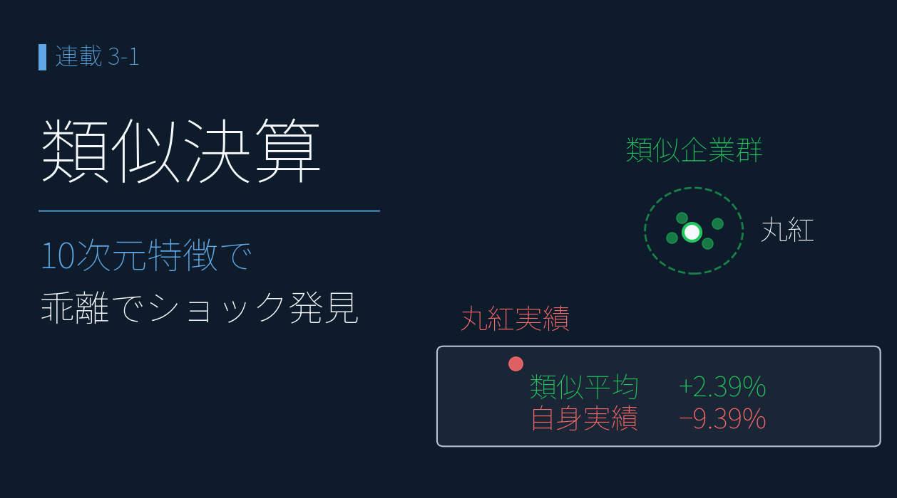
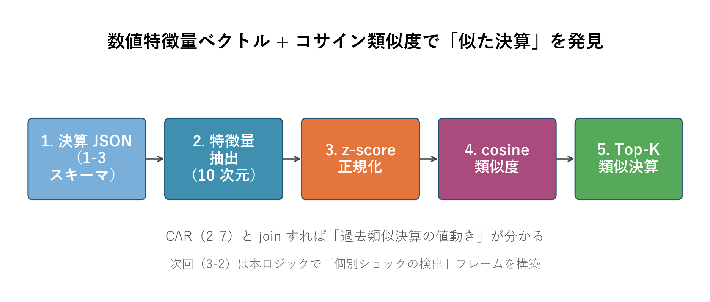
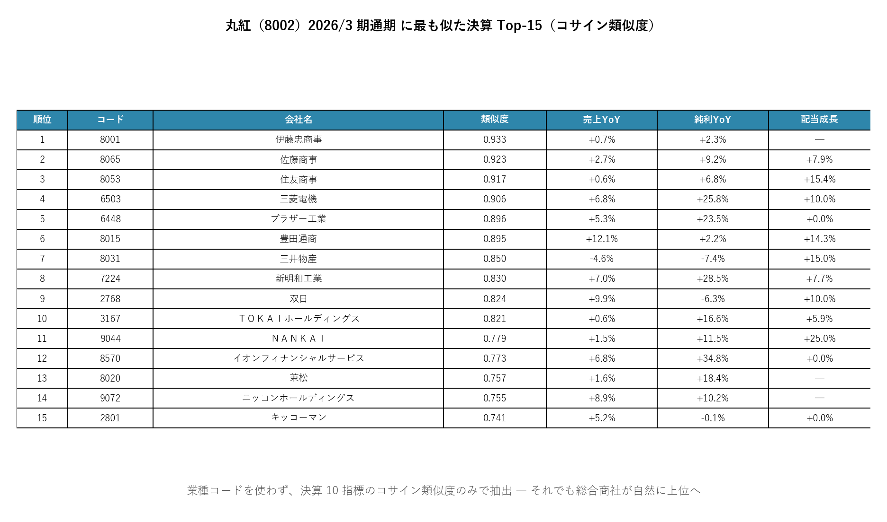
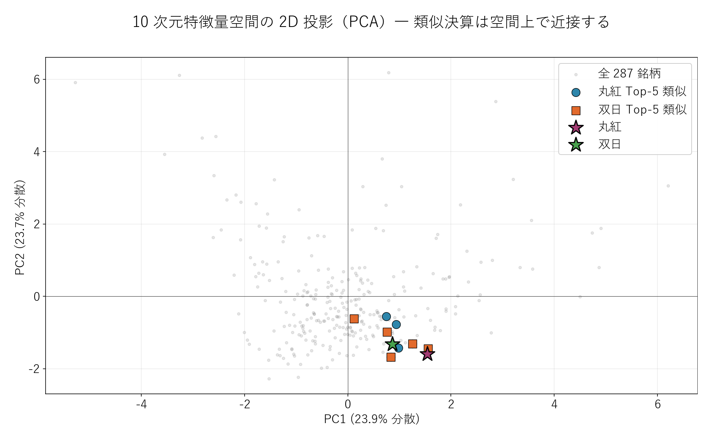

# コサイン類似度 ― 「似ている決算」を数値で検索する

{width="1280"}

「この決算、どこかで見た形だな」― そんな直感を、機械にやらせてみます。決算の数字から **10 個の特徴量** を取り出し、**コサイン類似度**（数字の並びの "似ている度"）で、決算短信 JSON のうち特徴量が 7 個以上そろう **287 銘柄**から「似た決算」を自動で探します。業種コードを一切使っていないのに、**商社・電機といった "業界の型" が数字だけから自然に立ち上がる** ― そこが本記事の見どころです。

データ出典 <i class="fa-solid fa-caret-right"></i>TDnet：決算短信 XBRL（2026年3月期、287銘柄、kind="actual"）、決算短信の開示ログ（2026-04〜05、3,549件）

<a class="ref-card ref-card--quiet" href="https://atmarkit.itmedia.co.jp/ait/articles/2112/08/news020.html" target="_blank" rel="noopener">

コサイン類似度 とは
2 つのベクトルの向きの近さで「似ている度合い」を測る指標 ― ＠IT 用語辞典

</a>

## コサイン類似度で「似た決算」を探す

やり方はシンプルです。決算の数字から **10 個の特徴量**（決算の特徴を表す 10 個の数値）を取り出し、各銘柄を「10 次元の点」として並べ、**向きの近さ＝コサイン類似度** で似た決算を探します。10 個は、大きく 2 グループです。

| グループ      | 特徴量（10 個）                          |
| --------- | ---------------------------------- |
| 伸び（モメンタム） | 売上・営業利益・税引前・純利益・包括利益 の前期比、年間配当の成長率 |
| 収益構造・事業構成 | 営業利益率、純利益率、事業セグメント数、主力事業への依存度      |

特徴量の抽出 → 正規化 → 全ペアでコサイン類似度を計算 → 似た決算 Top-K を返す、という流れです（下図）。

<i class="fa-solid fa-expand"></i> クリックで拡大

{width="1200"}

## 丸紅 2026/3 期通期の類似 Top-15

まず丸紅 2026/3 期通期（売上 8.27 兆円 +6.1%、純利益 5,439 億円 +8.1%、配当 95→107.5 円）を基準（クエリ）に、コサイン類似度で「似た決算」Top-15 を引きます。

<i class="fa-solid fa-expand"></i> クリックで拡大

使用データ（在庫評価損益調整なし） <i class="fa-solid fa-caret-right"></i>TDnet（決算短信 XBRL）：10次元特徴量（287銘柄、2026年3月期）

{width="1200"}

| 順位 | コード | 会社名 | 類似度 | 売上YoY | 純利YoY | 配当成長 |
|---|---|---|---|---|---|---|
| 1 | 8001 | 伊藤忠商事 | **0.934** | +0.7% | +2.3% | — |
| 2 | 8065 | 佐藤商事 | 0.921 | +2.7% | +9.2% | +7.9% |
| 3 | 8053 | 住友商事 | 0.917 | +0.6% | +6.8% | +15.4% |
| 4 | 6503 | 三菱電機 | 0.906 | +6.8% | +25.8% | +10.0% |
| 5 | 6448 | ブラザー工業 | 0.896 | +5.3% | +23.5% | 0.0% |
| 6 | 8015 | 豊田通商 | 0.895 | +12.1% | +2.2% | +14.3% |
| 7 | 8031 | 三井物産 | 0.850 | -4.6% | -7.4% | +15.0% |
| 8 | 7224 | 新明和工業 | 0.830 | +7.0% | +28.5% | +7.7% |
| 9 | 2768 | **双日** | 0.824 | +9.9% | -6.3% | +10.0% |
| 10 | 3167 | TOKAI HD | 0.821 | +0.6% | +16.6% | +5.9% |
| 11 | 9044 | 南海電鉄 | 0.779 | +1.5% | +11.5% | +25.0% |

**読み解き**：

- 類似 Top-15 に **総合商社 5 社**（伊藤忠・住友・豊田通商・三井・双日）が並ぶ ― **業種コードを一切使っていないのに、業界が自然にまとまった**（似た者どうしが集まる＝クラスタリング）
- つまり **数字の特徴だけで「商社業界の決算の型」を再現** できている
- 異業種でも、三菱電機・ブラザー工業・新明和工業など「決算の形が商社に似た」総合電機・産業機械が並ぶ

## 特徴量空間の 2D 投影（PCA）― 類似は空間上で近接する

10 次元の特徴量を、PCA（多くの次元を 2 次元に圧縮して見る手法）で平面に映してみます。

<i class="fa-solid fa-expand"></i> クリックで拡大

使用データ（在庫評価損益調整なし） <i class="fa-solid fa-caret-right"></i>TDnet（決算短信 XBRL）：10次元特徴量（287銘柄、2026年3月期）

{width="1200"}

- **★ 丸紅・双日 が中央近くに固まる**
- 丸紅 Top-5（青丸）と双日 Top-5（橙四角）も、それぞれの基準銘柄の周りに集中
- 2 次元では全体の約半分の情報しか映せないのに、**Top-5 が近いことははっきり見える**

10 次元で「似ている」と判定したものが、2 次元の図でもちゃんと近くに来る ― 高次元での近さが、平面に映しても保たれていると確認できます。

---

## まとめ

- **検索エンジン的アプローチ** ― 10 個の数値特徴量 + コサイン類似度で「最も似た決算」を発見（外部API不要・1,000 銘柄 0.1 秒・コスト 0 円）
- 丸紅を基準にすると **類似 Top-15 に総合商社 5 社が自動で集まる**（業種コード不使用）― **業種コードなしで「業界の型」が数字だけから再現できた**のが本記事の芯
- 見つかった「似た決算」を “物差し” にすれば、**その銘柄自身の値動きまで読めるのか** ― それが次回への問い

次回（3-2）は、見つけた類似群を "物差し" にして、各銘柄の反応が **似た者と同じ（典型）か、大きく外れた「個別ショック」か** を **K-NN で仕分け** ます。値も方向そのものも当てられませんが、その "外れ" こそが「真っ先に IR を確認すべき銘柄」を浮かび上がらせます。

## <i class="fa-brands fa-github"></i> Python コード

本記事のチャート画像・データ取得・成形スクリプトは、すべて **GitHub に公開**しています。**類似決算検索の計算方法（10 次元特徴量・z-score 正規化・コサイン類似度）**は、リポジトリの README にまとめています。データは提供元の利用規約により再配布できませんが、データを各自取得すれば、本連載と同じものが再現できます。

<a class="repo-link" href="https://github.com/minnanosaiban/blog/tree/main/03-01_similarity" target="_blank" rel="noopener">
github.com/minnanosaiban/blog/03-01_similarity
<i class="repo-link-arrow fa-solid fa-arrow-up-right-from-square"></i>
</a>

---
