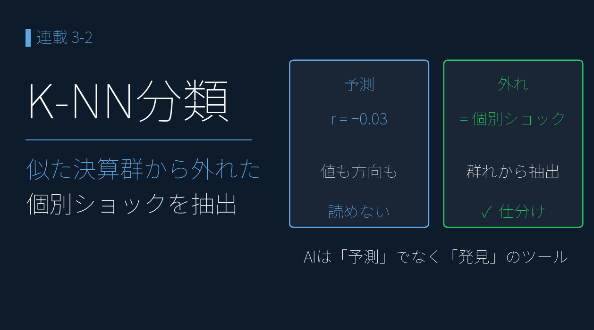
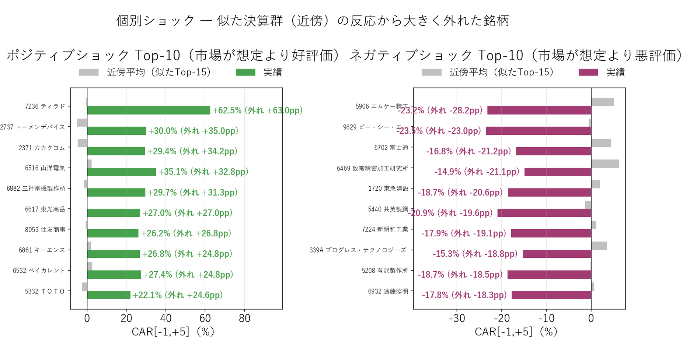

# K-NN 分類 ― 似た決算群から外れた「個別ショック」を検出

{width="1280"}

前回（3-1）の「似た決算」を物差しに、各銘柄の決算後の株価反応（CAR）を **K-NN で分類**します ― 似た者と同じ「典型」か、群れから大きく外れた「個別ショック」か。狙いは当てることではなく、**外れた銘柄＝真っ先に IR を確認すべき銘柄を洗い出す**ことです。

データ出典 <i class="fa-solid fa-caret-right"></i>TDnet：決算短信 XBRL から作成した決算10次元特徴量（3-1で生成、287銘柄） <i class="fa-solid fa-caret-right"></i>yfinance＋TDnet：2026/3期 CAR（events_2026）

<a class="ref-card ref-card--quiet" href="https://www.elastic.co/jp/what-is/knn" target="_blank" rel="noopener">

K近傍法（K-NN）とは
近くにある既知データの多数決で予測する機械学習手法 ― Elastic

</a>

<!-- more -->

## K-NN で「典型 / 個別ショック」を仕分ける

ある銘柄の「似た決算 Top-K」を集め、**その群れの反応（CAR）を "ふつうの目安"** とします。自身がその目安に **近ければ「典型」、大きく外れれば「個別ショック」** ― これを **287 銘柄まとめて** 仕分けます。

<i class="fa-solid fa-expand"></i> クリックで拡大

{width="1200"}

- 対象は特徴量が 7 個以上そろう **287 銘柄**、2026/3 期の実績 CAR と突き合わせ
- **そもそも値や方向は当てられません** ― 群れの平均を予測値にしても 相関 r≈−0.03・方向一致率 50.9%（コイン投げ）で、全銘柄の単純平均にも負ける。だから「当てる」のは捨て、**「外れの大小」だけ**を使います
- 外れるのは、**M&A・減損・ガイダンス・説明会IR など「数字に表れない事情」**があるから。逆に言えば、群れから大きく外れた銘柄ほど、その事情を真っ先に確認する価値があります

## 抽出された「個別ショック」 ― ポジ / ネガ Top-10

群れ（近傍 Top-15）の反応から大きく外れた銘柄を、上下それぞれ並べます。**数字の上では同業並みなのに、市場が予想外の評価をした銘柄** ― 投資判断で **真っ先に IR・説明会を確認すべき** 群れです。

<i class="fa-solid fa-expand"></i> クリックで拡大

使用データ（決算特徴量は在庫評価損益調整なし） <i class="fa-solid fa-caret-right"></i>TDnet（決算短信 XBRL）：10次元特徴量（287銘柄、2026年3月期、類似群の選定に使用） <i class="fa-solid fa-caret-right"></i>yfinance：日足、決算後株価反応 CAR[-1,+5]

{width="1200"}

**ポジティブショック Top-5（市場が想定より大幅好評価）**：

| コード | 会社名 | 近傍平均 | 実績 | 外れ |
|---|---|---|---|---|
| 7236 | ティラド | -0.5% | **+62.5%** | +63.0pp |
| 2737 | トーメンデバイス | -5.0% | +30.0% | +35.0pp |
| 2371 | カカクコム | -4.8% | +29.4% | +34.2pp |
| 6516 | 山洋電気 | +2.3% | +35.1% | +32.8pp |
| 6882 | 三社電機製作所 | -1.6% | +29.7% | +31.3pp |

いずれも **数字は平凡（YoY +5〜+20%）なのに、市場は +30〜60% で歓迎** した銘柄。M&A 期待・新製品・業界転換の本命視など、**数字に表れない "物語"** が背後にある可能性が高い ― 類似検索だけでは見つからない「**説明会・追加 IR で初めて見える買い材料**」です。

**ネガティブショック Top-5（市場が想定より大幅悪評価）**：

| コード | 会社名 | 近傍平均 | 実績 | 外れ |
|---|---|---|---|---|
| 5906 | エムケー精工 | +5.0% | **-23.2%** | -28.2pp |
| 9629 | ピー・シー・エー | -0.5% | -23.5% | -23.0pp |
| 6702 | 富士通 | +4.4% | -16.8% | -21.2pp |
| 6469 | 放電精密加工研究所 | +6.4% | -14.9% | -21.1pp |
| 1720 | 東急建設 | +2.1% | -18.7% | -20.6pp |

逆に、**数字は平凡〜やや良いのに、市場が大きく売った** 銘柄。ガイダンス下方修正・減損・説明会での慎重コメント・コンセンサス割れなど、**「資料を読み込まないと見えない警戒材料」** が反映された可能性が高い。

## 主要銘柄の仕分け ― 丸紅・双日・ＥＮＥＯＳ

| 銘柄 | 実績 CAR | 窓 | 近傍平均 | 外れ | 仕分け |
|---|---|---|---|---|---|
| 丸紅（8002） | **−9.39%** | [−1, +5] | +2.43% | **−11.82pp** | **個別ショック（ネガ）** |
| 双日（2768） | −4.25% | [−1, +5] | +2.54% | −6.79pp | **軽いネガショック** |
| **ＥＮＥＯＳ（5020）** | **−4.68%** | [−1, +5] | −2.30% | **−2.37pp** | **典型に近い（初動 +1.36% 後 5 日で反転）** |

- **丸紅・双日は「数字より市場の評価がネガティブ」** ― 利益の質・予想・セグメントで「健全」と評価した銘柄が、2026/3 期は市場で売られた。丸紅は 2-6 で見た「次世代事業 +127% × 金融 −54.7% の二極化」や、その利益化までの時間を、市場が説明会で問い直した可能性
- **ＥＮＥＯＳの外れ −2.37pp は小さく**、個別ショック上位（外れ ±10pp 以上）にも入らない＝**典型寄り**。初動 +1.36% が 5 日で −4.68% に反転したのは、2-6 で見た「高収益セグメントの正常化」が後追いで認識されたため。**数字でおおむね説明がつく事例**
    - ※ ただし「似た決算」の近傍選定に使う決算特徴量は、ＥＮＥＯＳでは **前期の在庫評価損が反転した急回復** を含む。"典型" に収まること自体が在庫込みプロファイル前提である点は割り引いて読む

ここに本記事の芯があります ― 大事なのは値を当てることではなく、**群れからどれだけ外れたか**。外れが小さければ「数字で読める＝AI に足す情報は薄い」、大きければ「数字の外の材料を急いで集めよ」。この **2 つに振り分ける** のが、K-NN の使いどころです。

> 💡 **API とコストについて**：本連載は、実際の embedding API・LLM API を一度も呼んでいません（要約・embedding は Claude が代理で出力しています）。仮に実 API で全 8,049 イベントを要約・embedding 化しても、Haiku 4.5 なら **約 3,100 円** の見積もりで収まります。

---

## まとめ

- **K-NN で銘柄を「典型 / 個別ショック」に仕分ける** ― 似た決算 Top-K の反応を "ふつうの目安" にして、そこから大きく外れた銘柄を抽出する
- **値や方向そのものは当てない** ― 数字の特徴だけで CAR を予測するのは構造的に無理（r≈−0.03）。だから「当てる」のではなく「外れを拾う」
- ポジ例 ティラド +63pp・カカクコム +34pp（物語で動いた）／ネガ例 エムケー精工 −28pp・ピー・シー・エー −23pp（資料で見える警戒材料）。主要銘柄では 丸紅 −9.39% / 双日 −4.25% が **個別ショック**、ＥＮＥＯＳ −4.68%（外れ −2.37pp）は **典型寄り**
- 使い方は **外れ大＝要 IR 確認、外れ小＝数字で読める** の二分。AI は予言の魔法ではなく、**異変を見つける仕分け器**

機械学習分析編は今後も手法を追加していく予定です。データ駆動投資の差別化要素は「データを使う」から「データを持つ・整理する・AI と組み合わせる」へ ― 本連載がそのスタート地点になれば幸いです。

---

## <i class="fa-brands fa-github"></i> Python コード

本記事のチャート画像・データ取得・成形スクリプトは、すべて **GitHub に公開**しています。**K-NN 分類の実装（似た決算 Top-K・近傍平均からの外れ量・個別ショック抽出・K=5/15/30 比較）**は、リポジトリの README にまとめています。データは提供元の利用規約により再配布できませんが、データを各自取得すれば、本連載と同じものが再現できます。

<a class="repo-link" href="https://github.com/minnanosaiban/blog/tree/main/03-02_knn" target="_blank" rel="noopener">
github.com/minnanosaiban/blog/03-02_knn
<i class="repo-link-arrow fa-solid fa-arrow-up-right-from-square"></i>
</a>

---
