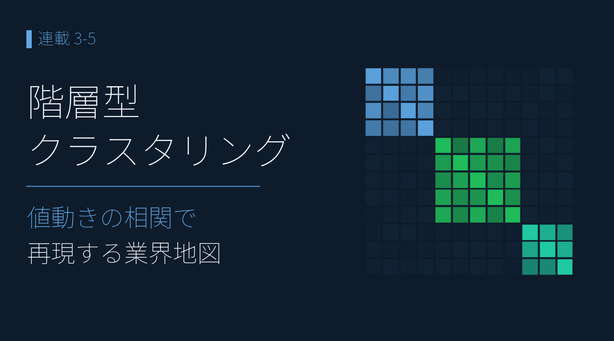
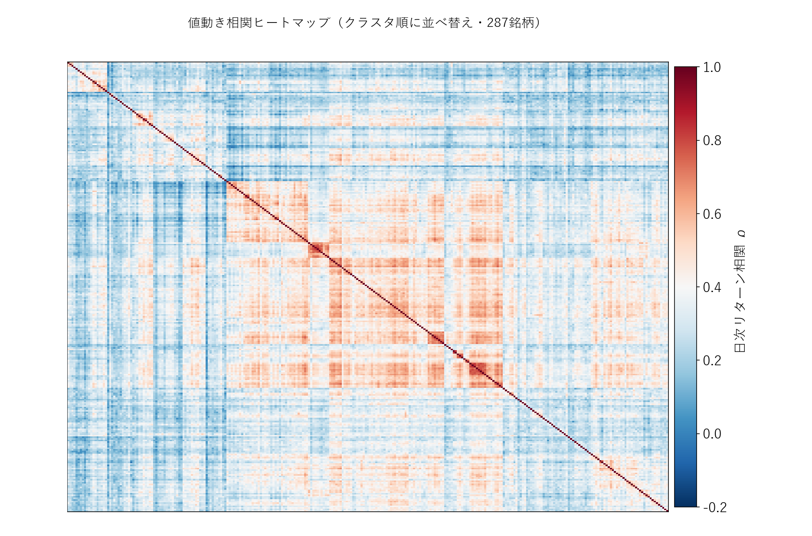
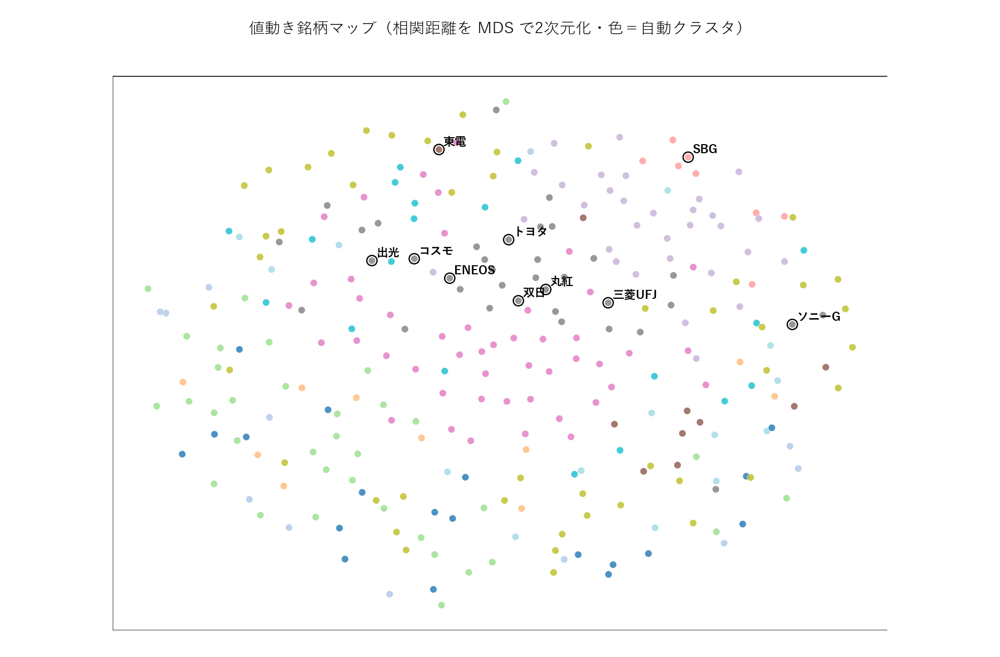
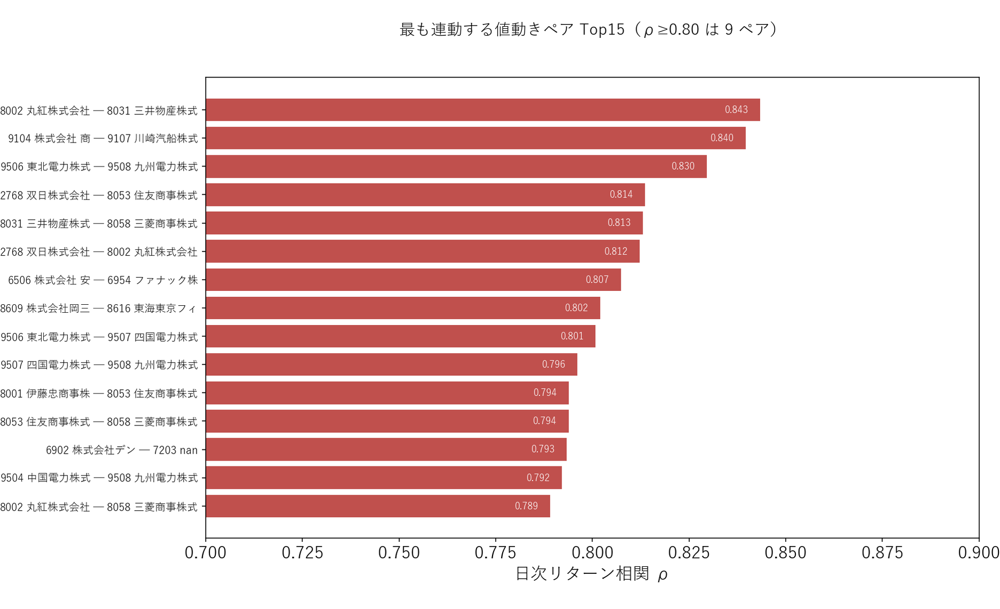

# 階層型クラスタリング ― 値動きの相関で再現する業界地図

{width="1280"}

本記事では、287 銘柄の日次リターンを相関でクラスタリングし、「ほとんど同じ動きの銘柄」と「似た仲間の銘柄」を、銘柄名も業種も伏せたまま機械に見つけさせます。

データ出典 <i class="fa-solid fa-caret-right"></i>yfinance：日次 Close（2026年5月31日取得） <i class="fa-solid fa-caret-right"></i>対象：特徴量ユニバースに比較用スポットライト銘柄（出光・コスモ・トヨタ・三菱UFJ・東電・SBG）を加え、価格カバレッジ95%以上で絞った287銘柄、直近499営業日

<a class="ref-card ref-card--quiet" href="https://ja.wikipedia.org/wiki/クラスター分析" target="_blank" rel="noopener">

クラスター分析（階層的手法）とは
距離の近いデータを順に併合し、階層的にグループ化する教師なし手法 ― Wikipedia

</a>

<!-- more -->

## 階層型クラスタリングで「似た値動き」をまとめる

決算特徴量は使いません。使うのは **日次リターンの「形」だけ** です。

生の株価ではなく、**日次リターン（毎日の上げ下げ）の相関** で測るのが肝。相関 ρ が高いほど距離が小さくなる **相関距離 `√(2(1−ρ))`** を使い、「似た動き＝近い」を表します。

- 対象は連載 3 章のユニバースに比較用のスポットライト銘柄（出光・コスモ・トヨタなど 6 銘柄）を加えた **287 銘柄**、直近 **499 営業日**（2024-05〜2026-05）の日次対数リターン
- ユークリッド距離だとボラティリティの大小に引っぱられるため、**相関距離** を採用
- **Ward 法の階層クラスタリング**（似た者どうしを下から順に併合していく手法）で樹形図をつくり、**細かすぎず粗すぎず、業種が見える粒度**として 12 グループで切ります。業種コードは一切与えません

## 相関ヒートマップで「ブロック構造」を見る

287 × 287 の相関行列を、クラスタ順に並べ替えて描きます。

<i class="fa-solid fa-expand"></i> クリックで拡大

使用データ <i class="fa-solid fa-caret-right"></i>yfinance：日足の日次対数リターン相関（287銘柄、直近499営業日）

{width="1200"}

- 全体がうっすら赤い ＝ どの銘柄も **市場全体という共通の波** に乗っているため（この波は次回 3-6 で取り出します）
- その上で、対角線上に **濃い赤の四角（ブロック）** が浮かびます。これが「いつも一緒に動く仲間」＝クラスタ
- この「共通の波」と「ブロック」を分けて考えることが、次回 3-6 の異常検知の土台になります

## 銘柄マップで「業種が自動で現れる」

相関距離を MDS（距離の近さを保ったまま 2 次元に並べる手法）で平面に落とし、色は自動クラスタで塗ります。

<i class="fa-solid fa-expand"></i> クリックで拡大

使用データ <i class="fa-solid fa-caret-right"></i>yfinance：日足の日次対数リターン相関（287銘柄、直近499営業日）

{width="1200"}

業種コードを **一切渡していない** のに、値動きだけで業種がきれいに分かれました。

| クラスタ | 自動で集まった主な業種 |
|---|---|
| C7（10 社） | **電力会社 ×9** |
| C9（36 社） | **総合商社 ×8・石油元売 ×3**（ＥＮＥＯＳ も同居） |
| C11（19 社） | 電力系電設会社 ×8 |
| C5・C6 | 半導体製造装置・半導体材料・FA／産業ロボット |
| C3（10 社） | 鉄道 ×3・航空 ×2（運輸） |

「電力」「商社＋資源」「半導体」「運輸」…と、**値動きが業界そのものを再現** しています。決算クラスタリング（3-3）が決算の型を見つけたのと同じ「教師なしの発見」が、ここでは値動きで起きています。

## 「ほとんど同じ動き」のペアは誰か

完全な双子（ρ≥0.90）は **0 ペア**。「完全に同じ動きの銘柄はいない」こと自体が発見です。最も連動するのは、いずれも教科書どおりの同業ペアでした。

<i class="fa-solid fa-expand"></i> クリックで拡大

使用データ <i class="fa-solid fa-caret-right"></i>yfinance：日足の日次対数リターン相関（287銘柄、直近499営業日）

{width="1200"}

| ρ | ペア | 業種 |
|---|---|---|
| **0.843** | 丸紅 × 三井物産 | 総合商社 |
| 0.840 | 商船三井 × 川崎汽船 | 海運 |
| 0.830 | 東北電力 × 九州電力 | 電力 |
| 0.807 | 安川電機 × ファナック | FA・産業ロボット |
| 0.802 | 岡三証券G × 東海東京FH | 証券 |

ρ≥0.80 が 9 ペア、ρ≥0.75 が 45 ペア。**最大でも 0.84** ―「ほぼ同じだが、完全には同じでない」が日本株の実像です。

## ＥＮＥＯＳ ― 石油元売と商社の「資源クラスタ」に同居

本連載の中核 **ＥＮＥＯＳ（5020）は、出光・コスモと並ぶだけでなく、総合商社 8 社と同じクラスタ C9** に入りました。原油・市況に連動する「資源コンプレックス」が、値動きだけで一つの島になっています。

ここで自然な問いが生まれます ―「**いつも一緒のこの仲間から、ＥＮＥＯＳが外れる日はあるのか？**」。その「共動が崩れた瞬間」こそ個別材料が出たサインであり、次回 3-6 の異常検知につながります。

## まとめ

- 入力を **決算の数字 → 値動きそのもの** に替え、予測ではなく **記述** に徹した（3-2／3-4 の失敗の教訓に素直に従う）
- 287 銘柄の日次リターンを **相関距離 ＋ Ward 法** でクラスタリング。**業種コードなしで電力・商社＋資源・半導体・運輸が自動再現**
- 完全な双子（ρ≥0.90）は **0**。最も連動するのは 丸紅 × 三井物産（**0.843**）など教科書どおりの同業ペア
- **ＥＮＥＯＳ は石油元売＋総合商社の「資源クラスタ」に同居** ― 値動きだけでサプライチェーンの島が浮かぶ
- 全銘柄が共有する「市場の波」と、各クラスタの「ブロック」を分けて考えることが、次回 **3-6 の異常検知（共動の崩壊）** の土台になる

次回は、このクラスタを「いつもの仲間」の基準線として使い、**仲間から突発的に外れた銘柄＝個別材料が出た銘柄** を毎日・全銘柄から検出します。

## <i class="fa-brands fa-github"></i> Python コード

本記事のチャート画像・データ取得・成形スクリプトは、すべて **GitHub に公開**しています。**クラスタリングの計算方法**（日次リターン・相関距離・Ward 法・MDS 可視化・ほぼ同一ペア抽出）は、リポジトリの README にまとめています。データは提供元の利用規約により再配布できませんが、データを各自取得すれば、本連載と同じものが再現できます。

<a class="repo-link" href="https://github.com/minnanosaiban/blog/tree/main/03-05_price_clustering" target="_blank" rel="noopener">
github.com/minnanosaiban/blog/03-05_price_clustering
<i class="repo-link-arrow fa-solid fa-arrow-up-right-from-square"></i>
</a>

---
