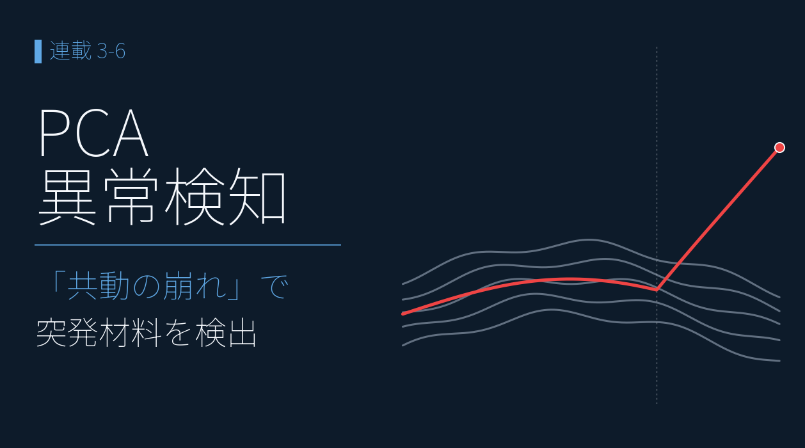
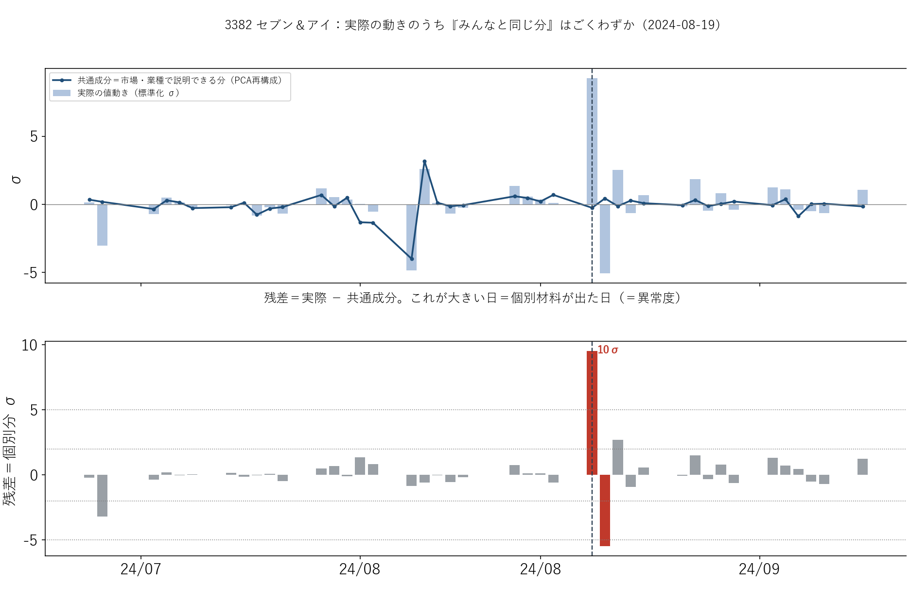
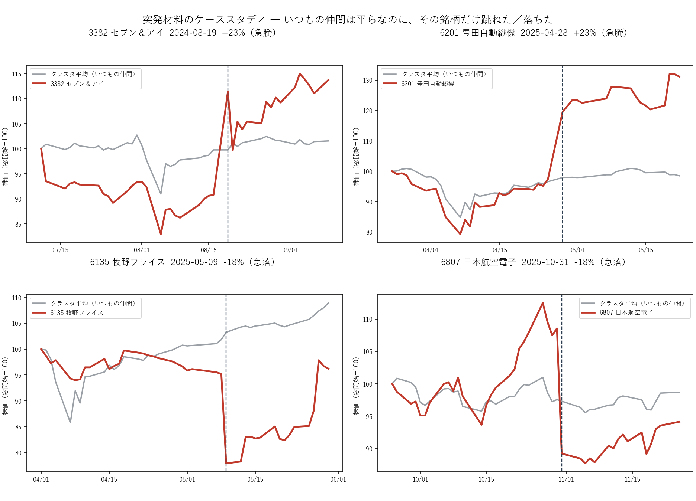
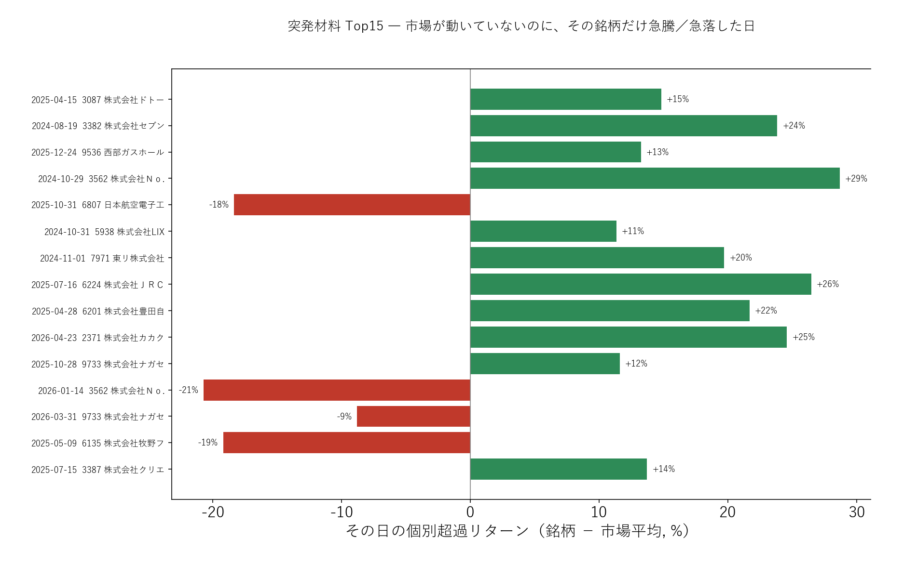
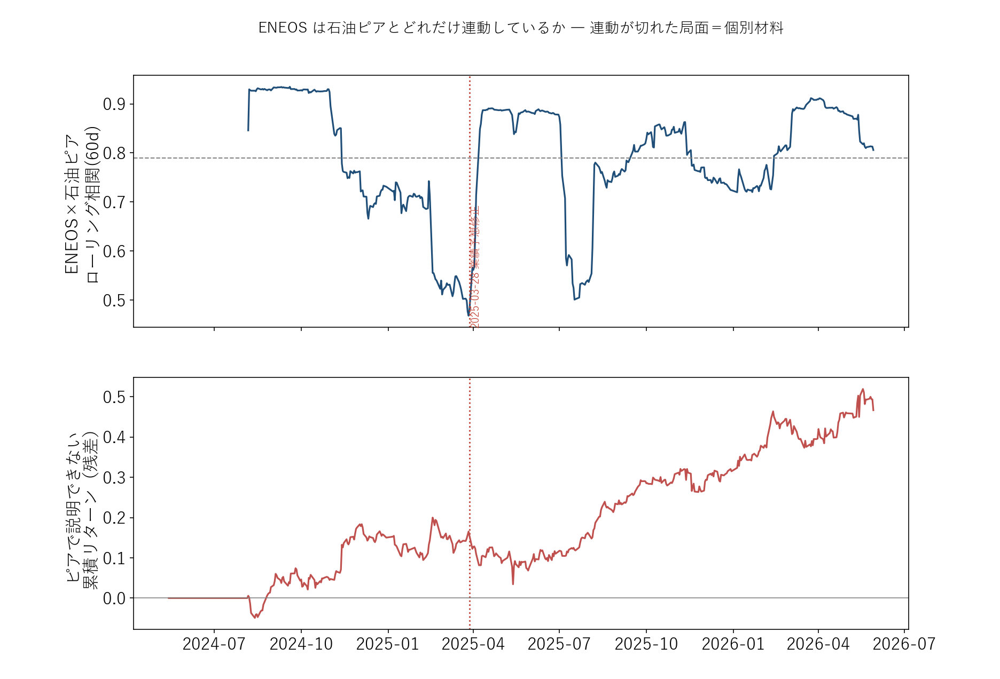
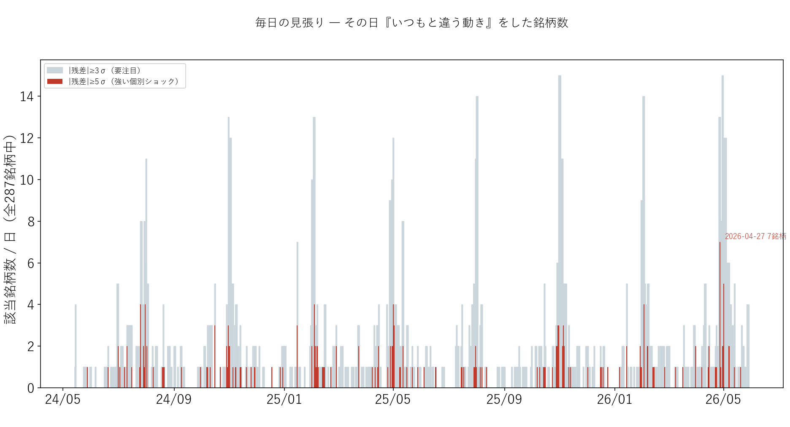

# PCA 異常検知 ― 値動きの「共動の崩れ」で突発材料を検出

{width="1280"}

買収提案、TOB、業績修正、事故 ― 個別の材料は、**その 1 社だけ** を襲います。だから「市場も同業も動いていないのに、この銘柄だけ急に動いた」を見つければ、**突発材料が出た銘柄をその日のうちに拾える** はずです。本記事は、これを教師なしで毎日・全銘柄から検出します。3-2 の「個別ショック抽出」の、**決算発表に依らない常時監視版** です。

データ出典 <i class="fa-solid fa-caret-right"></i>yfinance：日次 Close（2026年5月31日取得） <i class="fa-solid fa-caret-right"></i>対象：287銘柄、直近499営業日

<a class="ref-card ref-card--quiet" href="https://ja.wikipedia.org/wiki/異常検知" target="_blank" rel="noopener">

異常検知 とは
大多数のデータと振る舞いが大きく異なる事例を見つける手法 ― Wikipedia

</a>

<!-- more -->

## PCA で「みんなと違う動き」を検出する

どの銘柄も「市場全体の波」と「業種の波」に乗っています。そこで **PCA（主成分分析＝多くの銘柄に共通する動きを抜き出す手法）** で、その "みんなに共通する波" を取り出し（最も大きい波が市場全体の動きで、全体の約 36% を占める）、各銘柄の動きを **その共通の波でどれだけ説明できるか** を見ます。

**実際の値動き − 共通成分（再構成） ＝ 残差**。この残差が大きい日＝市場・業種で説明できない動き＝**個別材料が出た日**。

<i class="fa-solid fa-expand"></i> クリックで拡大

{width="1200"}

- 上段：セブン＆アイの 2024-08-19、**実際の動きは約 9σ**（σ＝普段の値動きの幅。9σ は "普段の 9 倍" 級）跳ねたのに、共通成分（青線）はほぼ 0 ― 市場・業種では説明できない
- 下段：その差＝**残差が 10σ** に突出。これが「異常度」で、大きい日ほど強い個別材料

## ケーススタディ ― 仲間は平ら、その銘柄だけ動いた

3-5 のクラスタを「いつもの仲間」の基準線にして、代表 4 銘柄を重ねます。

<i class="fa-solid fa-expand"></i> クリックで拡大

使用データ <i class="fa-solid fa-caret-right"></i>yfinance：日次 Close の日次リターン（287銘柄 × 499営業日、2024-05-14〜2026-05-29）

{width="1200"}

灰色（クラスタ平均＝いつもの仲間）は平らなのに、赤（対象銘柄）だけが縦線の日に跳ねる／落ちる ― **個別材料の瞬間が一目で分かります**。

- **セブン＆アイ +23%**（買収提案）／**豊田自動織機 +23%**（TOB 思惑）― 急騰
- **牧野フライス −18%**／**日本航空電子 −18%** ― 急落

## 突発材料 Top15 ― 検出器の出力

異常度（PCA の残差 σ）が大きい順に選び、見やすいように **その日の「個別の動き＝銘柄 − 市場平均」** で大きさを示します（並べる基準は残差、表示はその個別の動き）。

<i class="fa-solid fa-expand"></i> クリックで拡大

使用データ <i class="fa-solid fa-caret-right"></i>yfinance：日次 Close の日次リターン（287銘柄 × 499営業日、2024-05-14〜2026-05-29）

{width="1200"}

| 日付 | 銘柄 | その日 | 市場 | 個別 |
|---|---|---|---|---|
| 2024-08-19 | セブン＆アイ | **+22.7%** | −1.1% | **+23.8%** |
| 2025-04-28 | 豊田自動織機 | +22.7% | +1.0% | +21.7% |
| 2025-07-16 | ＪＲＣ | +26.3% | −0.2% | +26.5% |
| 2025-10-31 | 日本航空電子 | **−17.8%** | +0.5% | **−18.3%** |

緑＝急騰・赤＝急落。どれも **市場はほぼ動いていないのに、その銘柄だけ大きく動いた日** です。上げも下げも、両方向の突発材料を拾えています。

## ＥＮＥＯＳ ― いつもの石油同業から外れた日

本連載の中核 **ＥＮＥＯＳ** で試します。通常は石油の同業（出光・コスモ）と **相関 0.79** で連動しますが、その連動の強さ（ローリング相関＝直近どうしの相関）が **0.47 まで急落** した日があります ― それが **2025-03-28 の業績予想修正の前後** でした。

<i class="fa-solid fa-expand"></i> クリックで拡大

使用データ <i class="fa-solid fa-caret-right"></i>yfinance：日次 Close の日次リターン（ＥＮＥＯＳ と石油同業＝出光・コスモ、2024-05-14〜2026-05-29）

{width="1200"}

- 上段：いつもの石油同業との連動が、ＥＮＥＯＳ 固有の材料が出た局面でだけ切れている
- 下段：ピアで説明できない累積リターン（ENEOS 固有分）は 2025 年央から拡大

これは連載 **2-7（CAR）** で業界の動きを除いて測った市場反応を、**イベント窓ではなく毎日・教師なしで監視する常時版** にあたります。

## 毎日の見張り ― いつ点灯するか

日ごとに「いつもと違う動き」をした銘柄数を数えると、検出器の使い方が見えます。

<i class="fa-solid fa-expand"></i> クリックで拡大

使用データ <i class="fa-solid fa-caret-right"></i>yfinance：日次 Close の日次リターン（287銘柄 × 499営業日、2024-05-14〜2026-05-29）

{width="1200"}

- 平常日は 0〜2 銘柄。ところが **決算シーズン（2・5・8・11 月）に 10〜15 銘柄へスパイク**
- 個別材料が集中する時期に自動で点灯する ― **その日のうちに「確認すべき銘柄」を絞れる**

## 正直な限界

3-4 で重要度の罠を直視したのと同じトーンで、ここも正直に書きます。

- 検出できるのは **「個別材料が出た日」であって「不正」そのものではない**。大半は買収・業績修正・需給。**不正"判定器"ではなく、確認すべき銘柄を絞る"トリアージ装置"**
- タイミングは基本 **ニュースと同時**。発覚前に分かるのは情報が先行して漏れた場合だけで、**予言ではない**
- それでも価値は大きい ― 個人投資家の **時間配分の最適化**（どの IR・適時開示を先に読むか）に直結します

## まとめ

- 入力を「値動きそのもの」にして、**予測ではなく検出** に徹した。PCA の **残差（実際 − 共通成分）** が大きい日＝個別材料が出た日
- 検出器は **セブン＆アイ +23.8%（買収提案）／豊田自動織機 +21.7%（TOB）／日本航空電子 −18.3%** など、**市場が動かないのにその銘柄だけ動いた日** を上げ下げ両方向で的中
- **ＥＮＥＯＳ は石油ピアとの相関が 0.47 まで急落**（2025-03-28 業績予想修正の前後）。連載 2-7 の CAR を毎日・教師なしで監視する常時版
- 毎日の銘柄数は **決算シーズンにスパイク** ― 個別材料の集中を自動で可視化する「見張り」になる
- 限界も明確：検出できるのは「個別材料が出た日」で、不正の判定でも未来予言でもない。**“発見・トリアージ”の道具**

これで機械学習編（3-1〜3-6）が一区切りです。**値や方向そのものの予測（3-4 RF／3-2 でも r≈0）は構造的に難しい一方、発見（3-1 類似検索／3-2 個別ショックの仕分け／3-3・3-5 クラスタリング／3-6 異常検知）は教師なしでよく効く** ― 「AI は予言の魔法ではなく、整理・発見・時間節約の道具」という本連載の結論を、値動きデータが最も鮮やかに示しました。

## <i class="fa-brands fa-github"></i> Python コード

本記事のチャート画像・データ取得・成形スクリプトは、すべて **GitHub に公開**しています。**異常検知の計算方法**（PCA 再構成・残差による異常度・ピア残差・突発材料抽出・毎日の銘柄数）は、リポジトリの README にまとめています。データは提供元の利用規約により再配布できませんが、データを各自取得すれば、本連載と同じものが再現できます。

<a class="repo-link" href="https://github.com/minnanosaiban/blog/tree/main/03-06_price_anomaly" target="_blank" rel="noopener">
github.com/minnanosaiban/blog/03-06_price_anomaly
<i class="repo-link-arrow fa-solid fa-arrow-up-right-from-square"></i>
</a>

---
