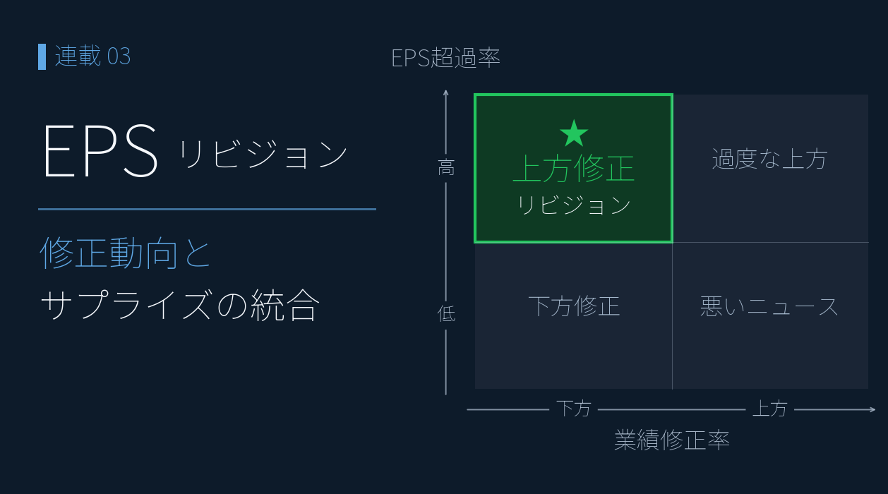

# EPS リビジョン・モメンタムで「出遅れ買い候補」を発掘する ― アナリスト予想と株価のズレを読む

{width="1280"}

「業績が上方修正されたのに株価がまだ動いていない」 ― これは個人投資家にとって最も明快な **情報の織り込み遅れによるエッジ** です。

連載02 の [マルチファクタースコアボード](02_multifactor_scoreboard.md) では、コスモエネＨＤ が **Consensus 68 / Sentiment 22** という「ファンダ良いのに需給冷えた」乖離状態にあることが分かりました。本記事ではその乖離を **業績予想修正率（リビジョン）× 株価モメンタム** の時系列軸で捉え直し、機関投資家が長年使ってきた **EPS Revision Momentum 戦略** を個人投資家でも実装できる形に落とし込みます。

<!-- more -->


## EPS リビジョン・モメンタムの概要

連載01・02 のスナップショット分析の弱点は、**指標が「変化した瞬間」を捉えられない**ことです。PER / ROE のような**水準**指標は「今の状態」しか分かりませんが、**業績予想修正率**（コンセンサス予想 **経常利益** の前回値からの改定幅%）は **アナリストの見立てがどう変わったか** を直接示し、企業業績の "変化" を最も早く伝えます。

学術的にも、アナリスト予想が上方修正された銘柄はその後 1〜3 ヶ月にわたって超過リターンを生むこと（Chan, Jegadeesh, Lakonishok 1996）、その効果は時価総額や業種を超えて頑健なこと（Bernhardt & Campello 2007）が実証されています。アナリストが見立てを変えるのは企業との対話・業界動向を踏まえた結果であり、その情報が株価に織り込まれるまでの時間差が **個人投資家にとっての機会** になります。

業績予想修正率（X 軸）と株価モメンタム（Y 軸、値上り率）で個別銘柄を **4 象限分類** すると、行動可能なゾーンが見えます。

|  | **下方修正**（修正率 −） | **上方修正**（修正率 +） |
|---|---|---|
| **株価上昇**（値上り率 +） | ⚠️ 逆行注意 | 既に反応済み |
| **株価下落**（値上り率 −） | 底入れ待ち | ★ **出遅れ買い候補** |

注目すべきは右下の **「出遅れ買い候補」**（上方修正済みだが市場の注目がまだ向いていない情報の織り込み遅れ）と、左上の **「逆行注意」**（業績下方修正に株価が追従していない、次の決算で楽観が崩れるリスク）の 2 象限です。

しきい値は **修正率 ±3%・値上り率 ±2%**（ノイズと信号を分ける経験則）、修正済み割安候補は追加で **PER（予）≤ 15**。実装詳細は Appendix の Python コードを参照。


## プロットで確認

リビジョン × モメンタムは、**業績予想修正率（横軸）× 値上り率（縦軸）の散布図**でプロットします。先ほどの 4 象限がそのまま 2 軸として再現され、銘柄の位置が一目で分かります。

時価総額 100 億円以上・ROE 5% 以上にフィルタした 1,965 銘柄について、4 象限分類すると（散布図の表示範囲内で）**出遅れ買い候補が 90 銘柄、逆行注意が 28 銘柄**。

<small style="color: var(--md-link-color);"><i class="fa-solid fa-expand"></i> クリックで拡大できます</small>
<small style="color: var(--md-link-color);">2026.05.22作成</small>

{width="1200"}

出遅れ買い候補 Top の銘柄（修正率上位、散布図表示範囲 ±30% 以内）:

| 銘柄 | 修正率 | 値上り率 | PER予 | ROE |
|---|---|---|---|---|
| ＫｅｅＰｅｒ技（6036） | +39.1% | +1.1% | 7.7 | **30.1%** |
| スマレジ（4431） | +36.4% | -1.5% | 21.9 | 21.4% |
| 三洋貿易（3176） | +29.2% | +1.6% | 9.2 | 9.3% |
| フリー（4478） | +25.2% | +1.8% | 111.1 | 7.6% |
| やまみ（2820） | +24.5% | -0.9% | 18.3 | 15.1% |
| アカツキ（3932） | +20.3% | -0.9% | 8.0 | 13.1% |

特に **ＫｅｅＰｅｒ技** は修正率 +39% / 値上り率 +1.1% / ROE 30% / PER 7.7 という、本記事の **3 条件（リビジョン × モメンタム × バリュエーション）が綺麗に揃った理想的な銘柄**です。

> 💡 上方修正 × 株価未反応の銘柄は、市場の注目が向く前の **時間差のエッジ**。ただし修正の "中身"（本業か、会計要因か）を必ず確認する。


## 石油元売 3 社比較

ここまで連載01・02 と追ってきた石油元売 3 社をリビジョン視点で再評価すると、**連載01・02 と役者が逆転している兆し** が読み取れます。連載01・02 で「GARP 圏外なのに +29.7% 上昇していた」ＥＮＥＯＳ・出光は、直近の **アナリストコンセンサス予想経常利益**が前回値から **▲3.71% / ▲3.48% に下振れ** （会社発表の修正ではなく、アナリスト予想の集計値が下方シフト）、株価も下落に転じている一方、コスモエネＨＤ は +1.11% の小幅上振れで横ばい ― 4 象限マップで言えば ＥＮＥＯＳ・出光は「底入れ待ち」ゾーンに移行しつつあります。

| 連載 | コスモ | ＥＮＥＯＳ | 出光 |
|---|---|---|---|
| 01 (PEG×ROE) | 理想ゾーン / −5.2% | バリュー候補 / +29.7% | 惜しい位置 / +17.6% |
| 02 (マルチファクター) | Consensus 68 × Sentiment 22（乖離） | Value 70 × Quality 32 | 中庸 |
| 03 (リビジョン) | **+1.11%** 上振れ | **−3.71%** 下振れ | **−3.48%** 下振れ |

<small style="color: var(--md-link-color);"><i class="fa-solid fa-expand"></i> クリックで拡大できます</small>
<small style="color: var(--md-link-color);">2026.05.22作成</small>

{width="1200"}

| 銘柄 | 業績予想修正率 | 値上り率 | PER予 | 解釈 |
|---|---|---|---|---|
| **コスモエネＨＤ** | **+1.11%** | +0.03% | 5.5 | 微上振れ、横ばい |
| **ＥＮＥＯＳ** | **−3.71%** | −0.57% | 9.4 | **コンセンサス下振れかつ株価も軟化** |
| **出光興産** | **−3.48%** | −1.04% | 8.1 | **コンセンサス下振れかつ株価も軟化** |

**ＥＮＥＯＳ 関係者・株主にとっての示唆**:

- 連載02 で観察された Consensus 22（低）／ Sentiment 57（中庸）の組み合わせは、本記事のリビジョン −3.71% に直接つながっている
- 「ROE 8.0% でも +29.7% 上昇できた」のは、業績改善期待への先回り買いだった可能性が高い
- 現在は **「コンセンサスの下振れが株価に織り込まれるプロセス」** が進行中 ― 底入れ待ちゾーンに入りつつある。ただし 2025/3 の会社発表下方修正の主因は **のれん減損（非現金）・在庫影響（油価連動）** であり、本業実態とコンセンサス値の方向感が分かれる局面（下記 callout 参照）
- 一方コスモエネＨＤ は連載02 で Value 92 / Consensus 68 と高評価、本記事の +1.11% 上振れもそれを裏付ける。**遅れて見直し買いが入る局面が来る可能性**

<div class="margin01">
<div class="card-bule">
<p class="small"><b>📝 ＥＮＥＯＳ ▲3.71% は「どの基準」の修正率か？</b></p>
<p class="small pad2">本記事が使う証券会社が無料で提供している値 <b>▲3.71%</b> は <b>コンセンサス予想経常利益の前回値からの修正率</b> です。しかし同じ ＥＮＥＯＳ 2025/3 期業績予想修正でも、基準を変えると <b>営業利益ベース ▲94%</b>、<b>純利益ベース ▲2.27%</b>、<b>ENEOS 実質基準 +4.76%</b> と <b>▲94% 〜 +4.76% のレンジに分散</b> します（連載01 編集部試算）。</p>
<p class="small pad2">▲3.71% の主因は <b>のれん減損（非現金）・在庫影響（油価連動）</b> ＝ 一時／構造要因。本業悪化と取り違えるリスクがある点と、ENEOS の「実質営業利益 4,400 億円維持」スタンス、4 基準試算の詳細は <a href="01_garp_peg_roe.md">連載01</a> 参照。</p>
</div>
</div>

これがリビジョン・モメンタムを使う本質的な価値です。**水準（連載02 のスコア）と変化（連載03 のリビジョン）が同じ方向を指したとき、シグナルの信頼性は最高** になります。


## Streamlit アプリ紹介

本記事と同じリビジョン × モメンタム散布図を **Streamlit + Plotly** で操作可能にしたアプリを公開しています。修正率の閾値や時価総額フィルタを動かしながら、自分の興味のある銘柄群を絞り込めます。

> 📝 **アプリ公開予定**: GitHub リポジトリ（準備中）。`app_chart.py` と同じく Streamlit ベースで、`requirements.txt` だけ揃えればローカルで動きます。

```python
# Plotly 版 リビジョン × モメンタム散布図（最小実装の抜粋）
import plotly.express as px

def revision_scatter(df, rev_th=3.0, rise_th=2.0):
    fig = px.scatter(df, x="業績予想修正率(予)", y="値上り率",
                     hover_data=["コード", "銘柄名", "PER予", "ROE"],
                     color_discrete_sequence=["#7eaee0"])
    # 4 象限の境界線
    fig.add_vline(x=0, line_color="#888")
    fig.add_hline(y=0, line_color="#888")
    fig.add_vline(x=rev_th, line_dash="dash", line_color="#8ab09a")
    fig.add_hline(y=rise_th, line_dash="dash", line_color="#8ab09a")
    fig.update_layout(xaxis_title="業績予想修正率(%) ← 下振れ  上振れ →",
                      yaxis_title="値上り率(%) ← 下落  上昇 →")
    return fig
```

データは連載中の `classify_revision()` を流用、4 象限ごとに色分けして表示することも可能。


## まとめ

- 業績予想修正率は **アナリストの見立ての "変化"** を最も早く伝える指標で、PER / ROE 等の "水準" 指標を補完する
- **散布図が標準的な可視化**。横軸=修正率 × 縦軸=値上り率の 2 軸で 4 象限分類すると、出遅れ買い候補 / 逆行注意 / 既反応済 / 底入れ待ち がワンビューで分かる
- 4 象限マップで **出遅れ買い 90 / 逆行注意 28 / 修正済み割安 66** を抽出 ― 個別銘柄を絞り込める
- 連載01・02 で +29.7% 上昇していた **ＥＮＥＯＳ / 出光は、直近のコンセンサス予想経常利益が ▲3.71% / ▲3.48% 下振れ**（会社発表ではなくコンセンサス）。4 象限マップでは「底入れ待ち」ゾーンへ移行中、一方コスモエネＨＤ は +1.11% の小幅上振れで横ばい
- ＥＮＥＯＳ ▲3.71% は **コンセンサス予想経常利益基準**であり、基準次第で ▲94% 〜 +4.76% に分散する（連載01 4 基準試算）

次回は **連続サプライズ・スコアボード** を実装します。本記事の「データ蓄積戦略」を発展させ、業績予想修正率・EPS 予想超過率・経常利益成長予想を時系列で合成し、業績モメンタムが本物の銘柄を発掘します。


## Appendix ― Python コード

画像生成の全コードは [`03_revision_momentum_make_images.py`](../scripts/03_revision_momentum_make_images.py) を参照。執筆者ローカルのモジュール・データに依存するため、そのままでは動きません。

```python
import pandas as pd

# 業績予想修正率(%) = (現在の予想経常利益 − 前回の予想経常利益) ÷ 前回の予想経常利益 × 100
# PER（予） = Close_yf ÷ EPS予想(213_EPS(予))
# しきい値: 修正率 ±3% / 値上り率 ±2% / 修正済み割安候補は PER(予) ≤ 15

def classify_revision(df: pd.DataFrame,
                      rev_col: str = "業績予想修正率(予)",
                      rise_col: str = "値上り率",
                      per_col: str = "PER予") -> pd.DataFrame:
    out = df.copy()
    out["分類"] = "対象外"
    laggard = (out[rev_col] >= 3) & (out[rise_col] <= 2)
    out.loc[laggard, "分類"] = "出遅れ買い候補"
    warn = (out[rev_col] <= -3) & (out[rise_col] >= 2)
    out.loc[warn, "分類"] = "逆行注意"
    val = (out[rev_col] >= 3) & (out[per_col].between(0, 15))
    out.loc[val, "分類"] = "修正済み割安候補"
    return out
```

---

*データ出典: 証券会社が無料で提供する銘柄情報サービスから取得した CSV 4 指標（業績予想修正率(予) / EPS(予) / ROE / 時価総額） + yfinance 日足 Close / Volume*
