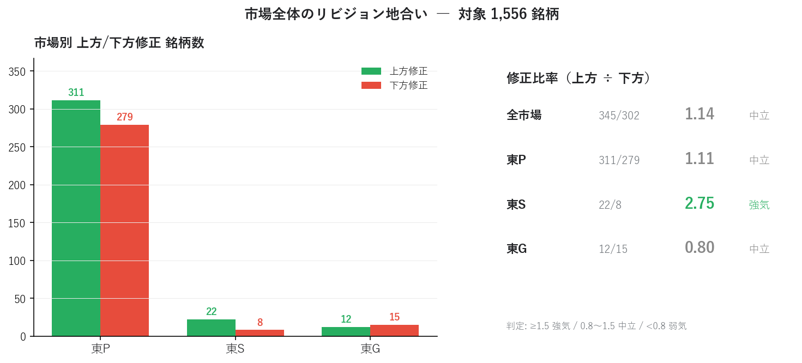
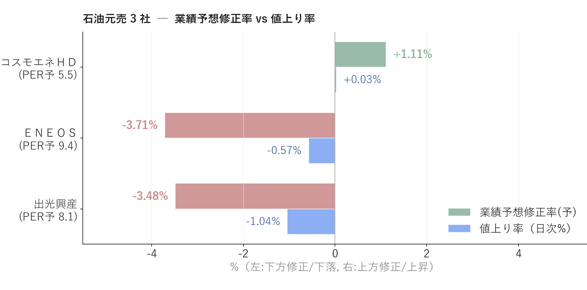
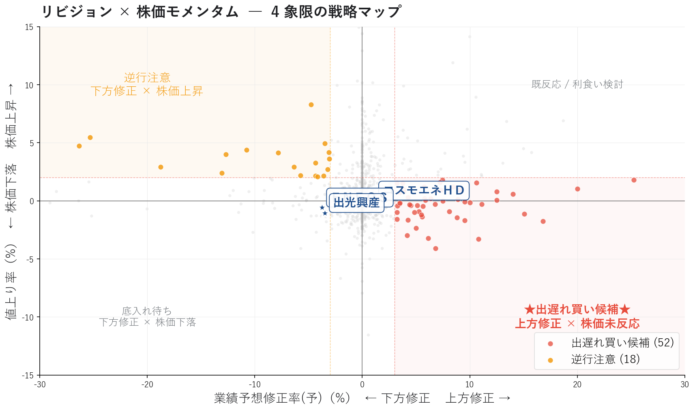
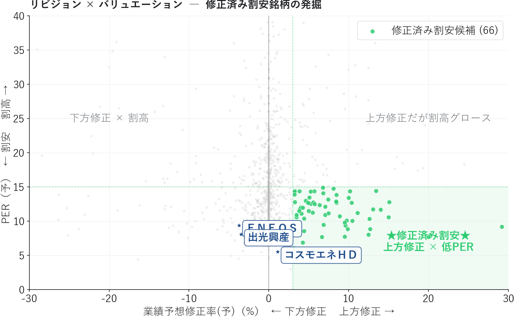
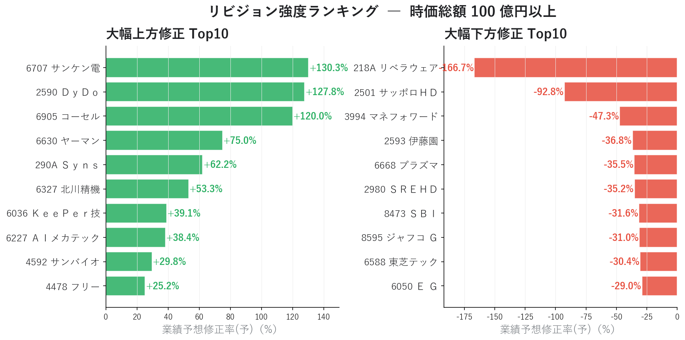

# EPS リビジョン・モメンタムで「出遅れ買い候補」を発掘する ― アナリスト予想と株価のズレを読む

「業績が上方修正されたのに株価がまだ動いていない」 ― これは個人投資家にとって最も明快な **アービトラージ機会** です。

連載02 の [マルチファクタースコアボード](02_multifactor_scoreboard.md) では、コスモエネＨＤ が **Consensus 73 / Sentiment 21** という「ファンダ良いのに需給冷えた」乖離状態にあることが分かりました。

本記事ではその乖離を **業績予想修正率（リビジョン）× 株価モメンタム** の時系列軸で捉え直し、機関投資家が長年使ってきた **EPS Revision Momentum 戦略** を個人投資家でも実装できる形に落とし込みます。

連載01〜02 で追ってきたＥＮＥＯＳ / 出光興産 / コスモエネＨＤ の現状を、リビジョン視点で再評価します。

<!-- more -->

---

## EPS リビジョン・モメンタムの概要

### 「PER が低い／高い」では捉えきれない、変化のタイミング

連載01・02 のスナップショット分析には、決定的な弱点があります。**指標が「変化した瞬間」を捉えられない** ことです。

| 指標タイプ | 例 | 限界 |
|---|---|---|
| 水準（level） | PER / PBR / ROE | 「今の状態」は分かるが、変化の方向と速度が見えない |
| **変化（revision）** | 業績予想修正率 | アナリストの見立てが **どう変わったか** を直接示す |

業績予想修正率は、コンセンサス予想 EPS の **改定幅（%）** です。プラスなら上方修正、マイナスなら下方修正。これは **企業業績の "変化" を最も早く伝える** 指標の一つです。

### EPS リビジョン・モメンタムの理論背景

EPS Revision Momentum は、機関投資家のクオンツモデルで長く使われている、**学術的にも実証された** ファクターです。

- Chan, Jegadeesh, Lakonishok (1996): アナリスト予想が上方修正された銘柄は、その後 1〜3 ヶ月にわたって超過リターンを生む（PEAD: Post-Earnings Announcement Drift の派生現象）
- Bernhardt & Campello (2007): リビジョン・モメンタムは時価総額や業種を超えて頑健
- 多くの長期ヘッジファンドが定番ファクターとして採用

直感的にも分かりやすい現象です。アナリストが見立てを変えるとき、彼らは **企業との対話・業界動向・サプライチェーン情報** を踏まえています。その情報が完全に株価に織り込まれるには時間がかかる ― この時間差が **個人投資家にとっての機会** になります。

### 修正比率で市場サイクルを判定

個別銘柄の前に、市場全体のリビジョン地合いを把握する指標が **修正比率**です。

```
修正比率 = 上方修正銘柄数 ÷ 下方修正銘柄数
```

| 修正比率 | 市場の状態 |
|---|---|
| ≥ 1.5 | 強気相場 ― 業績の追い風が広範囲 |
| 0.8〜1.5 | 中立 ― 銘柄選定の質で勝負 |
| < 0.8 | 弱気 ― 業績悪化局面、現金比率を高める判断材料 |

市場別（東P / 東S / 東G）に分けると、**資金フロー** や **テーマ性** の偏りまで読み取れます。

### 4 象限の戦略マップ

業績予想修正率（X 軸）と直近株価モメンタム（Y 軸、値上り率）の関係を、4 象限で分類します。

```
              値上り率
                ↑
                │
  逆行注意      │   既に反応済み
  (下方修正だが │   (上方修正で
   株価上昇)    │    既に上昇)
                │
─ ─ ─ ─ ─ ─ ─ ┼ ─ ─ ─ ─ ─ ─ ─  ゼロ
                │
  底入れ待ち   │   ★出遅れ買い候補★
  (下方修正で  │   (上方修正だが
   株価下落)   │    株価未反応)
                │
                ↓
```

注目すべきは右下 **「出遅れ買い候補」** と左上 **「逆行注意」** の 2 象限です。

- **出遅れ買い**: アナリストが業績を上方修正したが、市場の注目がまだ向いていない。次の決算・ニュースで一気に評価されるアービトラージ機会
- **逆行注意**: 業績が下方修正されているのに株価が上昇している。市場が悪材料を織り込んでおらず、次の決算で楽観が崩れるリスク

---

## 分析で分かったこと

東証上場 1,556 銘柄について、業績予想修正率と株価指標を組み合わせて 4 象限分析を行いました。

### 全市場のリビジョン地合い

{width="950"}

**全市場の修正比率は 1.14 ＝ 中立** ですが、市場別に見ると明確な分化があります。

| 市場 | 上方 / 下方 | 修正比率 | 判定 |
|---|---|---|---|
| 東P（プライム） | 311 / 279 | **1.11** | 中立 |
| 東S（スタンダード） | 22 / 8 | **2.75** | **強気** |
| 東G（グロース） | 12 / 15 | **0.80** | 中立寄り弱気 |

東S が突出して強気（2.75）なのが目立ちます。東P は均衡、東G はやや弱気。**東S のリビジョン優位** は、業績が上向きに転じている中小型優良株が増えているサインです。連載02 のスコアボード Top20 で東S 銘柄が多かったことと整合します。

### 石油元売 3 社の現状 ― 連載02 からの続編

ここまで連載01・02 と追ってきた石油元売 3 社を、リビジョン視点で再評価します。

{width="950"}

| 銘柄 | 業績予想修正率 | 値上り率 | PER予 | 解釈 |
|---|---|---|---|---|
| **コスモエネＨＤ** | **+1.11%** | +1.10% | 5.6 | 微上方修正、価格と整合 |
| **ＥＮＥＯＳ** | **−3.74%** | +0.15% | 9.5 | **下方修正だが株価未追従** |
| **出光興産** | **−3.48%** | +0.81% | 8.3 | **下方修正だが株価未追従** |

連載01・02 で観察された構図が、ここで **大きく変わる兆し** が読み取れます。

```
連載01 (PEG×ROE):    コスモ 理想ゾーン (-2%下落) / ENEOS バリュー候補 (+35.8%上昇)
連載02 (マルチファクター): コスモ Consensus 73 / Sentiment 21 / Momentum 39 → 乖離
連載03 (リビジョン):    コスモ +1.11%上方  / ENEOS -3.74%下方  / 出光 -3.48%下方
                       ─── 役者が逆転 ───
```

連載01・02 で **「GARP 圏外なのに +35% 上昇していた」** ＥＮＥＯＳ・出光が、直近で **下方修正** を受けています。しかし株価はまだそれを織り込んでいません（+0.15% / +0.81%）。これは 4 象限マップでは **「逆行注意の境界線」** ― 市場が悪材料を未反映の状態です。

**ＥＮＥＯＳ 関係者・株主にとっての示唆**:

- 連載02 時点で観察された Consensus 13（低）／ Sentiment 51（中庸）の組み合わせは、本記事のリビジョン -3.74% に直接つながっている
- 「ROE 8.0% でも +35% 上昇できた」のは、業績予想上方修正への先回り買いだった可能性が高い
- 機械的に読めば次のフェーズは **「下方修正が株価に織り込まれるプロセス」** ― 警戒シグナル。ただし下方修正の主因が **のれん減損（非現金）・在庫影響（油価連動）** であるため、本業実態とリビジョン値の方向感が分かれる局面（下記 callout 参照）
- 一方コスモエネＨＤ は連載02 で Value 85 / Consensus 73 と高評価、本記事の +1.11% 上方修正もそれを裏付ける。**遅れて見直し買いが入る局面が来る可能性**

<div class="margin01">
<div class="card-bule">
<p class="small"><b>📝 ＥＮＥＯＳ ▲3.74% は「どの基準」の修正率か？</b></p>
<p class="small pad2">本記事が使う証券会社が無料で提供している値 <b>▲3.74%</b> は <b>EPS コンセンサス基準</b> の修正率です。しかし同じ ＥＮＥＯＳ 2025/3 期業績予想修正でも、基準を変えると <b>営業利益ベース ▲94%</b>、<b>純利益ベース ▲2.27%</b>、<b>ENEOS 実質基準 +4.76%</b> と <b>▲94% 〜 +4.76% のレンジに分散</b> します（連載01 編集部試算）。</p>
<p class="small pad2">▲3.74% の主因は <b>のれん減損（非現金）・在庫影響（油価連動）</b> ＝ 一時／構造要因。本業悪化と取り違えるリスクがある点と、ENEOS の「実質営業利益 4,400 億円維持」スタンス、4 基準試算の詳細は <a href="01_garp_peg_roe.md">連載01</a> 参照。</p>
</div>
</div>

これがリビジョン・モメンタムを使う本質的な価値です。**水準（連載02 のスコア）と変化（連載03 のリビジョン）が同じ方向を指したとき、シグナルの信頼性は最高** になります。

### リビジョン × 株価モメンタム ― 出遅れ買い候補 60 銘柄

{width="950"}

時価総額 100 億円以上・ROE 5% 以上にフィルタした 1,221 銘柄について、4 象限分類すると **出遅れ買い候補が 60 銘柄、逆行注意が 15 銘柄**。石油元売 3 社は中央付近に位置していますが、ＥＮＥＯＳ・出光 は左下方向（逆行注意ゾーン）に近づきつつあります。

出遅れ買い候補 Top の銘柄（修正率上位）:

| 銘柄 | 修正率 | 値上り率 | PER予 | ROE |
|---|---|---|---|---|
| 北川精機（6327） | +53.3% | -7.89% | 24.2 | 8.0% |
| ＫｅｅＰｅｒ技（6036） | +39.1% | +1.43% | 7.7 | **30.1%** |
| 東洋電（6505） | +20.0% | -1.27% | 8.1 | 8.0% |
| フルヤ金属（7826） | +18.7% | -4.56% | 21.6 | 10.4% |
| 大阪チタ（5726） | +16.8% | -4.96% | 18.6 | 5.9% |
| ソディック（6143） | +15.8% | -5.08% | 16.4 | 5.2% |

特に **ＫｅｅＰｅｒ技** は修正率 +39% / 値上り率 +1.4% / ROE 30% / PER 7.7 という、本記事の **3 条件（リビジョン × モメンタム × バリュエーション）が綺麗に揃った理想的な銘柄**です。

### リビジョン × バリュエーション ― 修正済み割安 40 銘柄

{width="950"}

修正率 ≥ 3% かつ PER（予）≤ 15 の **「修正済み割安候補」は 40 銘柄**。業績改善が割安価格で買える状態です。バフェット流の "クオリティ × バリュー × モメンタム" の交差点で、機関投資家のファンドマネージャーが必ずチェックする領域です。

| 銘柄 | 修正率 | PER予 | ROE | 値上り率 |
|---|---|---|---|---|
| ＫｅｅＰｅｒ技（6036） | +39.1% | 7.7 | 30.1% | +1.4% |
| 東洋電（6505） | +20.0% | 8.1 | 8.0% | -1.3% |
| 第一生命（8750） | +15.1% | 12.8 | 11.1% | +2.4% |
| 神島化（4026） | +15.0% | 10.2 | 11.6% | -3.2% |
| カナデビア（7004） | +14.0% | 11.7 | 5.8% | -2.6% |
| トヨタ紡織（3116） | +12.5% | 8.1 | 5.0% | +1.5% |

### リビジョン強度ランキング

{width="950"}

大幅上方修正 Top10 と大幅下方修正 Top10 を見ると、**業績変化の規模の大きさ** が銘柄選定の優先度を決めます。修正率 +3% は誤差レベル、+10% 以上は明確なポジティブニュースを伴うことが多く、信頼性が大きく異なります。

特筆すべきは **サッポロＨＤ −92.80%**。これは事業売却や特別損益等の極端な要因による可能性が高く、純粋な業績変化の代理指標としては要注意です（同様の構造は ＥＮＥＯＳ ▲3.74% の "中身" 解説 callout でも触れたとおり）。

### スナップショットの限界 ― 時系列蓄積の必要性

ここまでの分析は **ある一時点のスナップショット** です。これだけでは見えないものがあります。

| 見えないもの | 例 |
|---|---|
| 連続性 | 「今回だけ +5%」と「3 週連続で +5%」を区別できない |
| 速度・加速度 | リビジョンが加速しているのか減速しているのか |
| 過去経緯 | EPS コンセンサスの推移トレンド |
| リビジョン後リターン | 上方修正後 N 週の株価リターン（PEAD 検証） |

**週次でデータを蓄積する習慣** を作れば、上記すべてが分析可能になります。

```
data/rakunav/history/
├── 2026-05-09/
│   └── 220_業績予想修正率.csv
├── 2026-05-16/
│   └── 220_業績予想修正率.csv
└── 2026-05-23/
    └── 220_業績予想修正率.csv
```

毎週金曜の引け後に CSV を `history/{日付}/` 配下に保存するだけ。3 ヶ月もすれば、本格的な **連続リビジョン検出** が可能になります。次回連載04 「連続サプライズ・スコアボード」では、まさにこの時系列分析を扱います。

---

## リビジョン・モメンタムの計算方法

ここまでスコアの順位と閾値で銘柄を比較してきましたが、その計算は具体的にどう行っているのか。本記事で使った 3 つの計算ロジックを整理します。

### 1. 業績予想修正率

```
業績予想修正率(%) = (今回コンセンサス予想 EPS − 直近コンセンサス予想 EPS) / 直近コンセンサス予想 EPS × 100
```

証券会社が無料で提供している業績予想修正率の予想値を直接利用します。アナリストコンセンサスの修正幅 を 1 つの数値に集約した指標です。

### 2. 修正比率と市場地合い

```
修正比率 = (修正率 > 0 の銘柄数) ÷ (修正率 < 0 の銘柄数)

判定:
  ≥ 1.5  → 強気
  0.8〜1.5 → 中立
  < 0.8  → 弱気
```

ゼロちょうど（修正率 = 0%）の銘柄は分子・分母どちらにも含めません。修正されていない銘柄は「シグナルなし」として扱う考え方です。

### 3. 4 象限分類のしきい値

```
出遅れ買い候補:    修正率 ≥ +3%  かつ  値上り率 ≤ +2%
逆行注意:          修正率 ≤ −3%  かつ  値上り率 ≥ +2%
修正済み割安候補:  修正率 ≥ +3%  かつ  PER(予) ≤ 15
```

±3% という閾値は経験則ですが、**「ノイズと信号を分ける」感覚的な境界線**です。+1% 程度なら誤差・計算手法の違いに吸収されますが、+3% 以上はアナリストが明確にスタンスを変えた意思表示と見なせます。

### PER（予）の自前計算

連載01・02 と同じく、PER は yfinance の最新終値と証券会社が無料で提供している予想 EPS から自前計算します。

```
PER（予） = Close_yf ÷ EPS実績(213)
```

株価変動が即反映されるため、無料で取れるデータのスナップショット値より新鮮です。

---

## Python コードの紹介

本分析の中核となるコードを抜粋して紹介します。画像生成の全コードは [`03_revision_momentum_make_images.py`](../scripts/03_revision_momentum_make_images.py) を参照してください（執筆者ローカルのモジュール・データに依存しているため、そのままでは動きません。動作要件は [scripts/README](../scripts/README.md) を参照）。

### 修正比率と市場別集計

```python
import pandas as pd

def revision_ratio(df: pd.DataFrame, col: str = "業績予想修正率(予)") -> dict:
    """修正比率（上方修正数 ÷ 下方修正数）を市場別に計算。"""
    s = df[col].dropna()
    s = s[s != 0]  # 修正なし（=0）は除外
    up = (s > 0).sum()
    dn = (s < 0).sum()
    return {
        "上方修正": int(up),
        "下方修正": int(dn),
        "修正比率": up / dn if dn > 0 else float("inf"),
    }


def by_market(df: pd.DataFrame) -> pd.DataFrame:
    rows = []
    for mk in sorted(df["市場"].dropna().unique()):
        stats = revision_ratio(df[df["市場"] == mk])
        rows.append({"市場": mk, **stats})
    return pd.DataFrame(rows)
```

### 4 象限分類

条件式で `分類` 列を作り、Matplotlib / Plotly で色分けするだけのシンプルな実装です。

```python
def classify_revision(df: pd.DataFrame,
                      rev_col: str = "業績予想修正率(予)",
                      rise_col: str = "値上り率",
                      per_col: str = "PER予") -> pd.DataFrame:
    out = df.copy()
    out["分類"] = "対象外"

    # 出遅れ買い候補: 上方修正 × 株価未反応
    laggard = (out[rev_col] >= 3) & (out[rise_col] <= 2)
    out.loc[laggard, "分類"] = "出遅れ買い候補"

    # 逆行注意: 下方修正 × 株価上昇
    warn = (out[rev_col] <= -3) & (out[rise_col] >= 2)
    out.loc[warn, "分類"] = "逆行注意"

    # 修正済み割安候補: 上方修正 × 低 PER
    val = (out[rev_col] >= 3) & (out[per_col].between(0, 15))
    out.loc[val, "分類"] = "修正済み割安候補"
    return out
```

### 出遅れ買い候補の絞り込み

ROE と時価総額でフィルタしてから抽出します。これは「クオリティが担保された出遅れ買い候補」を取るためのワンステップです。

```python
def laggard_candidates(df: pd.DataFrame,
                       mcap_min: float = 10_000,   # 百万円
                       roe_min: float = 5.0) -> pd.DataFrame:
    """流動性・収益性フィルタを掛けた出遅れ買い候補を返す。"""
    f = df[df["時価総額"].fillna(0) >= mcap_min]
    f = f[f["ROE"].fillna(-99) >= roe_min]
    f = f.dropna(subset=["業績予想修正率(予)", "値上り率"])
    lag = f[(f["業績予想修正率(予)"] >= 3) & (f["値上り率"] <= 2)]
    return lag.sort_values("業績予想修正率(予)", ascending=False)
```

### 週次データ蓄積

スナップショットを時系列に展開する最小コードです。毎週金曜の引け後に実行するだけ。

```python
from pathlib import Path
from datetime import date
import shutil

def archive_today(src_dir: Path = Path("data/rakunav")) -> Path:
    """rakunav/ 配下の CSV をすべて history/{今日} へコピー保存。"""
    today = date.today().isoformat()
    dst = src_dir / "history" / today
    dst.mkdir(parents=True, exist_ok=True)
    for csv in src_dir.glob("*.csv"):
        shutil.copy2(csv, dst / csv.name)
    return dst
```

3 ヶ月分（≈ 13 週）の蓄積ができれば、次のような分析が可能になります。

- **N 週連続上方修正検出**: `df_t.merge(df_{t-1}, ...).query("rev_t > 0 and rev_{t-1} > 0")`
- **リビジョン速度（加速度）**: `rev.diff()` で前週比の変化を計算
- **EPS コンセンサス推移グラフ**: `eps_predict` の時系列を銘柄ごとにプロット
- **PEAD 検証**: 上方修正後 N 週の Close リターンを集計

---

## まとめ

- 業績予想修正率は **アナリストの見立ての "変化"** を最も早く伝える指標で、PER / ROE 等の "水準" 指標を補完する
- 修正比率（上方 / 下方）で市場全体の地合いを判定: 今回は **全市場 1.14（中立）/ 東S 2.75（強気）/ 東G 0.80（弱気寄り）**
- 4 象限マップで **出遅れ買い候補 60 銘柄 / 逆行注意 15 銘柄 / 修正済み割安 40 銘柄** を抽出
- 連載01・02 で +35% 上昇していた **ＥＮＥＯＳ / 出光が直近 −3.74% / −3.48% の下方修正、株価未追従の「逆行注意」境界線上**。一方コスモエネＨＤ は +1.11% の小幅上方修正で需給と整合 ― 連載01〜02 と役者が逆転している可能性
- ＥＮＥＯＳ の ▲3.74% は **EPS コンセンサス基準**。基準次第で ▲94% 〜 +4.76% に分散する（連載01 4 基準試算）。リビジョン値の "中身" を見ないと本業悪化と一時／構造要因を取り違えるリスク
- スナップショットには限界がある。**週次蓄積で「真のリビジョン・モメンタム」（連続性・加速度・PEAD 検証）** を捉えることが次のステップ
- 連載02 の "水準" と本記事の "変化" を組み合わせると、シグナルの信頼性が大幅に上がる

次回は **連続サプライズ・スコアボード** を実装します。本記事の「データ蓄積戦略」を発展させ、業績予想修正率・EPS 予想超過率・経常利益成長予想を時系列で合成し、業績モメンタムが本物の銘柄を発掘します。

---

*データ出典: 証券会社が無料で提供する銘柄情報サービスから取得した CSV 4 指標（業績予想修正率(予) / EPS(予) / ROE / 時価総額） + yfinance 日足 Close / Volume*
