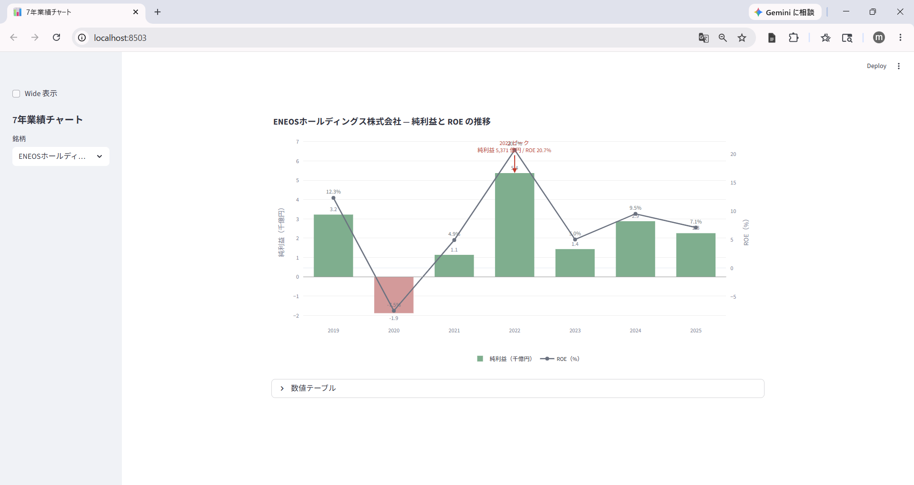

# XBRL を JSON に変換して分析する ― 既存サービスにない切り口を作る

{width="1280"}

前回取得した XBRL は「決算書そのもの」ですが、**生のままでは分析に使えません**。会計基準や業種でタグがバラバラだからです。これを **マッピング辞書で統一 JSON に変換** すれば、Python の数行で分析できます。

そして JSON 化して初めて見えるのが、市販ツールでは届かない **7 年の構造** ― ＥＮＥＯＳ のピークアウトです。

<!-- more -->


## XBRL は生では使えない

XBRL は、要素（タグ）と文脈（context）で値を表す XML です。

```xml
<jpcrp_cor:Revenue contextRef="CurrentYearConsolidatedDuration" unitRef="JPY">12322494000000</jpcrp_cor:Revenue>
```

ただし同じ「売上高」でも、会計基準や業種でタグが違います。

| 課題 | 例 |
| --- | --- |
| 会計基準でタグが違う | 売上 ＝ `NetSales`（日本基準）/ `RevenueIFRS`（IFRS） |
| 業種別タクソノミがある | 石油・ガス業は `jpigp_cor:` の独自タグ |
| 文脈が分離される | 当期 / 前期 / 連結 / 個別が context の組み合わせで決まる |
| 1 ファイルに数百タグ | 必要な財務項目はそのうち 40 程度 |

そこで **マッピング辞書（CSV）** で差分を吸収し、**統一 JSON スキーマ**に変換します。


## XBRL → JSON 変換の仕組み

肝は「**1 つの JSON キーに、複数の XBRL タグを対応させる**」設計です。

例えば `performance.current.net_sales` には日本基準の `NetSales`、IFRS の `RevenueIFRS` など複数タグが紐づき、**最優先（priority）のタグの値が採用**されます。使う側は会計基準をいっさい意識しません。

この設計を支える 5 原則です。

1. **意味的なセクション分け** ― performance / balance_sheet / dividend など会計的に意味のある単位で切る
2. **時間軸の対称性** ― current / prior / forecast を同じ構造で持つ（前期比が 1 行で書ける）
3. **会計基準の透過性** ― 「1 json_path : N xbrl_tag」でマッピング辞書が差分を吸収
4. **優先順位** ― 同じパスに複数タグが対応するとき priority で最優先を明示
5. **データ駆動** ― スキーマ拡張は CSV を 1 行足すだけ、パーサーコードは触らない

変換後は、Python の数行で全銘柄を横串分析できます。

```python
import json, glob, pandas as pd

rows = []
for f in glob.glob("data/statements/*_FY.json"):
    d = json.load(open(f, encoding="utf-8"))
    p = d.get("performance", {}).get("current", {})
    rows.append({"code": d["metadata"]["code"],
                 "net_sales": p.get("net_sales"),
                 "op_income": p.get("operating_income")})

df = pd.DataFrame(rows)
df["op_margin"] = df["op_income"] / df["net_sales"] * 100   # 会計基準を問わず計算できる
```


## JSON ならではの分析 ― 7 年時系列

無料で取れる集計データは **スナップショット止まり**ですが、自前 JSON なら **過去 7 年・セグメント・CF 詳細**まで届きます。

その代表例が、ＥＮＥＯＳ の 7 年純利益・ROE です（チャートは Appendix のアプリで対話的に確認できます）。

| 年度 | 純利益（億円） | ROE | 解釈 |
| --- | --- | --- | --- |
| 2019 | 3,223 | 12.3% | コロナ前の平常水準 |
| 2020 | −1,879 | −7.5% | コロナ・原油急落で赤字 |
| 2022 | **5,371** | **20.7%** | ★ピーク（原油急騰で在庫評価益膨張） |
| 2025 | 2,261 | 7.1% | ピーク比 −58% |

- 2022 は **ウクライナ侵攻による原油急騰で在庫評価益が膨張した特殊年**（ROE 20.7%）
- 2025 は **のれん減損・在庫影響などの一時／構造要因**を含む。比較基準を 2019 年（平常期）に置くと −30% 程度で穏やかになる

連載04〜07（無料データ分析）で観察した警戒シグナル（下方修正・経常変化マイナス）は、7 年スパンで見ると「**2022 の記憶 vs 業績の構造的低下**」のギャップとして裏付けられます。


## 既存サービスにないもの ― 企業独自指標の再構築

ここが自前 JSON の **最終価値**です。ＥＮＥＯＳ が打ち出す **「実質営業利益（在庫影響除き）4,400 億円」「本業利益・ROE 7.9%」** は会社独自の組替え定義で、**XBRL の標準勘定タグには存在しません**。

しかし JSON 化した要素データ（営業利益 / 在庫評価損益 / のれん減損 / 非継続事業損益）を組み合わせれば、**企業独自の主張数値を自分で再構築・検証できます**。標準項目を取るだけでなく、「**会社の主張は本当か**」を読者自身が確かめられる ― これが既存サービスにない切り口です。

> 具体的な計算式と前期比較は、フェーズ3 のアクルーアル・三角検証の回で扱います。


## まとめ ― フェーズ1（データ取得編）の総括

- XBRL は生では使えない（会計基準でタグがバラバラ）。**マッピング辞書で統一 JSON** に変換する
- 「**1 JSON キー : N XBRL タグ**」設計で会計基準を吸収。使う側は **数行で横串分析**できる
- JSON 化で **過去 7 年・セグメント・CF** まで届く ― ＥＮＥＯＳ の 2022 ピーク → 2025 半減の構造が見える
- **企業独自指標（実質営業利益 4,400 億円など）も要素から再構築可能**。既存サービスにない検証ができる
- これでフェーズ1「データ取得編」（連載01〜03）が完成。**株価・発表日時・無料指標・XBRL → JSON** の材料がそろった

次回からは **フェーズ2「無料データで銘柄を評価する編」**。連載04「PEG × ROE」から、そろえたデータで実際に銘柄を採点・比較していきます。


## Appendix ― Python コード <i class="fa-brands fa-github"></i>

XBRL → JSON 変換のパーサーとマッピング辞書を **GitHub に公開**しています。決算データは再配布できませんが、EDINET / TDnet から取得すれば同じ JSON を再現できます（手順はリポジトリの README 参照）。

> <i class="fa-brands fa-github"></i> **リポジトリ** [`github.com/minnanosaiban/blog`](https://github.com/minnanosaiban/blog)

#### XBRL → JSON パーサー

マッピング辞書（CSV）を読み込み、priority で衝突解決しながら XBRL を統一 JSON に正規化。スキーマ拡張は CSV を 1 行足すだけ。

> 🔗 公開準備中 ― `parse_yuho_xbrl.py` ほかをリポジトリに追加予定

#### 7年業績チャート ― 純利益と ROE の推移

有報 JSON を読み込み、純利益（棒・黒字緑/赤字赤）と ROE（線・右軸）を 7 年並べる Streamlit アプリ。銘柄を選ぶとピーク年に注釈が付きます（既定 ＥＮＥＯＳ）。

<small style="color: var(--md-link-color);"><i class="fa-solid fa-expand"></i> クリックで拡大できます</small>

{width="1200"}

> 🔗 [`06_xbrl_json/app.py`](https://github.com/minnanosaiban/blog/blob/main/06_xbrl_json/app.py)


---

*データ出典: EDINET API（金融庁）の有報 XBRL × 7 期 / TDnet の決算短信 XBRL。自前パーサで JSON 正規化*
