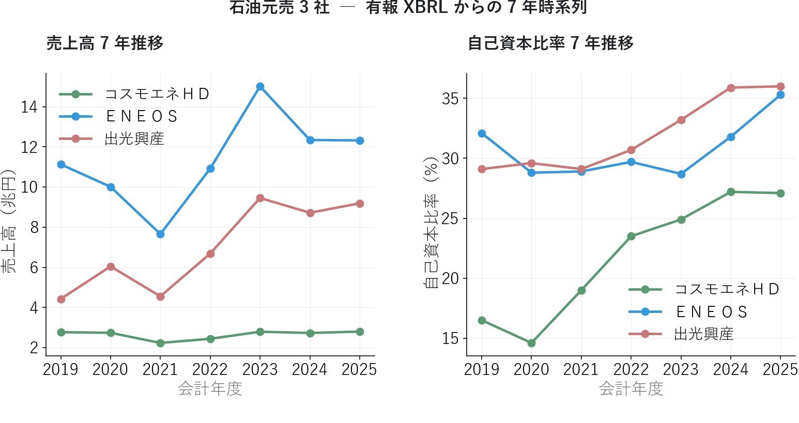

# XBRL を JSON に変換して分析する ― 既存サービスにない切り口を作る

{width="1280"}

前回取得した XBRL は「決算書そのもの」ですが、**生のままでは分析に使えません**。会計基準や業種でタグがバラバラだからです。これを **マッピング辞書で統一 JSON に変換** すれば、Python の数行で分析できます。

そして JSON 化して初めて見えるのが、ヤフーファイナンスや株探では届かない **7 年の構造** ― ＥＮＥＯＳ のピークアウトです。

<!-- more -->

## XBRL は JSON に変換する

XBRL は、要素（タグ）と文脈（context）で値を表す XML です。ただし同じ「売上高」でも、会計基準や業種でタグが違います。

| 課題 | 例 |
| --- | --- |
| 会計基準でタグが違う | 売上 ＝ `NetSales`（日本基準）/ `RevenueIFRS`（IFRS） |
| 業種別タクソノミがある | 石油・ガス業は `jpigp_cor:` の独自タグ |
| 文脈が分離される | 当期 / 前期 / 連結 / 個別が context の組み合わせで決まる |
| 1 ファイルに数百タグ | 必要な財務項目はそのうち 40 程度 |

そこで対応表を作成して、**分析できる形の「 JSON 」** に変換します。 JSON に変換した後は、Python の数行で全銘柄を横串分析できます。

## XBRL で実現できること

無料で取れる集計データは **スナップショット止まり**ですが、有報 XBRL は過去年度分も無料で取得できるので、時系列の業績指標を使って分析できます。

ここでは、3 年分の有報を重ね、7 期分の代表的な業績指標を使って石油元売 3 社のチャートを作成しました。後の記事では、XBRL で取得できたデータを使って深い分析を行っていきます。

<small style="color: var(--md-link-color);"><i class="fa-solid fa-expand"></i> クリックで拡大できます</small>

#### 規模は回復、財務体質はむしろ改善

{width="1200"}

売上高は 3 社とも 2021 年を底に回復し、規模では ＥＮＥＯＳ が突出します。あわせて自己資本比率を並べると、**3 社とも財務体質をむしろ強めて**きたことがわかります。とくにコスモエネＨＤは 2020 年の 15% から 2025 年は 27% へ大きく改善し、ＥＮＥＯＳ・出光興産も 30% 台へ。**「規模（売上）」と「体質（自己資本比率）」を同じ 7 年で重ねる**と、1 期の損益だけでは見えない安定度まで読めます。

#### 3 社とも 2022 がピーク ― そして直近ピークアウト

<small style="color: var(--md-link-color);"><i class="fa-solid fa-expand"></i> クリックで拡大できます</small>

{width="1200"}

<small>※ コスモエネＨＤ・出光興産の 2020 年 ROE は赤字で報告値が非開示のため、純利益÷自己資本で簡易補完しています。</small>

純利益は 3 社そろって **2022 年がピーク**（ＥＮＥＯＳ 5.4 千億円）。原油高で在庫評価益が膨らんだ特殊年です。ROE も一時 20〜35% まで跳ね上がりました。しかし直近は優良ライン（ROE 10%）前後まで低下し、**「2022 の記憶」と「足元の実力」のギャップ**が見えてきます（2025 はのれん減損などの一時要因も含む）。1 期だけ見ると見誤りますが、**7 年スパンで並べると構造が一目**です。

#### 営業 CF は健在 ― 利益より「嘘をつきにくい」

<small style="color: var(--md-link-color);"><i class="fa-solid fa-expand"></i> クリックで拡大できます</small>

{width="1200"}

純利益が落ちても、**営業 CF（緑）は 3 社ともプラスを維持**。本業の現金創出力は健在です。投資 CF（赤）・財務 CF（青）と並べれば、稼いだ現金を「投資に回したか／株主に返したか」の経営判断まで読めます。**利益は会計処理で動きますが、現金の出入りは動かしにくい** ― この視点は連載10「アクルーアル分析」で深掘りします。

> 💡 1 期の好決算に飛びつく前に、**7 年並べて「2022 のような特殊年ではないか」を確かめる**。純利益・ROE・営業 CF の 3 点セットで見ると、業績の「本物度」を判定しやすくなります。

## まとめ ― フェーズ1（データ取得編）の総括

連載01〜03 で、銘柄分析の土台となる **データ取得の引き出し**がそろいました。

| 連載 | テーマ | 取得したデータ（取得元） |
| --- | --- | --- |
| 01 | 株価を取得する | 日足・5分足 ― parquet に蓄積（yfinance） |
| 02 | 株価以外を取得する | 決算発表日時（TDnet）/ 業績指標 EPS・ROE・予想修正率（証券会社アプリ）/ 有報・決算短信の XBRL（EDINET・TDnet） |
| 03 | XBRL を JSON に変換する | 統一 JSON ＝ 7 年の業績時系列（自前パーサ） |

- **株価・タイミング・指標・財務諸表**の 4 系統がそろい、テクニカルからファンダメンタルまで横断できる
- XBRL → JSON 化で、無料サービスでは届かない **過去 7 年の時系列・セグメント・CF** まで自前で取得できる
- 石油元売 3 社では、**2022 ピーク → 直近ピークアウト**の構造が、売上・自己資本比率・純利益・ROE・CF を 7 年並べて裏づけられた

次回からは **フェーズ2「無料データで銘柄を評価する編」**。連載04「PEG × ROE」から、そろえたデータで実際に銘柄を採点・比較していきます。

## Appendix ― Python コード <i class="fa-brands fa-github"></i>

XBRL → JSON 変換のパーサーとマッピング辞書を **GitHub に公開**しています。決算データは再配布できませんが、EDINET / TDnet から取得すれば同じ JSON を再現できます（手順はリポジトリの README 参照）。

> <i class="fa-brands fa-github"></i> **リポジトリ** [`github.com/minnanosaiban/blog`](https://github.com/minnanosaiban/blog)

#### チャート生成スクリプト

本記事の 7 年時系列チャート（売上高・自己資本比率 / 純利益・ROE / CF）を有報 JSON から生成するスクリプトです。

> 🔗 [`make_images.py`](https://github.com/minnanosaiban/blog/blob/main/03_xbrl_json/make_images.py)

#### 決算 Note 記事プロンプト生成アプリ

決算短信・有報の JSON を所定フォルダに保存し、銘柄コードを入力するだけで **Note 記事の下書きプロンプト**を生成する Streamlit アプリです。連載01・02 でチャートの作り方は学んだので、ここでは「JSON から文章へ」のステップを体験します。

① 決算 XBRL を取得・パースして JSON を保存　② 銘柄コードを入力・期を選択　③ 着目点を一言メモ　④ プロンプトをコピーして Claude などに貼り付ける

<small style="color: var(--md-link-color);"><i class="fa-solid fa-expand"></i> クリックで拡大できます</small>

{width="1200"}

#### PDF を AI に渡す方法との違い

「決算短信 PDF を直接 AI に貼り付ければ同じでは？」という疑問は自然です。1 社・1 回の記事作成なら PDF で十分です。ただし **社数・頻度が増えるほど差が開きます**。

| | PDF → AI（手作業） | XBRL アプリ |
| --- | --- | --- |
| **取得** | TDnet で 1 社ずつ DL → AI にアップロード | `fetch_kessan.py` でコードを指定して自動 DL |
| **数値の正確性** | AI の PDF 読み取りに依存 | XBRL 構造化データから取得・計算済み |
| **前期比・予算比** | AI が推算（小数点で誤差が出ることがある） | 計算値をそのまま渡すため誤差ゼロ |
| **後発事象・ガイダンス前提** | PDF 全体を渡さないと抜けることがある | `qualitative.htm` から自動抽出 |
| **複数社の定点観測** | 毎期、全社分の DL → UL を繰り返す | JSON が蓄積されるため追加取得のみ |
| **記事の自動化** | 手動コピペが前提 | API（Claude 等）を呼べばバッチ処理も可能 |

PDF 方式は「今すぐ 1 社だけ」に最適です。XBRL 方式は **連載で 10 社以上を毎期追う** ような用途で真価を発揮します。また Claude API を組み込めば、取得 → 変換 → 記事生成までをスクリプト 1 本で完結させることもできます。

#### チャート画像 ― ダブルクリック一発で PNG を作成

本記事の図はすべて **Matplotlib** で生成しています。**デスクトップショートカットからダブルクリック一発で最新データの高解像度 PNG / PDF を再生成**。Windows タスクスケジューラ / cron に登録すれば、毎週・毎月の定点観測を手を動かさず回せます。

> 🔗 

---

*データ出典: EDINET API（金融庁）の有報 XBRL × 7 期 / TDnet の決算短信 XBRL。自前パーサで JSON 正規化*
