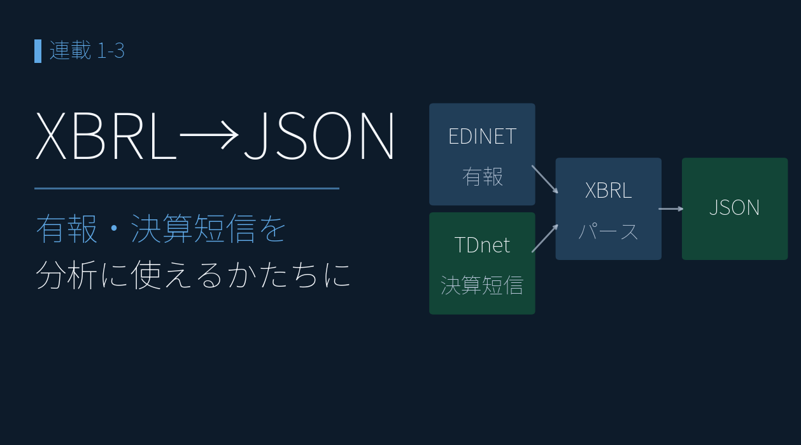
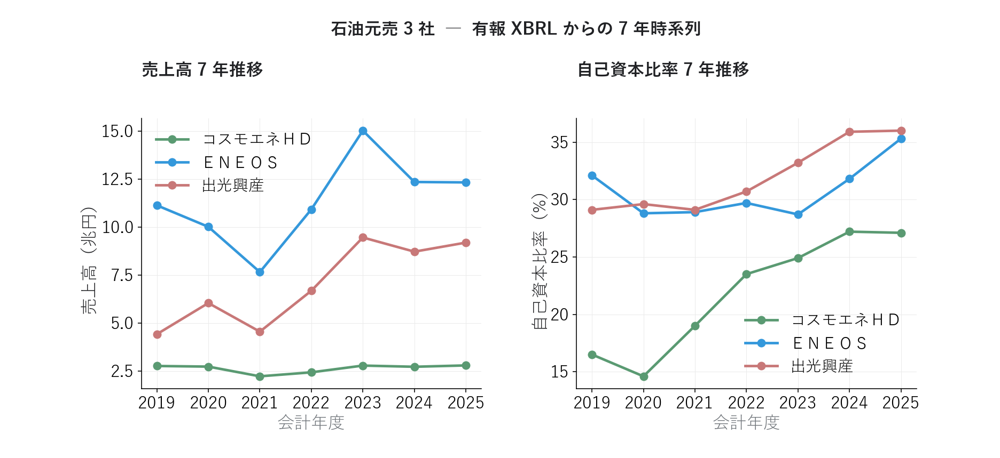
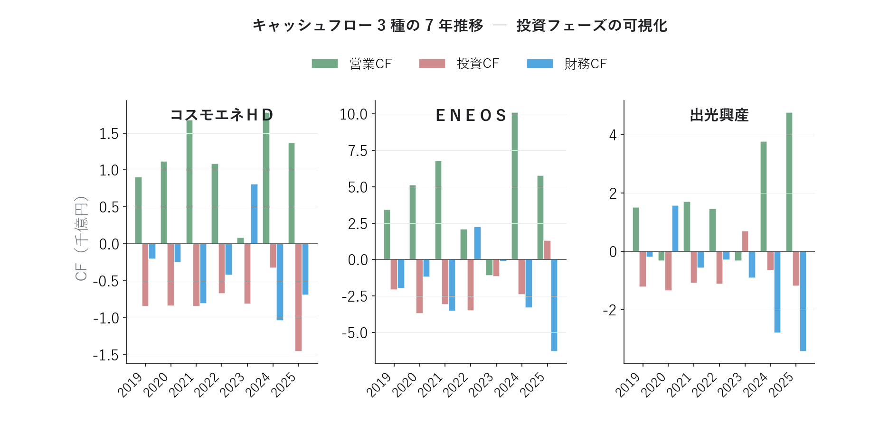

# 決算 XBRL を JSON に変換 ― 決算そのものを分析、元売3社業績比較

{width="1280"}

企業が有価証券報告書を金融庁（EDINET）に提出するときは、決算データを XBRL という形式で出します。しかし、XBRL は複雑な構造で、そのまま分析に使うのは現実的ではありません。そのため、**XBRL を JSON という形式に変換**する必要があります。

本記事では、 取得した XBRL を JSON 化し、代表的な財務指標の時系列推移を可視化します。そこで見えてきたのが、ＥＮＥＯＳ のピークアウトです。

データ出典: EDINET API（金融庁）の有報 XBRL × 7 期 / TDnet の決算短信 XBRL。自前パーサで JSON 正規化

<a class="ref-card ref-card--quiet" href="https://developer.mozilla.org/ja/docs/Learn/JavaScript/Objects/JSON" target="_blank" rel="noopener">

JSON とは
構造化データを表す標準のテキスト形式 ― MDN Web Docs

</a>

<!-- more -->

## XBRL は JSON に変換する

XBRL は、要素（タグ）と文脈（context）で値を表す XML です。ただし同じ「売上高」でも、会計基準や業種でタグが違います。

| 課題 | 例 |
| --- | --- |
| 会計基準でタグが違う | 売上 ＝ `NetSales`（日本基準）/ `RevenueIFRS`（IFRS） |
| 業種別タクソノミがある | 石油・ガス業は `jpigp_cor:` の独自タグ |
| 文脈が分離される | 当期 / 前期 / 連結 / 個別が context の組み合わせで決まる |
| 1 ファイルに数百タグ | 必要な財務項目はそのうち 40 程度 |

そこで対応表を作成して、**分析できるかたちの「 JSON 」** に変換します。 JSON に変換した後は、Python の数行で全銘柄を横串分析できます。

## JSON 化で実現、時系列分析

有報 XBRL は過去年度分も無料で取得でき、業績指標の時系列を表現できます。ここでは、3 年分の有報を重ね、7 期分の代表的な業績指標を使って石油元売 3 社のチャートを作成しました。後の連載では、JSON 化したデータを使い、アクルーアル分析やセグメント発進力など、さらに深い分析を行っていきます。

### 規模は回復、財務体質はむしろ改善

売上高は 3 社とも 2021 年を底に回復し、規模では 🟥ＥＮＥＯＳ が突出します。あわせて自己資本比率を並べると、**3 社とも財務体質をむしろ強めて**きたことがわかります。とくに🟩コスモエネＨＤは 2020 年の 15% から 2025 年は 27% へ大きく改善し、🟥ＥＮＥＯＳ・🟦出光興産も 30% 台へ。**「規模（売上）」と「体質（自己資本比率）」を同じ 7 年で重ねる**と、1 期の損益だけでは見えない安定度まで読めます。

<i class="fa-solid fa-expand"></i> クリックで拡大

{width="1200"}

### 3 社とも 2022 がピーク ― そして直近ピークアウト

純利益は 3 社そろって **2022 年がピーク**（🟥ＥＮＥＯＳ 5.4 千億円）。原油高で在庫評価益が膨らんだ特殊年です。ROE も一時 20〜35% まで跳ね上がりました。しかし直近は優良ライン（ROE 10%）前後まで低下し、**「2022 の記憶」と「足元の実力」のギャップ**が見えてきます（2025 はのれん減損などの一時要因も含む）。1 期だけ見ると見誤りますが、**7 年スパンで並べると構造が一目**です。

<i class="fa-solid fa-expand"></i> クリックで拡大

{width="1200"}

<small>※ コスモエネＨＤ・出光興産の 2020 年 ROE は赤字で報告値が非開示のため、純利益÷自己資本で簡易補完しています。</small>

### 営業 CF は健在 ― 利益より「嘘をつきにくい」

純利益が落ちても、🟩営業 CFは 3 社ともプラスを維持。本業の現金創出力は健在です。🟥投資 CF・🟦財務 CFと並べれば、稼いだ現金を「投資に回したか／株主に返したか」の経営判断まで読めます。**利益は会計処理で動きますが、現金の出入りは動かしにくい** ― この視点は後の「アクルーアル分析」の記事で深掘りします。

<i class="fa-solid fa-expand"></i> クリックで拡大

{width="1200"}

## <i class="fa-brands fa-github"></i> Python コード

本記事のチャート画像・アプリ・データ取得・成形スクリプトは、すべて **GitHub に公開**しています。データは提供元の利用規約により再配布できませんが、データを各自取得すれば、本連載と同じものが再現できます（動かし方はリポジトリの README 参照）。

<a class="repo-link" href="https://github.com/minnanosaiban/blog/tree/main/03_xbrl_json" target="_blank" rel="noopener">
github.com/minnanosaiban/blog/03_xbrl_json
<i class="repo-link-arrow fa-solid fa-arrow-up-right-from-square"></i>
</a>

## 📌 自作アプリ紹介

**― 決算 Note 記事プロンプト生成アプリ ―**

<a class="repo-link" href="https://github.com/minnanosaiban/blog/tree/main/03_xbrl_json" target="_blank" rel="noopener">
github.com/minnanosaiban/blog/03_xbrl_json
<i class="repo-link-arrow fa-solid fa-arrow-up-right-from-square"></i>
</a>

決算短信・有報の JSON を所定フォルダに保存し、銘柄コードを入力するだけで **Note 記事の下書きプロンプト**を生成する Streamlit アプリです。前の記事でチャートの作り方は扱ったので、ここでは「JSON から文章へ」のステップを体験します。

1. 決算 XBRL を取得・パースして JSON を保存
2. 銘柄コードを入力・期を選択
3. 着目点を一言メモ
4. プロンプトをコピーして Claude などに貼り付ける

<i class="fa-solid fa-expand"></i> クリックで拡大

{width="1200"}

> 📌 **PDF を AI に渡す方法との違い**
>
> 「決算短信 PDF を直接 AI に貼り付ければ同じでは？」という疑問は自然です。1 社・1 回の記事作成なら PDF で十分です。ただし **社数・頻度が増えるほど差が開きます**。
>
> | | PDF → AI（手作業） | XBRL アプリ |
> | --- | --- | --- |
> | **取得** | TDnet で 1 社ずつ DL → AI にアップロード | `fetch_kessan.py` でコードを指定して自動 DL |
> | **数値の正確性** | AI の PDF 読み取りに依存 | XBRL 構造化データから取得・計算済み |
> | **前期比・予算比** | AI が推算（小数点で誤差が出ることがある） | 計算値をそのまま渡すため誤差ゼロ |
> | **後発事象・ガイダンス前提** | PDF 全体を渡さないと抜けることがある | `qualitative.htm` から自動抽出 |
> | **複数社の定点観測** | 毎期、全社分の DL → UL を繰り返す | JSON が蓄積されるため追加取得のみ |
> | **記事の自動化** | 手動コピペが前提 | API（Claude 等）を呼べばバッチ処理も可能 |
>
> PDF 方式は「今すぐ 1 社だけ」に最適です。XBRL 方式は **連載で 10 社以上を毎期追う** ような用途で真価を発揮します。また Claude API を組み込めば、取得 → 変換 → 記事生成までをスクリプト 1 本で完結させることもできます。

---
