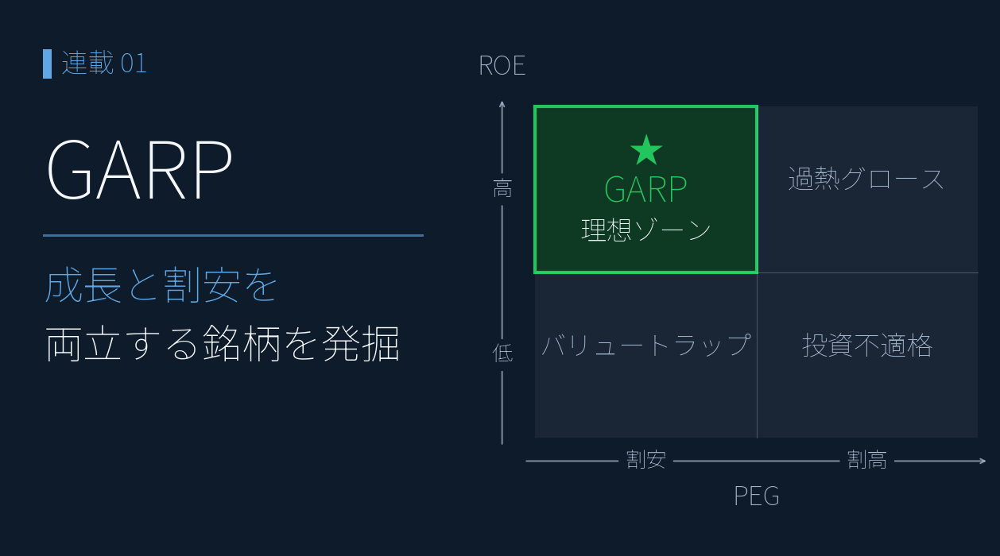
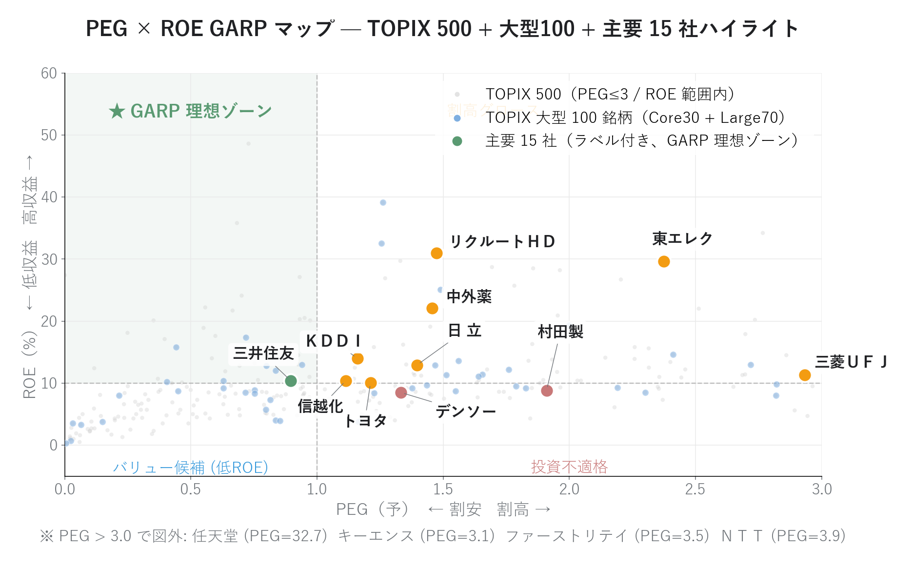
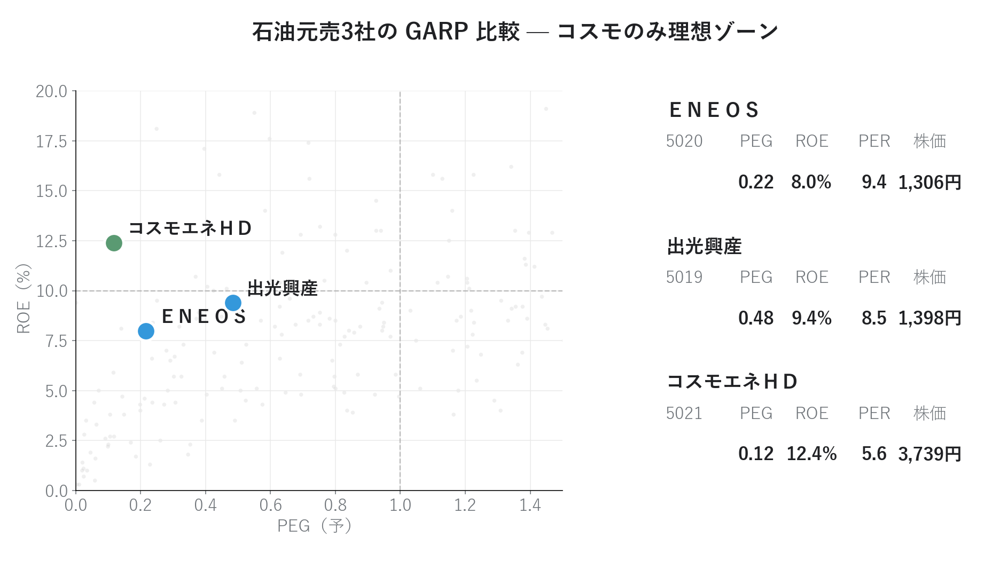
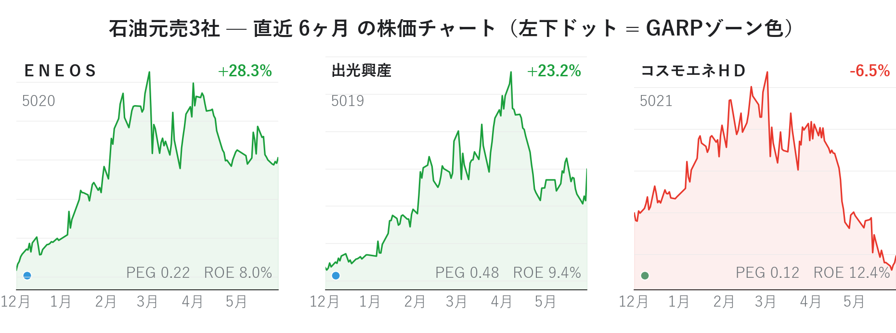

# 4象限で GARP を見る ― 「成長と割安の両立銘柄」を発掘

{width="1280"}

「PER が低いから割安」 ― この判断には、**成長率という視点**が抜けています。

ピーター・リンチが伝説的ファンドを年率 29% で運用した **GARP（Growth At a Reasonable Price）** 戦略では、PEG と ROE の組み合わせで「成長性（グロース）と割安度（バリュー）を両立した銘柄」を見つけ出します。

データ出典: 証券会社のアプリの ROE / 前期 EPS / 予想 EPS + yfinance 日足 Close

<a class="ref-card ref-card--quiet" href="https://www.ifinance.ne.jp/glossary/stock/sto379.html" target="_blank" rel="noopener">

GARP とは
成長性と割安性を両立して狙う投資手法 ― iFinance 用語集

</a>

## GARP の概要

**GARP（Growth At a Reasonable Price）** は、**割安（低 PEG）かつ高品質（高 ROE）** の銘柄を選ぶ戦略です。グロース投資が陥る「成長鈍化での PER 再評価による株価急落」、バリュー投資が陥る「構造的低収益のバリュートラップ」 ― この 2 つの失敗の **中間** に位置し、**「成長性を確認しつつ妥当な価格で買う」** スタンスです。

**PEG（予想） = PER（予想） ÷ EPS成長率(%)** ― 成長率に対する割安度

PER 30 倍でも年率 60% 成長なら PEG = 0.5 で超割安、PER 10 倍でも減益予想なら PEG = ∞ で罠。

| 目安 | 判定 |
| --- | --- |
| ≤ 0.5 | 超割安 |
| ≈ 1.0 | 適正 |
| ≥ 2.0 | 割高 |

**ROE = 当期純利益 ÷ 自己資本 × 100** ― 自己資本の利益効率

| 目安 | 判定 |
| --- | --- |
| ≥ 15% | 超優良(堀の可能性) |
| ≥ 10% | 優良 |
| ≤ 5% | 構造的低収益（罠警戒） |

>⚠️本記事の「予想」表記は、**証券会社のアプリのアナリストコンセンサス値**。企業公式の業績予想とは異なります。

## 主要15銘柄「成長性 × 割安度」を見る

GARP は、PEG（横軸）× ROE（縦軸）でプロットすると、「割安 × 高 ROE の理想ゾーン」が一目で分かります。**緑が GARP 理想ゾーン**（PEG ≤ 1.0 かつ ROE ≥ 10%）です。

<i class="fa-solid fa-expand"></i> クリックで拡大 ・ 2026.05.31作成

{width="1200"}

- **理想ゾーンに入っている主要銘柄は三井住友だけ** ― **割安 × 高 ROE の両立は、大型株では稀**であることが一目で分かる
- 大型株（水色）は ROE 帯にばらつきがあるが、PEG ≤ 1.0 の領域には少ない ―「妥当な価格」を厳格に求めると候補が限られる
- 中小型株（背景グレー）には PEG が極端に低い銘柄が散在 ―「割安だが流動性・知名度が低い」候補は中小型に多い

## 元売3社「GARPと株価の逆行」を観測

### GARP では理想ゾーンのコスモ

ここで、石油元売 3 社の銘柄比較を見てみましょう。市況・精製マージン・在庫評価など共通の事業構造を持ちながら、GARP マップ上の位置はまったく異なります。

<i class="fa-solid fa-expand"></i> クリックで拡大 ・ 2026.05.31作成

{width="1200"}

- **コスモエネＨＤ**: PEG 0.12 / ROE 12.4% → 🌟GARP 理想ゾーン
- **出光興産**: PEG 0.48 / ROE 9.4% → 惜しい位置（ROE があと一歩）
- **ＥＮＥＯＳ**: PEG 0.22 / ROE 8.0% → バリュー候補だが低収益

### なぜコスモの株価は GARP と逆行し、下落したか

GARP だけ見ればコスモが魅力的です。しかし、**直近 6 ヶ月の株価**は、−6.5% で下落しているのです。一方、ROE が劣る ＥＮＥＯＳ は +28.3%、出光は +23.2% と上昇しています。

<i class="fa-solid fa-expand"></i> クリックで拡大 ・ 2026.05.31作成

{width="1200"}

一見矛盾するこの結果は、いくつかの解釈ができます。

1. **市況連動セクター特有の罠**: 石油元売の業績は原油価格・精製マージンに大きく左右される。コスモの予想 EPS 成長率 +47.66% はコンセンサスが楽観的すぎる可能性があり、**次回下方修正で PEG が一気に跳ね上がる懸念**
2. **次の業績改善期待を先取り**: ＥＮＥＯＳ / 出光は GARP 的にはイマイチでも、市場が先回りして買いに動いている可能性。GARP が「過去の予想ベース」を見るのに対し、株価は「次の予想変化」を読みに行く
3. **流動性プレミアム**: ＥＮＥＯＳ は時価総額が大きく機関投資家の資金が入りやすい一方、コスモは相対的に小型で見落とされやすい

 > 💡 「GARP マップで光る銘柄」と「直近で上がる銘柄」は必ずしも一致せず。GARP は中長期スタンスであり、短期株価とは別次元の話。

## まとめ

- **GARP = 低 PEG × 高 ROE** で、バリュートラップを避けつつ高品質な割安成長株を選ぶ戦略
- **散布図が GARP の標準的な可視化**。PEG × ROE の 2 軸でファンダの位置と市場全体の分布を同時に見られる
- 主要 15 社のうち **GARP 理想ゾーン入りは三井住友のみ** ― 大型株での両立は稀
- 石油元売 3 社では **GARP 理想値のコスモが直近 6 ヶ月で下落**、ＥＮＥＯＳ と GARP と株価が逆転

## <i class="fa-brands fa-github"></i> Python コード

本記事のチャート画像・アプリ・データ取得・成形スクリプトは、すべて **GitHub に公開**しています。データは提供元の利用規約により再配布できませんが、データを各自取得すれば、本連載と同じものが再現できます（動かし方はリポジトリの README 参照）。

<a class="repo-link" href="https://github.com/minnanosaiban/blog/tree/main/04_PEG_ROE" target="_blank" rel="noopener">
github.com/minnanosaiban/blog/04_PEG_ROE
<i class="repo-link-arrow fa-solid fa-arrow-up-right-from-square"></i>
</a>

## 📌 自作アプリ紹介

**― 銘柄が GARP 上どこにいるか確認 ―**

<a class="repo-link" href="https://github.com/minnanosaiban/blog/tree/main/04_PEG_ROE" target="_blank" rel="noopener">
github.com/minnanosaiban/blog/04_PEG_ROE
<i class="repo-link-arrow fa-solid fa-arrow-up-right-from-square"></i>
</a>

PEG × ROE の GARP マップを Streamlit でリアルタイムに操作しながら、銘柄が理想ゾーン（PEG ≤ 1.0 × ROE ≥ 10%）のどこにいるかを確認できます。証券会社のアプリの CSV を配置するだけで TOPIX 500 全銘柄の分布が一目でわかります。

<i class="fa-solid fa-expand"></i> クリックで拡大

{width="1200"}

---

