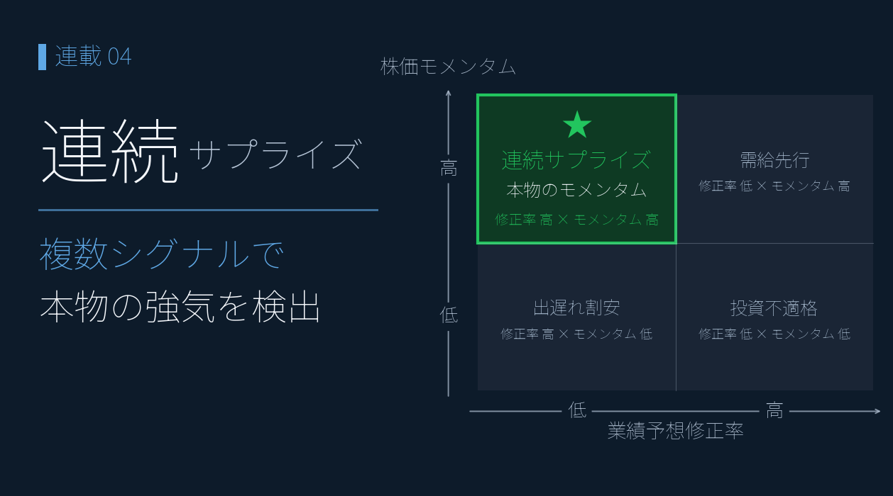

# 連続サプライズ・スコアボードで「業績モメンタムが本物の銘柄」を発掘する ― 3 シグナル合成で単一指標の限界を超える

{width="1280"}

連載03 の [EPS リビジョン・モメンタム](03_eps_revision_momentum.md) では業績予想修正率という **1 つのシグナル** から「出遅れ買い候補」を抽出しました。しかし単一シグナルだけで判断すると、**ノイズと本物のサプライズを区別しきれない** という限界があります。

本記事では修正率に **EPS 予想超過率・経常利益変化率（予）** を加えた **3 シグナルを合成**してサプライズスコアを作り、業績モメンタムが本物の銘柄を発掘します。

<!-- more -->


## 連続サプライズの概要

連載03 で業績予想修正率を見たとき、こんな疑問が残りませんでしたか。

- 「+5% の修正」と「+50% の修正」は、同じ "上方修正" として扱っていいのか？
- 上方修正の銘柄が来期増益と限らないなら、修正率だけで買うのは早計では？

**単一シグナルは強力だが、その精度・持続性・コンセンサス全体での合意度を測れない** ― これが連載03 の課題です。機関投資家のクオンツモデルが使う標準的な解決策は **複数シグナルの合成** です。

| シグナル | 何を測っているか | 単独の弱点 |
|---|---|---|
| 業績予想修正率(予) | アナリスト予想の **変化** | 1 人の修正でも上方修正に分類される |
| EPS 予想超過率 | コンセンサス予想 vs 実績の **乖離幅** | EPS 実績が極小の銘柄で発散しやすい |
| 経常利益変化率(予) | 来期予想の **水準（成長率）** | 修正の方向を反映していない |

それぞれ単独では落とし穴がありますが、**3 つすべてが高い銘柄は本物の業績モメンタム**。連載02 のマルチファクター採点と同じ思想（パーセンタイル化 → 単純平均）でサプライズスコアを作ります。

```
サプライズスコア = mean(
    rank_pct(業績予想修正率(予)),
    rank_pct(EPS予想超過率),
    rank_pct(経常利益変化率(予))
) × 100
```

学術的にも、**PEAD（Ball & Brown 1968）** や **Earnings Revision Strategy（Chan, Jegadeesh, Lakonishok 1996）**、**Quality × Revision（Asness et al. 2014）** といった研究で、複数シグナル合成の有効性が長年実証されています。

EPS 予想超過率は **(EPS(予) − EPS実績) ÷ |EPS実績| × 100**（|EPS実績| < 1.0 の銘柄は欠損扱い）で自前計算。しきい値は **サプライズスコア ≥ 75 が注目候補（上位 25%）/ ≥ 90 が本命級（上位 10%）**、品質担保のため ROE 5% 以上にフィルタ。実装詳細は Appendix の Python コードを参照。


## プロットで確認

3 シグナルのうち **修正率（X 軸）× 経常利益変化率(予)（Y 軸）** で 4 象限分類すると、業績モメンタムの位置が一目で分かります。

<small style="color: var(--md-link-color);"><i class="fa-solid fa-expand"></i> クリックで拡大できます</small>
<small style="color: var(--md-link-color);">2026.05.22作成</small>

{width="1200"}

| 象限 | 意味 | 銘柄数 |
|---|---|---|
| **右上**: 上方修正 × 来期成長 | ★最強ゾーン | **32** |
| 左上: 下方修正 × 来期成長 | 回復期待・限定的 | 1 |
| 左下: 下方修正 × 来期減益 | 回避ゾーン | 28 |
| 右下: 上方修正 × 来期減益 | ピークアウト警戒 | 0 |

特徴的なのは **左上（回復期待）と右下（ピークアウト警戒）がほぼ空白** という点。アナリストは「修正の方向」と「来期成長見通し」を **同じ方向に動かす** 傾向が強いため、銘柄の大半が右上 or 左下に振り分けられます。

石油元売 3 社（青い星マーク）は 4 象限のちょうど中央付近に位置。コスモエネＨＤ がわずかに右上、ＥＮＥＯＳ が左下にやや傾いています。

> 💡 修正率と経常変化率(予) は相関が強い。**両方が高い右上ゾーンに加えて、3 つ目のシグナル（EPS 予想超過率）まで揃った銘柄が "本物"**。


## ヒートマップで確認

散布図が「銘柄の位置」を見るのに対し、**ヒートマップは「全体序列と 3 シグナルの内訳」を同時に見るツール**です。3 シグナルを合成した総合スコアの Top 20 を、シグナル別に色分けして並べました。

<small style="color: var(--md-link-color);"><i class="fa-solid fa-expand"></i> クリックで拡大できます</small>
<small style="color: var(--md-link-color);">2026.05.22作成</small>

{width="1200"}

| 順位 | 銘柄 | サプライズ | 修正率 | EPS超過 | 経常変化(予) | ROE |
|---|---|---|---|---|---|---|
| 1 | 日清紡ＨＤ（3105） | **92.7** | +16.0% | +38.5% | +28.9% | 5.0% |
| 2 | ＴＥＮＴＩＡＬ（325A） | 92.6 | +2.5% | +195.2% | +10.3% | 23.5% |
| 3 | アサヒインテック（7747） | 92.5 | +5.9% | +140.4% | +5.9% | 8.4% |
| 4 | ＦＵＪＩ（6134） | 90.7 | +4.0% | +85.6% | +8.2% | 7.0% |
| 5 | 精工技研（6834） | 89.3 | +10.0% | +28.6% | +10.0% | 20.1% |

Top1 の **日清紡ＨＤ** は修正率 +16.0% / EPS 超過率 +38.5% / 経常変化率(予) +28.9% と、3 シグナルすべてが市場上位に並ぶ **業績モメンタム全方位タイプ**。

> 💡 修正率と経常変化率(予) はしばしば一致するため、**サプライズスコアを差別化する役割は EPS 予想超過率** にある。


## 石油元売 3 社比較

連載01〜03 で追ってきた 3 社を、3 シグナルで再評価します。

<small style="color: var(--md-link-color);"><i class="fa-solid fa-expand"></i> クリックで拡大できます</small>
<small style="color: var(--md-link-color);">2026.05.22作成</small>

{width="1200"}

| 銘柄 | 修正率 | EPS 超過率 | 経常変化率(予) | ROE |
|---|---|---|---|---|
| **コスモエネＨＤ** | **+1.1%** | **+47.7%** | — | 12.4% |
| **ＥＮＥＯＳ** | −3.7% | +43.8% | **−0.6%** | 8.0% |
| 出光興産 | −3.5% | +17.5% | — | 9.4% |

**コスモエネＨＤ** は利用可能な 2 シグナルがプラス：

- 修正率 +1.1%（連載03 で確認）
- EPS 超過率 **+47.7%**（コンセンサスが今期から大きく伸びると予想）
- 経常変化率(予) ― データ欠損

連載01 の "GARP 理想ゾーン"、連載02 の Value 92 / Consensus 68 と、一貫して高評価です。

**ＥＮＥＯＳ** は構図が複雑です：

- 修正率 −3.7%（連載03 で確認、コンセンサス下振れ）
- EPS 超過率 +43.8%（来期予想自体は高水準）
- 経常変化率(予) **−0.6%**（来期 **わずかに減益** 予想）

EPS 超過率が +44% と高いのに、経常変化率(予) は **マイナス**。**「EPS は今期実績比で大きく増えるが、経常利益は前期比で減る」** という、一見矛盾する組み合わせです。理由として考えられるのは:

1. 今期に **特別損失** があり、来期は剥落 → EPS は伸びるが経常は減
2. 来期は **金融費用増・投資コスト計上** で経常レベルでは減益、ただし税効果や非継続事業の整理で純利益（=EPS）は維持
3. アナリスト予想の細部に **不確実性が大きい** ― 数字の整合性が取れていない

<div class="margin01">
<div class="card-bule">
<p class="small"><b>📝 ＥＮＥＯＳ の "方向バラつき" は 3 解釈すべて該当</b></p>
<p class="small pad2">上記 3 つの抽象解釈は ＥＮＥＯＳ の場合、すべて具体的な構造要因として実在します：</p>
<p class="small pad2">
・解釈①「特別損失」← <b>のれん減損 ▲1,600 億円</b>（非現金、東燃ゼネラル統合分の金利上昇による減損）<br>
・解釈②「非継続事業の整理」← <b>JX金属 IPO</b>（57.6% 売却、当期利益 +1,300 億円）<br>
・経常利益の前期比減 ← <b>在庫影響 ▲1,500 億円</b>（油価下落タイムラグ）
</p>
<p class="small pad2">シグナル間の "バラつき" は本業悪化ではなく、一時／構造要因が複合的に作用している姿。ENEOS 公式の「実質営業利益 4,400 億円維持」スタンス、<b>4 つの修正率基準（▲94% 〜 +4.76% に分散）</b> の試算、出典 PDF は <a href="01_garp_peg_roe.md">連載01</a> 参照。</p>
</div>
</div>

**3 シグナルの方向がバラついている** こと自体が「業績モメンタムが揃っていない」サインです。連載02 の Consensus 22（下位）、連載03 の修正率 −3.7%（下振れ）と合わせると、機械的には **ＥＮＥＯＳ は短期的には注意が必要なフェーズ** と読めます（ただし上記 callout のとおり、バラつきの主因は本業悪化ではなく一時／構造要因）。

**出光興産** も経常変化率(予) のデータが欠損し、修正率 −3.5% / EPS 超過率 +17.5% と方向バラつき構造は ＥＮＥＯＳ と同様。

> 💡 3 シグナルが同じ方向を指していないときはエントリーを保留 ― これがマルチシグナル戦略の基本ルール。


## Streamlit アプリの紹介

本記事と同じ修正率 × 経常変化率(予) の 4 象限散布図を **Streamlit + Plotly** で操作可能にしたアプリを公開しています。サプライズスコアの閾値を動かしながら、3 シグナル全揃いの銘柄を絞り込めます。

> 📝 **アプリ公開予定**: GitHub リポジトリ（準備中）。`app_chart.py` と同じく Streamlit ベースで、`requirements.txt` だけ揃えればローカルで動きます。

```python
# Plotly 版 サプライズ 4 象限散布図（最小実装の抜粋）
import plotly.express as px

def surprise_scatter(df, rev_th=3.0, growth_th=0.0):
    fig = px.scatter(df,
                     x="業績予想修正率(予)",
                     y="経常利益変化率(予)",
                     size="サプライズスコア",
                     hover_data=["コード", "銘柄名", "EPS予想超過率", "ROE"],
                     color_discrete_sequence=["#7eaee0"])
    fig.add_vline(x=0, line_color="#888")
    fig.add_hline(y=0, line_color="#888")
    fig.add_vline(x=rev_th, line_dash="dash", line_color="#8ab09a")
    fig.add_hline(y=growth_th, line_dash="dash", line_color="#8ab09a")
    fig.update_layout(xaxis_title="業績予想修正率(%) ← 下振れ  上振れ →",
                      yaxis_title="経常利益変化率(予)(%) ← 減益  増益 →")
    return fig
```

データは連載中の `add_surprise_score()` を流用、3 シグナル全揃いの銘柄をハイライト表示できます。


## まとめ

- 連載03 の単一シグナル（修正率）の限界 ― **ノイズと本物のサプライズを区別できない** を、**3 シグナル合成** で乗り越える
- **散布図が標準的な可視化**。修正率 × 経常変化率(予) の 4 象限で、業績モメンタムの位置が一目で分かる
- 修正率 + EPS 予想超過率 + 経常利益変化率(予) のパーセンタイル平均でサプライズスコアを構築。フィルタ後 783 銘柄中、**スコア 75 以上 61 銘柄 / 90 以上 4 銘柄**
- 4 象限散布図では **右上「上方修正 × 来期成長予想」32 銘柄** が業績モメンタムの本命ゾーン
- **石油元売 3 社の構図**: コスモエネＨＤ は修正率・EPS超過がプラス（経常データ欠損）/ ＥＮＥＯＳ は修正率 -3.7% × EPS 超過 +43.8% × 経常変化率(予) **-0.6%** で **方向がバラつく状態**

連載01〜04 で追ってきた **ＥＮＥＯＳ / 出光興産 / コスモエネＨＤ の構図** ：

| 連載 | コスモエネＨＤ | ＥＮＥＯＳ | 出光興産 |
|---|---|---|---|
| 01 (PEG×ROE) | 理想 / -5.2% | バリュー候補 / +29.7% | 惜しい / +17.6% |
| 02 (マルチファクター) | Cons 68 / Sen 22 → 乖離 | Cons 22 / Mom 51 | 中庸型 |
| 03 (リビジョン) | +1.11% 横ばい | -3.71% 底入れ待ち | -3.48% 底入れ待ち |
| **04 (サプライズ)** | **修正率・EPS超過プラス（経常欠損）** | **方向バラつき（経常 −0.6%）** | **方向バラつき** |

ＥＮＥＯＳ の "方向バラつき" は、**のれん減損・在庫影響・JX金属IPO の同時進行という構造要因が主因**。4 基準試算（▲94% 〜 +4.76%）と公式説明は連載01 参照。

次回連載05 は **信用需給ダッシュボード** を実装します。連載02〜04 までの "業績軸" の視点から需給軸に切り替え、信用残・出来高 10 指標を統合して全市場の需給を一覧化します。


## Appendix ― Python コード

画像生成の全コードは [`04_surprise_score_make_images.py`](../scripts/04_surprise_score_make_images.py) を参照。執筆者ローカルのモジュール・データに依存するため、そのままでは動きません。

```python
import pandas as pd

# EPS 予想超過率 = (EPS(予) − EPS実績) / |EPS実績| × 100
# しきい値: サプライズスコア ≥ 75 で注目候補 / ≥ 90 で本命級
# 右上ゾーン（最強）: 修正率 ≥ +3% かつ 経常変化率(予) > 0
# 品質フィルタ: ROE ≥ 5%（予想精度が低い赤字スレスレ銘柄を除外）

def compute_eps_surprise(df: pd.DataFrame,
                         eps_actual: str = "EPS実績",
                         eps_forecast: str = "EPS予",
                         min_actual_abs: float = 1.0) -> pd.Series:
    """EPS 予想超過率を自前計算（EPS実績が極小の銘柄は除外）。"""
    safe = df[eps_actual].where(df[eps_actual].abs() >= min_actual_abs)
    return (df[eps_forecast] - safe) / safe.abs() * 100


def add_surprise_score(df: pd.DataFrame) -> pd.DataFrame:
    """3 シグナルのパーセンタイルランク平均でサプライズスコアを追加。"""
    out = df.copy()
    out["_s_rev"] = percentile_score(out["業績予想修正率(予)"])
    out["_s_eps"] = percentile_score(out["EPS予想超過率"])
    out["_s_ord"] = percentile_score(out["経常利益変化率(予)"])
    out["サプライズスコア"] = out[["_s_rev", "_s_eps", "_s_ord"]].mean(axis=1)
    return out


def classify_4zone(df: pd.DataFrame,
                   rev: str = "業績予想修正率(予)",
                   ord_growth: str = "経常利益変化率(予)") -> pd.Series:
    """業績モメンタムの 4 象限分類を返す。"""
    cls = pd.Series("対象外", index=df.index)
    cls.loc[(df[rev] >= 3) & (df[ord_growth] > 0)]  = "上方修正×成長予想（最強）"
    cls.loc[(df[rev] <= -3) & (df[ord_growth] > 0)] = "下方修正×成長予想（回復期待）"
    cls.loc[(df[rev] <= -3) & (df[ord_growth] <= 0)] = "下方修正×減益予想（回避）"
    cls.loc[(df[rev] >= 3) & (df[ord_growth] <= 0)] = "上方修正×減益予想（ピークアウト警戒）"
    return cls
```

---

*データ出典: 証券会社が無料で提供する銘柄情報サービスから取得した CSV 6 指標（業績予想修正率(予) / EPS(予) / EPS実績 / 経常利益変化率(予) / ROE / 時価総額）*
