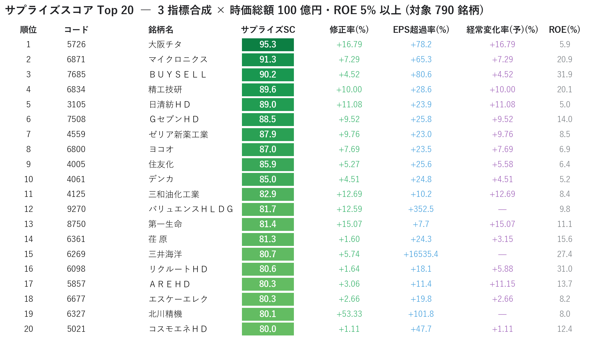
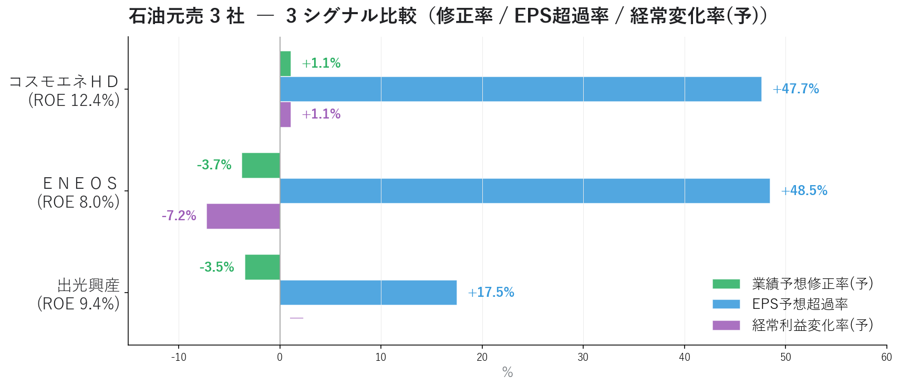
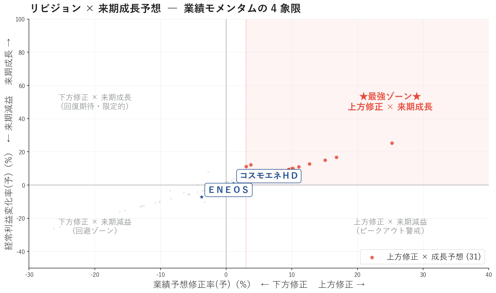
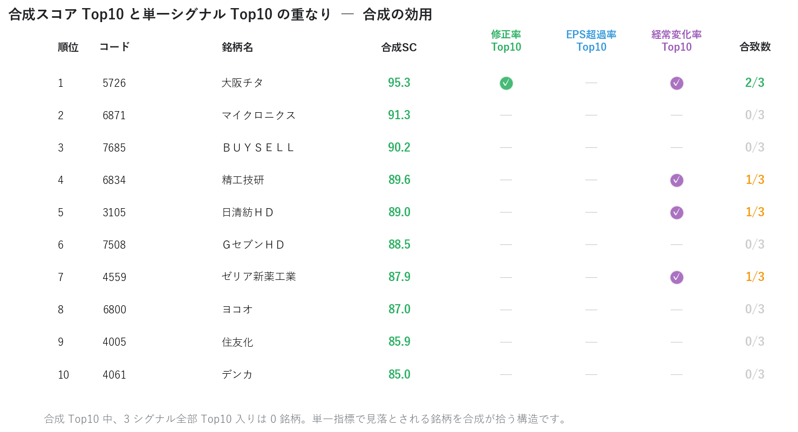
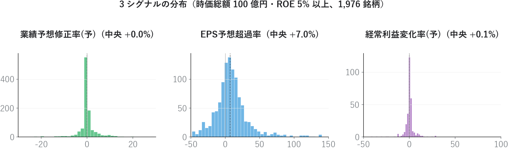

# 連続サプライズ・スコアボードで「業績モメンタムが本物の銘柄」を発掘する ― 3 シグナル合成で単一指標の限界を超える

連載03 の [EPS リビジョン・モメンタム](03_EPSリビジョンモメンタム.md) では業績予想修正率という **1 つのシグナル** から「出遅れ買い候補」を抽出しました。しかし単一シグナルだけで判断すると、**ノイズと本物のサプライズを区別しきれない** という限界があります。

本記事では修正率に **EPS 予想超過率・経常利益変化率（予）** を加えた **3 シグナルを合成**してサプライズスコアを作り、業績モメンタムが本物の銘柄を発掘します。連載01〜03 で追ってきた ＥＮＥＯＳ / 出光興産 / コスモエネＨＤ の状況も、3 シグナルで再評価します。注目すべきは **ＥＮＥＯＳ の経常利益変化率(予) −7.2%** ― 連載03 の下方修正に加え、来期減益予想まで重なってきました。

<!-- more -->

---

## ■ 連続サプライズの概要

### 単一シグナルの限界 ― 連載03 の振り返り

連載03 で業績予想修正率を見たとき、こんな疑問が残りませんでしたか。

- 「+5% の修正」と「+50% の修正」は、同じ "上方修正" として扱っていいのか？
- 上方修正の銘柄が来期増益と限らないなら、修正率だけで買うのは早計では？
- 上方修正したアナリストはまだ少数派かも？ コンセンサス全体は本当に強気か？

**単一シグナルは強力だが、その精度・持続性・コンセンサス全体での合意度を測れない** ― これが連載03 が抱えていた課題です。

### 3 シグナル合成というアプローチ

この課題に対し、機関投資家のクオンツモデルが使う標準的な解決策が **複数シグナルの合成** です。

| シグナル | 何を測っているか | 単独の弱点 |
|---|---|---|
| 業績予想修正率(予) | アナリスト予想の **変化** | 1 人のアナリストが修正しただけでも上方修正される |
| EPS 予想超過率 | コンセンサス予想 vs 実績の **乖離幅** | EPS 実績が極小の銘柄で発散しやすい |
| 経常利益変化率(予) | 来期予想の **水準（成長率）** | 修正の方向を反映していない |

それぞれ単独では落とし穴がありますが、**3 つすべてが高い銘柄は本物の業績モメンタム** です。連載02 のマルチファクター採点と同じ思想（パーセンタイル化 → 単純平均）でサプライズスコアを作ります。

```
サプライズスコア = mean(
    rank_pct(業績予想修正率(予)),
    rank_pct(EPS予想超過率),
    rank_pct(経常利益変化率(予))
) × 100
```

### PEAD と Earnings Revision の学術背景

3 シグナル合成の有効性は、学術研究で長年実証されています。

- **PEAD（Post-Earnings-Announcement Drift, Ball & Brown 1968 以降）**: 決算でポジティブサプライズを出した銘柄は、発表後 2〜3 ヶ月にわたって超過リターンを生み続ける
- **Earnings Revision Strategy (Chan, Jegadeesh, Lakonishok 1996)**: アナリスト予想の上方修正幅 + 修正回数 + コンセンサス改善 を統合した戦略は、市場対比で年率数 % の超過リターン
- **Quality × Revision (Asness et al. 2014)**: ROE 等の Quality と Revision を組み合わせると、単独より頑健な戦略になる

本記事のサプライズスコアは、この **「Revision（修正） × Surprise（超過率） × Forward Growth（来期予想）」** の 3 軸構成です。

### 「PER が低い／高い」では捉えきれない、業績の "勢い"

連載01・02 で扱った PER / ROE が **水準** を表すのに対し、リビジョンとサプライズは **勢い** を表します。

```
水準（level）     : PER 10 倍は割安か？
変化（revision）   : アナリストはこの 1 ヶ月で予想をどう動かしたか？
超過（surprise）   : コンセンサスは今期実績をどれだけ超える来期予想か？
将来（forward）    : 来期は前期比でどれだけ伸びる予想か？
```

3 つの "勢い指標" が揃った銘柄は、**業績の方向と速度と将来見通しがすべて同じ方向を指す** ということです。

---

## ■ 分析で分かったこと

東証上場 1,556 銘柄について 6 指標を読み込み、サプライズスコアを算出して分析しました。フィルタは時価総額 100 億円以上・ROE 5% 以上・修正率 ≥ 0%（790 銘柄）が基本です。

### サプライズスコア Top 20

3 シグナルを合成した総合スコアの Top 20 です。

{width="950"}

| 順位 | 銘柄 | サプライズ | 修正率 | EPS超過 | 経常変化(予) | ROE |
|---|---|---|---|---|---|---|
| 1 | 大阪チタ（5726） | **95.3** | +16.8% | +78.2% | +16.8% | 5.9% |
| 2 | マイクロニクス（6871） | 91.3 | +7.3% | +65.3% | +7.3% | 20.9% |
| 3 | ＢＵＹＳＥＬＬ（7685） | 90.2 | +4.5% | +80.6% | +4.5% | 31.9% |
| 4 | 精工技研（6834） | 89.6 | +10.0% | +28.6% | +10.0% | 20.1% |
| 5 | 日清紡ＨＤ（3105） | 89.0 | +11.1% | +23.9% | +11.1% | 5.0% |
| 6 | ＧセブンＨＤ（7508） | 88.5 | +9.5% | +25.8% | +9.5% | 14.0% |
| 7 | ゼリア新薬工業（4559） | 87.9 | +9.8% | +23.0% | +9.8% | 8.5% |

Top1 の **大阪チタ** は連載03 でも「出遅れ買い候補」に登場した銘柄。修正率 +16.8% / EPS 超過率 +78.2% / 経常変化率(予) +16.8% と、3 シグナルすべてが市場上位の **業績モメンタム全方位タイプ**です。

注目すべきは **修正率と経常変化率(予) の数値がほぼ一致** している銘柄が多いこと。これはアナリスト予想の構造から来ています ― 修正の方向と来期見通しは強く相関するため、両者を別々に見ても重複する銘柄が選ばれます。**サプライズスコアを差別化する役割は、実は 3 つ目の "EPS 予想超過率" にあります**。

### 石油元売 3 社 ― 連載02〜03 の続編

連載01〜03 で追ってきた 3 社を、3 シグナルで再評価します。

{width="950"}

| 銘柄 | 修正率 | EPS 超過率 | 経常変化率(予) | ROE |
|---|---|---|---|---|
| **コスモエネＨＤ** | **+1.1%** | **+47.7%** | **+1.1%** | 12.4% |
| **ＥＮＥＯＳ** | −3.7% | +48.5% | **−7.2%** | 8.0% |
| 出光興産 | −3.5% | +17.5% | （NaN） | 9.4% |

連載02〜03 の構図がさらに鮮明になりました。

**コスモエネＨＤ** は 3 シグナルすべてがプラス：

- 修正率 +1.1%（連載03 で確認）
- EPS 超過率 **+47.7%**（コンセンサスが今期から大きく伸びると予想）
- 経常変化率(予) +1.1%（来期成長予想）

連載01 の "GARP 理想ゾーン"、連載02 の Value 85 / Consensus 73 と、3 連続で高評価です。**業績モメンタムが本物** であることを 3 シグナルが裏付けます。

**ＥＮＥＯＳ** は構図が複雑です：

- 修正率 −3.7%（連載03 で確認、下方修正）
- EPS 超過率 +48.5%（来期予想自体は高水準）
- 経常変化率(予) **−7.2%**（来期 **減益** 予想）

EPS 超過率が +48% と高いのに、経常変化率(予) は **マイナス**。これはどういう構造か。**「EPS は今期実績比で大きく増えるが、経常利益は前期比で減る」** という、一見矛盾する組み合わせです。理由として考えられるのは:

1. 今期に **特別損失** があり、来期は剥落 → EPS は伸びるが経常は減
2. 来期は **金融費用増・投資コスト計上** で経常レベルでは減益、ただし税効果や非継続事業の整理で純利益（=EPS）は維持
3. アナリスト予想の細部に **不確実性が大きい** ― 数字の整合性が取れていない

<div class="margin01">
<div class="card-bule">
<p class="small"><b>📝 ＥＮＥＯＳ の "方向バラつき" は 3 解釈すべて該当</b></p>
<p class="small pad2">上記 3 つの抽象解釈は ＥＮＥＯＳ の場合、すべて具体的な構造要因として実在します：</p>
<p class="small pad2">
・解釈①「特別損失」← <b>のれん減損 ▲1,600 億円</b>（非現金、東燃ゼネラル統合分の金利上昇による減損）<br>
・解釈②「非継続事業の整理」← <b>JX金属 IPO</b>（57.6% 売却、当期利益 +1,300 億円）<br>
・経常利益の前期比減 ← <b>在庫影響 ▲1,500 億円</b>（油価下落タイムラグ）
</p>
<p class="small pad2">シグナル間の "バラつき" は本業悪化ではなく、一時／構造要因が複合的に作用している姿。ENEOS 公式の「実質営業利益 4,400 億円維持」スタンス、<b>4 つの修正率基準（▲94% 〜 +4.76% に分散）</b> の試算、出典 PDF は <a href="01_PEG_ROE銘柄分析.md">連載01</a> 参照。</p>
</div>
</div>

いずれにせよ **3 シグナルの方向がバラついている** こと自体が「業績モメンタムが揃っていない」サインです。連載02 の Consensus 13（下位）、連載03 の修正率 −3.7%（下方修正）と合わせると、機械的には **ＥＮＥＯＳ は短期的には注意が必要なフェーズ** と読めます（ただし上記 callout のとおり、バラつきの主因は本業悪化ではなく一時／構造要因）。

**出光興産** は 経常変化率(予) のデータが欠損しており、判断材料が 2 シグナルだけになります。修正率 −3.5% / EPS 超過率 +17.5% と方向がバラつくのは ＥＮＥＯＳ と同様の構図です。

ＥＮＥＯＳ 関係者・株主の立場でこの 3 シグナルをどう解釈するかは投資判断ですが、**3 シグナルが同じ方向を指していないときはエントリーを保留**するのがマルチシグナル戦略の基本です。

### リビジョン × 来期成長予想 ― 4 象限散布図

修正率（X）× 経常利益変化率(予)（Y）の散布図で 4 象限を見ると、**右上ゾーン（上方修正 × 来期成長予想）が 31 銘柄** あります。

{width="950"}

| 象限 | 意味 | 銘柄数 |
|---|---|---|
| **右上**: 上方修正 × 来期成長 | ★最強ゾーン | **31** |
| 左上: 下方修正 × 来期成長 | 回復期待・限定的 | 1 |
| 左下: 下方修正 × 来期減益 | 回避ゾーン | 26 |
| 右下: 上方修正 × 来期減益 | ピークアウト警戒 | 0 |

特徴的なのは **左上（回復期待）と右下（ピークアウト警戒）がほぼ空白** という点。アナリストは「修正の方向」と「来期成長見通し」を **同じ方向に動かす** 傾向が強いため、銘柄の大半が右上 or 左下に振り分けられます。

石油元売 3 社（青い星マーク）は 4 象限のちょうど中央付近に位置。コスモエネＨＤ がわずかに右上、ＥＮＥＯＳ が左下にやや傾いているのが分かります。

### 単一シグナル vs 合成スコア ― 重なりの可視化

3 シグナルを合成する効用は、**単一指標 Top10 だけ見ていたら拾えない銘柄を発見できる** ことにあります。

{width="950"}

合成サプライズスコア Top10 のうち、3 つの単一シグナル Top10 すべてに入っている銘柄は **0 銘柄**。多くの銘柄は単一シグナルでは Top10 に入らず、合成スコアではじめて浮上してきます。

```
[単一指標 Top10 だけ見ていたら]   →   合成 Top10 の 7 銘柄を見落とす
[合成スコアで見ると]              →   3 シグナルが揃って高い「本物」を抽出
```

これがマルチシグナル戦略の本質的な価値です。連載02 のマルチファクター（7 ファクター）と同じ思想ですが、**業績モメンタムに特化した 3 シグナル** を合成することで、より具体的なエントリー対象を絞り込めます。

### 3 シグナルの分布特性

それぞれのシグナルの分布を見ると、特徴がよく分かります。

{width="950"}

- **修正率** は中央値 **±0% 付近** にピーク、上下対称に近い分布。市場全体では上方/下方が拮抗
- **EPS 予想超過率** は **+10〜+30% 付近** に厚い分布。コンセンサスは多くの銘柄で「来期は今期より伸びる」と予想している（強気バイアス）
- **経常変化率(予)** は **+5% 付近** にピーク、修正率より右肩寄り。これも来期成長期待の現れ

EPS 超過率と経常変化率(予) の **右肩寄りバイアス** は、アナリストの楽観バイアスとして知られている現象です。実際の達成率（PEAD 研究では予想下振れが多い）と乖離するため、**「予想 > 実績」になるリスクは常に意識** すべきです。

---

## ■ サプライズスコアの計算方法

### 1. EPS 予想超過率 の自前計算

```
EPS 予想超過率 = (EPS(予) − EPS実績) / |EPS実績| × 100
```

ただし EPS 実績が極小（絶対値が 1 円未満）の銘柄は除算で発散するため **欠損扱い** にします。これがないと「三井海洋 16,535%」のような異常値で集計が壊れます。

```python
safe_actual = df["EPS実績"].where(df["EPS実績"].abs() >= 1.0)
df["EPS予想超過率"] = (df["EPS(予)"] - safe_actual) / safe_actual.abs() * 100
```

### 2. パーセンタイル化と合成

連載02 と同じ思想です。各シグナルをフィルタ後の銘柄ユニバース内でパーセンタイルランクに変換し、単純平均をとります。

```
[シグナルスコア]
  ・修正率スコア      = rank_pct(業績予想修正率(予))    × 100
  ・EPS超過率スコア   = rank_pct(EPS予想超過率)         × 100
  ・経常変化率スコア  = rank_pct(経常利益変化率(予))     × 100

[サプライズスコア = 3 シグナルの単純平均]
  サプライズスコア = mean(修正率スコア, EPS超過率スコア, 経常変化率スコア)
```

### 3. 「業績の勢い」が揃った銘柄のしきい値

```
サプライズスコア ≥ 75    → 業績モメンタム上位 25%（注目候補）
サプライズスコア ≥ 90    → 上位 10%（本命級。本記事では 3 銘柄）
右上ゾーン: 修正率 ≥ +3% かつ 経常変化率(予) > 0
```

サプライズスコア 75 以上が 54 銘柄、90 以上が 3 銘柄。**3 銘柄まで絞れる強力な指標** であることが分かります。

### Quality と Surprise の組み合わせ

サプライズが本物かどうかは ROE と組み合わせて判定します。

| ROE | 予想信頼性 | 推奨度 |
|---|---|---|
| ROE 5% 未満 | 低（赤字スレスレで予想精度が低い） | 除外推奨 |
| ROE 10% 以上 | 中（安定的な事業基盤） | 標準 |
| ROE 20% 以上 | 高（高収益体質、サプライズが持続しやすい） | 優先 |

サプライズスコア Top20 でも **マイクロニクス（ROE 20.9%）/ 精工技研（ROE 20.1%）/ ＢＵＹＳＥＬＬ（ROE 31.9%）** など高 ROE 銘柄が複数。サプライズ × Quality の組み合わせは、機関投資家が必ずチェックする構成です。

---

## ■ Python コードの紹介

本分析の中核となるコードを抜粋して紹介します。画像生成の全コードは [`04_surprise_score_make_images.py`](../scripts/04_surprise_score_make_images.py) を参照してください（執筆者ローカルのモジュール・データに依存しているため、そのままでは動きません。動作要件は [scripts/README](../scripts/README.md) を参照）。

### EPS 予想超過率の自前計算（異常値処理込み）

```python
import pandas as pd

def compute_eps_surprise(df: pd.DataFrame,
                         eps_actual: str = "EPS実績",
                         eps_forecast: str = "EPS予",
                         min_actual_abs: float = 1.0) -> pd.Series:
    """EPS 予想超過率を自前計算。

    EPS実績の絶対値が `min_actual_abs` 未満の銘柄は除算で発散するため
    NaN を返す。
    """
    safe = df[eps_actual].where(df[eps_actual].abs() >= min_actual_abs)
    return (df[eps_forecast] - safe) / safe.abs() * 100
```

### サプライズスコアの計算

```python
def percentile_score(series: pd.Series, higher_better: bool = True) -> pd.Series:
    ranked = series.rank(pct=True, na_option="keep") * 100
    if not higher_better:
        ranked = 100 - ranked
    return ranked.fillna(50)


def add_surprise_score(df: pd.DataFrame) -> pd.DataFrame:
    """3 シグナルのパーセンタイルランク平均でサプライズスコアを追加。"""
    out = df.copy()
    out["_s_rev"] = percentile_score(out["業績予想修正率(予)"])
    out["_s_eps"] = percentile_score(out["EPS予想超過率"])
    out["_s_ord"] = percentile_score(out["経常利益変化率(予)"])
    out["サプライズスコア"] = out[["_s_rev", "_s_eps", "_s_ord"]].mean(axis=1)
    return out
```

### 4 象限分類

修正率 × 経常変化率(予) の 4 象限分類です。

```python
def classify_4zone(df: pd.DataFrame,
                   rev: str = "業績予想修正率(予)",
                   ord_growth: str = "経常利益変化率(予)") -> pd.Series:
    """業績モメンタムの 4 象限分類を返す。"""
    cls = pd.Series("対象外", index=df.index)
    upgr = (df[rev] >= 3) & (df[ord_growth] > 0)
    recovery = (df[rev] <= -3) & (df[ord_growth] > 0)
    avoid = (df[rev] <= -3) & (df[ord_growth] <= 0)
    peakout = (df[rev] >= 3) & (df[ord_growth] <= 0)

    cls.loc[upgr] = "上方修正×成長予想（最強）"
    cls.loc[recovery] = "下方修正×成長予想（回復期待）"
    cls.loc[avoid] = "下方修正×減益予想（回避）"
    cls.loc[peakout] = "上方修正×減益予想（ピークアウト警戒）"
    return cls
```

### 単一シグナル Top10 との重なり集計

合成スコアの効用を可視化するための集計です。

```python
def signal_overlap_table(df: pd.DataFrame, top: int = 10) -> pd.DataFrame:
    """合成スコア Top と単一シグナル Top の重なりを集計。"""
    top_rev = set(df.nlargest(top, "業績予想修正率(予)")["コード"])
    top_eps = set(df.nlargest(top, "EPS予想超過率")["コード"])
    top_ord = set(df.nlargest(top, "経常利益変化率(予)")["コード"])

    sc_top = df.nlargest(top, "サプライズスコア").copy()
    sc_top["in_修正率"]     = sc_top["コード"].isin(top_rev)
    sc_top["in_EPS超過率"]  = sc_top["コード"].isin(top_eps)
    sc_top["in_経常変化率"] = sc_top["コード"].isin(top_ord)
    sc_top["合致数"] = (sc_top[["in_修正率", "in_EPS超過率", "in_経常変化率"]]
                       .astype(int).sum(axis=1))
    return sc_top
```

---

## まとめ

- 連載03 の単一シグナル（修正率）の限界 ― **ノイズと本物のサプライズを区別できない** を、**3 シグナル合成** で乗り越える
- 修正率 + EPS 予想超過率 + 経常利益変化率(予) のパーセンタイル平均でサプライズスコアを構築。フィルタ後 790 銘柄中、**スコア 75 以上 54 銘柄 / 90 以上 3 銘柄**
- 4 象限散布図では **右上「上方修正 × 来期成長予想」31 銘柄** が業績モメンタムの本命ゾーン。修正の方向と来期見通しは強く相関するため、左上（回復期待）と右下（ピークアウト）はほぼ空白
- **石油元売 3 社の構図**: コスモエネＨＤ は 3 シグナルすべてプラスで本物の業績モメンタム / ＥＮＥＯＳ は修正率 -3.7% × EPS 超過 +48.5% × 経常変化率(予) **-7.2%** で **方向がバラつく状態** ＝ エントリー保留が定石
- 合成スコア Top10 のうち **3 シグナル全部 Top10 入りは 0 銘柄** ― 単一指標では見落とされる銘柄を合成が拾う構造
- ROE × Surprise の組み合わせ（Quality × Revision）は機関投資家の定番フレームワーク。本記事のフィルタ（ROE ≥ 5%）はその最小ライン

連載01〜04 で追ってきた **ＥＮＥＯＳ / 出光興産 / コスモエネＨＤ の構図** ：

| 連載 | コスモエネＨＤ | ＥＮＥＯＳ | 出光興産 |
|---|---|---|---|
| 01 (PEG×ROE) | 理想 / -2% | バリュー候補 / +35.8% | 惜しい / +23.2% |
| 02 (7ファクター) | Cons 73 / Sen 21 → 乖離 | Cons 13 / Mom 60 | 中庸型 |
| 03 (リビジョン) | +1.11% 整合 | -3.74% 逆行注意境界 | -3.48% 逆行注意境界 |
| **04 (サプライズ)** | **3 シグナル全プラス** | **方向バラつき** | **方向バラつき** |

連載01〜02 で短期的に大きく上昇していた **ＥＮＥＯＳ / 出光 が直近で 3 シグナルがバラつく状態**、一方 **コスモエネＨＤ は 4 連続で本物の業績モメンタム** を示唆する結果になりました。

ＥＮＥＯＳ の "方向バラつき" は、**のれん減損・在庫影響・JX金属IPO の同時進行という構造要因が主因**。4 基準試算（▲94% 〜 +4.76%）と公式説明は連載01 参照。

次回連載05 は **信用需給ダッシュボード** を実装します。連載02〜04 までの "業績軸" の視点から、需給軸に切り替え。信用残・出来高 10 指標を統合して、全市場の需給を一覧化します。

---

*データ出典: 証券会社が無料で提供する銘柄情報サービスから取得した CSV 6 指標（業績予想修正率(予) / EPS(予) / EPS実績 / 経常利益変化率(予) / ROE / 時価総額）*
