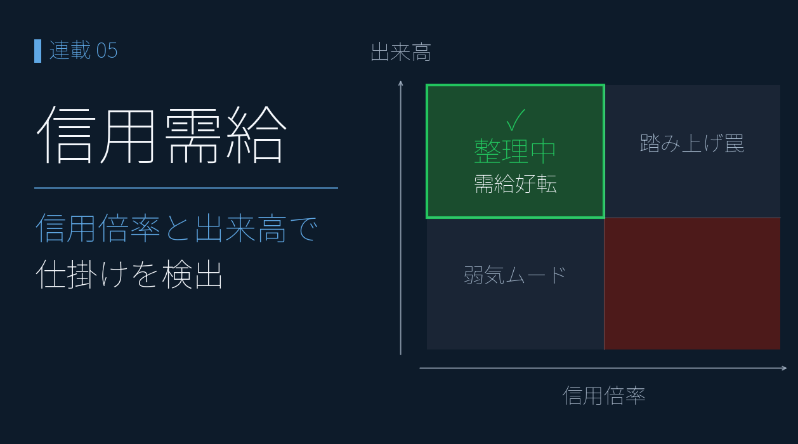
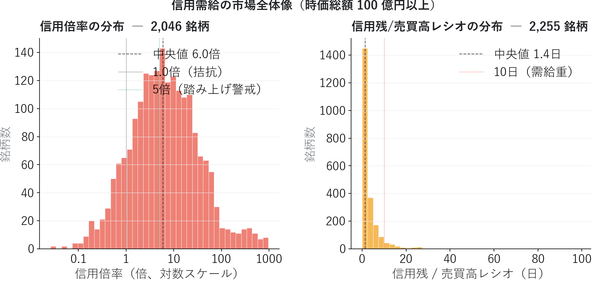
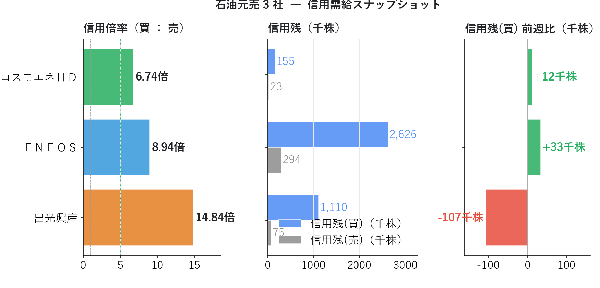
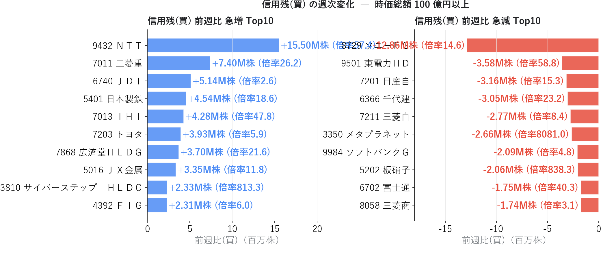
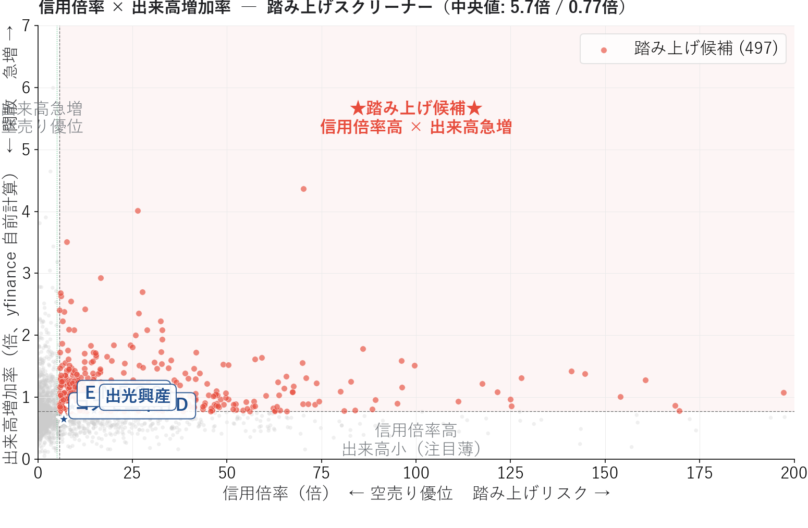
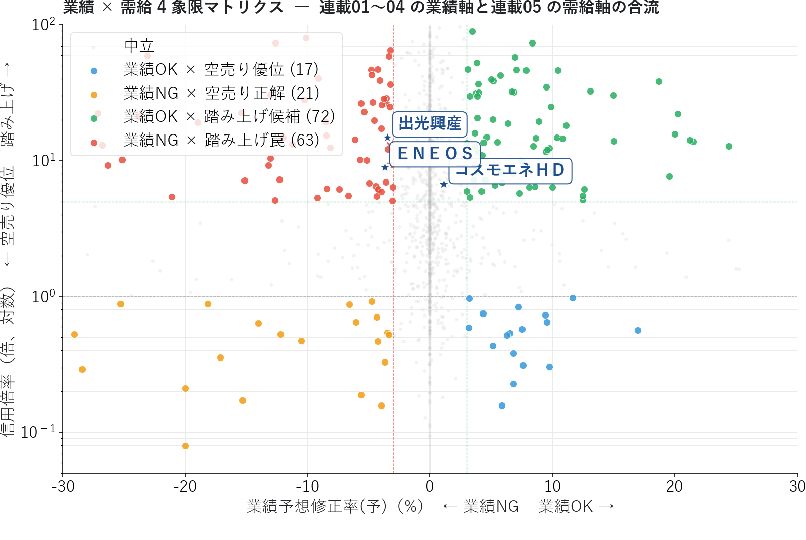

# 信用需給ダッシュボードで「踏み上げ候補」を発見する ― 業績軸に需給軸を合流させる

{width="1280"}

「業績は良いのに株価が上がらない」「業績は悪いのに下がらない」 ― そんな違和感の背景にあるのが **信用需給** です。

連載01〜04 では業績軸を深掘りし、ＥＮＥＯＳ / 出光興産 / コスモエネＨＤ の構図を追ってきました。本記事ではそれに **需給軸** を合流させます。

注目は **出光興産（信用倍率 14.8 倍 + 前週比 −10.7 万株急減）** の信用買い玉整理と、**ＥＮＥＯＳ（信用倍率 8.9 倍 + 前週比 +3.3 万株増加）** で「コンセンサス下方修正なのに個人が買い増し中」の状態。機械的には **業績NG × 踏み上げ罠** の典型構図ですが、ＥＮＥＯＳ の下方修正は **構造要因（のれん減損・在庫影響）が主因** のため、個人が構造を見抜いて仕込んでいる可能性もある ― そう読める対比です。

フェーズ 1 連載の締めくくりとして、業績軸と需給軸の合流点で何が見えるかを 4 象限マトリクスで可視化します。

<!-- more -->

---

## 信用需給の概要

### 業績だけでは説明できない値動き

「PER が低くて ROE も高い銘柄なのに、なぜ上がらないんだろう？」

これは個人投資家がよく抱く疑問です。答えの一つが **需給** にあります。ファンダメンタルズが優秀でも、信用買い残が多すぎれば戻り売り圧力で上値が重く、空売りが少なすぎれば材料が出ても急騰しません。逆に、業績が悪くても **空売り勢が積み上がっていれば踏み上げ** で急騰することがあります。

業績軸（連載01〜04）と需給軸（連載05）は **直交する 2 つの視点**。両方を見ることで、初めて「上がる／下がる」の確率を立体的に評価できます。

### 信用倍率 ― 踏み上げリスクの指標

**信用倍率 = 信用残（買） ÷ 信用残（売）**

| 信用倍率 | 状態 | リスク |
|---|---|---|
| > 10 倍 | 空売りが極端に少ない | **踏み上げ警戒** / 上方トリガーで急騰可能性 |
| 5〜10 倍 | やや買い優位 | 中庸 |
| 1〜5 倍 | 拮抗 | 健全な需給 |
| < 1 倍 | 空売り優位 | 弱気センチメント / **踏み上げ余地** |

信用倍率が高い銘柄は、空売り勢が買い戻しを迫られた時に **ショートスクイーズ** で急騰する余地があります。逆に信用倍率が低い（< 1 倍）銘柄は、空売り勢の見立てが正しかった場合の **空売り正解** を含意します。

### 前週比 ― 個人投資家のセンチメント変化

信用残の前週比は、**個人投資家の心理** をリアルタイムで反映する指標です。

- **前週比（買）プラス急増**: 個人が強気に転換、注目テーマが移動中
- **前週比（買）マイナス急減**: 信用買い玉が整理されている（ロスカット・期日決済）

前週比は **「マスコミがどう報じているか」より早く** 市場のセンチメント変化を捉えます。

### 信用残 / 売買高レシオ ― 需給滞留度

```
信用残 / 売買高レシオ = 信用残 ÷ 直近の売買高
                        = 信用残が "何日分の売買高" に相当するか
```

このレシオが高いほど **需給が重く**、ポジション解消に時間がかかります。10 日以上だと「良い銘柄なのに上がらない」状態になりやすく、20 日以上は要警戒です。

### 業績 × 需給 4 象限マトリクス

連載01〜04 の業績軸（業績予想修正率）と連載05 の需給軸（信用倍率）を組み合わせると、銘柄を 4 つの戦略カテゴリーに分類できます。

```
              信用倍率（縦軸：踏み上げ）
                ↑
                │
   業績NG ×    │   業績OK ×
   踏み上げ罠   │   踏み上げ候補
   （危険）     │   （★狙い目★）
                │
─ ─ ─ ─ ─ ─ ─ ┼ ─ ─ ─ ─ ─ ─ ─  業績予想修正率
                │
   業績NG ×    │   業績OK ×
   空売り正解   │   空売り優位
                │   （逆張り？）
                ↓
```

最強ゾーンは **右上「業績OK × 踏み上げ候補」**、最危険ゾーンは **左上「業績NG × 踏み上げ罠」** です。連載01〜04 の業績モメンタムだけでは見えなかった「需給の罠」が、このマトリクスで初めて可視化されます。

---

## 分析で分かったこと

東証上場銘柄について信用 5 指標と業績 1 指標を読み込み、時価総額 100 億円以上の **2,553 銘柄** で分析しました。

### 全市場の信用倍率 ― 中央値 6.34 倍という日本市場の特徴

{width="1200"}

信用倍率の分布を見ると、日本市場全体が **構造的に買い優位** であることが分かります。

| 信用倍率 | 銘柄数 | 構成比 |
|---|---|---|
| 5 倍超 | 1,175 | **46%** |
| 10 倍超 | 837 | **33%** |
| 1 倍以下（空売り優位） | 272 | 11% |

中央値が **6.34 倍** ― これは日本の信用取引制度（証券会社の貸株残高制限・銘柄により空売り禁止）の構造的な制約を反映しています。米国市場と異なり、日本では **「信用倍率 1.0 倍前後が標準」ではなく「6 倍前後が標準」** です。この点を踏まえないと「信用倍率 5 倍は踏み上げ候補」という閾値判断を誤ります。

信用残/売買高レシオの中央値は約 **1.4 日**。多くの銘柄は信用残が当日売買高の数日分以内で需給はクリアですが、**100 日超** の極端な滞留銘柄も少数存在（市場全体の流動性問題が出やすい中小型株）。

### 石油元売 3 社の信用需給 ― 連載04 の続編

連載01〜04 で追ってきた 3 社を信用需給で再評価すると、連載04 の "方向バラつき" が需給面でも顕著です。

{width="1200"}

| 銘柄 | 信用倍率 | 信用残(買) | 信用残(売) | 前週比(買) | 需給解釈 |
|---|---|---|---|---|---|
| **コスモエネＨＤ** | 6.74 倍 | 155 千株 | 23 千株 | **+12 千株** | 中央値付近、信用買い微増 |
| **ＥＮＥＯＳ** | **8.94 倍** | 2,626 千株 | 294 千株 | **+33 千株** | やや踏み上げ寄り、信用買い増加中 |
| **出光興産** | **14.84 倍** | 1,110 千株 | 75 千株 | **−107 千株** | **踏み上げ警戒水準だが信用買い玉が急減** |

連載01〜04 と組み合わせると、特に重要なシグナルが 2 つ見えます。

**1. ＥＮＥＯＳ = 「業績NG × 踏み上げ罠」の継続中**

連載02 で Consensus 13（最下位）、連載03 で修正率 −3.7%（下方修正）、連載04 で経常変化率(予) −0.6%（わずかに減益予想）と、コンセンサスベースの業績悪化シグナルが積み重なってきました。**それにもかかわらず信用買い残が今週 +3.3 万株増加**。機械的に読めばこれは典型的な **踏み上げ罠** ＝ 信用買い玉が後の整理売りで雪崩を起こすリスクですが、下方修正の主因が構造要因（のれん減損・在庫影響）であるため、個人が **構造を見抜いて仕込んでいる** 可能性もあります（下記 callout 参照）。

<div class="margin01">
<div class="card-bule">
<p class="small"><b>📝 ＥＮＥＯＳ 信用買い増加は「罠」か「仕込み」か</b></p>
<p class="small pad2">「業績NG」の根拠であるコンセンサス下方修正（▲3.7%）の主因は <b>のれん減損（非現金）・在庫影響（油価連動）</b> ＝ 一時／構造要因。同時に <b>JX金属 IPO</b>（57.6% 売却）で当期利益 +1,300 億円・ネット D/E レシオ 0.46→0.40 改善という構造変化も進行中。</p>
<p class="small pad2">信用買い残が増加している背景には、個人投資家が <b>同じ構造を読み取って仕込んでいる</b> 可能性があります。<b>「踏み上げ罠」と読むか「構造を見抜いた仕込み」と読むかは、本業実態の解釈次第</b>。</p>
<p class="small pad2">ENEOS 公式の「実質営業利益 4,400 億円維持」スタンス、<b>4 つの修正率基準（▲94% 〜 +4.76% に分散）</b> の試算、出典 PDF は <a href="01_garp_peg_roe.md">連載01</a> 参照。</p>
</div>
</div>

**2. 出光興産 = 罠から脱出中？**

ＥＮＥＯＳ と同じく業績シグナルは悪化（連載03 修正率 −3.5%）ですが、信用倍率 14.84 倍という極端な高水準 + 信用買い前週比 −10.7 万株という **急減**。これは **信用買い玉の整理が進行している** サイン ＝ 雪崩がすでに始まっており、整理が完了すれば需給がクリアになります。**底値圏での反転シグナル** の可能性があり、今後 1〜2 ヶ月の信用残推移を追う価値があります。

**3. コスモエネＨＤ = 業績OK × 中庸需給**

信用倍率 6.74 倍は市場中央値付近で過熱感なし。前週比 +12 千株の微増は健全。連載04 の「修正率・EPS超過プラス（経常データ欠損）」と合わせて、**業績モメンタムが本物 + 需給がクリア** という最も買いやすい状態です。

### 前週比急増 / 急減 Top10 ― 個人投資家の関心移動

{width="1200"}

急増側を見ると、**防衛・素材セクター** に資金が流入していることが読み取れます。

- ＮＴＴ +15.5M 株（信用倍率 57.4 倍）― 大型通信株での記録的な信用買い急増
- **三菱重工 +7.4M 株（信用倍率 26.2 倍）** ― 防衛関連
- ＪＤＩ +5.1M 株 / 日本製鉄 +4.5M 株 / **ＩＨＩ +4.3M 株（信用倍率 47.8 倍）** ― 素材・防衛
- ＪＸ金属 +3.3M 株 ― 非鉄金属

急減側はまったく違うセクターが並びます。

- ソニーＦＧ −12.9M 株 ― 金融大型株での記録的な整理売り
- 東電力ＨＤ −3.6M 株（信用倍率 58.8 倍）― 信用買い玉の整理進行中
- 日産自 −3.2M 株 / 三菱自 −2.8M 株 ― 自動車

「お金がどこから抜けて、どこに向かっているか」が見えます。**急増 = 防衛・素材 / 急減 = 金融・自動車** という地政学的な資金フローのサインです。

### 信用倍率 × 出来高増加率 散布図 ― 踏み上げスクリーナー

{width="1200"}

信用倍率が高く（横軸右）かつ出来高が増加（縦軸上）の右上ゾーンが **踏み上げ候補 497 銘柄**。中央値（信用倍率 5.7 倍 / 出来高 0.77 倍）の交差で 4 象限に分割しています。

石油元売 3 社（青い星）はいずれも信用倍率 7〜15 倍 + 出来高 ≈ 1.0 倍の **「信用倍率は高いが直近の出来高変化なし」** 位置。つまり踏み上げの "火薬庫" にはなっていますが、まだ着火していない状態。何らかのトリガー（決算サプライズ・ニュース）があれば急騰する余地はありますが、現時点では静かです。

### 業績 × 需給 4 象限マトリクス ― 連載01〜04 と連載05 の合流点

連載01〜04 の業績軸（業績予想修正率）と連載05 の需給軸（信用倍率）を組み合わせた、本記事の **目玉ビュー** です。

{width="1200"}

| 象限 | 銘柄数 | 解釈 | 行動指針 |
|---|---|---|---|
| **業績OK × 踏み上げ候補**（右上、緑） | **88** | 業績モメンタムあり + 踏み上げの火薬庫 | ★最強の買い候補 |
| 業績OK × 空売り優位（右下、青） | 21 | 業績は良いが市場が懐疑的 | 逆張り視点で要精査 |
| **業績NG × 踏み上げ罠**（左上、赤） | **79** | 業績悪化なのに信用買い過多 | ★危険ゾーン（買い避け） |
| 業績NG × 空売り正解（左下、オレンジ） | 25 | 空売り筋の見立て正解 | 順張りショート候補 |

注目すべきは **「業績OK × 踏み上げ候補」88 銘柄 と「業績NG × 踏み上げ罠」79 銘柄がほぼ同数** という事実です。市場には「業績モメンタム × 信用買い集中」がほぼ等量に存在し、業績軸だけで判断すると **半分は罠** を掴むことになります。

3 社の位置を散布図上で確認すると：

- **コスモエネＨＤ**: 中央右側（業績OK ×中央値付近の信用倍率）
- **ＥＮＥＯＳ**: 左上の「踏み上げ罠」赤色領域に位置
- **出光興産**: ENEOS と同じ赤色領域に位置するが、前週比急減でこの罠から抜け出しつつある

連載01 で +29.7% 上昇していた ＥＮＥＯＳ が、連載05 のマトリクスでは **明確に「業績NG × 踏み上げ罠」象限** に分類されました。連載01〜04 で追ってきた業績悪化シグナルが、ここで需給データと合流して **総合的な警戒シグナル** として完成します。

---

## 信用需給指標の計算方法

### 1. 信用倍率の自前計算

```
信用倍率 = 信用残(買) ÷ 信用残(売)
```

証券会社が無料で提供する指標（信用倍率）を直接利用することもできますが、信用残買と信用残売から自前計算する方が透明で柔軟です。

### 2. 信用残/売買高レシオ

```
信用残/売買高レシオ = (信用残(買) + 信用残(売)) ÷ 直近の売買高
                       = 「信用残が何日分の売買高に相当するか」
```

証券会社が無料で提供する指標を利用。本記事のフィルタ後 2,553 銘柄では中央値が 1.4 日、外れ値（100 日超）も少数存在します。

### 3. 業績 × 需給 4 象限の閾値

```
業績OK × 踏み上げ候補:  業績予想修正率(予) ≥ +3% かつ 信用倍率 > 5
業績OK × 空売り優位:    業績予想修正率(予) ≥ +3% かつ 信用倍率 ≤ 1
業績NG × 踏み上げ罠:    業績予想修正率(予) ≤ -3% かつ 信用倍率 > 5
業績NG × 空売り正解:    業績予想修正率(予) ≤ -3% かつ 信用倍率 ≤ 1
```

しきい値は経験則ですが、**業績変化 ±3% は連載03 と統一**、**信用倍率 5 倍は日本市場の中央値（6.34 倍）付近** で設定しています。

### 4. 流動性フィルタ

```
時価総額 ≥ 100 億円 = 個人投資家でも入退場が容易な水準
ROE ≥ 5% = 予想信頼性の最低ライン（連載04 と統一）
```

時価総額フィルタを外すと、信用倍率 18,000 倍のような極端値（信用残売が 100 株のみ）の特殊銘柄が混入します。本記事の閾値は分析を実用範囲に絞るためのものです。

---

## Python コードの紹介

本分析の中核となるコードを抜粋して紹介します。画像生成の全コードは [`05_credit_dashboard_make_images.py`](../scripts/05_credit_dashboard_make_images.py) を参照してください。

### 信用倍率の自前計算

```python
import pandas as pd

def compute_credit_ratio(df: pd.DataFrame) -> pd.Series:
    """信用残(買) ÷ 信用残(売) で信用倍率を計算。信用残(売)=0 の銘柄は NaN。"""
    return df["信用残(買)"] / df["信用残(売)"].where(df["信用残(売)"] > 0)
```

### 業績 × 需給 4 象限分類

```python
def classify_fund_vs_credit(df: pd.DataFrame,
                            rev_col: str = "業績予想修正率(予)",
                            cr_col: str = "信用倍率") -> pd.Series:
    """業績軸と需給軸の組み合わせで 4 象限分類。"""
    zone = pd.Series("中立", index=df.index)
    ok = df[rev_col] >= 3
    ng = df[rev_col] <= -3
    hot = df[cr_col] > 5
    short = df[cr_col] <= 1

    zone[ok & hot]    = "業績OK × 踏み上げ候補"
    zone[ok & short]  = "業績OK × 空売り優位"
    zone[ng & hot]    = "業績NG × 踏み上げ罠"
    zone[ng & short]  = "業績NG × 空売り正解"
    return zone
```

### 踏み上げ候補の抽出

```python
def shortsqueeze_candidates(df: pd.DataFrame,
                            mcap_min: float = 10_000,  # 百万円
                            cr_min: float = 5.0,
                            vol_growth_min: float = 1.5) -> pd.DataFrame:
    """流動性 + 信用倍率高 + 出来高急増の踏み上げ候補を抽出。

    出来高増加率は utils.price_metrics.compute_price_metrics() の出力を使用。
    """
    f = df[df["時価総額"].fillna(0) >= mcap_min]
    f = f.dropna(subset=["信用倍率", "出来高増加率"])
    f = f[(f["信用倍率"] >= cr_min) & (f["出来高増加率"] >= vol_growth_min)]
    return f.sort_values("信用倍率", ascending=False)
```

### 業績 × 需給 散布図（matplotlib + 対数 y 軸）

信用倍率は分布が指数的に右肩上がりなので、対数スケールで描画すると 4 象限が見やすくなります。

```python
import matplotlib.pyplot as plt

def plot_fund_vs_credit_scatter(ax, df,
                                rev_col="業績予想修正率(予)",
                                cr_col="信用倍率"):
    zone_colors = {
        "業績OK × 踏み上げ候補": ("#27AE60", 0.85, 50),
        "業績OK × 空売り優位":   ("#3498DB", 0.85, 50),
        "業績NG × 踏み上げ罠":   ("#E74C3C", 0.85, 50),
        "業績NG × 空売り正解":   ("#F39C12", 0.85, 50),
        "中立":                  ("#cccccc", 0.25, 12),
    }
    for zone, (color, alpha, size) in zone_colors.items():
        sub = df[df["zone"] == zone]
        ax.scatter(sub[rev_col], sub[cr_col],
                   s=size, color=color, alpha=alpha,
                   edgecolors="white" if zone != "中立" else "none",
                   label=f"{zone} ({len(sub)})")

    # 基準線
    ax.axhline(5, color="#27AE60", linestyle="--", alpha=0.6)
    ax.axhline(1, color="#999999", linestyle="--", alpha=0.6)
    ax.axvline(3, color="#27AE60", linestyle="--", alpha=0.6)
    ax.axvline(-3, color="#E74C3C", linestyle="--", alpha=0.6)

    ax.set_yscale("log")
    ax.set_xlim(-30, 30)
    ax.set_ylim(0.05, 100)
    ax.legend(loc="upper left", fontsize=9)
```

---

## まとめ ― フェーズ 1 の総括

本記事の発見：

- 日本市場全体の **信用倍率中央値は 6.34 倍**（米国市場とは異なる構造的特性）
- 時価総額 100 億円以上の **2,553 銘柄中、信用倍率 5 倍超が 1,175 銘柄（46%）/ 10 倍超が 837 銘柄（33%）**
- 業績 × 需給 4 象限マトリクスで **「業績OK × 踏み上げ候補」88 銘柄 と 「業績NG × 踏み上げ罠」79 銘柄がほぼ同数** ＝ 業績軸だけだと半分は罠
- 前週比急増 = 防衛・素材セクター（ＮＴＴ / 三菱重 / ＩＨＩ / 日本製鉄）、急減 = 金融・自動車（ソニーＦＧ / 日産自 / 三菱自）の **資金フロー** が明確
- 連載01〜05 で追ってきた **石油元売 3 社の構図** は需給データで完成形に近づく

| 連載 | コスモエネＨＤ | ＥＮＥＯＳ | 出光興産 |
|---|---|---|---|
| 01 (PEG×ROE) | 理想 / -5.2% | バリュー候補 / +29.7% | 惜しい / +17.6% |
| 02 (マルチファクター) | Cons 73 / Sen 21 → 乖離 | Cons 13 / Mom 60 | 中庸 |
| 03 (リビジョン) | +0.03% 整合 | -3.71% 底入れ待ち | -3.5% 底入れ待ち |
| 04 (サプライズ) | 修正率・EPS超過プラス（経常欠損） | 方向バラつき（経常-0.6%） | 方向バラつき |
| **05 (信用需給)** | **6.7 倍 / +12千株（中庸）** | **8.9 倍 / +33千株（踏み上げ罠）** | **14.8 倍 / −107千株（整理進行中）** |

連載01 で +29.7% 上昇していた **ＥＮＥＯＳ は 5 連続でコンセンサスベースの警戒シグナルが積み重なる構図**。ただし主因は **のれん減損・在庫影響・JX金属IPO の構造変化** であり、ENEOSの「実質営業利益維持」スタンスや **4 基準試算（▲94% 〜 +4.76%）** は連載01 参照。一方 **コスモエネＨＤ は連載01〜04 を通じて概ね良好（連載04 は経常データ欠損を除きポジティブ）**。読者は、ＥＮＥＯＳ 関係者・株主にとってこの構図が何を意味するか、シグナル分析と公式説明の両論を持って自分で判断できる材料を手にしました。

これで **フェーズ 1（証券会社が無料で提供するデータだけで作れる分析）の 5 本** が完成しました。1 つ 1 つは単純なスナップショット分析ですが、複数を組み合わせることで「業績軸 × 需給軸」の立体的な銘柄評価が可能になります。

次回からは **フェーズ 2: XBRL 基礎** に入ります。無料で取れるデータでは届かない「決算短信そのもの」を扱えるようになると、本記事のリビジョン・サプライズ・需給シグナルの **裏側で何が起きているか** までを定量的に追えるようになります。XBRL とは何か、なぜ必要か、EDINET / TDnet からの取得方法を順に解説していきます。

---

*データ出典: 証券会社が無料で提供する銘柄情報サービスから取得した CSV 6 指標（信用残(買)/信用残(売)/前週比(買)/前週比(売)/信用残/売買高レシオ/業績予想修正率(予) + ROE/時価総額のフィルタ用 2 指標）+ yfinance 日足 Close/Volume*
