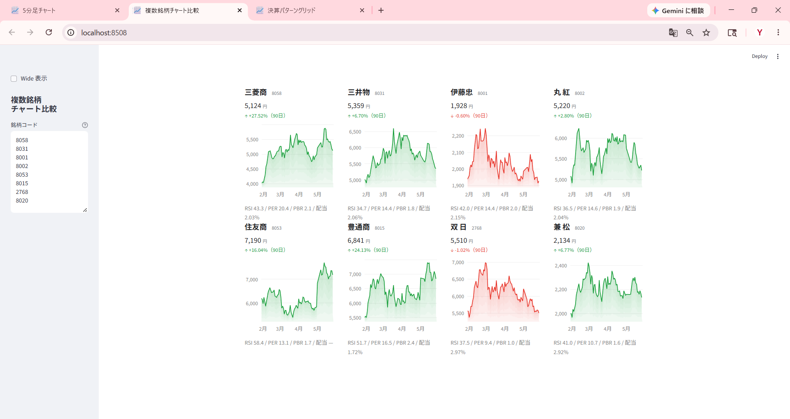
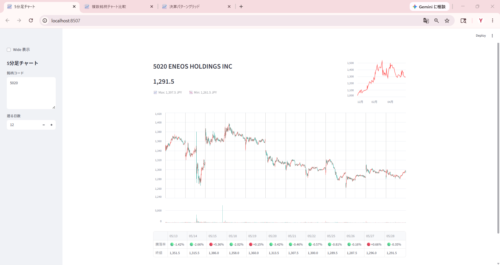

# Streamlit で作るチャート3種 ― 無料データをブラウザに表示する

{width="1280"}

連載01〜04 では「コンセンサスデータ」「株価」「決算発表日時」を使って銘柄を分析してきました。本記事はおまけ回として、これらのデータをどこから取得し、どうやって Streamlit でブラウザに表示するか ― 連載01-04 の付録 Streamlit アプリより一歩踏み込んだ **3つの最小構成サンプル** を紹介します。

<!-- more -->


## このおまけ回について

連載01-04 を読み進めるうえで、読者の皆さんから次のような声をいただきました。

- 「証券会社が無料で提供している CSV ってどうやって取得するの？」
- 「TDnet の決算発表日時はどこから？」
- 「Streamlit のアプリは紹介されているけど、もう一歩自分で改造する取っ掛かりが欲しい」

本記事ではフェーズ1（連載01-04）で使ってきたデータの **取り方** をまとめ、それを使った **3つのチャートアプリ** をサンプル提示します。

| アプリ | 用途 | 主要技術 |
|---|---|---|
| **Chart 1** | 5分足ローソク + 日足ライン（複数銘柄） | Altair / yfinance |
| **Chart 2** | 複数銘柄の指標 + 90日トレンド比較 | Plotly / yfinance + 無料コンセンサスデータ |
| **Chart 3** | 決算発表後の値動きをパターン分類 | Plotly / ローカル 5分足 + TDnet |

3アプリ共通で、サイドバーに **「Wide 表示」チェックボックス** を置いて、画面幅をブラウザサイズに応じて切り替えられるようにしています（デフォルトは Narrow、CSS 注入方式なので再読み込み不要）。


## データの取り方

### yfinance ― 株価（日足・5分足）

`pip install yfinance` で誰でも使える Yahoo! Finance ラッパーです。`{コード}.T` で東証銘柄を指定。

```python
import yfinance as yf
df = yf.download("5020.T", period="3mo", interval="1d", auto_adjust=True)
```

- **日足**: 長期データ可（10年以上）
- **5分足**: 直近 **約60日** が上限（古いデータは取れない）
- `auto_adjust=True` で株式分割を遡及調整（[連載でも既定方針](../../index.md)）
- 最新値だけ欲しい場合は `yf.Ticker("5020.T").fast_info.get("lastPrice")` が高速


### 証券会社の無料ツール ― 13指標 CSV

連載01-04 で「コンセンサスデータ」として使った13指標（EPS / BPS / 配当金 / ROE / ROA / EV/EBITDA / 業績予想修正率(予) / 経常利益変化率(予) など）は、証券会社が無料で提供する取引ツールの「銘柄情報シート」から CSV エクスポートできます。

- 例（楽天証券）: <https://www.rakuten-sec.co.jp/ITS/qaJ010102-001.html>
- 操作: 銘柄情報シート → 指標を選択 → 「CSV保存」
- 出力: `113_EPS実績.csv`、`213_EPS予想.csv` のように指標番号付きで保存される（連載01-02 の `RAKUNAV_SPECS` 参照）

> 💡 マネックス証券の「銘柄スカウター」、SBI証券、会社四季報なども、似た指標を CSV / 一覧で提供しています。本連載では楽天MS2 を採用していますが、同等指標が揃えば代替可能。


### TDnet ― 決算発表日時

東京証券取引所が運営する **適時開示情報** の公式サービスです。決算短信を含むすべての適時開示が日次で公開されます。

- 公式: <https://www.release.tdnet.info/>
- 取得: HTML スクレイピング（決算短信 PDF へのリンク + 発表日時）

本記事の Chart 3 で使うのは **発表日時だけ** なので、サンプル `earnings.csv`（`date, time, code` の3列）を同梱しました。本格的なスクレイピング実装と XBRL の取得・パースは **連載07 [EDINET/TDnet 取得とパース](07_edinet_tdnet_parse.md)** で詳説します。


## Chart 1: 5分足ローソク + 日足ライン

複数銘柄の **直近N営業日の5分足** をローソク足で並べ、右上に日足ラインを小さく添える ― 寄付・引け・場中の動きを **「窓開け」も含めて** 視覚的に確認するためのアプリです。

<small style="color: var(--md-link-color);"><i class="fa-solid fa-expand"></i> クリックで拡大できます</small>
<small style="color: var(--md-link-color);">2026.05.29作成</small>

{width="1200"}

- **縦の境界線**（朝寄り＝濃いめ、午後寄り＝薄め）でギャップアップ・ギャップダウンを視覚化
- 銘柄コードはカンマ・スペース・改行で区切って **複数銘柄入力**
- 当日の終値は `yf.Ticker.fast_info.lastPrice` で上書き（5分足の末尾と公式引け値のズレを補正）

> 💡 5分足は **直近60日** しか取得できない制約があるので、長期の振り返りには向かない。あくまで「最近の動き」を細かく見る用途。


## Chart 2: 複数銘柄チャート比較（4列カードグリッド）

連載02 の「マルチファクター・スコアボード」の **チャート版** とも言える比較アプリ。各銘柄をカード化して4列グリッドに並べ、ファンダ指標（PER/PBR/配当）とテクニカル（RSI）、そして90日チャートを **1画面で俯瞰** します。

<small style="color: var(--md-link-color);"><i class="fa-solid fa-expand"></i> クリックで拡大できます</small>
<small style="color: var(--md-link-color);">2026.05.29作成</small>

{width="1200"}

- 各カード: **銘柄名 / 価格 / 90日期間騰落率 / エリア塗りチャート / RSI・PER・PBR・配当 1行**
- 線・塗りの色は **90日期間騰落率** で統一（上昇=緑、下落=赤）
- PER / PBR / 配当は無料コンセンサスデータ CSV から、RSI は yfinance 日足から自前計算（Wilder RSI(14)）

> 💡 連載02 はファクター採点に **数値の高低** を出すのに対し、Chart 2 は **チャート形状の比較** を1画面で見るための補助ツール。総合商社など同セクター複数銘柄を並べると、トレンドの揃い具合が一目で分かる。


## Chart 3: 決算パターングリッド（5分足）

決算発表後の値動きを **5パターン**（🟢上げ📈 / 逆V字 / 無風 / V字 / 🔴下げ💀）に自動分類し、各銘柄の5分足エリアチャートを並べるアプリです。

- **初日リターン**: 発表前 Close → 発表後初日 Close
    - 引け後発表（≥15:00）: 発表当日 Close → 翌営業日 Close
    - 場中・寄り前発表: 前営業日 Close → 発表当日 Close
- **最終リターン**: 発表後初日 Close → +5営業日後の Close
- 閾値: `|初日| ≤ 2%` / `|最終| ≤ 3%` を「横ばい(flat)」、外れたら方向に応じて(up/down)

<small style="color: var(--md-link-color);"><i class="fa-solid fa-expand"></i> クリックで拡大できます</small>
<small style="color: var(--md-link-color);">2026.05.29作成</small>

{width="1200"}

- 各カード: **銘柄名 / パターンラベル / 発表日時 / 5分足エリアチャート + 発表時刻に縦点線**
- チャート色は **グレー固定**（線の方向はラベルで示すため、視覚的混乱を回避）
- 下部 expander に全銘柄一覧テーブル（初日%・最終%・パターン）

> 💡 5分足のローカル保存は前提だが、それさえあれば「**発表時刻直前の最後の足** → **発表直後の最初の足**」が綺麗に見え、寄付ギャップや場中発表の瞬間が体感できる。連載13 [CARイベントスタディ](13_car_event_study.md) は同じ素材を **大量に集計** したもの、こちらは **1銘柄ずつ目で見る** アプローチ。


## まとめ

- 連載01-04 で使った **yfinance / 無料コンセンサスデータ / TDnet** の出所と入手方法を1か所にまとめた
- Streamlit + Altair / Plotly で **3つの最小構成チャートアプリ** を実装：
    - Chart 1: 5分足ローソク + 日足ライン（複数銘柄）
    - Chart 2: 複数銘柄カードグリッド（指標 + 90日トレンド）
    - Chart 3: 決算後5パターン分類グリッド
- 3アプリ共通で **Wide / Narrow 切替**、CSS 注入方式で再読み込み不要

これでフェーズ1（コンセンサスデータ分析）の **データ取り方** とそれを **ブラウザで見るテンプレ** が揃いました。次回 [連載06 XBRL とは何か](06_what_is_xbrl.md) から、決算短信そのものを **読み解く側** に踏み込みます。


## Appendix ― Python コード <i class="fa-brands fa-github"></i>

本記事のチャート3アプリは、すべて **GitHub に公開**しています。yfinance のみで完結する Chart 1 はそのまま動きますが、Chart 2 は無料コンセンサスデータ CSV、Chart 3 はローカル 5分足 parquet が前提です。

> <i class="fa-brands fa-github"></i> **リポジトリ** [`github.com/minnanosaiban/blog/05_charts`](https://github.com/minnanosaiban/blog/tree/main/05_charts)

#### Chart 1 ― 5分足チャート（app1.py）

`yfinance` だけで動く最も依存の少ないアプリ。**Python 1 ファイル・約 250 行**。複数銘柄入力、縦境界線でギャップ表示、当日値補正まで含めて Altair で実装。

> 🔗 [`github.com/minnanosaiban/blog/05_charts/app1.py`](https://github.com/minnanosaiban/blog/blob/main/05_charts/app1.py)


#### Chart 2 ― 複数銘柄チャート比較（app2.py）

無料コンセンサスデータ CSV を読み、4列カードグリッドで指標+チャートを並列表示。**Python 1 ファイル・約 250 行**。エリア塗りグラデーションは Plotly の `fill="tonexty"` を多段重ねで実装、RSI は Wilder 方式（EWMA）。

> 🔗 [`github.com/minnanosaiban/blog/05_charts/app2.py`](https://github.com/minnanosaiban/blog/blob/main/05_charts/app2.py)


#### Chart 3 ― 決算パターングリッド（app3.py + earnings.csv）

ローカル保存の 5分足 parquet と同梱 `earnings.csv` を組み合わせて、発表後の値動きを5パターン分類。**Python 1 ファイル・約 270 行**。パターン分類ロジックはインラインで完結。

> 🔗 [`github.com/minnanosaiban/blog/05_charts/app3.py`](https://github.com/minnanosaiban/blog/blob/main/05_charts/app3.py)

株価や指標は提供元の利用規約により再配布できませんが、**yfinance** や **証券会社が無料で提供する銘柄情報シート CSV** を組み合わせれば、ご自身の銘柄リストで同じ画面を再現できます。

---

*データ出典: yfinance 日足・5分足 / 証券会社が無料で提供する銘柄情報シート CSV / TDnet 適時開示（決算発表日時のみ）*
