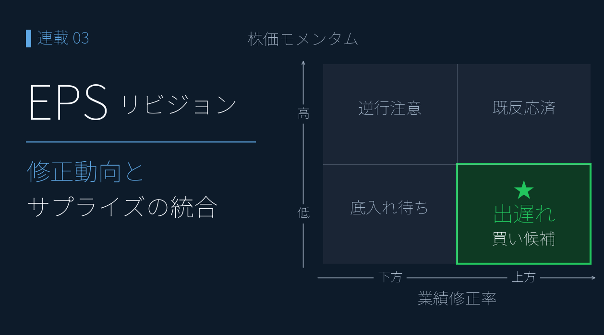
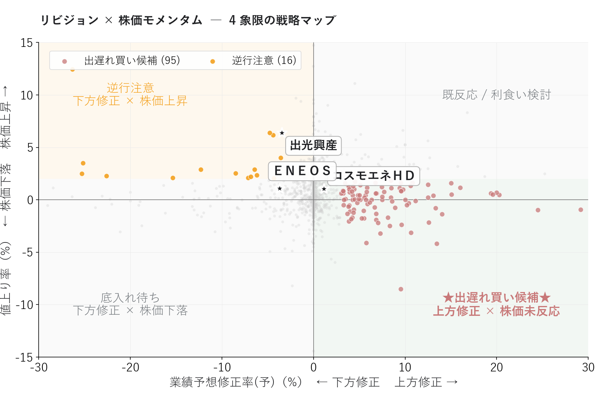
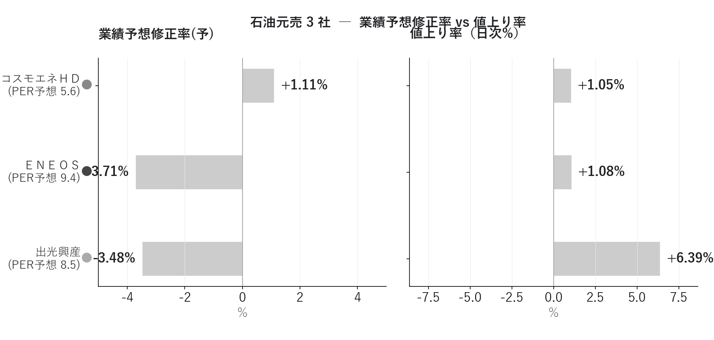

# EPS リビジョン・モメンタムで「出遅れ買い候補」を発掘する ― アナリスト予想と株価のズレを読む

{width="1280"}

「業績が上方修正されたのに株価がまだ動いていない」 ― これは個人投資家にとって最も明快な **情報の織り込み遅れによるエッジ** です。

連載05 の [マルチファクタースコアボード](05_multifactor_scoreboard.md) では、コスモエネＨＤ が **Consensus 68 / Sentiment 22** という「ファンダ良いのに需給冷えた」乖離状態にあることが分かりました。本記事ではその乖離を **業績予想修正率（リビジョン）× 株価モメンタム** の時系列軸で捉え直し、機関投資家が長年使ってきた **EPS Revision Momentum 戦略** を個人投資家でも実装できる形に落とし込みます。

<!-- more -->

## EPS リビジョン・モメンタムの概要

連載04・05 のスナップショット分析の弱点は、**指標が「変化した瞬間」を捉えられない**ことです。PER / ROE のような**水準**指標は「今の状態」しか分かりませんが、**業績予想修正率**（コンセンサス予想 **経常利益** の前回値からの改定幅%）は **アナリストの見立てがどう変わったか** を直接示し、企業業績の "変化" を最も早く伝えます。

学術的にも、アナリスト予想が上方修正された銘柄はその後 1〜3 ヶ月にわたって超過リターンを生むこと（Chan, Jegadeesh, Lakonishok 1996）、その効果は時価総額や業種を超えて頑健なこと（Bernhardt & Campello 2007）が実証されています。アナリストが見立てを変えるのは企業との対話・業界動向を踏まえた結果であり、その情報が株価に織り込まれるまでの時間差が **個人投資家にとっての機会** になります。

業績予想修正率（X 軸）と株価モメンタム（Y 軸、値上り率）で個別銘柄を **4 象限分類** すると、行動可能なゾーンが見えます。

|                      | **下方修正** （修正率 −） | **上方修正** （修正率 +） |
| :------------------: | :-----------------: | :-----------------: |
| **株価上昇 （値上り率 +）** |     🚨  逆行注意     |    💨 既に反応済み     |
| **株価下落 （値上り率 −）** |     ⏳ 底入れ待ち      |   🎯  出遅れ買い候補    |

注目すべきは右下の **「出遅れ買い候補」**（上方修正済みだが市場の注目がまだ向いていない情報の織り込み遅れ）と、左上の **「逆行注意」**（業績下方修正に株価が追従していない、次の決算で楽観が崩れるリスク）の 2 象限です。

しきい値は **修正率 ±3%・値上り率 ±2%**（ノイズと信号を分ける経験則）、修正済み割安候補は追加で **PER（予想）≤ 15**。

## プロットで確認

リビジョン × モメンタムは、**業績予想修正率（横軸）× 値上り率（縦軸）の散布図**でプロットします。先ほどの 4 象限がそのまま 2 軸として再現され、銘柄の位置が一目で分かります。

時価総額 100 億円以上・ROE 5% 以上にフィルタした 1,965 銘柄について、4 象限分類すると（散布図の表示範囲内で）**出遅れ買い候補が 90 銘柄、逆行注意が 28 銘柄**。

<small style="color: var(--md-link-color);"><i class="fa-solid fa-expand"></i> クリックで拡大できます</small>
<small style="color: var(--md-link-color);">2026.05.31作成</small>

{width="1200"}

出遅れ買い候補 Top の銘柄（修正率上位、散布図表示範囲 ±30% 以内）:

| 銘柄            | 修正率    | 値上り率  | PER予想 | ROE       |
| ------------- | ------ | ----- | ----- | --------- |
| ＫｅｅＰｅｒ技（6036） | +39.1% | +1.1% | 7.7   | **30.1%** |
| スマレジ（4431）    | +36.4% | -1.5% | 21.9  | 21.4%     |
| 三洋貿易（3176）    | +29.2% | +1.6% | 9.2   | 9.3%      |
| フリー（4478）     | +25.2% | +1.8% | 111.1 | 7.6%      |
| やまみ（2820）     | +24.5% | -0.9% | 18.3  | 15.1%     |
| アカツキ（3932）    | +20.3% | -0.9% | 8.0   | 13.1%     |

特に **ＫｅｅＰｅｒ技** は修正率 +39% / 値上り率 +1.1% / ROE 30% / PER 7.7 という、本記事の **3 条件（リビジョン × モメンタム × バリュエーション）が綺麗に揃った理想的な銘柄**です。

> 💡 上方修正 × 株価未反応の銘柄は、市場の注目が向く前の **時間差のエッジ**。ただし修正の "中身"（本業か、会計要因か）を必ず確認する。

## 石油元売 3 社比較

ここまで連載04・05 と追ってきた石油元売 3 社をリビジョン視点で再評価すると、**連載04・05 と役者が逆転している兆し** が読み取れます。連載04・05 で「GARP 圏外なのに +29.7% 上昇していた」ＥＮＥＯＳ・出光は、直近の **コンセンサス予想経常利益**（会社発表の修正ではなく、アナリスト予想の集計値）が前回値から **▲3.71% / ▲3.48% に下方シフト**、株価も下落に転じている一方、コスモエネＨＤ は +1.11% の小幅上振れで横ばい ― 4 象限マップで言えば ＥＮＥＯＳ・出光は「底入れ待ち」ゾーンに移行しつつあります。

| 連載                | コスモ                                            | ＥＮＥＯＳ                              | 出光                              |
| ----------------- | ---------------------------------------------- | ----------------------------------- | ------------------------------- |
| 連載04 PEG×ROE  | 理想ゾーン 値上り率 −5.2%                            | バリュー候補 値上り率 +29.7%              | 惜しい位置 値上り率 +17.6%            |
| 連載05 マルチファクター | Consensus 68 Sentiment 22（乖離）               | Value 70 Quality 32              | 中庸                              |
| 連載06 リビジョン     | 修正率 **+1.11%**（上振れ）                            | 修正率 **−3.71%**（下振れ）                | 修正率 **−3.48%**（下振れ）             |

<small style="color: var(--md-link-color);"><i class="fa-solid fa-expand"></i> クリックで拡大できます</small>
<small style="color: var(--md-link-color);">2026.05.31作成</small>

{width="1200"}

| 銘柄 | 業績予想修正率 | 値上り率 | PER予想 | 解釈 |
| ----------- | ---------- | ------ | ----- | -------------------- |
| **コスモエネＨＤ** | **+1.11%** | +0.03% | 5.5   | 微上振れ、横ばい |
| **ＥＮＥＯＳ** | **−3.71%** | −0.57% | 9.4   | **コンセンサス下振れかつ株価も軟化** |
| **出光興産** | **−3.48%** | −1.04% | 8.1   | **コンセンサス下振れかつ株価も軟化** |

**ＥＮＥＯＳ 関係者・株主にとっての示唆**:

- 連載05 で観察された Consensus 22（低）／ Sentiment 57（中庸）の組み合わせは、本記事のリビジョン −3.71% に直接つながっている
- 「ROE 8.0% でも +29.7% 上昇できた」のは、業績改善期待への先回り買いだった可能性が高い
- 現在は **「コンセンサスの下振れが株価に織り込まれるプロセス」** が進行中 ― 底入れ待ちゾーンに入りつつある。ただし 2025/3 の会社発表下方修正の主因は **のれん減損（非現金）・在庫影響（油価連動）** であり、本業実態とコンセンサス値の方向感が分かれる局面（詳細は[連載04](04_garp_peg_roe.md)参照）
- 一方コスモエネＨＤ は連載05 で Value 92 / Consensus 68 と高評価、本記事の +1.11% 上振れもそれを裏付ける。**遅れて見直し買いが入る局面が来る可能性**

これがリビジョン・モメンタムの価値です。**水準（連載05 のスコア）と変化（本記事のリビジョン）が同じ方向を指したとき、シグナルの信頼性は最大** になります。

## まとめ

- 業績予想修正率は **アナリストの見立ての "変化"** を最も早く伝える指標で、PER / ROE 等の "水準" 指標を補完する
- **散布図が標準的な可視化**。横軸=修正率 × 縦軸=値上り率の 2 軸で 4 象限分類すると、出遅れ買い候補 / 逆行注意 / 既反応済 / 底入れ待ち がワンビューで分かる
- 4 象限マップで **出遅れ買い 90 / 逆行注意 28 / 修正済み割安 66** を抽出 ― 個別銘柄を絞り込める
- 連載04・05 で +29.7% 上昇していた **ＥＮＥＯＳ / 出光は、直近のコンセンサス予想経常利益が ▲3.71% / ▲3.48% 下振れ**（会社発表ではなくコンセンサス）。4 象限マップでは「底入れ待ち」ゾーンへ移行中、一方コスモエネＨＤ は +1.11% の小幅上振れで横ばい
- ＥＮＥＯＳ ▲3.71% は **コンセンサス予想経常利益基準**であり、基準次第で ▲94% 〜 +4.76% に分散する（連載04 4 基準試算）

次回は **連続サプライズ・スコアボード** を実装します。本記事の「データ蓄積戦略」を発展させ、業績予想修正率・EPS 予想超過率・経常利益成長予想を時系列で合成し、業績モメンタムが本物の銘柄を発掘します。

## <i class="fa-brands fa-github"></i> Python コード

本記事のチャート画像・アプリ・データ取得・成形スクリプトは、すべて **GitHub に公開**しています。データは提供元の利用規約により再配布できませんが、データを各自取得すれば、本連載と同じものが再現できます（動かし方はリポジトリの README 参照）。

> [github.com/minnanosaiban/blog/06_eps_revision](https://github.com/minnanosaiban/blog/tree/main/06_eps_revision)

#### 📈 Streamlit アプリ ― 業績修正と株価の "ズレ" をブラウザで追跡

業績予想修正率 × 値上り率 の 4 象限マトリクスをブラウザで確認できます。「修正はポジティブなのに株価が動いていない」出遅れ買い候補を対話的に絞り込めます。

<small style="color: var(--md-link-color);"><i class="fa-solid fa-expand"></i> クリックで拡大できます</small>

{width="1200"}

---

*データ出典: 証券会社が無料で提供する銘柄情報サービスから取得した CSV 4 指標（業績予想修正率(予想) / EPS(予想) / ROE / 時価総額） + yfinance 日足 Close / Volume*
