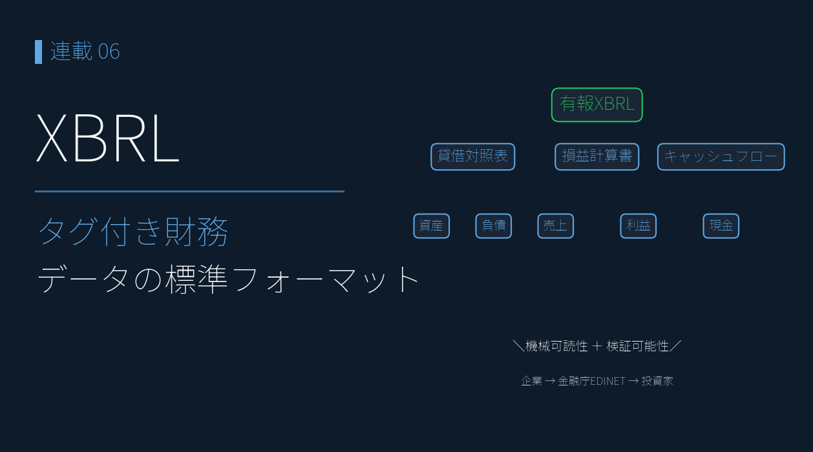
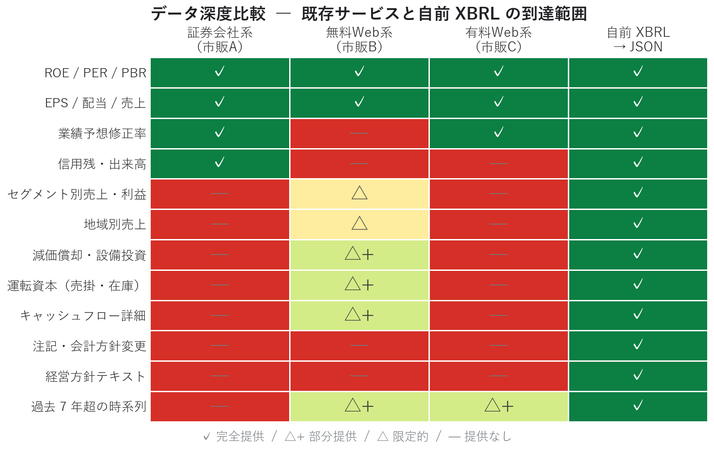
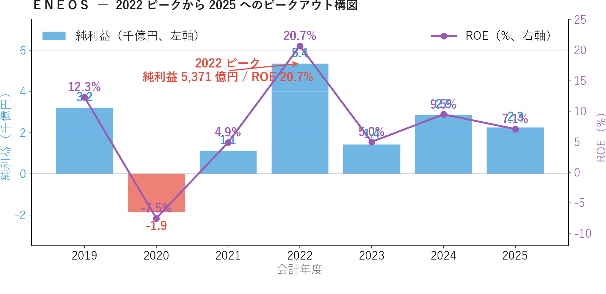
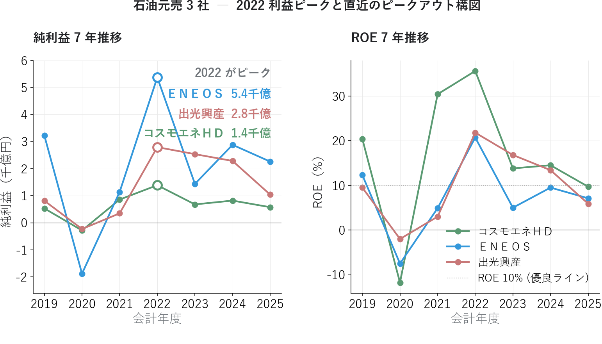
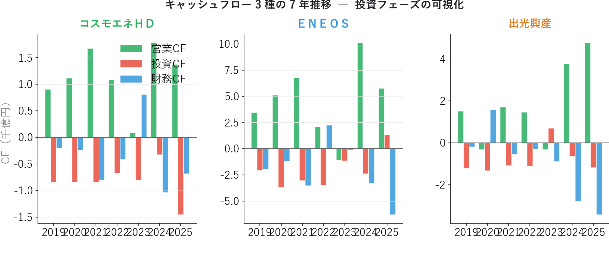
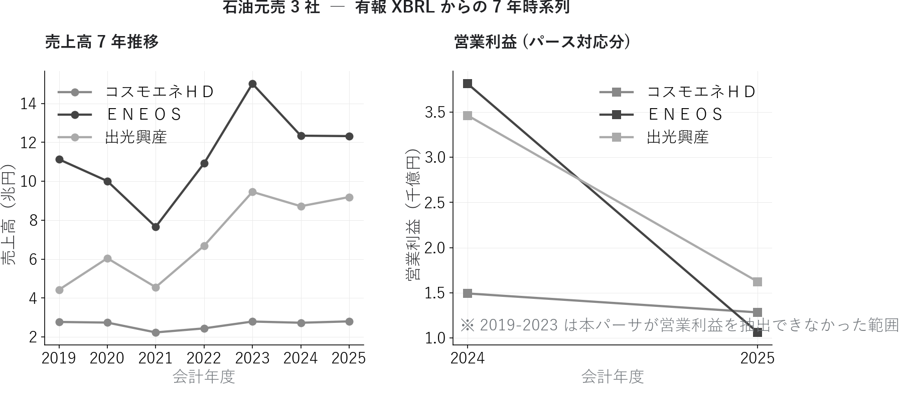

# XBRL とは何か ― 無料で取れるデータでは届かない「決算書そのもの」に手を伸ばす

{width="1280"}

連載01〜04 では、証券会社が無料で提供する銘柄情報サービスから取れる **集計済み数値** だけで業績軸（PEG / マルチファクター / リビジョン / サプライズ）を組み立ててきました。しかしそこには明確な限界があります。

**ＥＮＥＯＳ の純利益は 2022 年に 5,371 億円のピークを付け、ROE 20.7% を記録**。しかし 2025 年は純利益 2,261 億円・ROE 7.1% まで縮小しています。

ただし 2022 は **ウクライナ侵攻による原油急騰で在庫評価益が大きく膨張した特殊年** であり、また 2025 にも **のれん減損などの一時要因が含まれます**。比較基準と一時要因の解釈は、有報 XBRL を取って **自分で組み立てる** ことで初めて見えてきます。

これは連載01〜04 のスナップショットには映りません。同じ会社の **7 年間の構造的なピークアウト** は、無料で取れるデータの枠を超えた **有価証券報告書 XBRL** からしか取り出せません。

本記事ではフェーズ 2 の入口として、XBRL とは何か、なぜ個人投資家でも XBRL を扱う必要があるのかを、ＥＮＥＯＳ・出光・コスモエネＨＤ の 7 年実データで示します。

<!-- more -->

---

## XBRL の概要

### フェーズ 1（連載01〜04）の限界

連載01〜04 は強力なフレームワークでしたが、本質的に **スナップショット分析** です。証券会社が無料で提供するデータは「直近時点の集計済み数値」を提供してくれますが、以下のような情報には届きません。

| 種類 | 例 | 無料で取れるデータで取れるか |
|---|---|---|
| **過去 7 年超の時系列** | ＥＮＥＯＳ の純利益が 2022 → 2025 で半減 | △（直近 3〜5 年が限界） |
| **セグメント別売上・利益** | この会社は何で儲けているのか | ✗ |
| **キャッシュフロー詳細** | 営業 CF / 投資 CF / 財務 CF の内訳 | △（合計値のみ） |
| **減価償却・設備投資の絶対額** | フリーキャッシュフロー計算 | ✗ |
| **運転資本（売掛・在庫・買掛）** | 運転資本サイクルの分析 | ✗ |
| **経営方針・見通しテキスト** | 中期計画の方向性 | ✗ |
| **会計方針変更・注記** | 会計品質・利益操作の検知 | ✗ |

これらが見えないまま投資判断するのは「ファンダメンタル分析」とは呼べません。地図なしで山を登るようなものです。

### XBRL とは ― タグ付きの XML

**XBRL（eXtensible Business Reporting Language）** は、決算データを機械可読にした XML 規格です。

| 項目 | 内容 |
|---|---|
| 正式名称 | eXtensible Business Reporting Language |
| 規格策定 | XBRL International（非営利団体） |
| 日本での導入 | 2008 年〜（金融庁が EDINET で採用） |
| 採用国 | 米国 SEC、欧州 ESMA、日本など 60 カ国以上 |
| 基本構造 | タグ付きの XML。要素（element）と文脈（context）で意味を表現 |
| タクソノミ | 要素の定義集。日本では金融庁が公開（業種別あり） |

決算短信や有価証券報告書には、人間向けの PDF と並んで **必ず XBRL ファイル** が同時提出されています。PDF は OCR が必要で誤読が頻発しますが、XBRL なら **タグごとに値を直接取り出せる** ため、機械処理に向いています。

### EDINET と TDnet の使い分け

XBRL は主に 2 つの経路で入手できます。

| 経路 | 種類 | 提供期間 | 速報性 | アクセス |
|---|---|---|---|---|
| **EDINET** | 有価証券報告書・四半期報告書 | 過去 5〜7 年が公開 | 報告書なので遅い | 公式 API（OAuth 不要） |
| **TDnet** | 決算短信・適時開示 | 直近のみ | **発表直後** | API なし、スクレイピング |

EDINET は **金融庁公式** で、長期時系列の業績分析に向きます。TDnet は **取引所** が運営し、決算発表 **直後** の数値を即座に取り出せます。連載04 で扱った業績モメンタムや連載03 のリビジョンは、本質的には TDnet 由来のデータです。

### 既存サービスとの位置づけ

証券会社が無料で提供するデータと自前 XBRL を比較すると、データ深度の階段が見えます。

{width="1200"}

| サービス | データ深度 | 時系列 | カスタム分析 | 価格 |
|---|---|---|---|---|
| 証券会社系（A） | △ 集計済み | △ 直近 | ✗ 不可 | 無料 |
| 無料 Web 系（B） | ○ 中程度 | ○ 数年 | ✗ 不可 | 無料 |
| 有料 Web 系（C） | ○ 中程度 | ○ 数年 | △ 限定 | 有料 |
| **自前 XBRL → JSON** | ◎ 完全 | ◎ 全期間 | ◎ 自由 | 無料（手間あり） |

「無料」と書いた自前構築には **データ取得スクリプトの実装** と **XBRL の理解** という参入障壁がありますが、一度作ってしまえば永続的に使えます。

### 本記事における XBRL の取り扱い

本連載では XBRL を直接 XML で扱うのではなく、**JSON に正規化したスキーマ** で扱います。

```
data/yuho/                        ← 有価証券報告書（EDINET 由来）
└── E24050/                       ← EDINET コード（=ＥＮＥＯＳ）
    ├── E24050_2019-03-31.json    ← 1 期 1 ファイル
    ├── E24050_2020-03-31.json
    └── ... 2025-03-31 まで 7 期分

data/statements/                  ← 決算短信（TDnet 由来）
├── 7203_2025-03-31_FY.json       ← {コード}_{決算期末}_{種別}.json
├── 6758_2025-03-31_FY.json
└── ... 1,368 ファイル
```

JSON のセクション構成は以下のとおりです。これを採用することで、XBRL の複雑なタクソノミから解放され、Python の `json.load` だけで業績分析できます。

```json
{
  "metadata":     { "code": "5020", "fiscal_year_end": "2025-03-31", ... },
  "financials":   { "net_sales": ..., "operating_income": ..., "roe": ..., ... },
  "segments":     [ { "label": "燃料油", "net_sales": ..., "operating_income": ... }, ... ],
  "_source":      { "format": "xbrl", "file": "...", "parser_version": "..." }
}
```

XBRL → JSON への変換実装は次回連載07 で詳述します。本記事は **「変換後の JSON で何が見えるか」** に焦点を当てます。

---

## 分析で分かったこと

ＥＮＥＯＳ・出光・コスモエネＨＤ の有報 7 期分（2019-2025 年）を JSON 化し、業績の長期トレンドを取り出しました。

### ＥＮＥＯＳ ― 2022 ピークから 2025 へのピークアウト構図

{width="1200"}

ＥＮＥＯＳ の 7 年純利益と ROE を並べると、極めて明瞭な **山型** が浮かびます。

| 年度 | 純利益（億円） | ROE | 解釈 |
|---|---|---|---|
| 2019 | 3,223 | 12.3% | コロナ前の安定水準 |
| 2020 | **−1,879** | **−7.5%** | コロナ・原油急落で赤字 |
| 2021 | 1,140 | 4.9% | 回復途上 |
| **2022** | **5,371** | **20.7%** | ★ピーク（ウクライナ侵攻による原油急騰で在庫評価益膨張） |
| 2023 | 1,438 | 5.0% | 急減（特需消失） |
| 2024 | 2,881 | 9.5% | 部分回復 |
| 2025 | 2,261 | 7.1% | 再び低下 |

2022 年の純利益 **5,371 億円・ROE 20.7%** は、ウクライナ侵攻による原油急騰で全石油元売が記録した **特需**（在庫評価益が大きく膨張）によるもの。それ以降は段階的に水準が下がり、2025 年は純利益 2,261 億円・ROE 7.1% で **ピーク比 −58%** まで縮小しています。

なお比較基準を **2019 年（純利益 3,223 億円・ROE 12.3%）= コロナ前の平常期** に置くと、2025 は −30% 程度で「ピーク比」より穏やかな比較になります。さらに 2025 の純利益は **のれん減損 ▲1,600 億・在庫影響 ▲1,500 億** という一時／構造要因を含むため、ENEOS自身は「実質営業利益 4,400 億円維持」と主張しています（4 基準試算は <a href="01_garp_peg_roe.md">連載01</a> 参照）。

連載01〜04 で観察したサインがここで全部裏付けられます。

| 連載 | ＥＮＥＯＳ のシグナル | 有報 XBRL での解釈 |
|---|---|---|
| 02 | Consensus 13（最下位） | 2022 ピーク後の業績低迷を市場は既に織り込み済み |
| 03 | 修正率 −3.71%（下方修正） | 2024 → 2025 で再低下のアナリスト調整 |
| 04 | 経常変化率(予想) **−0.6%**（わずかに減益） | ピークアウト構図の継続 |

つまり連載01〜04 で示した警戒シグナルは、**7 年スパンで見れば 2022 ピークの記憶 vs 業績の構造的低下** という対比軸として再解釈できます。アナリストは「構造的低下」を、個人投資家は「2022 の戻り or 一時要因の剥落後の本業実態 (4,400 億ライン)」を見ている、と読むこともできます。どちらが正しいかは有報 XBRL × 連載01 の 4 基準試算で前期比較するまで断定できません。

### 石油元売 3 社の 7 年比較 ― 純利益と ROE

ＥＮＥＯＳ 単独の構図を、3 社で比較すると違いが明確になります。

{width="1200"}

3 社とも **2022 ピーク → 2025 半減** という共通のサイクルを辿っていますが、レベル感は大きく違います。

| 銘柄 | 2022 ROE | 2025 ROE | 7 年平均 ROE（NaN除外） |
|---|---|---|---|
| **コスモエネＨＤ** | **35.6%** | 9.7% | 約 18%（全期間で高水準） |
| 出光興産 | 21.8% | 5.9% | 約 10% |
| ＥＮＥＯＳ | 20.7% | 7.1% | 約 7%（赤字年込み） |

コスモエネＨＤ は **規模は小さいが資本効率が突出して高い**。2022 ピークでは ROE 35.6%、低水準の年でも他 2 社より高い ROE を維持しています。連載01〜04 でコスモが概ね良好評価を得ていたのは（連載04 は経常データ欠損を除きポジティブ）、有報レベルでは **そもそも資本効率が違う** ことが背景にあります。

ＥＮＥＯＳ は **規模で他 2 社を圧倒**（売上 12 兆円 vs 出光 9 兆円 vs コスモ 2.8 兆円）しますが、**赤字年（2020）を含む 7 年平均で ROE は他社より低い**。連載01 の「バリュー候補だが低収益」が、有報 7 年でも一貫した事実だと裏付けられます。

### キャッシュフローで見る投資フェーズ

純利益だけでは見えない事業フェーズの違いが、CF 3 種で浮かびます。

{width="1200"}

3 社とも 2025 年に **財務 CF が大きくマイナス**（=借入返済・自社株買い・配当などの株主還元）になっています。これは「2022 ピークで稼いだ現金を株主に還元するフェーズ」に入ったサインです。

特に **ＥＮＥＯＳ の 2025 年は財務 CF −6,304 億円**（前年比約 2 倍の流出）と突出。一方で営業 CF 5,768 億円が稼げているため、財務的に追い込まれての借入返済ではなく、**手元現金を株主に返す積極的な姿勢** の表れと読めます。配当性向や自社株買いペースの分析は、本連載のフェーズ 3 以降（連載10 アクルーアル、11 三角検証など）で深掘りします。

### 売上は安定、営業利益が情報源 ― パーサーの現実

{width="1200"}

売上高の 7 年推移は綺麗にトレースできますが、**営業利益は 2024-2025 の 2 年分しかパースできていません**。これは現在の有報 XBRL パーサーが、IFRS 連結ベースの営業利益を抽出できる範囲に限界があるためです。

XBRL の構造はタクソノミ・会計基準（JP / IFRS / US）・連結/個別の組み合わせで複雑になり、**パーサー側の対応度** が課題になります。本連載のフェーズ 2 後半（連載08 スキーマ設計、連載11 三角検証）で、このパース品質の改善方法を扱います。

### 連載01〜05 で「届かなかったもの」のまとめ

有報 XBRL からの 7 年時系列が出てきたことで、連載01〜05 のスナップショットでは見えなかった以下が明らかになりました。

1. **業績ピークの絶対位置**（ＥＮＥＯＳ 2022 = 純利益 5,371 億円・ROE 20.7%）
2. **ピークからの低下幅と速度**（3 年で純利益半減・ROE 1/3）
3. **3 社の構造的な資本効率差**（コスモ > 出光 > ＥＮＥＯＳ）
4. **キャッシュフローの構造変化**（2025 年に株主還元フェーズへ）
5. **赤字年の存在**（ＥＮＥＯＳ 2020 = 純利益 −1,879 億円）

これらはすべて、**「自前で XBRL → JSON 化する」という 1 つのステップを越えるだけ** で手に入る情報です。

ただし、**ENEOS が主張する「実質営業利益 4,400 億円」「ROE 7.9%」のような会社独自の組替え指標は、XBRL の標準勘定には含まれません**。これらを XBRL 要素データ（のれん減損・在庫影響・非継続事業損益）から再構築する作業は、連載08 のスキーマ設計で扱います。**XBRL は万能ではなく、企業独自の主張を裏付ける／反証するための "再構築の土台"** と位置づけるのが正確です。


---

## XBRL → JSON 変換の方針

具体的な実装は次回連載07 で詳述します。ここでは方針だけ紹介します。

### 1. XBRL の構造

XBRL ファイルは、要素（タグ）と文脈（context）の 2 軸で値を表現します。

```xml
<jpcrp_cor:Revenue contextRef="CurrentYearConsolidatedDuration" unitRef="JPY" decimals="-6">
  12322494000000
</jpcrp_cor:Revenue>
```

- `jpcrp_cor:Revenue` = タクソノミ要素（売上高）
- `contextRef="CurrentYearConsolidatedDuration"` = 当期連結期間
- `unitRef="JPY"` = 通貨単位
- 値 = 12,322,494,000,000（円） = 約 12.3 兆円

### 2. JSON への正規化スキーマ

複雑な XBRL を、扱いやすい辞書構造に正規化します。

```python
{
    "metadata": {
        "edinet_code": "E24050",
        "sec_code": "5020",
        "company_name": "ＥＮＥＯＳホールディングス株式会社",
        "fiscal_year_end": "2025-03-31",
        "accounting_standard": "IFRS",
        "is_consolidated": True
    },
    "financials": {
        "net_sales": 12322494000000,
        "operating_income": 106093000000,
        "net_income": 226071000000,
        "roe": 0.071,
        "operating_cf": 576835000000,
        "investing_cf": 130765000000,
        "financing_cf": -630414000000,
        # ... 約 40 項目
    },
    "segments": [
        { "label": "燃料油", "net_sales": ..., "operating_income": ... },
        ...
    ]
}
```

### 3. パース戦略

XBRL を JSON に正規化する主要ライブラリと、本連載でのアプローチを比較します。

| ライブラリ | 学習コスト | カスタマイズ性 | 速度 | 本連載での利用 |
|---|---|---|---|---|
| `arelle` | 高（XBRL 全機能対応） | ○ | △ | 参考のみ |
| `python-xbrl` | 中 | △ | △ | 不採用 |
| **lxml + 自前マッピング** | 低 | ◎ | ○ | **連載07 で採用** |

XBRL の全機能を扱う `arelle` は強力ですが、本連載では「日本企業の業績指標を扱う」という限定された用途なので、**lxml で必要なタグを抜き、自前で正規化する** アプローチが効率的です。

---

## Python コードの紹介

XBRL → JSON 化後のデータを扱う基本コードを紹介します。XBRL のパース実装そのものは次回連載07 で詳述します。

### 有報 JSON の読み込みと 7 年時系列化

```python
import json
from pathlib import Path
import pandas as pd

def load_yuho_timeseries(edinet_code: str, root: Path = Path("data/yuho")) -> pd.DataFrame:
    """有報 JSON を 7 期分まとめて時系列 DataFrame にする。"""
    rows = []
    for f in sorted((root / edinet_code).glob("*.json")):
        with open(f, encoding="utf-8") as fp:
            d = json.load(fp)
        meta = d.get("metadata", {})
        fin = d.get("financials", {}) or {}
        rows.append({
            "fy": meta.get("fiscal_year_end", "")[:4],
            "net_sales": fin.get("net_sales"),
            "operating_income": fin.get("operating_income"),
            "net_income": fin.get("net_income"),
            "roe": fin.get("roe"),
            "op_cf": fin.get("operating_cf"),
            "inv_cf": fin.get("investing_cf"),
            "fin_cf": fin.get("financing_cf"),
        })
    return pd.DataFrame(rows)


# ＥＮＥＯＳ（E24050）の 7 年時系列
df_eneos = load_yuho_timeseries("E24050")
print(df_eneos)
```

### セグメント情報の取り出し

```python
def load_segments(edinet_code: str,
                  fy_end: str,
                  root: Path = Path("data/yuho")) -> pd.DataFrame:
    """有報 JSON から特定年度のセグメント情報を DataFrame にする。"""
    f = root / edinet_code / f"{edinet_code}_{fy_end}.json"
    with open(f, encoding="utf-8") as fp:
        d = json.load(fp)
    seg = d.get("segments", [])
    if isinstance(seg, dict):
        seg = seg.get("current", [])
    return pd.DataFrame(seg)
```

### 決算短信 JSON のスキャン

決算短信（TDnet 由来）は 1 社 1 ファイルではなく **{コード}_{決算期末}_{種別}.json** 形式なので、ファイル名から自動分類できます。

```python
def scan_statements(root: Path = Path("data/statements")) -> pd.DataFrame:
    """statements/ 配下の JSON ファイルをスキャンしてカタログ化。"""
    rows = []
    for f in root.glob("*.json"):
        parts = f.stem.split("_")
        rows.append({
            "コード": parts[0],
            "決算期末": parts[1] if len(parts) > 1 else "",
            "種別": "_".join(parts[2:]) if len(parts) > 2 else "",
            "パス": str(f),
        })
    return pd.DataFrame(rows).sort_values(["コード", "決算期末"], ascending=[True, False])
```

---

## まとめ

- 連載01〜04 で扱った証券会社が無料で提供するデータは **集計済みのスナップショット** で、過去 7 年の業績トレンド・セグメント情報・CF 詳細などには届かない
- **XBRL（タグ付き XML）** を自前で取得・パース・JSON 化すれば、機関投資家と同じ "決算書そのもの" の中身にアクセスできる
- 取得経路は 2 つ ―  **EDINET**（有報・四半期、長期時系列）と **TDnet**（決算短信、速報性）
- ＥＮＥＯＳ の有報 7 年データから、**2022 純利益 5,371 億円・ROE 20.7% のピーク → 2025 半減（純利 2,261 億円・ROE 7.1%）** という構造的なピークアウトが明確に
- 連載01〜04 までの警戒シグナル（下方修正・経常変化マイナス）は、有報 7 年で **「2022 の良かった頃に戻る期待」と「業績低下の現実」のギャップ** として説明できる
- 3 社の比較で、コスモエネＨＤ の **資本効率の構造的優位**（7 年平均 ROE 18%）が浮かぶ
- フェーズ 1 では届かなかった ① 業績ピークの絶対位置 ② 低下幅と速度 ③ 資本効率差 ④ CF 構造変化 ⑤ 赤字年の存在 が、すべて XBRL → JSON の 1 ステップで取り出せる
- ただし 2022 ピークは **ウクライナ侵攻による在庫評価益膨張の特殊年**、2025 半減には **のれん減損・在庫影響などの一時／構造要因** を含む。比較基準を 2019 平常期に置くと −30% 程度で穏やか
- **ENEOS 独自の「実質営業利益 4,400 億・ROE 7.9%」は XBRL の標準勘定にない**。これらは XBRL 要素データから再構築する必要があり、連載08 で扱う ― **連載01 の 4 基準試算（▲94% 〜 +4.76%）と一本の物語** になる

次回連載07 では **EDINET / TDnet からの XBRL 取得とパース実装** に踏み込みます。EDINET API の呼び出し方、ZIP の解凍、XBRL から JSON への変換ロジックまで、実際のコードで解説します。

---

*データ出典: EDINET API（金融庁）から取得した有価証券報告書 XBRL × 7 期分 × 3 社、自前パーサで JSON 正規化*
