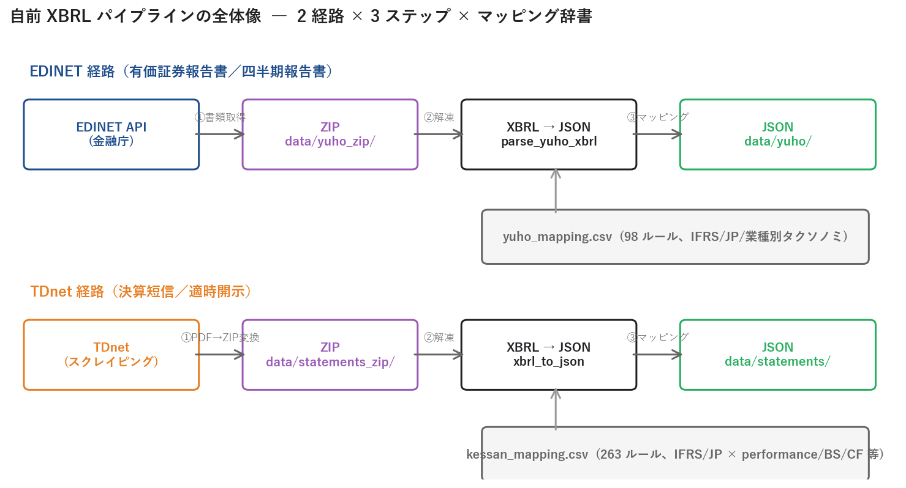
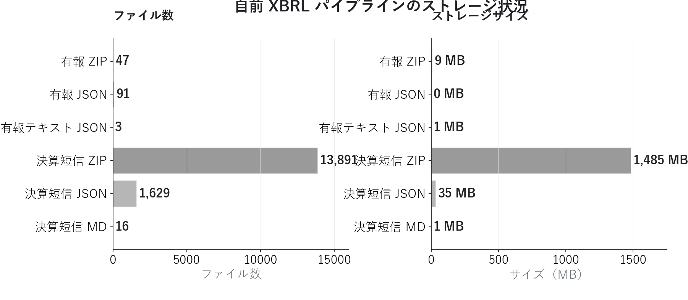
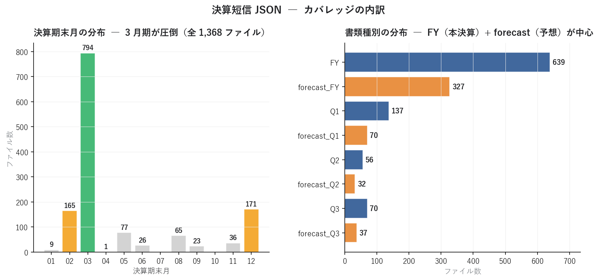
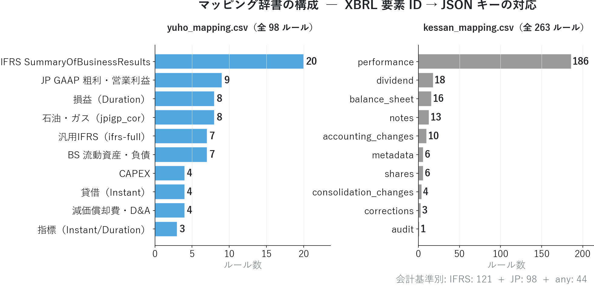
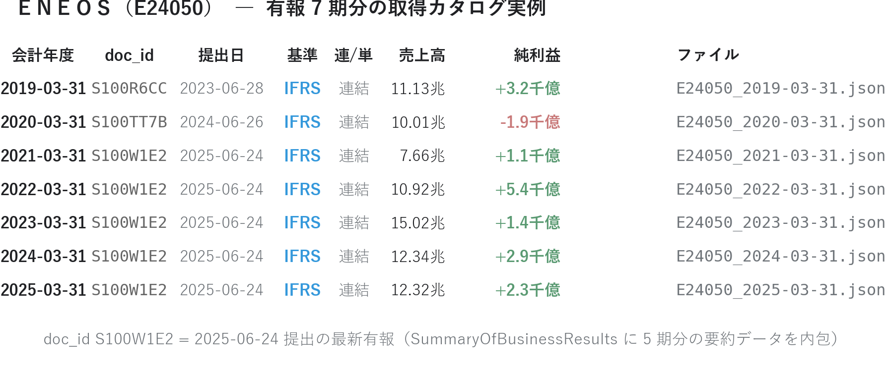

# EDINET / TDnet から XBRL を取得してパースする ― 自前の決算データ基盤を作る

連載06 では ＥＮＥＯＳ の **2022 純利益 5,371 億円ピーク → 2025 純利 2,261 億円** という 7 年時系列を、有報 XBRL で可視化しました（2022 は ウクライナ侵攻による特殊年、2025 にも のれん減損などの一時要因 ― 詳細は連載06 の構造要因解説と連載01 の 4 基準試算を参照）。あの 7 行のデータは **「EDINET から XBRL ZIP を 1 つダウンロードして JSON にパースする」** という単純なステップから生まれます。

本記事ではその実装を解説します。EDINET API の使い方、TDnet スクレイピング、ZIP の解凍、XBRL → JSON 変換のマッピング辞書、そして 8,907 個の決算短信 ZIP と 47 個の有報 ZIP からどう 1,368 + 91 個の JSON が生成されるのか ― **自前パイプラインの全体像** を実装ベースで示します。

<!-- more -->

---

## 取得とパースの概要

### 連載06 で見たデータの「出どころ」

連載06 で示した ＥＮＥＯＳ の純利益 7 年推移は、たった 1 つのファイルから生まれました。

```
data/yuho/E24050/E24050_2025-03-31.json   ← 1 ファイル
  └─ metadata.fiscal_year_end = "2025-03-31"
  └─ metadata.doc_id          = "S100W1E2"   ← EDINET 書類 ID
  └─ financials.net_sales     = 12,322,494,000,000
  └─ financials.net_income    = 226,071,000,000
  └─ financials.roe           = 0.071
```

この JSON は、EDINET API から取得した **doc_id S100W1E2 の XBRL ZIP**（ＥＮＥＯＳ 2025 年提出有報）を、`parse_yuho_xbrl.py` でパースして作られました。**1 つの有報 XBRL に約 40 項目の財務データが詰まっている** ことが、フェーズ 2 の出発点です。

### パイプライン全体像 ― 2 経路 × 3 ステップ

{width="950"}

XBRL は **2 つの経路** で入手し、いずれも **3 ステップで JSON 化** します。

| 経路 | 取得元 | API 形態 | パーサ | 保存先 |
|---|---|---|---|---|
| **EDINET** | 金融庁 | 公式 REST API（無料登録） | `parse_yuho_xbrl.py` | `data/yuho/{EDINETコード}/` |
| **TDnet** | 東京証券取引所 | スクレイピング | `xbrl_to_json.py` | `data/statements/` |

両経路とも `ZIP → 解凍 → マッピング辞書照合 → JSON` という共通フローです。差は **取得方式** と **マッピング辞書** にあります。

### マッピング辞書こそが本当のノウハウ

XBRL は会計基準（JP / IFRS / US）と業種別タクソノミでタグが異なるため、**1 つの財務項目を取り出すのに複数の XBRL 要素 ID を試す必要** があります。

```csv
# yuho_mapping.csv の抜粋 ― "売上高" には 3 つの異なる XBRL タグが対応
損益（Duration）,                jpcrp_cor:NetSalesSummaryOfBusinessResults,        net_sales       # 日本基準
IFRS SummaryOfBusinessResults,  jpcrp_cor:RevenueIFRSSummaryOfBusinessResults,     net_sales       # IFRS
IFRS SummaryOfBusinessResults,  jpcrp_cor:RevenuesSummaryOfBusinessResults,        net_sales       # IFRS 別表現
```

**1 つの JSON キー（`net_sales`）に、複数の XBRL 要素 ID が紐づきます**。会計基準・業種・年度によって XBRL タグが微妙に違うため、マッピング辞書の充実度が直接、JSON のカバレッジに影響します。yuho 用 98 ルール、kessan 用 263 ルールの蓄積が、フェーズ 2 の品質を支える本体です。

### 本記事における実装スコープ

```
本記事で扱うこと:
  ・EDINET API の 2 ステップ呼び出し（インデックス → 書類取得）
  ・TDnet スクレイピングと PDF URL → ZIP URL 変換
  ・XBRL ZIP の解凍と XBRL_TO_CSV 形式の活用
  ・マッピング辞書による JSON 正規化
  ・複数会計基準（JP / IFRS）の吸収

本記事で扱わないこと:
  ・タクソノミ要素自体の詳細な意味（連載08 で扱う）
  ・JSON スキーマ設計の判断基準（連載08 で扱う）
  ・パース失敗時のリカバリ戦略（連載11 三角検証で扱う）
  ・ENEOS 独自指標（実質営業利益等）の XBRL 要素からの再構築（連載08 スキーマ設計 + フェーズ 3 で扱う）
```

---

## 分析で分かったこと

自前パイプラインを 2026-05-21 時点で観察すると、以下の状況が見えます。

### ストレージ統計 ― ZIP 9 GB、JSON 22 MB

{width="950"}

| 種類 | ファイル数 | サイズ |
|---|---|---|
| 有報 ZIP | 47 | 9 MB |
| 有報 JSON | 91 | 0.1 MB |
| 有報テキスト JSON | 3 | 1 MB |
| **決算短信 ZIP** | **8,907** | **935 MB** |
| **決算短信 JSON** | **1,368** | **22 MB** |
| 決算短信 MD | 16 | 1 MB |

特筆すべきは **「ZIP 935 MB → JSON 22 MB」という 40 倍の圧縮率** です。XBRL ZIP には XBRL 本体・XSD（スキーマ）・CSV（XBRL_TO_CSV 変換版）・PDF・テキスト等が全部含まれますが、**JSON は本当に必要な財務項目だけに絞り込んだ** 結果、サイズが大幅に小さくなります。

また 8,907 ZIP に対して JSON が 1,368 しか作れていない（≈ 15%）のは、現在のパーサが **FY 本決算と forecast に対応した銘柄** だけを処理しているためです。Q1〜Q3 四半期短信のパースは段階的に追加していく方針です。

### 決算短信のカバレッジ ― 3 月期と FY が中心

{width="950"}

決算短信 JSON 1,368 ファイルの内訳：

| 決算期末月 | ファイル数 |
|---|---|
| **3 月** | **794** |
| 12 月 | 171 |
| 2 月 | 165 |
| 5 月 | 77 |
| 8 月 | 65 |

日本の上場企業は **3 月期決算が圧倒的多数**（全体の 58%）。次に多いのは国際派企業の 12 月期、小売・流通の 2 月期です。「3 月期だけ追えば事足りる」と思いがちですが、それでは年間 5 ヶ月（4〜8 月）しか決算フローがなく、決算プレイの機会を失います。**多様な決算期末を取得することで、年間を通じて決算データが途切れずに流れてきます**。

書類種別では **FY（本決算）639 + forecast_FY（業績予想）327** が中心。連載02〜04 で使った業績予想修正率（証券会社の無料データ）は、本来この **forecast_FY を時系列で繋ぐ** ことで自前構築できます。

### マッピング辞書の構成 ― 98 + 263 ルール

{width="950"}

**yuho_mapping.csv（98 ルール）** の内訳：

| カテゴリ | ルール数 | 例 |
|---|---|---|
| IFRS SummaryOfBusinessResults | 20 | IFRS 採用企業の要約財務 |
| JP GAAP 粗利・営業利益 | 9 | 日本基準の損益項目 |
| 損益（Duration） | 8 | 売上・経常・純利益等 |
| 石油・ガス業（jpigp_cor） | 8 | 業種別タクソノミ |
| 汎用 IFRS（ifrs-full） | 7 | 国際標準タクソノミ |

**kessan_mapping.csv（263 ルール）** の内訳：

| カテゴリ | ルール数 |
|---|---|
| **performance**（業績） | **186** |
| dividend（配当） | 18 |
| balance_sheet（貸借） | 16 |
| notes（注記） | 13 |
| accounting_changes（会計方針変更） | 10 |
| metadata / shares / consolidation_changes / 等 | 20 |

会計基準別: **IFRS 121 + JP 98 + any 44**。決算短信は有報より項目が多く、複数の会計基準への対応エントリも多いため、ルール数が 2.7 倍になります。

このマッピング辞書こそが **無料で取れるデータを超えるカバレッジを実現するノウハウの本体** です。タクソノミの追加・改正に追随するメンテナンスコストはありますが、一度蓄積すれば再利用できます。

### ＥＮＥＯＳ 7 期の取得カタログ実例

{width="950"}

連載06 で見せた ＥＮＥＯＳ 7 期データは、実は **3 つの doc_id** から構成されています。

| 会計年度 | doc_id | 提出日 | 由来 |
|---|---|---|---|
| 2019-03-31 | S100R6CC | 2023-06-28 | 2023 年提出の有報の "前々々期" |
| 2020-03-31 | S100TT7B | 2024-06-26 | 2024 年提出の有報の "前々々期" |
| 2021-03-31 | **S100W1E2** | 2025-06-24 | 2025 年提出の有報の "前々々々期" |
| 2022-03-31 | **S100W1E2** | 2025-06-24 | 同上 "前々々期" |
| 2023-03-31 | **S100W1E2** | 2025-06-24 | 同上 "前々期" |
| 2024-03-31 | **S100W1E2** | 2025-06-24 | 同上 "前期" |
| 2025-03-31 | **S100W1E2** | 2025-06-24 | 同上 "当期" |

**doc_id S100W1E2（2025-06-24 提出の最新有報）には、過去 5 期分の要約財務（`SummaryOfBusinessResults`）が含まれている** ため、最新有報 1 つで 2021〜2025 の 5 年間が一気に取得できます。これは **EDINET XBRL タクソノミの強力な仕様** です。

「過去 5 年の財務時系列を取得したい」という需要に対し、**最新の有報 1 つ + 過去の有報 2 つ = 3 ファイルで 7 年分** が揃う設計になっています。これも無料で取れるデータでは到達しにくい価値です。

---

## 実装の核心

### 1. EDINET API ― 2 ステップで XBRL を取得

EDINET API v2 は **書類インデックス取得** と **書類本体取得** の 2 ステップです。

```python
import os, requests
from dotenv import load_dotenv
load_dotenv()
API_KEY = os.getenv("EDINET_API_KEY")

# Step 1: 指定日に提出された書類一覧
res_idx = requests.get(
    "https://disclosure.edinet-fsa.go.jp/api/v2/documents.json",
    params={"date": "2025-06-24", "type": 2, "Subscription-Key": API_KEY},
)
documents = res_idx.json()["results"]
# → 提出日 2025-06-24 の全書類リスト（数百件）
# → 各 result に docID / edinetCode / docTypeCode / 等

# Step 2: XBRL ZIP を取得（type=5 が XBRL）
doc_id = "S100W1E2"   # ＥＮＥＯＳ の 2025 年有報
res_zip = requests.get(
    f"https://disclosure.edinet-fsa.go.jp/api/v2/documents/{doc_id}",
    params={"type": 5, "Subscription-Key": API_KEY},
)
with open(f"data/yuho_zip/E24050/{doc_id}.zip", "wb") as f:
    f.write(res_zip.content)
```

`type` パラメータの意味：

| type | 内容 |
|---|---|
| 1 | 本文 PDF |
| 2 | XBRL（旧形式、HTML 込み） |
| **5** | **XBRL_TO_CSV**（パース済み CSV を含む ZIP） |

本連載では `type=5` を使います。**XBRL_TO_CSV** 形式は EDINET 側が XML → CSV 変換した状態で配信してくれるため、Python 側の CSV パースだけで済むのが大きなメリットです。

### 2. EDINET インデックスの蓄積

`fetch_edinet_index.py` は、過去の書類一覧を `data/edinet_index.parquet` に蓄積します。日次バッチで「新規書類だけ追加取得」する設計です。

```python
# 既存インデックスを読み込み、未取得の日付だけ API を叩く
import pandas as pd
from datetime import date, timedelta
from pathlib import Path

INDEX = Path("data/edinet_index.parquet")
existing = pd.read_parquet(INDEX) if INDEX.exists() else pd.DataFrame()
done_dates = set(existing["filing_date"].astype(str)) if not existing.empty else set()

new_rows = []
d = date(2025, 1, 1)
while d <= date.today():
    if d.isoformat() not in done_dates:
        res = requests.get(API_URL, params={"date": d.isoformat(),
                                            "type": 2, "Subscription-Key": API_KEY})
        for doc in res.json().get("results", []):
            new_rows.append({**doc, "filing_date": d.isoformat()})
    d += timedelta(days=1)

if new_rows:
    pd.concat([existing, pd.DataFrame(new_rows)], ignore_index=True).to_parquet(INDEX)
```

### 3. TDnet スクレイピング ― PDF → ZIP URL 変換

TDnet には公式 API がないため、適時開示ページから決算短信を発見して **PDF URL を ZIP URL に変換** します。

```python
import re, requests, time
from bs4 import BeautifulSoup

SLEEP_SEC = 1.0  # 過剰アクセス防止

def fetch_tdnet_documents(target_date: str):
    # 公式ページの HTML をパース
    url = f"https://www.release.tdnet.info/inbs/I_list_001_{target_date}.html"
    res = requests.get(url, headers={"User-Agent": "Mozilla/5.0"})
    soup = BeautifulSoup(res.text, "html.parser")

    docs = []
    for link in soup.find_all("a", href=re.compile(r"\d{15}\.pdf$")):
        pdf_url = link["href"]
        # PDF URL を ZIP URL に変換（同じパスで拡張子だけ変わる）
        zip_url = re.sub(r"\.pdf$", ".zip", pdf_url)
        docs.append({"pdf_url": pdf_url, "zip_url": zip_url,
                     "title": link.get_text(strip=True)})
    return docs


def download_zip(zip_url: str, save_path: Path):
    res = requests.get(zip_url, headers={"User-Agent": "Mozilla/5.0"})
    if res.status_code == 200:
        save_path.write_bytes(res.content)
    time.sleep(SLEEP_SEC)
```

**注意**: TDnet は商用利用・データ転売が禁止です。個人の投資判断目的に限定し、`SLEEP_SEC` を 1 秒以上に設定するなどマナーを守って使用してください。

### 4. XBRL → JSON 変換のコア

EDINET の `type=5` で取得した ZIP には `XBRL_TO_CSV/jpcrp030000-asr-*.csv`（または短信形式の場合は別パス）が含まれます。これを読み込み、マッピング辞書と照合して JSON に正規化します。

```python
import csv, io, zipfile, json

# 1) ZIP 内の CSV を見つける
with zipfile.ZipFile("S100W1E2.zip") as z:
    csv_name = next(n for n in z.namelist()
                    if "XBRL_TO_CSV" in n and "jpcrp030000-asr" in n)
    with z.open(csv_name) as f:
        # EDINET の CSV は UTF-16 LE BOM 付き
        reader = csv.DictReader(io.TextIOWrapper(f, encoding="utf-16"))
        rows = list(reader)

# 2) マッピング辞書を読み込み
mapping: dict[str, str] = {}
with open("collectors/yuho_mapping.csv", encoding="utf-8") as f:
    for r in csv.DictReader(f):
        mapping[r["xbrl_element_id"]] = r["field_name"]

# 3) XBRL 要素 ID → JSON キーに変換
result = {"metadata": {}, "financials": {}}
for r in rows:
    elem_id = r.get("要素ID", "")
    if elem_id in mapping:
        field = mapping[elem_id]
        try:
            result["financials"][field] = float(r.get("値", "0"))
        except ValueError:
            pass  # 文字列値や欠損は無視

# 4) JSON で保存
with open("data/yuho/E24050/E24050_2025-03-31.json", "w", encoding="utf-8") as f:
    json.dump(result, f, ensure_ascii=False, indent=2)
```

このシンプルな構造が、**有報 1 つ → JSON 1 つ** の変換ロジックです。

### 5. 会計基準の差分吸収

マッピング辞書には **同じ JSON キーに複数の XBRL 要素 ID が紐づく** エントリが多数あります。

```csv
# yuho_mapping.csv の抜粋
# 「売上高」を表す要素 ID は会計基準・業種で異なる
損益（Duration）,                jpcrp_cor:NetSalesSummaryOfBusinessResults,                  net_sales       # 日本基準
IFRS SummaryOfBusinessResults,  jpcrp_cor:RevenueIFRSSummaryOfBusinessResults,               net_sales       # IFRS 採用
IFRS SummaryOfBusinessResults,  jpcrp_cor:RevenuesSummaryOfBusinessResults,                  net_sales       # IFRS 別表現
石油・ガス（jpigp_cor）,         jpigp_cor:NetSalesIFRSSummaryOfBusinessResults_OG,           net_sales       # 業種別タクソノミ
```

XBRL → JSON 変換時には、CSV を 1 回ループするだけで「どの要素 ID が来ても同じ JSON キーに集約される」ため、出力 JSON は会計基準を問わず統一スキーマになります。連載06 で **ＥＮＥＯＳ（IFRS）と日本基準銘柄を同じグラフ上で比較できた** のは、この差分吸収のおかげです。

### 6. パイプライン実行コマンド

```bash
# 1. EDINET インデックス更新（日次）
python collectors/fetch_edinet_index.py

# 2. 有報 XBRL ZIP ダウンロード
python collectors/fetch_edinet_xbrl.py

# 3. 有報 XBRL → JSON 変換
python collectors/parse_yuho_xbrl.py

# 4. 有報のテキスト部分（経営方針・見通し）も抽出
python collectors/parse_yuho_text.py

# 5. 決算短信（TDnet）取得 + JSON 化
python collectors/fetch_statements.py
```

毎週金曜の引け後にこれを順番に実行するだけで、自前パイプラインが回り続けます。

---

## Python コードの紹介

実装の主要部分はすでに前節で示しましたが、**XBRL ZIP の構造を理解するための補助コード** を追加で紹介します。

### XBRL ZIP の中身を覗く

```python
import zipfile

def inspect_xbrl_zip(zip_path: str) -> dict:
    """XBRL ZIP の中身を分類して返す。"""
    categories = {"XBRL_TO_CSV": [], "PublicDoc": [], "XBRL": [], "PDF": [], "他": []}
    with zipfile.ZipFile(zip_path) as z:
        for name in z.namelist():
            if "XBRL_TO_CSV" in name:
                categories["XBRL_TO_CSV"].append(name)
            elif "PublicDoc" in name:
                categories["PublicDoc"].append(name)
            elif name.endswith(".xbrl"):
                categories["XBRL"].append(name)
            elif name.endswith(".pdf"):
                categories["PDF"].append(name)
            else:
                categories["他"].append(name)
    return categories


# 使用例
counts = {k: len(v) for k, v in inspect_xbrl_zip("S100W1E2.zip").items()}
print(counts)
# → {'XBRL_TO_CSV': 16, 'PublicDoc': 22, 'XBRL': 4, 'PDF': 1, '他': 87}
```

EDINET の XBRL ZIP には平均 100 ファイル以上が含まれますが、JSON 化に必要なのは **`XBRL_TO_CSV/jpcrp030000-asr-*.csv` の 1 ファイル** だけです。残りは XSD / XML スタイルシート / 用語定義集など、人間が読むための補助ファイルです。

### マッピング辞書の品質チェック

```python
import pandas as pd

def audit_mapping(mapping_csv: str) -> dict:
    """マッピング辞書のカバレッジを集計。"""
    df = pd.read_csv(mapping_csv)
    return {
        "total_rules": len(df),
        "unique_json_keys": df["field_name"].nunique(),
        "rules_per_key": df.groupby("field_name").size().describe().to_dict(),
        "categories": df["category"].value_counts().to_dict(),
    }


audit = audit_mapping("collectors/yuho_mapping.csv")
print(f"全ルール: {audit['total_rules']}")
print(f"JSON キー数: {audit['unique_json_keys']}")
# → 全ルール 98 / JSON キー数 約 40
# → 1 JSON キーあたり平均 2〜3 個の XBRL 要素 ID（会計基準別エントリ）
```

「1 つの JSON キーに何個の XBRL 要素 ID が紐づくか」は、マッピング辞書の **網羅性の指標** になります。多くなりすぎると保守困難ですが、少なすぎると会計基準対応が不十分。バランスの追求が連載08（スキーマ設計）のテーマです。

---

## まとめ

- 連載06 で見せた ＥＮＥＯＳ 7 年データは、**EDINET から ZIP 3 つ取得 → JSON 7 つ生成**という単純な実装の成果物（ただし数値は IFRS 標準勘定ベース。ENEOS 独自の「実質営業利益 4,400 億円」等は要素データから再構築が必要で、連載08 で扱う）
- パイプラインは **EDINET（公式 API）と TDnet（スクレイピング）の 2 経路 × ZIP 取得・解凍・マッピングの 3 ステップ**
- マッピング辞書（yuho 98 ルール / kessan 263 ルール）が **無料で取れるデータを超えるカバレッジを実現する本体のノウハウ**。会計基準（JP / IFRS / 業種別タクソノミ）の差分を吸収して統一 JSON スキーマに正規化
- 自前パイプラインの現状: 決算短信 ZIP 8,907 / JSON 1,368 / 有報 ZIP 47 / JSON 91。**ZIP 935 MB → JSON 22 MB の 40 倍圧縮**
- 決算カバレッジは **3 月期 794 が中心、12 月 / 2 月 / 5 月 / 8 月期** も取得することで年間を通じた決算フローが途切れない
- ＥＮＥＯＳ 7 期分は **3 つの doc_id**（S100R6CC / S100TT7B / S100W1E2）から生成。最新有報 1 つに **過去 5 期分の要約データが内包** されている EDINET XBRL タクソノミの仕様により、3 ファイルで 7 年を網羅
- 自前パイプラインを持つことで、データ提供の **永続性・ブラックボックスからの解放・全銘柄バルク取得・LLM 連携の準備** が実現

次回連載08 は **決算短信 JSON のスキーマ設計** に踏み込みます。「マッピング辞書をどう構築するか」「JSON スキーマをどう設計するか」「複数会計基準にどう対応するか」を、`kessan_mapping.csv` 263 ルールの構造から逆算して解説します。

---

*データ出典: EDINET API（金融庁）/ TDnet（東京証券取引所）。本記事の数値は 2026-05-21 時点の自前パイプライン状況*
