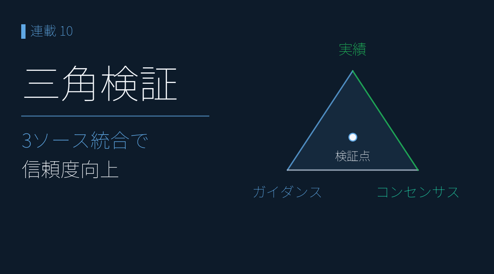
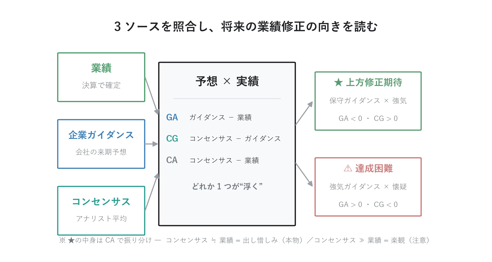
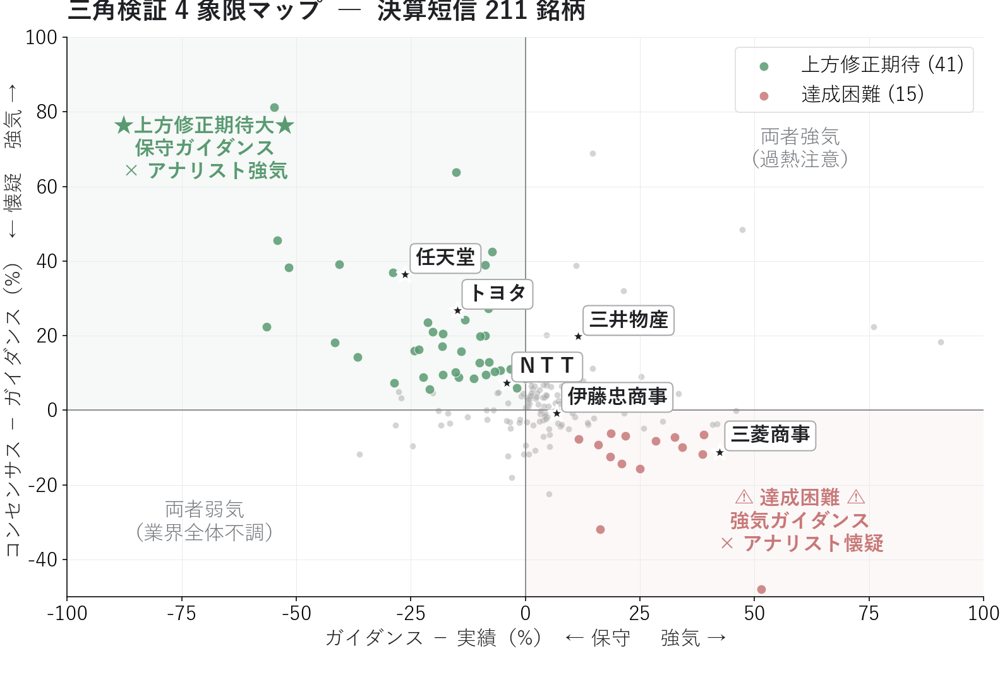
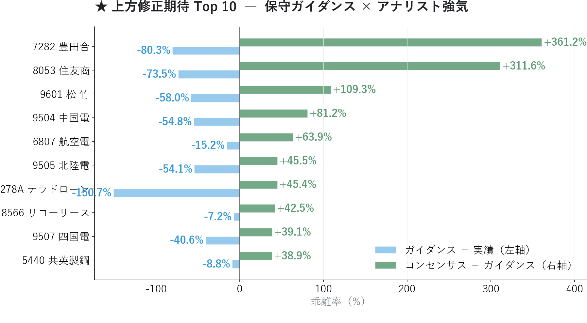
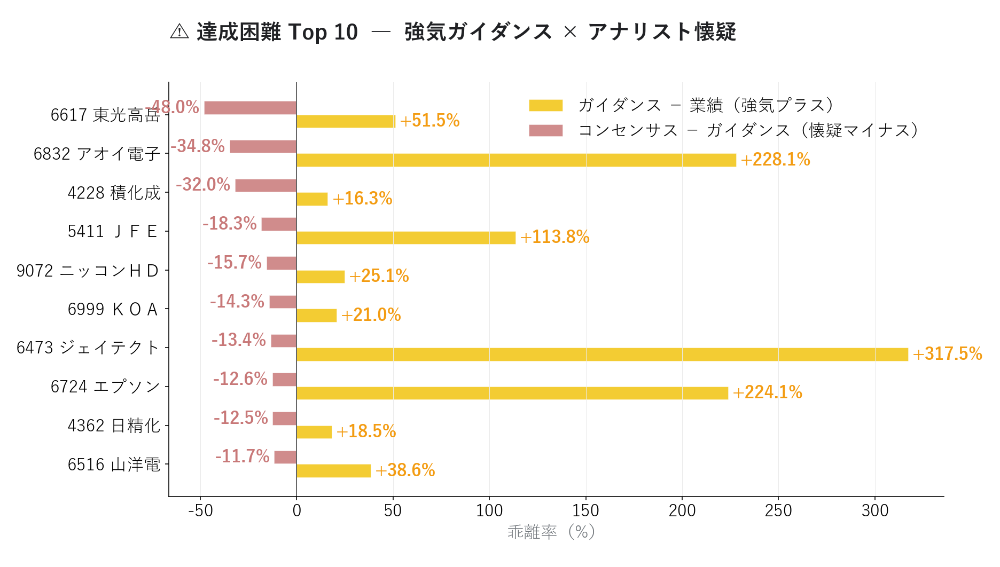
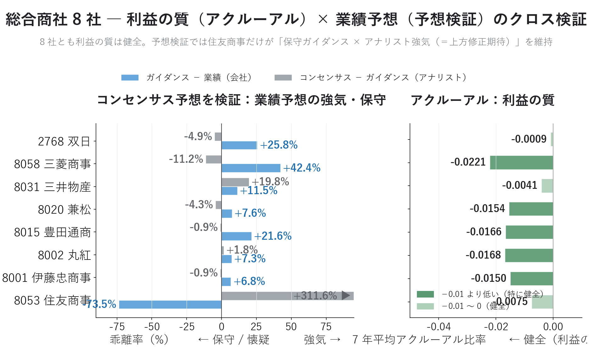

# コンセンサス予想を検証 ― 「予想のズレ」で将来の業績修正の向きを先回り

{width="1280"}

「アナリストが強気だから買い」「会社が増益予想だから安心」。実は、**業績・会社予想・アナリスト予想の 3 つの食い違い**で、その「安心」は揺らぎます。

業績予想には、常に **3 つの数値** が並んでいます。

1. **業績**（決算で確定した数値）
2. **企業ガイダンス**（企業自身が出す来期予想）
3. **アナリストコンセンサス**（複数アナリストの平均予想）

本記事では、この **3 つの予想を並べて照合**し、「次に上方修正が出そうな銘柄」と「ガイダンス未達リスクの銘柄」を炙り出します。

データ出典: 自前で構築したパイプラインの `data/statements/*_FY.json` 841 件（actual） + 327 件（forecast）から (code) マッチ 327 ペアを構築し、`data/rakunav/213_EPS.csv` を結合した 211 銘柄サンプル

<a class="ref-card ref-card--quiet" href="https://www.nomura.co.jp/terms/japan/ko/con_chosa.html" target="_blank" rel="noopener">

アナリストコンセンサス とは
複数アナリスト予想の平均値 ― 野村證券 用語集

</a>

<!-- more -->

## 将来の業績修正の向きを読む

業績・企業ガイダンス・アナリストコンセンサスの 3 つを **同一銘柄 × 同一会計年度** で並べると、コツは **「3 つのうち、どれか 1 つだけが浮いていないか」** を探すこと。その浮いた 1 つから、将来の業績修正の向きを読みます。

- **ガイダンスだけ低い**（コンセンサス ≒ 業績）→ 会社の **出し惜しみ** → 後で上方修正 ＝ **買い**
- **コンセンサスだけ高い**（業績・ガイダンスより突出）→ アナリストの **楽観バイアス** → **当てにせず見送り**
- **ガイダンスだけ高い**（コンセンサスが下）→ 会社の **背伸び** → 下方修正リスク ＝ **警戒**

つまりコンセンサスは「正解」でも「ノイズ」でもなく、**ガイダンスの出し惜しみ／背伸びを炙り出す“第三者の物差し”**。信じるかどうかではなく、**3 点のどれが浮いているか** を読みます。

<i class="fa-solid fa-expand"></i> クリックで拡大 ・ 2026.05.31作成

{width="1200"}

## 4 象限マップで「予想のズレ」を確認

同じ銘柄について、次の 3 つを突き合わせます。

1. 業績 EPS（決算短信）
2. 会社予想 EPS（決算短信）
3. アナリストコンセンサス EPS（証券会社アプリ）

今回は、データがそろっている 211 銘柄を使って分析します。

🟩左上　<i class="fa-solid fa-star"></i> 上方修正期待　「保守ガイダンス × アナリスト強気」　
🟥右下　<i class="fa-solid fa-triangle-exclamation"></i> 達成困難予想　「強気ガイダンス × アナリスト懐疑」　

<i class="fa-solid fa-expand"></i> クリックで拡大 ・ 2026.05.31作成

{width="1200"}

主要銘柄の位置を見ると、**トヨタ・任天堂の保守ガイダンス** が際立ちます。

| 銘柄              | ガイダンスと 業績の差 | コンセンサスと ガイダンスの差 | 解釈              |
| --------------- | -------------- | ------------------ | --------------- |
| **トヨタ 7203** | **−14.9%**     | **+26.8%**         | 典型的保守 + アナリスト強気 |
| **任天堂 7974** | **−26.2%**     | **+36.4%**         | 保守ガイダンスの極致      |
| ＮＴＴ 9432     | −4.0%          | +7.3%              | 微保守 + アナリストやや強気 |

トヨタは業績 295.2 円 → ガイダンス 251.2 円（−14.9%）に対しコンセンサス 318.5 円（+26.8%）。**「企業は固く出す、アナリストは強気で見る」日本市場の伝統的構図** がそのまま出ています。

## ズレが大きい銘柄ランキング

3 つの数値を頭文字で **C＝コンセンサス**・**G＝ガイダンス**・**A＝業績（Actual）** と呼びます。2 文字の指標はいずれも **「（前の数値 − 後の数値）÷ 後の数値」** の % で、後ろの文字が基準です。

- **GA＝（ガイダンス − 業績）÷ 業績**：マイナスほど会社が**保守的**
- **CG＝（コンセンサス − ガイダンス）÷ ガイダンス**：プラスほどアナリストが**強気**
- **CA＝（コンセンサス − 業績）÷ 業績**：小さいほどコンセンサスは**業績どおり（本物）**、大きいほど**上振れ（楽観）**

<i class="fa-solid fa-star"></i> 上方修正期待と <i class="fa-solid fa-triangle-exclamation"></i> 達成困難予想を、**CG の大きい順**に 10 銘柄ずつ並べます。そのうえで、その強気・懐疑が **本物か楽観かは CA で見分けます**（下表の「業績EPS」と「コンセンサス」を見比べてください。両表に列として載せるのは **GA・CG** です）。

### アナリスト強気が大きい順 Top 10

口火を切るのは **業績の半値以下という極端な保守ガイダンス × アナリスト強気** の銘柄群。象徴的なのが **住友商事** ― 業績 EPS 499 円に対し会社ガイダンスは 132 円（業績比 **−74%**）、アナリストコンセンサスは 543 円（ガイダンス比 **+312%**）と強気です。

<i class="fa-solid fa-expand"></i> クリックで拡大 ・ 2026.05.31作成

{width="1200"}

| 銘柄 | 業績EPS | ガイダンス | コンセンサス | GA | CG |
|---|---|---|---|---|---|
| 豊田合成（7282） | 494 | 97 | 449 | −80.3% | **+361.2%** |
| **住友商事（8053）** | 499 | 132 | 543 | **−73.5%** | +311.6% |
| 松竹（9601） | 381 | 160 | 335 | −58.0% | +109.3% |
| 中国電力（9504） | 191 | 86 | 156 | −54.8% | +81.2% |
| 航空電（6807） | 105 | 89 | 146 | −15.2% | +63.9% |
| 北陸電力（9505） | 261 | 120 | 174 | −54.1% | +45.5% |
| テラドローン（278A） | 260 | −132 | −72 | −150.7% | +45.4% |
| リコーリース（8566） | 416 | 386 | 550 | −7.2% | +42.5% |
| 四国電力（9507） | 247 | 147 | 205 | −40.6% | +39.1% |
| 共英製鋼（5440） | 227 | 207 | 288 | −8.8% | +38.9% |

チャート最上位の **豊田合成（7282）** ― 業績比 −80% / ガイダンス比 +361% ― のように、上位は「会社が在庫評価益などの一時的要因を除いて低めに置いたガイダンスを、アナリストが実態ベースで上に見ている」という構図です。

ここで大事な見分け。同じ「上方修正期待」でも、**コンセンサスを業績と並べる** と中身が 2 つに分かれます。

- **住友商事（出し惜しみ＝本物）**：コンセンサス 543 ≒ 業績 499 で、浮いているのは **ガイダンス 132**。会社が低めに出しているだけなので上方修正の蓋然性が高い ＝ **買い候補**
- **リコーリース（楽観バイアス＝注意）**：ガイダンス 386 ≒ 業績 416 と正直なのに **コンセンサス 550 だけ突出**。浮いているのはアナリスト予想で、楽観に乗ると外しやすい

CG（+311% と +42%）だけ見れば両者とも「強気」ですが、**意味は逆**。コンセンサスを業績とも突き合わせて初めて区別できます。

ただし **テラドローン（278A）** はガイダンス・コンセンサスが赤字（マイナス EPS）で、％が負値基準で発散・符号反転するため解釈に注意。本来は \|EPS\|>1 のフィルタに加え、**符号が反転するケースは別扱い** が望ましい一例です。

### アナリスト懐疑が大きい順 Top 10

アナリスト懐疑が大きい順に 10 銘柄。筆頭の **東光高岳（6617）** はガイダンスが業績比 **+51% 強気** なのに、アナリストはガイダンス比 **−48% 懐疑** と見ています。

<i class="fa-solid fa-expand"></i> クリックで拡大 ・ 2026.05.31作成

{width="1200"}

| 銘柄 | 業績EPS | ガイダンス | コンセンサス | GA | CG |
|---|---|---|---|---|---|
| 東光高岳（6617） | 411 | **623** | 324 | +51.5% | **−48.0%** |
| アオイ電子（6832） | 6.3 | 20.5 | 13.4 | +228% | −34.8% |
| 積水化成品工業（4228） | 47 | 55 | 37 | +16.3% | −32.0% |
| ＪＦＥ ＨＤ（5411） | 110 | 236 | 193 | +113.8% | −18.3% |
| ニッコンＨＤ（9072） | 153 | 191 | 161 | +25.1% | −15.7% |
| ＫＯＡ（6999） | 106 | 129 | 110 | +21.0% | −14.3% |
| ジェイテクト（6473） | 38 | 157 | 136 | +317.5% | −13.4% |
| エプソン（6724） | 57 | 184 | 161 | +224.1% | −12.6% |
| 日本精化（4362） | 202 | 240 | 210 | +18.5% | −12.5% |
| 山洋電気（6516） | 244 | 338 | 299 | +38.6% | −11.7% |

**6473（ジェイテクト）** や **6724（エプソン）** は業績比 +200% を超える極端な強気ガイダンス（特殊要因の可能性）に対し、アナリストはより冷静な見方。いずれも **次の決算で下方修正が出るリスクが高い** 警戒銘柄群です。

## 総合商社 8 社で「利益の質 × 予想」を確認

利益の質を測る **アクルーアル分析**（純利益と営業 CF の乖離）で健全と確認された **総合商社 8 社（伊藤忠 / 丸紅 / 豊田通商 / 兼松 / 三井物産 / 三菱商事 / 住友商事 / 双日）** は、本記事の予想検証可能 211 銘柄にも全社含まれます。**「利益の質」と「予想の信頼性」を同じ銘柄群でクロス分析できる初の機会** です。

FY2025 本決算を経て、**8 社とも利益の質（アクルーアル < 0）は健全なまま、予想検証では住友商事だけが「保守ガイダンス × アナリスト強気」を維持**。他 7 社は FY2026 を強気ガイダンスで設定し、アナリストは中立〜懐疑に転じました。

<i class="fa-solid fa-expand"></i> クリックで拡大 ・ 2026.05.31作成

{width="1200"}

| 銘柄 | GA | CG | アクルーアル | 統合解釈 |
|---|---|---|---|---|
| **住友商事（8053）** | **−73.5%** | **+311.6%** | −0.0075 | 健全 + 極端な保守 + アナリスト強気 |
| 三菱商事（8058） | **+42.4%** | −11.2% | **−0.0221** | 最も健全 + FY2026 強気ガイダンス |
| 三井物産（8031） | +11.5% | +19.8% | −0.0041 | 強気ガイダンス + アナリスト強気 |
| 双日（2768） | +25.8% | −4.9% | −0.0009 | FY2026 強気ガイダンス |
| 兼松（8020） | +7.6% | −4.3% | −0.0154 | 微強気ガイダンス |
| 豊田通商（8015） | +21.6% | −0.9% | −0.0166 | 強気ガイダンス + 中立 |
| 丸紅（8002） | +7.3% | +1.8% | −0.0168 | 微強気ガイダンス + 中立 |
| 伊藤忠商事（8001） | +6.8% | −0.9% | −0.0150 | 微強気ガイダンス |

この変化を個別銘柄の判定に落とし込むと：

1. **アクルーアル（利益の質）**: 利益の質が高いか？ → 全社 OK
2. **予想検証（予想の信頼性）**: 上方修正期待があるか？ → 住友商事のみ明確。他社は強気ガイダンス × アナリスト中立〜懐疑に転換

この **「利益の質 × 予想の信頼性 のクロス検証」** は、機関投資家のファンダメンタル・スコアリングの基本構造そのものです。

## まとめ

- 業績・ガイダンス・コンセンサスを並べ、**「浮いた 1 つ」で次の修正の向きを読む**（対象 211 銘柄）
- <i class="fa-solid fa-star"></i> **上方修正期待**（保守ガイダンス × アナリスト強気）の筆頭は **住友商事** ― 本物か楽観かは **CA** で判別
- <i class="fa-solid fa-triangle-exclamation"></i> **達成困難**（強気ガイダンス × アナリスト懐疑）は **ジェイテクト・エプソン** など要警戒
- **総合商社 8 社で「利益の質 × 予想の信頼性」を初クロス** ― 上方修正期待を保つのは **住友商事のみ**

## <i class="fa-brands fa-github"></i> Python コード

本記事のチャート画像・データ取得・成形スクリプトは、すべて **GitHub に公開**しています。**予想検証の計算方法**（3 ソースの統合・3 ペアの乖離率・4 象限分類・アクルーアルとのクロス）は、リポジトリの README にまとめています。データは提供元の利用規約により再配布できませんが、データを各自取得すれば、本連載と同じものが再現できます。

<a class="repo-link" href="https://github.com/minnanosaiban/blog/tree/main/07_triangulation" target="_blank" rel="noopener">
github.com/minnanosaiban/blog/07_triangulation
<i class="repo-link-arrow fa-solid fa-arrow-up-right-from-square"></i>
</a>

---
