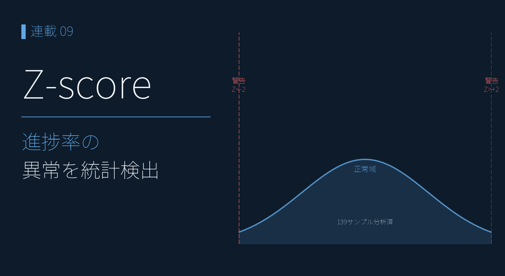
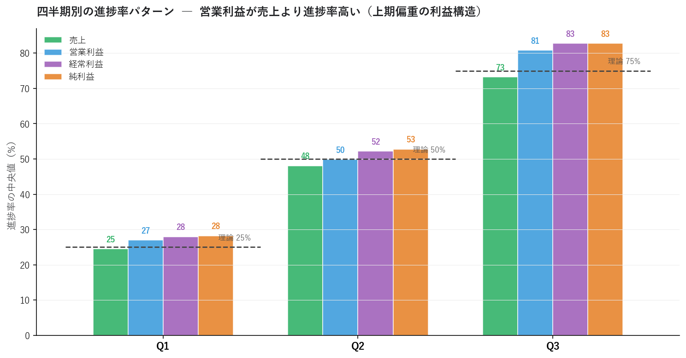
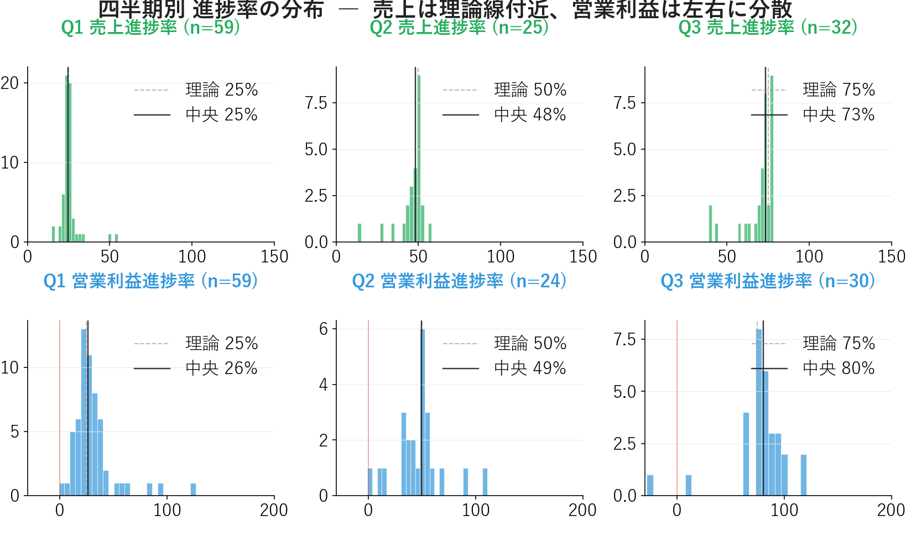
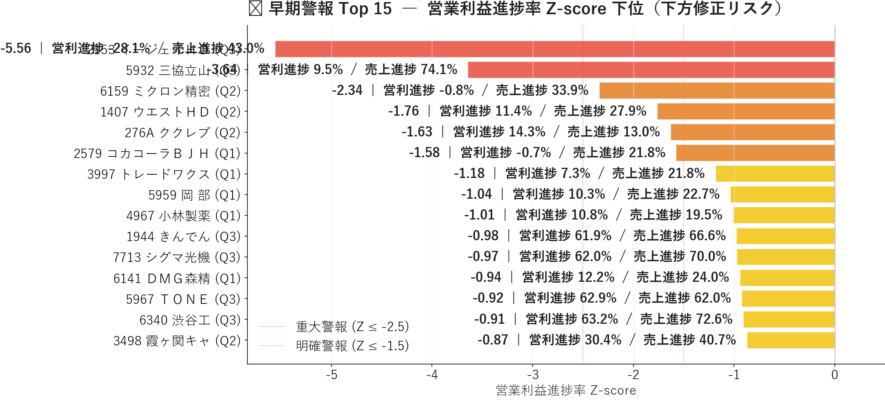
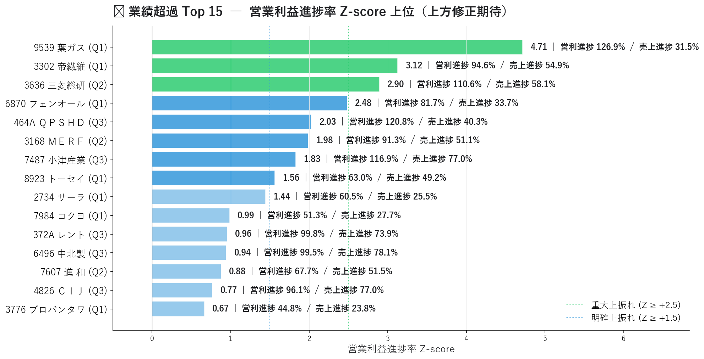
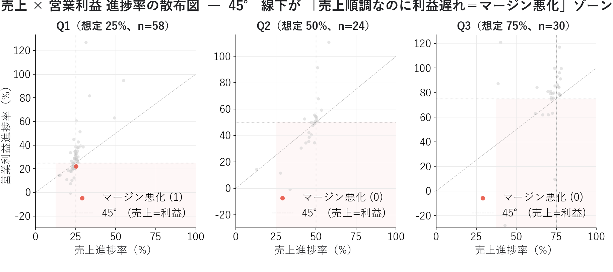

# 進捗率 Z-score 早期警報 ― 決算下方修正を 1〜3 ヶ月先取りする

{width="1280"}

連載06〜07 で見た **業績予想修正率** や **EPS リビジョン** は、「アナリストが修正した**後**」の遅行シグナルでした。本記事はフェーズ3 の入口として、「修正される**前**」に業績の異常を察知する **進捗率 Z-score** を、連載03 で作った統一 JSON から実装します。

四半期累積実績 ÷ 通期予想で出す **進捗率** を全銘柄で比べると、**Ｅ・Ｊ HD（2153）Q3 営業利益進捗 −28%（Z −5.56）** や **京葉瓦斯（9539）Q1 営業利益進捗 127%（Z +4.71）** といった極端な事例が一発で抽出できます。

<!-- more -->


## 早期警報の概要

### 遅行シグナルを補う「先行」シグナル

連載06（リビジョン）・07（サプライズ）の業績シグナルは、本質的に **市場が動いた後を追う** 構造でした。進捗率 Z-score は、企業が四半期決算を出した直後に「通期予想との乖離」を測ることで、**アナリスト修正の前**に動けます。

```
[四半期決算発表] ← 進捗率 Z-score はここ（先行）
   ↓ 数週間〜1ヶ月
[アナリスト予想修正] ← 連載06 リビジョンはここ
   ↓
[通期予想の公式修正] → [株価が織り込む]
```

「四半期決算は出たが通期予想はまだ修正されていない」 ― この **1〜3 ヶ月のラグ**が優位性です。

### 進捗率と Z-score の定義

```
進捗率(%) = 四半期累積実績 ÷ 通期予想 × 100
Z-score   = (個別の進捗率 − 同四半期の全銘柄平均) ÷ 同四半期の標準偏差
```

進捗率の絶対値だけだと業界の季節性（小売・建設はQ4集中など）に引っ張られます。**同じ四半期の市場平均からの偏差**で正規化すれば業界差は自動で吸収されます。四半期ごとに別々に正規化するのがポイントです。


## 分析で分かったこと

決算短信 JSON 1,624 ファイルから、**Q1-Q3 累積実績 262 件と通期予想 466 件をマッチさせた 139 件**で分析しました。

### 四半期別の進捗率 ― 「営業利益は売上より進捗が早い」

{width="1200"}

| 四半期 | 売上 中央値 | 営利 中央値 | 経常 中央値 | 純利 中央値 | 理論進捗 |
|---|---|---|---|---|---|
| Q1 | 25% | 26% | 28% | 28% | 25% |
| Q2 | 48% | 49% | 52% | 53% | 50% |
| Q3 | 73% | **79%** | 81% | 82% | 75% |

- **売上は理論進捗にほぼ一致**（Q3 73%）。日本企業全体の季節性は平均すると緩やか
- **営業利益は売上より進捗が高い**（Q3 79% > 売上 73%）。上期に利益が出やすく下期にコスト（修繕費・賞与・販促費）が偏る構造

理論線（25/50/75）で判定すると Q3 営利 75% は「想定通り」に見えますが、市場平均 81% から見れば**下振れ気味**。Z-score で測る必要性がここにあります。

### 進捗率の分布 ― 営業利益はバラつきが売上の3倍

{width="1200"}

- 売上の標準偏差: Q1 5.9% / Q2 9.1% / Q3 10.6%
- 営業利益の標準偏差: Q1 **20.3%** / Q2 **21.3%** / Q3 **19.6%**

営業利益の分散が売上の **3 倍**あるのは、売上のブレが利益に増幅される **オペレーティング・レバレッジ**の効果。早期警報を「営業利益進捗率」で取るのは、こちらのほうがシグナル/ノイズ比が高いからです。

### 🚨 早期警報 Top5 ― 営業利益進捗率 Z-score 下位

{width="1200"}

| 銘柄 | 四半期 | 売上進捗 | 営利進捗 | **Z-score** | 解釈 |
|---|---|---|---|---|---|
| Ｅ・Ｊ HD（2153） | Q3 | 43.0% | **−28.0%** | **−5.56** | 営業赤字。下方修正必至 |
| 三協立山（5932） | Q3 | 74.1% | 9.5% | **−3.64** | 売上順調なのに利益消失 |
| ミクロン精密（6159） | Q2 | 33.9% | −0.8% | −2.34 | 上期から営業赤字スレスレ |
| ウエスト HD（1407） | Q2 | 27.9% | 11.4% | −1.76 | 中間期で進捗 1/8 |
| ククレブ（276A） | Q2 | 13.0% | 14.3% | −1.63 | 全般的に進捗大幅遅れ |

Ｅ・Ｊ HD の Z −5.56 は「市場平均からの偏差として 100 万銘柄に 1 つ」レベルの異常値。**通期で大幅下方修正が公式に出る前に察知できるシグナル**です。三協立山は売上 74%（市場並み）なのに営利 9.5% ― **「売上は計画通りなのに利益だけ消失」**という典型的なマージン悪化（原材料高・人件費・値下げ圧力）です。

### 🚀 業績超過 Top5 ― 営業利益進捗率 Z-score 上位

{width="1200"}

| 銘柄 | 四半期 | 売上進捗 | 営利進捗 | **Z-score** | 解釈 |
|---|---|---|---|---|---|
| 京葉瓦斯（9539） | Q1 | 31.5% | **126.9%** | **+4.71** | Q1 で通期予想の 1.27 倍 |
| 帝国繊維（3302） | Q1 | 54.9% | 94.6% | +3.12 | Q1 で通期ほぼ達成 |
| 三菱総研（3636） | Q2 | 58.1% | 110.6% | +2.90 | 中間期で通期超過 |
| 日本フェンオール（6870） | Q1 | 33.7% | 81.7% | +2.48 | Q1 で通期 8 割 |
| QPS HD（464A） | Q3 | 40.3% | 120.8% | +2.03 | Q3 で通期超過 |

京葉瓦斯の Q1 営利進捗 127% は「上方修正待ち」を超えて **「通期予想が保守的すぎる」**レベル。連載07 のサプライズスコアで先取りした上方修正候補が、進捗率でより明瞭に裏付けられます。ただし業績超過銘柄は**既に株価が織り込んでいる**ことも多く、連載06 のリビジョン × モメンタムと組み合わせて「業績は良いがまだ動いていない出遅れ」に絞るとリスク・リワードが改善します。

### 売上 × 営業利益 散布図 ― マージン分析

{width="1200"}

45° 線（売上進捗 = 営利進捗）の下が「マージン悪化」ゾーン。Q1 では多くの銘柄が線の**上**（上期偏重）に並びますが、Ｅ・Ｊ HD や三協立山のようなマージン崩壊銘柄は Q2/Q3 で**大きく線下に落ちて**識別できます。

### ＥＮＥＯＳ との接続

ＥＮＥＯＳ・出光・コスモエネＨＤ の決算短信 JSON は自前パイプライン未取得（466 銘柄カバレッジ外）で、進捗率の直接計算は次のステップです。ただし連載03 の**有報 7 期時系列**からは類推できます ― ＥＮＥＯＳ は 2022 純利益 5,371 億円（ROE 20.7%）から 2025 年 2,261 億円（ROE 7.1%）へ縮小。一方 ENEOS自身は構造要因（のれん減損・在庫影響）を理由に「**実質営業利益 4,400 億円水準は維持**」と主張しています（[連載03](03_xbrl_to_json.md) / [連載04](04_garp_peg_roe.md) 4 基準試算参照）。「公表純利益の半減」と「実質維持」のどちらが本業実態か ― 次回連載09 のアクルーアル分析で、**2022 ピーク利益がキャッシュで裏付けられていたか**を検証します。


## 警報レベルの目安

| Z-score | 意味 | 想定アクション |
|---|---|---|
| **≤ −2.5** | 重大警報（上位 1%） | 保有は即減らす |
| −2.5 〜 −1.5 | 明確警報 | 一部利確・ヘッジ |
| ±1.5 以内 | 中立 | 様子見 |
| +1.5 〜 +2.5 | 明確上振れ | 上方修正期待、ロング検討 |
| **≥ +2.5** | 重大上振れ（下位 1%） | 上方修正可能性大（既織り込み注意） |

実運用では **ROE ≥ 10%・時価総額 ≥ 100 億円・売上と営利の両方で下振れ**などのフィルタを重ねると、純粋な業績悪化銘柄に絞り込めます。


## まとめ

- 連載06〜07 の遅行シグナル（リビジョン・サプライズ）を補う、**事前**の業績シグナルとして進捗率 Z-score を実装
- 連載03 の統一 JSON 1,624 ファイルから Q1-Q3 実績 262 + 通期予想 466 をマッチ、**139 件**で分析
- **Q3 営業利益進捗の市場平均 81%・標準偏差 19.6%** ― 営業利益は売上より分散が広く（3倍）、SNR が高い
- 早期警報 Top1 **Ｅ・Ｊ HD（2153）Q3 営利進捗 −28%（Z −5.56）**、**三協立山（5932）売上 74% × 営利 9.5%** はマージン崩壊の典型
- 業績超過 Top1 **京葉瓦斯（9539）Q1 営利進捗 127%（Z +4.71）** は上方修正必至
- 連載07 サプライズスコアとの併用で「進捗率異常 + 予想修正の遅れ」の**二重警報**に絞り込める

次回連載09 は **アクルーアル分析**。本記事で見つけた銘柄の「利益の質」を営業 CF と純利益の乖離から判定し、見かけ上の好決算に潜むリスクを検出します。ＥＮＥＯＳ 2022 ピーク利益のキャッシュ実態を検証し、連載04 の 4 基準試算と接続します。


## Appendix ― Python コード <i class="fa-brands fa-github"></i>

進捗率データ構築・Z-score 計算・早期警報抽出・サプライズスコア結合のコードを **GitHub に公開**しています。決算データは再配布できませんが、EDINET / TDnet から取得した JSON があれば再現できます。

> <i class="fa-brands fa-github"></i> **リポジトリ** [`github.com/minnanosaiban/blog`](https://github.com/minnanosaiban/blog)

#### 進捗率 Z-score 早期警報

決算短信 JSON から進捗率を計算 → 四半期別に Z-score 正規化 → 下位を早期警報として抽出。連載07 のサプライズスコアと結合して二重警報も判定します。

> 🔗 <!-- TODO: 公開リポジトリ 08_zscore のパスを確定して差し替え -->

---

*データ出典: 連載03 で構築した自前パイプラインの `data/statements/*.json` 1,624 ファイル（Q1-Q3 actual + FY forecast を結合した 139 件で集計）*
