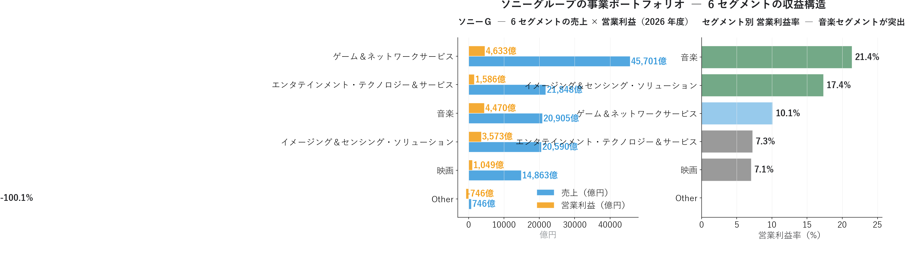
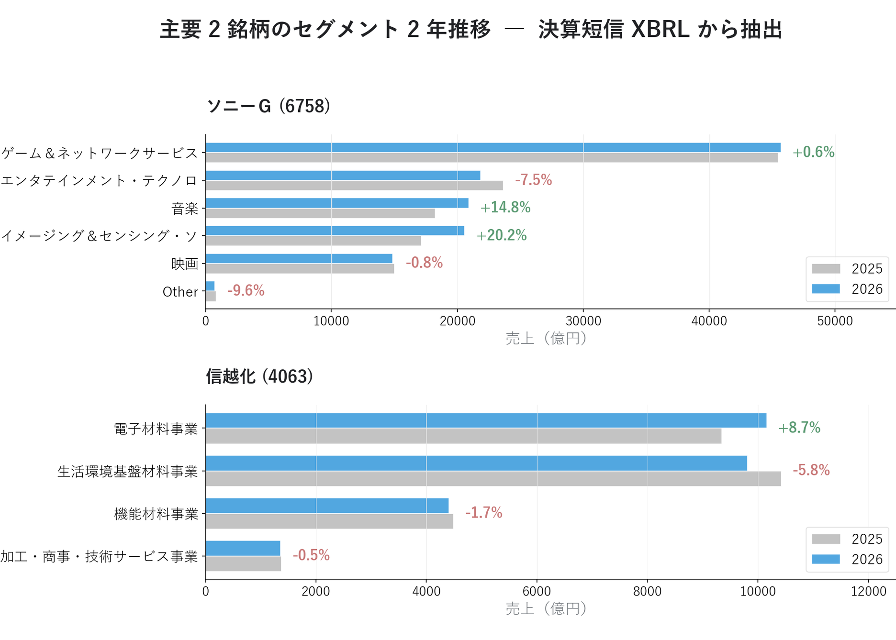

# セグメント発進力スコアで「次の主力事業・隠れた高収益事業」を発掘する ― 決算短信セグメント情報

{width="1280"}

「PER 20 倍、ROE 10% ― この会社は割高で高収益」。こうした全社平均では、**裏でどの事業が伸び、どの事業が縮んでいるか** までは見えません。

本記事は **XBRL を JSON 化した自前パイプライン** で決算を **事業セグメント別** に分解し、「次の主力事業」と「隠れた高収益事業」を発掘します。


<!-- more -->

---

## セグメント分析の概要

PEG・ROE・アクルーアル・三角検証は、すべて **企業合算** の指標で、その内訳までは見えません。総合電機や商社のような複合企業ほど、決算短信 XBRL の **セグメント別** 分解の価値は大きくなります。

⬛ **セグメント発進力スコア = 直近 1 年の成長率 ÷ 過去 5 年平均 CAGR** ― 事業の加速／減速を測る指標

| 発進力スコア | 判定 |
| --- | --- |
| ≥ 1.5 | 加速中 |
| 0.7 〜 1.5 | 横ばい |
| ≤ 0.7 | 減速中 |

ただし決算短信 XBRL の時系列は **2 年分** のため、本記事は **前期比成長率** で代用します（蓄積が進めば本来の 5-7 年スパンへ）。分析対象は決算短信 XBRL でセグメントが取れた **233 銘柄 × 787 セグメント**（有報 XBRL は parser 未対応）。

>⚠️ ＥＮＥＯＳ は本記事用に追加取得して 5 セグメントを分析。出光 / コスモエネＨＤ は同期未取得のため対象外です。

---

## セグメント分解で「収益構造」を確認

### ソニーグループ ― 6 セグメントの収益構造

マルチファクター分析で **総合スコア 44.1** と中庸評価だったソニーG。決算短信 XBRL でセグメントに分解すると、**音楽事業の営業利益率 19.6% が突出** し、「単なるゲーム会社」ではない事業ポートフォリオの強みが見えてきます。

<small style="color: var(--md-link-color);"><i class="fa-solid fa-expand"></i> クリックで拡大できます</small>
<small style="color: var(--md-link-color);">2026.05.31作成</small>


{width="1200"}

| セグメント | 売上（億円） | 営業利益（億円） | **営業利益率** |
|---|---|---|---|
| ゲーム＆ネットワークサービス | 45,436 | 4,148 | 9.1% |
| 音楽 | 18,203 | 3,573 | **19.6%** |
| 映画 | 14,985 | 1,173 | 7.8% |
| エンタテインメント・テクノロジー＆サービス | 23,628 | 1,909 | 8.1% |
| イメージング＆センシング・ソリューション | 17,125 | 2,611 | **15.2%** |

その音楽事業は売上規模こそゲームの 40% 程度ですが、利益率はゲーム（9.1%）の 2 倍以上。Spotify / Apple Music が世界を席巻するストリーミング時代でも、音楽パブリッシング・原盤権という **「軽資産で永続キャッシュフロー」** ビジネスの収益性が際立ちます。

マルチファクター総合スコア 44 はこの **「音楽 + イメージング・センサ」の高利益率セグメントを企業合算で平均化したため過小評価** していた可能性が示唆されます。セグメント別に見ることで、**ソニーG ≠ 単なるゲーム会社 ≠ 単なるエレキ会社** という事業ポートフォリオの強み が浮かびます。

### セグメント前期比成長率 ― 加速 Top10 / 減速 Worst10

決算短信 233 銘柄 × 787 セグメントを前期比成長率（売上 100 億円以上）で見ると、**丸紅が "次世代事業 +127%" で加速側・"金融 −55%" で減速側の両方に顔を出す** 二極化が目を引きます。事業転換の現場がセグメントに表れています。

<small style="color: var(--md-link-color);"><i class="fa-solid fa-expand"></i> クリックで拡大できます</small>
<small style="color: var(--md-link-color);">2026.05.31作成</small>


{width="1200"}

**★ 加速 Top10**

| 銘柄 | セグメント | 売上前期比 | 当期売上 |
|---|---|---|---|
| **ＮＥＣキャピタル（8793）** | **その他（Other）** | **+627.3%** | 315 億 |
| 大東建託（1878） | 不動産開発事業 | +186.5% | 1,471 億 |
| ＳＢＩ GAM（4765） | アセットマネジメント事業 | +170.0% | 263 億 |
| エムスリー（2413） | ペイシェントソリューション | +159.5% | 569 億 |
| **丸紅（8002）** | **次世代事業開発** | **+127.2%** | 1,824 億 |
| ＣＣＩグループ（7381） | 銀行業 | +100.5% | 1,518 億 |
| ホシデン（6804） | 機構部品 | +94.9% | 4,143 億 |
| ＳＢＩ HD（8473） | 次世代事業 | +83.2% | 562 億 |
| エスコン（8892） | 不動産開発事業 | +83.0% | 520 億 |
| **双日（2768）** | **エネルギー・ヘルスケア** | **+78.9%** | 3,485 億 |

**⚠ 減速 Worst10**

| 銘柄 | セグメント | 売上前期比 | 当期売上 |
|---|---|---|---|
| **丸紅（8002）** | 金融・リース・不動産 | **−54.7%** | 246 億 |
| **セブン&アイ（3382）** | スーパーストア事業 | **−51.9%** | 6,876 億 |
| セブン&アイ | Other | −47.4% | 1,512 億 |
| 東京電力（9501） | リニューアブルパワー | −41.9% | 515 億 |
| ＳＧHD（9143） | 不動産事業 | −35.6% | 154 億 |
| セブン&アイ | 金融関連事業 | −34.4% | 1,218 億 |
| ＮＡＮＫＡＩ（9044） | 建設業 | −25.4% | 304 億 |
| 積水化成品（4228） | インダストリー分野 | −25.0% | 615 億 |
| 三菱倉庫（9301） | 不動産事業 | −24.6% | 354 億 |
| イオンFS（8570） | ソリューション | −22.4% | 928 億 |

加速 Top1 は **ＮＥＣキャピタル（8793）の "その他" +627.3%**（売上 315 億）。XBRL の "Other/その他" セグメントは期初から存在しないことが多く、事業組替や新規連結による急拡大の反映と推測されます。ストーリー上で注目すべきは **丸紅の "次世代事業開発" +127%**（売上 1,824 億）と **双日の "エネルギー・ヘルスケア" +78.9%**（売上 3,485 億）。利益の質（アクルーアル）が健全で予想の信頼性（三角検証）も確認された総合商社が、セグメントレベルでも **新規事業に成功している** 構図が確認できます。

逆に **丸紅は同時に "金融・リース・不動産" が −54.7% で減速 Worst1**。これは **事業転換期** にある典型的なサイン。「総合商社のうち丸紅は次世代事業 +127% × 既存金融事業 −55% の二極化」が、本記事のセグメント分析でしか見えない結論です。

最も衝撃的なのは **セブン&アイ（3382）の本業 "スーパーストア事業" が −51.9%**（売上 6,876 億 → 半減）。これは大規模事業再編（イトーヨーカ堂分離等）の影響と推測されますが、企業合算では見えない構造変化が、セグメントで一発で可視化されます。

### 高営業利益率セグメント ― 「隠れた寡占ビジネス」の発掘

売上 200 億円以上に絞った営業利益率 Top10 には、**マキタのアジア事業 88.4%、アドバンテストのテストシステム事業 50.9%（売上 1 兆円）** といった「隠れた寡占ビジネス」が並びます。**無料で取れるデータには絶対に出てこない数字** です。

<small style="color: var(--md-link-color);"><i class="fa-solid fa-expand"></i> クリックで拡大できます</small>
<small style="color: var(--md-link-color);">2026.05.31作成</small>


{width="1200"}

| 銘柄 | セグメント | 営業利益率 | 売上 | 営利 |
|---|---|---|---|---|
| **マキタ（6586）** | アジア | **88.4%** | 343 億 | 304 億 |
| オービック（4684） | システムサポート | 74.0% | 715 億 | 529 億 |
| オービック（4684） | システムインテグレーション | 59.7% | 553 億 | 330 億 |
| カカクコム（2371） | 食べログ事業 | 55.2% | 402 億 | 222 億 |
| 大阪瓦斯（9532） | 海外エネルギー | 53.3% | 1,270 億 | 677 億 |
| カカクコム（2371） | 価格．ｃｏｍ事業 | 53.1% | 236 億 | 125 億 |
| **アドバンテスト（6857）** | **テストシステム事業** | **50.9%** | **10,194 億** | **5,188 億** |
| 野村総研（4307） | ＩＴ基盤サービス | 50.1% | 770 億 | 386 億 |
| 東海旅客鉄道（9022） | 運輸業 | 46.7% | 16,417 億 | 7,675 億 |
| 竹内製作所（6432） | 日本 | 46.2% | 678 億 | 314 億 |

特筆すべきは **アドバンテストのテストシステム事業: 売上 1.02 兆円 × 営業利益率 50.9% = 営利 5,188 億円**。これは **半導体テスター世界寡占** の利益構造そのもの。マルチファクターの総合スコア計算では「ROE / Quality 指標」として企業合算で平均化されますが、**「実は 1 兆円規模の事業を利益率 50% で運営している」** という事実は、セグメント情報なしには見えません。

**東海旅客鉄道（9022）の運輸業 46.7% / 売上 1.64 兆円** も同様で、新幹線という社会インフラの利益構造を定量化できます。

カカクコムの **食べログ事業 55.2% / 価格.com 事業 53.1%** はインターネット広告ビジネスの規模の経済効果、オービックの **システムサポート 74.0%** は基幹システム ベンダーの粘着性、マキタの **アジア事業 88.4%** は電動工具の海外販売利益率の極端な高さ。それぞれの **業界寡占構造** が数字で見えます。

### 主要 4 銘柄の 2 年セグメント推移

主要銘柄を 2 年分のセグメント別売上で並べると、**6 セグメントすべての前期比が取れるのはソニーG だけ**。トヨタ（新区分）・任天堂（単一事業）はセグメント開示の制約でデータが限られます。

<small style="color: var(--md-link-color);"><i class="fa-solid fa-expand"></i> クリックで拡大できます</small>
<small style="color: var(--md-link-color);">2026.05.31作成</small>


{width="1200"}

- **トヨタ（7203）**: 自動車事業（前期比なし、新セグメント区分のため）の構造は連結ベースで巨大、金融事業の規模も顕著
- **ソニーG（6758）**: 6 セグメントすべての YoY が見える唯一の銘柄
- **信越化（4063）**: シリコーン・電子材料・有機合成・無機機能材料の 4 セグメントが安定推移
- **任天堂（7974）**: セグメント数 1 のためデータなし（単一事業 = ゲーム & DC事業）

## 総合商社で「事業転換」を確認

利益の質（アクルーアル）と予想の信頼性（三角検証）で健全と確認された総合商社 8 社のうち、本記事で **追加情報が取れたのは 丸紅 と 双日 の 2 社**。いずれも **「健全な利益の質」に加えてセグメントでも新規事業が加速** しており、3 つの分析が同じ方向を指します：

| 銘柄 | アクルーアル（利益の質） | 三角検証（予想） | **セグメント（本記事）** |
|---|---|---|---|
| 丸紅（8002） | −0.0168（健全） | G +7.3% / C +1.8% | **次世代事業 +127% × 金融 −55%** |
| 双日（2768） | −0.0009（健全） | G +25.8% / C −4.9% | **エネルギー・ヘルスケア +78.9%** |

利益の質・予想・セグメントの 3 つの分析で「健全」と評価された 2 社が、**セグメントレベルでも事業転換に成功** している事実が確認できました。FY2025 確定後の三角検証は **丸紅（G +7.3%/C +1.8%: 強気ガイダンス×中立コンセンサス）・双日（G +25.8%/C −4.9%: 強気ガイダンス×懐疑的コンセンサス）** に転換しており、セグメント加速との **「3 分析の整合シグナル」は継続評価が必要** です。

## ＥＮＥＯＳ で「ピークアウトの内訳」を確認

本連載の中核銘柄である ＥＮＥＯＳ について、2026/3 期通期の決算短信 XBRL を取得し、主要 6 セグメントの当期 vs 前期を比較しました。連結営業利益は **公表ベース 前期 3,717 億円 → 当期 4,666 億円（+949 億、+25.5%）**、JX金属を非継続事業として除外した **継続事業ベースでは 前期 1,061 億円 → 当期 4,666 億円（+339.8%）** という急回復を示しました。さらに同社開示の **「在庫影響除き営業利益相当額 4,744 億円」** は、2025/3 期業績予想修正発表時の主張（実質営業利益 4,400 億円維持）を **上回って着地** しています（[GARP の記事](04_garp_peg_roe.md)の 4 基準試算参照）。セグメント別に分解すると、この急回復の構造が複層的に見えてきます。

<small style="color: var(--md-link-color);"><i class="fa-solid fa-expand"></i> クリックで拡大できます</small>
<small style="color: var(--md-link-color);">2026.05.31作成</small>

{width="1200"}

| セグメント | 当期売上 | 当期営利 | 当期OPM | 前期OPM | OPM 変化 | 営利 YoY |
|---|---|---|---|---|---|---|
| **石油製品ほか**（売上の 92%） | 103,953 億 | 2,924 億 | 2.81% | −0.46% | **+3.27pt** | 赤字脱却 |
| 電気 | 3,492 億 | 220 億 | 6.30% | 6.56% | −0.26pt | +4.9% |
| **機能材** | 3,390 億 | 111 億 | 3.27% | 5.09% | **−1.82pt** | **−37.3%** |
| **石油・天然ガス開発** | 2,167 億 | 508 億 | 23.45% | 36.00% | **−12.54pt** | **−41.8%** |
| 再生可能エネルギー | 487 億 | −9 億 | −1.91% | −38.39% | +36.48pt | 赤字縮小 |
| **その他** | — | **912 億** | — | — | — | **金属 442 億 + NIPPO・連結調整ほか 470 億**（PDF p30） |
| **連結合計** | — | **4,666 億** | — | — | — | **公表ベース +25.5%（+949 億）/ 継続事業ベース +339.8%** |

連結業績の急回復（公表 +25.5% / 継続事業ベース +339.8%）の正体は、**売上の 92% を占める石油製品セグメントが前期赤字 (−507 億) から当期黒字 (+2,924 億) に転換** したことに加え、**その他事業の 912 億円**（金属 442 億 + NIPPO・連結調整 470 億）が連結利益の約 20% を貢献していることです。在庫評価差益や精製マージン回復など、原油価格サイクルに連動する要素が大きく寄与しています。利益の質分析で見た通り、石油元売の在庫影響は単年では大きく揺れますが **2022-2024 累積では CF が純利益を上回って回収済み** ― 在庫影響そのものは「一過性」ではなく **業態固有の上下サイクル** の一部です。

一方で、**本来の収益エンジンである 2 セグメントの利益率は低下** しています:

- **石油・天然ガス開発**: 5 セグメント中で唯一 OPM 20% 超だった高収益事業。**OPM 36.00% → 23.45%（−12.54pt）、営業利益 −41.8%**。ただし OPM 23% は依然として他業界比較で高水準で、原油・ガス価格高止まり期からの **サイクル正常化** とも読めます。「構造的剥落」か「サイクル要因」かは 2 年比較では断定できず、継続観察が必要
- **機能材**: 「高付加価値素材で利益を安定化」と説明される事業だが、**OPM 5.09% → 3.27%（−1.82pt）、営業利益 −37.3%**。化学市況の悪化が利益率を圧迫している点は注意が必要

この **「連結回復 vs 高 OPM セグメントの正常化」の二層構造** は、ＥＮＥＯＳ という銘柄の複層性を裏付けます。分析の角度を変えるごとに、別の面が見えてきます。

```
割安度（PEG×ROE）   : GARP マップで割安・低 ROE。GARP 圏外でも +29.7% 上昇
XBRL 業績推移        : 2022 純利 5,371 億（ウクライナ侵攻特殊年）→ 2025 2,261 億 縮小
アクルーアル（利益の質）: 2022 単年 CF/純利 39% vs 3 年累積 114%（回収済み）
三角検証（予想）      : EPS +72.9% vs 経常 ▲0.6% の併存は構造要因（のれん減損・JX金属IPO・自社株買い）で説明可能
CAR（市場反応）      : 2025-03-28 業績予想修正発表 CAR [-1,+20]=-13.89%（主因は のれん減損・在庫影響 = 構造要因）
セグメント（本記事）   : 「開発 OPM 36→23%、機能材 OPM 5→3%」と高 OPM セグメントの正常化局面を可視化、連結 +25.5%（公表）/ +339.8%（継続事業ベース）/ 4,666 億、在庫除き 4,744 億 で主張通り着地
```

従来は **「全体としてピークアウト」** が観察対象でしたが、本記事のセグメント分解で **「主力 2 事業の OPM 低下と石油製品の急回復が同時進行している」** という複層構造が見えてきます。連結の急回復の表面に騙されず、**「石油製品の在庫評価差益が連結を押し上げた裏で、高 OPM セグメントは正常化局面に入っている」** という多面的な解釈が、決算短信 XBRL のセグメント情報から定量的に裏付けられました。「ピークアウトか正常化か」は利益の質分析で見た **CF 累積（CF/純利 114%）** やセグメント時系列の継続観察と併せて判断する必要があります（ENEOS 自身は「実質営業利益 4,400 億円水準を維持」と主張、[GARP の記事](04_garp_peg_roe.md)の 4 基準試算参照）。

なお出光興産 / コスモエネＨＤ は本記事執筆時点で同期 (2026/3 期) の決算短信 XBRL を未取得です。3 社揃えれば「石油元売 3 社の事業構成比較」が可能になり、割安度・マルチファクター分析で観察された 3 社の株価動向の差をセグメントレベルで説明できる見込みです。

---

## まとめ

- これまでの分析が企業合算指標だったのに対し、本記事は **事業セグメント別** に分解。XBRL を JSON 化した独自スキーマの威力が最も顕著に出る分析
- 決算短信 XBRL から **233 銘柄 × 787 セグメント** の前期比成長率を計算。有報 XBRL のセグメントは parser_version 0.2.0 で未対応（既知の課題）
- ソニーグループの 6 セグメントで **音楽事業の営業利益率 19.6%** が突出 ― マルチファクター総合スコア 44 では見えない「軽資産で永続キャッシュ」ビジネスの収益性
- **加速 Top1: ＮＥＣキャピタル その他 +627%**（事業組替・新規連結の反映と推測）、**大東建託 不動産開発 +186%**、**丸紅 次世代事業 +127%**、**双日 エネルギー・ヘルスケア +79%** など、新規・周辺事業の本格寄与シグナル
- **減速 Worst: セブン&アイ スーパーストア −52%（売上 6,876 億）** ― 大規模事業再編の影響が企業合算ではなく **セグメントレベルで初めて可視化**
- **高営業利益率 Top: マキタ アジア 88.4% / アドバンテスト テストシステム 50.9%（売上 1.02 兆円）/ 東海旅客鉄道 運輸業 46.7%** ― 業界寡占構造の定量化
- 利益の質・予想・セグメントで評価した **丸紅・双日 がセグメントレベルでも「事業転換に成功」している** 確認。3 つの分析で整合したシグナル
- **ＥＮＥＯＳ 2026/3 期** は連結営業利益 **4,666 億（公表 +25.5% / 継続事業ベース +339.8%）** の急回復。在庫影響除き営業利益相当額は **4,744 億** で、2025/3 期業績予想修正発表時の主張「実質営業利益 4,400 億維持」を **上回って着地**（4 基準試算と整合）。主因は **石油製品（売上 92%）の赤字脱却**（在庫影響の reverse）+ その他事業 912 億（金属 442 + NIPPO・連結調整 470）+ 累積 CF の回収局面。一方 **主力 2 事業の OPM 低下**（開発 36→23% / 機能材 5→3%）も同時進行しており、「構造的ピークアウト」か「サイクル正常化」かは継続観察が必要

次回は **CAR（Cumulative Abnormal Return）イベントスタディ** に進みます。決算発表前後の株価リターンを集計し、ここまでのアクルーアル / 三角検証 / セグメント発進力 で発掘した銘柄が、実際に **どれだけ超過リターンを生んだか** を実証します。

## <i class="fa-brands fa-github"></i> Python コード

本記事のチャート画像・データ取得・成形スクリプトは、すべて **GitHub に公開**しています。**セグメント分析の計算方法**（JSON スキーマからの抽出・前期比成長率・加速判定・アクルーアルとのクロス）は、リポジトリの README にまとめています。データは提供元の利用規約により再配布できませんが、データを各自取得すれば、本連載と同じものが再現できます。

> [<span style="color: var(--md-link-color);">github.com/minnanosaiban/blog/08_segments</span>](https://github.com/minnanosaiban/blog/tree/main/08_segments)

---

*データ出典: 自前で構築したパイプラインの `data/statements/*_FY.json` 1,624 ファイル中、セグメント情報を持つ 634 件（400 銘柄）。前期比成長率は 2 年分時系列を持つ 233 銘柄 × 787 セグメントで計算*
