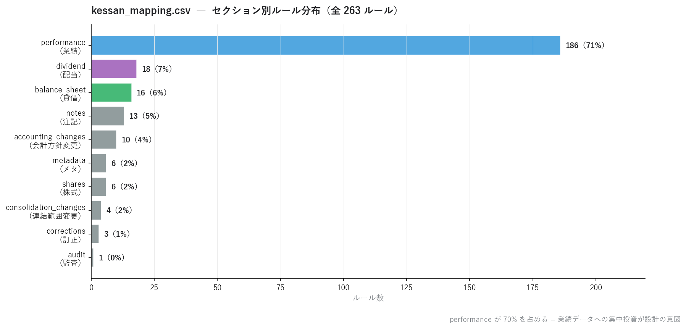
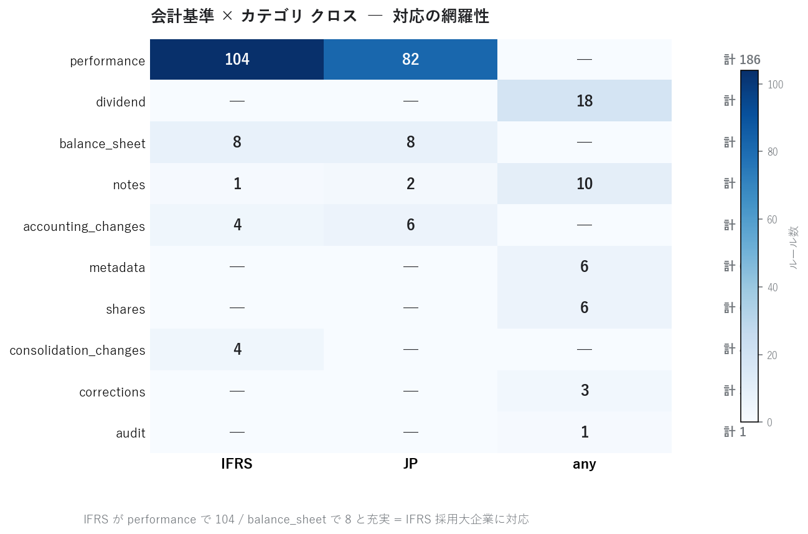
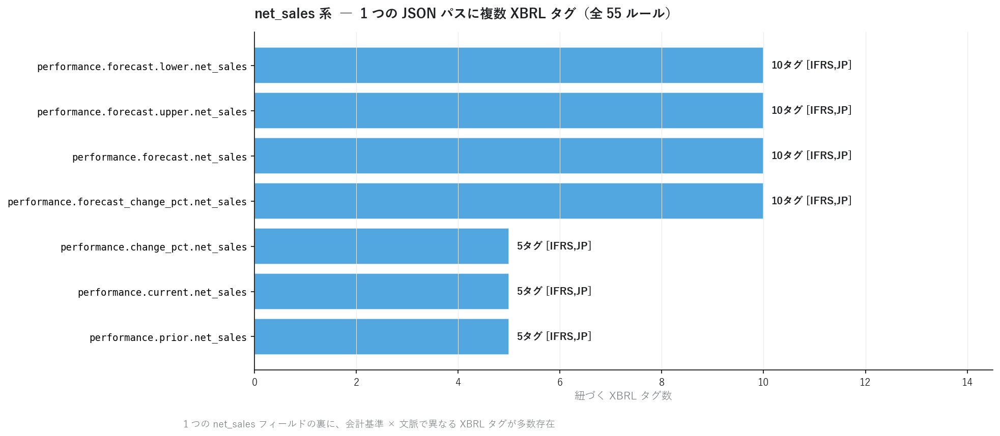
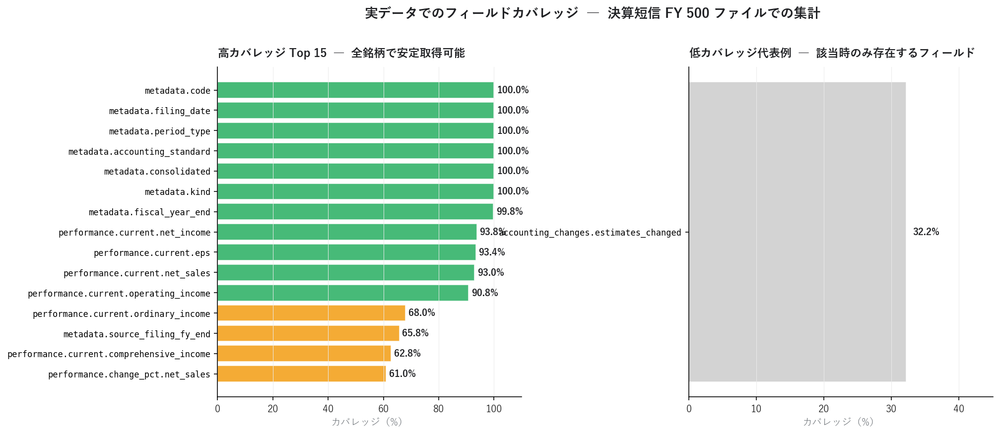
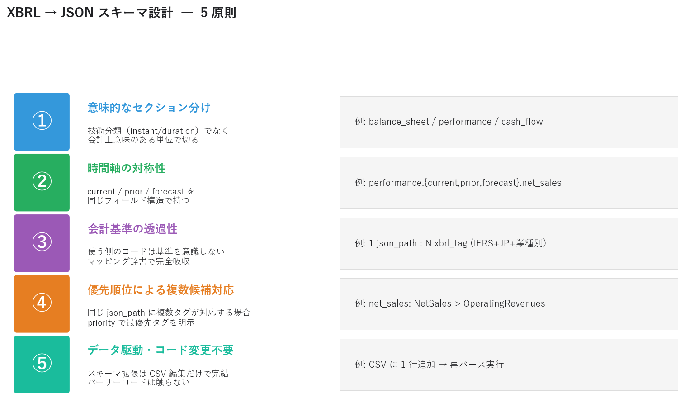

# 決算短信 JSON のスキーマ設計 ― XBRL の混沌を整理する独自スキーマの作り方

連載06 で「XBRL から見える 7 年時系列」を、連載07 で「取得とパースの実装」を解説しました。残るは最大の難所 ― **XBRL の混沌をどう独自スキーマに整理するか** です。

同じ "売上高" を表す XBRL タグは、日本基準・IFRS・業種別タクソノミでバラバラ。さらに当期/前期/予想/予想レンジ上限・下限といった時間軸の区別もあり、本連載の `kessan_mapping.csv` だけで **net_sales 系だけで 55 ルール** という巨大さです。これをどう整理して使う側のコードを楽にするか ― それがスキーマ設計の本質です。フェーズ 2 の集大成として、5 つの設計原則と実データのカバレッジを示します。

<!-- more -->

---

## ■ スキーマ設計の概要

### なぜ XBRL を「そのまま」使えないのか

XBRL は金融庁・取引所が定めた標準フォーマットですが、**使う側の負担が大きすぎる** という問題があります。

| 課題 | 例 |
|---|---|
| 会計基準で要素 ID が違う | 売上 = `NetSales`（JP） / `RevenueIFRS`（IFRS） / `Revenues`（IFRS 別表現） |
| 業種別タクソノミがある | 石油・ガス業は `jpigp_cor:` 名前空間で独自タグ |
| context（文脈）が分離される | 当期/前期/連結/個別が別タグではなく context の組み合わせで決まる |
| 1 ファイルに数百のタグ | 必要な財務項目はそのうち 40 程度 |

連載07 で示したように、市販データを超えたい個人投資家にとって XBRL は強力ですが、**それを毎回直接扱うのは現実的ではない**。「決算データ分析」と「XBRL タクソノミ理解」を切り離す層が必要です。

### 解決策 ― マッピング辞書 CSV と統一 JSON スキーマ

本連載のアプローチは、**マッピング辞書（CSV）で会計基準・文脈の差分を吸収し、統一 JSON スキーマで使う側に提供する** という設計です。

```
XBRL（カオス）
  ↓ kessan_mapping.csv（263 ルール）の照合
JSON スキーマ（整理）
  → performance.current.net_sales
  → balance_sheet.current.total_assets
  → segments.current.{...}
  → dividend.{forecast/current/prior}
  → ...
  ↓
使う側のコード（横串分析が容易）
```

統一 JSON が手に入れば、連載06 で示した **ＥＮＥＯＳ 7 期の net_sales / net_income / ROE** のような時系列分析を、たった数行の Python で書けます。

### 本記事で扱う設計原則

スキーマ設計は地味ですが、ここを丁寧にやるかどうかで **後段の分析の生産性が 100 倍変わります**。本記事では本連載で適用している 5 原則と、その結果としての実データカバレッジを示します。

```
本記事で扱うこと:
  ・kessan_mapping.csv の構造分析（263 ルール）
  ・「1 json_path : N xbrl_tag」という設計の威力
  ・実データ 500 ファイルでのフィールドカバレッジ
  ・スキーマ設計 5 原則とその実装例

本記事で扱わないこと:
  ・XBRL タクソノミの厳密な定義（連載07 で言及）
  ・パース失敗時のリカバリ戦略（連載11 三角検証で扱う）
```

---

## ■ 分析で分かったこと

`kessan_mapping.csv` 263 ルールの構造と、それが生み出す JSON の実データカバレッジを観察します。

### セクション別ルール分布 ― performance に 70% 集中

{width="950"}

決算短信 JSON のスキーマは **performance（業績）が 186 ルール、70% 強** を占めます。これは設計の意図的な選択です。

| セクション | ルール数 | 構成比 | 設計意図 |
|---|---|---|---|
| **performance** | **186** | 70% | 投資家が最も使うため集中投資 |
| dividend | 18 | 7% | 配当政策の時系列追跡 |
| balance_sheet | 16 | 6% | 主要 BS 項目（総資産・純資産・自己資本比率） |
| notes | 13 | 5% | 注記・後発事象 |
| accounting_changes | 10 | 4% | 会計方針変更（品質シグナル） |
| その他（meta/shares/...） | 20 | 8% | メタ情報・株式数・訂正等 |

performance の内訳は、連載04 で扱った業績モメンタムの構成要素そのものです：

```
performance.current.{net_sales, operating_income, ordinary_income, net_income, eps, ...}
performance.prior.{...}                          ← 前期実績（current と同じ構造）
performance.forecast.{...}                       ← 通期予想（current と同じ構造）
performance.forecast.upper.{...} / lower.{...}   ← 予想レンジ上下限
performance.change_pct.{...}                     ← 前期比
performance.forecast_change_pct.{...}            ← 予想前期比
```

**時間軸の各バリエーション × 数値項目** の組み合わせで 186 ルールに膨らみます。dividend や balance_sheet も同様の構造（current/prior/forecast）を持ちます。

### 会計基準 × カテゴリ の対応

{width="950"}

| カテゴリ | IFRS | JP | any | 合計 |
|---|---|---|---|---|
| **performance** | **104** | **82** | 0 | 186 |
| balance_sheet | 8 | 8 | 0 | 16 |
| accounting_changes | 4 | 6 | 0 | 10 |
| consolidation_changes | 4 | 0 | 0 | 4 |
| notes | 1 | 2 | 10 | 13 |
| dividend | 0 | 0 | 18 | 18 |
| metadata / shares / corrections / audit | 0 | 0 | 14 | 14 |

読み取れる設計の特徴：

1. **performance は IFRS / JP の両方を厚く対応**（104 + 82）。連載06 でＥＮＥＯＳ（IFRS 採用）の業績を市販データと同等以上に取れたのは、この厚みのおかげ
2. **balance_sheet は IFRS / JP が同数**（8 + 8）。連結ベースの主要項目に絞った設計
3. **dividend / metadata / shares は accounting_standard = "any"**。これらは会計基準に依存しないメタ情報なので 1 つのルールで全企業対応
4. **consolidation_changes は IFRS 専用**（連結範囲変更は IFRS 採用企業で多く発生）

### 「1 json_path : N xbrl_tag」 ― 設計の威力

{width="950"}

net_sales 系 JSON パスだけで **55 ルール** が存在します。

| json_path | 紐づくタグ数 |
|---|---|
| performance.forecast.lower.net_sales | 10 |
| performance.forecast.upper.net_sales | 10 |
| performance.forecast.net_sales | 10 |
| performance.forecast_change_pct.net_sales | 10 |
| performance.current.net_sales | 5 |
| performance.prior.net_sales | 5 |
| performance.change_pct.net_sales | 5 |

予想（forecast）系の json_path に 10 タグずつ紐づくのは、**業績予想に複数の表現方法があるため**：

```
予想通期売上 のタグ候補:
  ・tse-ed-t:ForecastNetSales                 (JP, FY)
  ・tse-ed-t:ForecastNetSalesIFRS             (IFRS, FY)
  ・tse-ed-t:ForecastRevenueIFRS              (IFRS, FY, 別表現)
  ・tse-ed-t:RangeForecastNetSales            (JP, FY, レンジ)
  ・tse-ed-t:RangeForecastNetSalesIFRS        (IFRS, FY, レンジ)
  ・... 計 10 タグ
```

これを **使う側は意識せず `performance.forecast.net_sales` 1 つで取り出せる** のが、マッピング辞書による吸収の威力です。連載03 で使った業績予想修正率を時系列で追えるのは、この net_sales 系 55 ルールが裏で支えているからです。

### 実データのフィールドカバレッジ

スキーマがどれだけ「実用的に機能しているか」を測るには、実データを通してみるのが一番です。決算短信 FY 500 ファイルで各 JSON パスの出現率を集計しました。

{width="950"}

**Top 高カバレッジ**（全銘柄で安定取得可能）：

| フィールド | カバレッジ |
|---|---|
| metadata.code | 100.0% |
| metadata.filing_date | 100.0% |
| metadata.accounting_standard | 100.0% |
| metadata.fiscal_year_end | 99.8% |
| performance.current.net_income | 93.8% |
| performance.current.eps | 93.4% |
| performance.current.net_sales | 93.0% |
| performance.current.operating_income | 90.8% |
| performance.current.ordinary_income | 68.0% |
| performance.current.comprehensive_income | 62.8% |

metadata は **100% カバレッジ**。これはスキーマ設計が正しく機能している証です。逆に `ordinary_income`（経常利益）が 68% に留まるのは、IFRS 採用企業が「経常利益」概念を使わない（営業利益 → 税引前利益 の構造）ためです。これは欠陥ではなく **会計基準の正直な反映** です。

**低カバレッジの代表例**（該当時のみ存在するフィールド）：

| フィールド | カバレッジ | 解釈 |
|---|---|---|
| dividend.current.q4_dps | 数 % | 4Q 配当を分けて公表する企業のみ |
| accounting_changes.estimates_changed | 数 % | 会計上の見積り変更があった企業のみ |
| consolidation_changes.scope_change | 数 % | 連結範囲変更があった企業のみ |
| corrections.original_filing_date | 0.2% | 訂正報告書だけが持つ |
| segments.aggregates.*.* | 0.2% | parser_version 0.1.x で集約済みデータを持つ企業のみ |

低カバレッジのフィールドは **「該当する場合のみ存在する」** タイプ。むしろこのカバレッジ分布があるからこそ、「業績悪化なのに会計上の見積り変更があった」のような **品質シグナル** を後段の連載10（アクルーアル）や 11（三角検証）で活用できます。

### スキーマ設計の 5 原則

ここまでの観察を踏まえ、本連載でのスキーマ設計原則をまとめます。

{width="950"}

**① 意味的なセクション分け**
技術分類（XBRL の `instant` / `duration` など）ではなく、会計的に意味のある単位で切ります。`balance_sheet` / `performance` / `cash_flow` / `dividend` のように。

**② 時間軸の対称性**
`current` / `prior` / `forecast` を **同じフィールド構造** で持ちます。同じコードで `current` と `prior` を扱えれば、前期比などのロジックが 1 行で書けます。

```python
def growth_rate(d, field):
    cur = d["performance"]["current"][field]
    prv = d["performance"]["prior"][field]
    return (cur - prv) / prv * 100
```

**③ 会計基準の透過性**
使う側のコードは基準を意識しません。`1 json_path : N xbrl_tag` の設計で、マッピング辞書が完全に吸収します。連載06 でＥＮＥＯＳ（IFRS）と日本基準銘柄を同じグラフ上で比較できたのは、この透過性の成果。

**④ 優先順位による複数候補対応**
同じ json_path に複数タグが対応するとき、`notes` 列の priority で最優先タグを明示します。「`NetSales` があれば `OperatingRevenues` より優先」というルールで、安定した値選択を実現。

**⑤ データ駆動・コード変更不要**
スキーマ拡張は **CSV 編集だけで完結** し、パーサーコードは触りません。新しいフィールドを追加するときの手順は：

```bash
# 1. CSV に 1 行追加（XBRL タグ ID と JSON パスの対応）
echo "tse-ed-t:NewMetric,JP,performance,current,Current{period}Duration,performance.current.new_metric,int,JPY,priority 1" >> collectors/kessan_mapping.csv

# 2. 再パース実行
python collectors/xbrl_to_json.py
```

これだけ。連載10〜16 のフェーズ 3 以降で新指標を扱うとき、毎回この CSV 編集だけで済みます。

---

## ■ スキーマ設計の判断ロジック

ここまでの 5 原則を、実装の具体的な判断シーンに落とし込みます。

### 1. マッピング辞書のスキーマ

`kessan_mapping.csv` は 9 列構造です。

```csv
xbrl_tag,accounting_standard,category,context_role,context_pattern,json_path,value_type,unit_ref,notes
tse-ed-t:NetSales,JP,performance,current,Current{period}Duration_ConsolidatedMember_ResultMember,performance.current.net_sales,int,JPY,priority 1
tse-ed-t:NetSalesIFRS,IFRS,performance,current,Current{period}Duration_ConsolidatedMember_ResultMember,performance.current.net_sales,int,JPY,priority 1
tse-ed-t:OperatingRevenues,JP,performance,current,Current{period}Duration_ConsolidatedMember_ResultMember,performance.current.net_sales,int,JPY,priority 2
```

| 列 | 役割 |
|---|---|
| `xbrl_tag` | 入力側（XBRL の要素 ID） |
| `accounting_standard` | 適用条件（IFRS / JP / any） |
| `category` | スキーマ上の大分類（performance / balance_sheet / ...） |
| `context_role` | 時間軸（current / prior / forecast / ...） |
| `context_pattern` | XBRL 内の context 名のテンプレート |
| `json_path` | 出力側（ドット区切り） |
| `value_type` | 型変換（int / float / str / date / bool） |
| `unit_ref` | 単位（JPY / shares / pure / —） |
| `notes` | 優先順位や注釈 |

**「同じ json_path に複数行」を許容する設計** がポイント。net_sales 系で 55 ルールがあるのもこの構造のおかげです。

### 2. パーサーの基本ロジック

```python
import pandas as pd

def parse_xbrl_to_json(xbrl_data: dict, mapping_df: pd.DataFrame) -> dict:
    """マッピング辞書で XBRL から JSON を構築。priority で衝突解決。"""
    result: dict = {}
    written_priority: dict[str, int] = {}

    for _, rule in mapping_df.iterrows():
        # 1. 会計基準フィルタ
        if rule["accounting_standard"] not in ("any", xbrl_data["accounting_standard"]):
            continue

        # 2. XBRL タグから値を取り出す
        value = find_xbrl_value(xbrl_data, rule["xbrl_tag"], rule["context_pattern"])
        if value is None:
            continue

        # 3. 型変換
        value = convert_value(value, rule["value_type"])

        # 4. priority で衝突解決（小さいほど優先）
        path = rule["json_path"]
        prio = parse_priority(rule["notes"])  # default 99
        if path in written_priority and written_priority[path] < prio:
            continue   # 既に優先度の高い値が書かれている

        # 5. ネスト構造に書き込む
        set_nested(result, path, value)
        written_priority[path] = prio

    return result
```

**priority による衝突解決** が肝。同じ `performance.current.net_sales` に複数のタグから値が候補に上がっても、**priority が最も小さい（=最優先）タグの値だけが採用** されます。

### 3. スキーマのバージョン管理

JSON 出力には `_source.parser_version` を含めます。

```json
{
  "metadata": {"code": "5020", "fiscal_year_end": "2025-03-31", ...},
  "performance": {...},
  "_source": {
    "format": "edinet-xbrl-csv",
    "file": "S100W1E2.zip",
    "parser_version": "0.2.0"
  }
}
```

これにより：
- スキーマ非互換変更時に既存 JSON を識別可能
- 0.2.x で対応していなかった項目（連載06 で言及した営業利益 2019-2023）が、0.3.x で取れるようになったら識別できる
- マイグレーションスクリプトが書きやすい

### 4. CSV 編集での拡張手順

新フィールド追加の典型手順：

```
1. XBRL タクソノミドキュメントで対象タグ ID を特定
2. その企業の生 XBRL（or XBRL_TO_CSV）でタグが実在することを確認
3. kessan_mapping.csv に 1 行追加
4. python collectors/xbrl_to_json.py で再パース
5. data/statements/*.json で新フィールドの出現を確認
6. カバレッジを measure
```

実装コードは一切変更しません。**スキーマ拡張がレビューしやすい CSV diff になる** のもデータ駆動設計の副次的なメリットです。

---

## ■ Python コードの紹介

スキーマ駆動の典型ユースケースを Python で示します。

### 横串分析の最小実装

統一スキーマがあれば、500 ファイルの決算短信を 10 行で横串分析できます。

```python
import json, glob
import pandas as pd

records = []
for f in glob.glob("data/statements/*_FY.json"):
    with open(f, encoding="utf-8") as fp:
        d = json.load(fp)
    records.append({
        "code":      d["metadata"]["code"],
        "fy_end":    d["metadata"]["fiscal_year_end"],
        "std":       d["metadata"]["accounting_standard"],
        "net_sales": d.get("performance", {}).get("current", {}).get("net_sales"),
        "op_income": d.get("performance", {}).get("current", {}).get("operating_income"),
        "ni":        d.get("performance", {}).get("current", {}).get("net_income"),
    })

df = pd.DataFrame(records)
# 会計基準を意識せず、全銘柄横串で営業利益率を計算
df["op_margin"] = df["op_income"] / df["net_sales"] * 100
print(df.nlargest(10, "op_margin"))
```

連載04 のサプライズスコアや、連載01 の GARP スコアも、最終的にはこの形のコードに落ちます。

### カバレッジ計測

スキーマの「実用性」を測る関数：

```python
def measure_coverage(stmt_dir: str = "data/statements",
                    pattern: str = "*_FY.json") -> pd.DataFrame:
    """JSON 各パスの出現率を集計。"""
    field_counts: dict[str, int] = {}
    total = 0

    for f in glob.glob(f"{stmt_dir}/{pattern}"):
        total += 1
        with open(f, encoding="utf-8") as fp:
            d = json.load(fp)

        def walk(obj, path=""):
            if isinstance(obj, dict):
                for k, v in obj.items():
                    if v is None:
                        continue
                    walk(v, f"{path}.{k}" if path else k)
            elif not isinstance(obj, list):
                field_counts[path] = field_counts.get(path, 0) + 1

        walk(d)

    return pd.DataFrame({
        "field":    list(field_counts.keys()),
        "count":    list(field_counts.values()),
        "coverage": [c / total * 100 for c in field_counts.values()],
    }).sort_values("coverage", ascending=False)
```

新しいフィールドを追加した直後にこれを実行すれば、**そのフィールドの実用カバレッジ** がすぐ分かります。

### マッピング辞書の品質チェック

```python
def audit_mapping(csv_path: str = "collectors/kessan_mapping.csv") -> dict:
    """マッピング辞書のカバレッジ感を集計。"""
    df = pd.read_csv(csv_path)
    return {
        "total_rules":       len(df),
        "unique_json_paths": df["json_path"].nunique(),
        "avg_tags_per_path": len(df) / df["json_path"].nunique(),
        "by_section":        df["json_path"].str.split(".").str[0].value_counts().to_dict(),
        "by_standard":       df["accounting_standard"].value_counts().to_dict(),
    }


print(audit_mapping())
# → total_rules: 263
# → unique_json_paths: ~90
# → avg_tags_per_path: 2.9（1 パスあたり平均 2.9 個の XBRL タグが紐づく）
```

「1 json_path あたり平均 3 タグ」という数字は、**会計基準と業種別タクソノミの差分吸収にどれだけ投資しているか** の指標になります。

---

## ■ 既存スキーマ vs 公式 XBRL の比較

| 観点 | 公式 XBRL | 本連載の独自 JSON |
|---|---|---|
| データ構造 | XML（タクソノミ依存） | JSON（フラットに近い） |
| 会計基準対応 | 利用者が自分で吸収 | スキーマで自動吸収 |
| 学習コスト | 高い（タクソノミ理解必須） | 低い（辞書的） |
| 横串分析 | 困難 | 容易 |
| 拡張性 | 公式タクソノミ依存 | CSV 編集で自由拡張 |
| 容量 | 大きい（メタデータ込み） | 小さい（必要項目のみ） |

公式 XBRL は **金融庁が定めた網羅的な仕様** ですが、実用には冗長です。独自スキーマは **「投資判断に必要な項目に絞った扱いやすい形」** にすることで、分析の生産性を大幅に上げます。

「すべての XBRL タグを完璧に取り込む」ことは目標にしません。**目的は投資判断であり、XBRL タクソノミの忠実な再現ではない** ― この割り切りが設計の自由度を生みます。

---

## まとめ ― フェーズ 2 の総括

- XBRL の混沌を独自 JSON スキーマで整理。マッピング辞書 `kessan_mapping.csv` の **263 ルール / 約 90 個の json_path** が本体
- セクション別では **performance に 70% 集中**（186 ルール）。投資家が最も使う業績データへの集中投資
- **「1 json_path : N xbrl_tag」設計** で会計基準（IFRS 121 / JP 98 / any 44）と業種別タクソノミの差分を吸収。net_sales 系だけで 55 ルール
- 実データ 500 ファイルでのカバレッジは **metadata 100% / 業績核項目（net_sales/net_income/eps/operating_income）90% 以上** と高水準
- 低カバレッジは「該当時のみ存在する」タイプ（会計方針変更・訂正・連結範囲変更等）で、欠陥ではなく品質シグナルの源泉
- スキーマ設計 5 原則: ① 意味的セクション ② 時間軸対称 ③ 会計基準透過 ④ 優先順位 ⑤ データ駆動。**CSV 編集だけでスキーマ拡張可能**
- 連載06 で示したＥＮＥＯＳ 7 期データが、市販データを超える価値を持つのは、この設計の上に成立している

これでフェーズ 2（XBRL 基礎）の 3 本（連載06・07・08）が完成しました。次回からは **フェーズ 3: XBRL 活用分析** に入り、独自スキーマで蓄積した JSON を実際に使って **進捗率 Z-score 早期警報・アクルーアル分析・三角検証** などの本格的な銘柄分析を行います。連載01〜05 のフェーズ 1（市販データ分析）と連載06〜08 のフェーズ 2（XBRL 基盤構築）で築いた土台の上に、機関投資家レベルの定量分析が乗っていきます。

---

*マッピング辞書: `collectors/kessan_mapping.csv` (263 ルール) / `collectors/yuho_mapping.csv` (98 ルール)。本記事の数値は 2026-05-21 時点の自前パイプライン状況*
