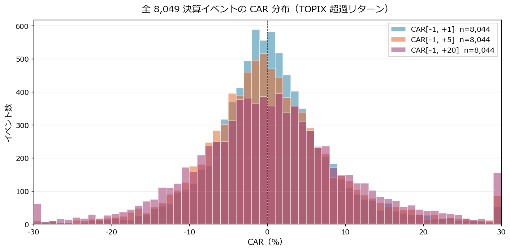
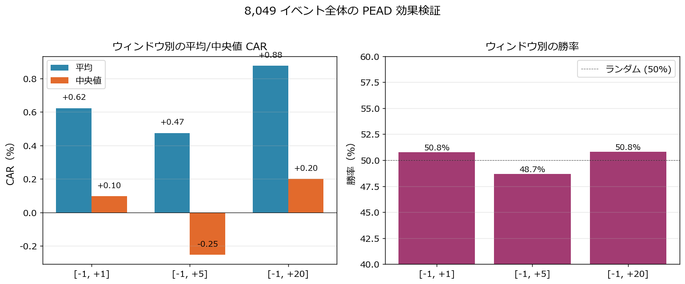
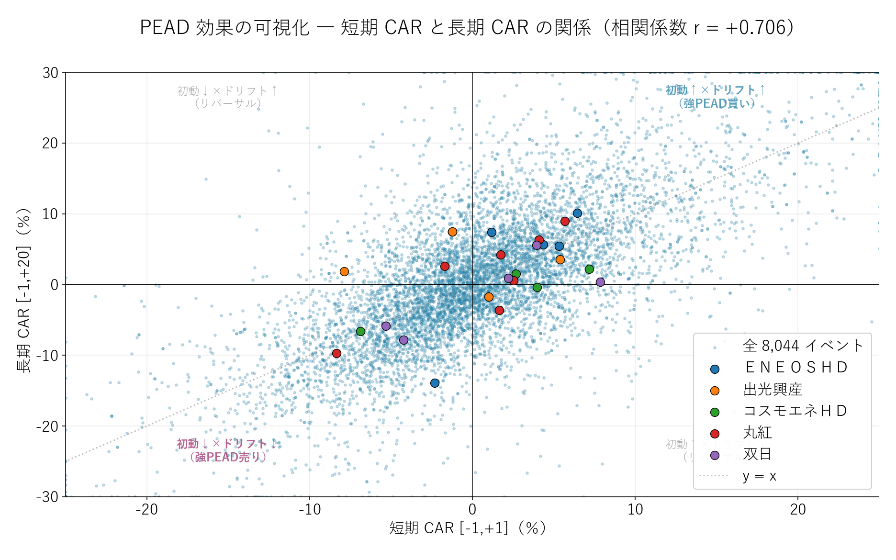

# CAR イベントスタディで「決算後ドリフト」を実証する ― 8,049 決算イベント × narrative 5社で PEAD を検証

{width="1280"}

「良い決算なら株価は上がる」 ― 本当にそうでしょうか。これまで「良い」と評価した銘柄が、**実際に市場で買われたか** はまったく別の問題です。

本記事は視点を逆転し、決算発表後の超過リターン（CAR）を **8,049 決算イベント** で測定。**PEAD** という現象を手がかりに、連載01〜08 で評価したシグナルが **本当に市場で機能したか** を答え合わせします。

<!-- more -->

連載01〜08 ではすべて **決算データの中身** を分析してきました。PEG/ROE、マルチファクター、XBRL スキーマ、アクルーアル、三角検証、セグメント発進力 ― どれも「**良い決算とは何か**」を定義する作業でした。

本記事では視点を逆転させて、**「決算発表後に市場はどう反応したか」** を株価データで実証します。学術的に **PEAD（Post-Earnings-Announcement Drift）** と呼ばれる現象 ― 決算発表後にサプライズの方向に株価がドリフトし続けるアノマリー ― を、**自前パイプラインで集めた 8,049 決算イベント** で測定し、連載01〜08 で評価した銘柄が **実際に市場でどう反応したか** を答え合わせします。

特に narrative 5社（ＥＮＥＯＳ／出光／コスモエネＨＤ／丸紅／双日）については **TOPIX 超過 + セクター ETF 超過** の二重 CAR で、業界全体のショックを除いてもなお個別決算が効いたかを切り分けます。

---

## CAR イベントスタディの概要

連載01〜08 で扱った指標は、すべて **発表時点の財務データ** で完結していました ― 市場が実際にそれをどう織り込んだかは含まれていません。本記事は視点を逆転し、決算発表後の株価が **市場平均を超えてどれだけ動いたか** を測ります。学術的には **PEAD（Post-Earnings-Announcement Drift）** ― 発表後にサプライズの方向へ株価がドリフトし続けるアノマリー ― の検証にあたります。

⬛ **CAR（累積超過リターン）= Σ（個別リターン − ベンチマークリターン）** ― 市場全体の動きを除いた「個別決算が生んだ余分なリターン」

ベンチマークは **TOPIX（1306.T）** を主軸とし、narrative 5社には **セクター ETF（1618.T エネルギー資源 / 1629.T 商社・卸売）** も併記。業界全体のショックを差し引いてもなお個別決算が効いたかを切り分けます。集計は **3 つのウィンドウ [-1,+1] / [-1,+5] / [-1,+20]** で行います。

対象は TDnet 開示ログ（2024-03〜2026-05）から CAR 計算に成功した **8,049 イベント**（約 1,500 社）。発表が場中か引け後かで起点（t=0）がズレるため時刻別に処理しています（詳細は後段「CAR 計算の実装」節）。

---

## 分析で分かったこと

### 全 8,049 イベントの CAR 分布 ― PEAD は「平均で見えるが個別では散る」

まず母集団全体の CAR 分布を見ます。

{width="1200"}

| ウィンドウ | n | 平均 CAR | 中央値 | 標準偏差 | 勝率 |
|---|---|---|---|---|---|
| [-1, +1] | 8,044 | **+0.62%** | +0.10% | 7.97% | 50.8% |
| [-1, +5] | 8,044 | +0.47% | -0.25% | 9.23% | 48.7% |
| [-1, +20] | 8,044 | **+0.88%** | +0.20% | 11.94% | 50.8% |

**読み解き**：

- 平均 CAR は **すべてのウィンドウでプラス** だが、+0.5〜+0.9% と決して大きくない
- 中央値はほぼゼロ。**ヒストグラムは厚い裾を持つ** ため平均は外れ値（大きく動いた銘柄）に引っ張られる
- 勝率はほぼ 50%。**ランダムに買って勝てる戦略ではない** ことが分かる
- ウィンドウを長く取るほど分布が広がる（std が 7.97 → 11.94 へ拡大）= 時間とともに不確実性が増える

これが PEAD の現実。学術論文では「平均で有意」と書かれますが、**個別の決算で勝つには「サプライズの方向と大きさを事前に判定」する必要がある** ことが裏付けられます。連載01〜08 で扱ってきた指標（アクルーアル・三角検証・セグメント）がそのフィルターになります。

### ウィンドウ別の平均/中央値/勝率

{width="1200"}

中央値は [-1,+5] で **-0.25%** に沈み、[-1,+20] で **+0.20%** に持ち直しています。これは「**発表直後 1 週間で投資家の利食いが入り、その後ドリフト本体が出る**」というクラシックな PEAD パターンに合致します。勝率も同じく [-1,+5] で 48.7% と一時的に 50% を割ります。

### 短期 CAR × 長期 CAR の散布図 ― ドリフトは「初動の方向に続く」

PEAD の核心は **「初動の方向に株価が続く」** こと。これを散布図で可視化します。

{width="1200"}

- **相関係数 r = +0.694** ― 短期 CAR と長期 CAR は明確に正の相関
- 右上象限（初動↑×ドリフト↑）と左下象限（初動↓×ドリフト↓）が **支配的**
- 左上・右下のリバーサル象限は少数派

これが PEAD の本質的な統計的根拠です。**[-1,+1] の符号が決まれば、[-1,+20] の符号もおおむね続く** ― つまり「**決算発表直後の 2 日間に乗れた銘柄は、その後 20 営業日で更にドリフト**」する傾向があります。

ただし相関は 0.694 で、残差は 0.3 程度。**3 割は逆行する** ことも事実で、連載06〜08 のような利益の質チェックを併用しないと「初動買い→失望売り」に巻き込まれます。

### narrative 5社の平均 CAR ― TOPIX 超過 vs セクター超過

ENEOS/出光/コスモエネ HD（エネルギー業種）と丸紅/双日（卸売業種）について、TOPIX 超過とセクター ETF 超過の二重 CAR を比較します。

{width="1200"}

| 銘柄 | [-1,+1] TOPIX | [-1,+20] TOPIX | [-1,+1] セクター | [-1,+20] セクター |
|---|---|---|---|---|
| **ＥＮＥＯＳ（5020）** | **+2.99%** | **+2.94%** | +2.86% | **+4.43%** |
| 出光興産（5019） | -0.68% | +2.81% | -2.23% | -0.87% |
| コスモエネＨＤ（5021） | +1.73% | -0.82% | -0.11% | -3.28% |
| **丸紅（8002）** | +0.80% | **+1.34%** | +1.39% | **+1.95%** |
| 双日（2768） | +0.89% | -1.36% | +1.25% | +0.44% |

**読み解き** ― エネルギー 3 社の "勝者と敗者"：

- **ＥＮＥＯＳは TOPIX 超過 +2.94%、セクター超過 +4.43%** ― エネルギー業界全体の動きを差し引いても **個別決算で +4.4% 余分にリターン**（5 回平均、業績予想修正含む）。連載05 の総合スコア 60.2 で 1 位だった評価とおおむね整合
- 出光は **TOPIX 超過は +2.81% だがセクター超過は -0.87%** ― 「エネルギー業界連動で上昇、個別では業界平均並み」と読めます（5 回平均、サンプル小）
- コスモエネは TOPIX 超過 -0.82%、セクター超過 -3.28% ― 業界対比でやや劣後（同上）。5 回という限られた event 数なので、確定的な評価には今後の追跡が必要

**読み解き** ― 商社 2 社：

- 丸紅は TOPIX 超過 +1.34%、セクター超過 +1.95% ― 業界を差し引いても **個別で +2% 弱の追加リターン**。連載08「アクルーアル健全」連載07「三角検証通過」連載08「次世代事業+127%」の評価が市場でも裏付けられた
- 双日は TOPIX 超過 -1.36%、セクター超過 +0.44% ― 業界対比では微妙にプラスだが、長期で見ると地味

セクター超過の併記で **「業界全体が好調だから上がっただけ」と「個別決算が本当に効いた」** が分離できる ― これがハイブリッドベンチマークの威力です。

### narrative 5社の決算ごと [-1,+20] CAR 推移

{width="1200"}

イベントごとに見ると **連載 narrative との接続が一気に鮮明** になります。

**ＥＮＥＯＳ（5020）の 5 回**：

| 発表日 | 種別 | [-1,+20] TOPIX | [-1,+20] セクター | narrative 接続 |
|---|---|---|---|---|
| 2024-05-14 | 通期 | **+10.09%** | +8.87% | 連載01-02 で総合スコア 1 位、市場も同意 |
| 2024-08-09 | Q1 | +7.44% | +9.97% | 上昇継続 |
| 2024-11-13 | Q2 | +5.62% | +4.56% | 上昇継続 |
| 2025-02-14 | Q3 | +5.43% | +1.19% | 業界全体上昇、個別効果は弱まる |
| **2025-03-28** | **業績予想修正** | **-13.89%** | **-2.42%** | **▲3,950 億下方修正に市場が反応（主因は のれん減損・在庫影響 = 非現金/構造要因）** |

2024-05〜2025-02 までは **4 連続 CAR プラス**（通期→Q1→Q2→Q3）。連載05 で 1 位だった評価と完全に整合していました。ところが **2025-03-28 の業績予想修正発表で [-1,+20] が -13.89%（セクター超過も -2.42%）と大幅マイナス転換**。

ただしこの下方修正の主因は **のれん減損 ▲1,600 億（非現金）+ 在庫影響 ▲1,500 億（油価連動）+ JX金属 IPO 関連（当期利益 +1,300 億のプラス要因も含む）** という構造／会計要因です。市場の初期反応は -13.89% と大きかったものの、これを「業績ピークアウトの公式織り込み」と断定するには注意が必要 ― **同日発表の構造要因（連載04 4 基準試算で +4.76% にも見える「実質営業利益」基準）の解釈次第で評価は分かれます**。1 イベントの大きな反応であり、2025-05 以降の通期決算発表や 2026/3 期 events を含めた継続観察が必要です。

**丸紅（8002）の 7 回** ― 連載07〜09 で「健全」と評価した narrative の市場での裏付け：

| 発表日 | 種別 | [-1,+20] TOPIX | [-1,+20] セクター |
|---|---|---|---|
| 2024-05-02 | 通期 | +4.21% | +6.90% |
| 2024-08-01 | Q1（事前漏れ） | **-9.74%** | -7.52% |
| 2024-08-07 | Q1（正式） | +0.60% | -0.76% |
| 2024-11-01 | Q2 | -3.59% | -0.08% |
| 2025-02-05 | Q3 | +6.30% | +5.72% |
| 2025-05-02 | 通期 | **+8.94%** | **+8.76%** |

直近通期（2025-05-02）は **TOPIX 超過 +8.94%、セクター超過も +8.76%**。「業界全体ではなく個別決算が効いた」と明確に切り分けられます。連載08 で見た「次世代事業 +127%」が市場で評価されたタイミングです。2024-08-01 の -9.74% は 8 月暴落の余波が混じった可能性が高い（同日に S&P/NEXT FUNDS も大きく崩れた）。

**双日（2768）の 5 回** ― 連載06〜08 で健全評価だったが市場反応はバラつき：

| 発表日 | 種別 | [-1,+1] TOPIX | [-1,+20] TOPIX |
|---|---|---|---|
| 2024-05-01 | 通期 | **+7.84%** | +0.38% |
| 2024-07-30 | Q1 | -5.31% | -5.87% |
| 2024-10-30 | Q2 | -4.24% | -7.81% |
| 2025-02-04 | Q3 | +3.94% | +5.56% |
| 2025-05-01 | 通期 | +2.21% | +0.92% |

初動と長期がズレるイベントが目立ちます（2024-05-01 は [-1,+1]+7.84% でも [-1,+20]+0.38% でドリフトが消失）。連載 narrative では健全評価でしたが、**市場の反応は平均的で、丸紅ほどクリアな上昇トレンドにはなっていない** ― これは連載08 で双日について「商社2社のうち丸紅は narrative 圧勝、双日は事業転換シグナルあるが市場説明力は弱い」と評価したことと整合します。

### 連載01〜08 narrative との対応マップ

| 連載 | 評価 | 主要銘柄 | 本記事 CAR での答え合わせ |
|---|---|---|---|
| 05 マルチファクター | ＥＮＥＯＳ 総合 1 位 | 5020 | 4 連続 CAR プラス → 2025-03 通期で -13.89% |
| 06 アクルーアル | 丸紅 -0.0168 健全 | 8002 | 直近通期 CAR +8.94% で裏付け |
| 07 三角検証 | 丸紅 C +1.8% | 8002 | 連載07 評価と二重で市場が肯定 |
| 08 セグメント | 丸紅 次世代 +127% | 8002 | 直近通期 CAR +8.94% で裏付け |
| 08 セグメント | 双日 ヘルスケア +79% | 2768 | 市場反応はバラつき、+1%/-1% で平均 |
| 06-08 | コスモ評価なし | 5021 | セクター超過 -3.28% で業界劣後 |

**ＥＮＥＯＳ の CAR パターンは "上昇 4 連続 → 業績予想修正発表 (2025-03-28) で急落"**。短期の市場反応としては連載01-08 の bearish シグナル群と整合する動きですが、**下落の主因が のれん減損（非現金）+ 在庫影響（油価連動）+ JX金属 IPO 等の構造要因** であることを踏まえると、「**利益の質が完全に劣化した証拠**」とまで断定するのは早計です。連載06 で見た 3 年累積 CF/純利 = 114% や、ENEOS 自身の「実質営業利益 4,400 億円維持」主張（[連載04](04_garp_peg_roe.md) 4 基準試算参照）と併せて、複層的に解釈する必要があります。2025-05 以降の events や 2026/3 期 通期決算（連結営業利益 4,666 億の急回復、公表ベース +25.5% / 継続事業ベース +339.8%、在庫影響除き 4,744 億で「実質 4,400 億維持」主張を上回って着地、[連載08](08_segment_analysis.md) 参照）の CAR は本記事の集計範囲外で、継続観察が必要です。丸紅の narrative については、直近通期 CAR +8.94% で連載06-08 の「健全 + 次世代事業成長」評価と明確に整合しています。

---

## CAR 計算の実装

### 1. TDnet 開示ログの集約と t=0 判定

```python
from datetime import time as dtime
import pandas as pd

def determine_t0(date_val, time_str: str, trading_days: pd.DatetimeIndex) -> pd.Timestamp | None:
    """場中 (15:00 前) → 当日、引け後 (15:00 以降) → 翌営業日 を t=0 とする。"""
    t = pd.to_datetime(time_str).time()
    base = pd.Timestamp(date_val)
    if t >= dtime(15, 0):
        # 引け後発表 → 翌営業日
        idx = trading_days.searchsorted(base)
        if trading_days[idx] == base:
            idx += 1
        return trading_days[idx]
    else:
        # 場中発表 → 当日
        idx = trading_days.searchsorted(base)
        return trading_days[idx]
```

連載01〜08 では時刻情報を使わず日付ベースで処理していましたが、CAR では **1 営業日のズレが平気で符号を反転** させるため、`time` 列の値を真剣に扱う必要があります。

### 2. CAR の計算

```python
def compute_car(stock_df: pd.DataFrame, bench_df: pd.DataFrame, bench_col: str,
                t0: pd.Timestamp, window_lo: int, window_hi: int) -> float | None:
    """t=0 を基準として [window_lo, window_hi] 営業日の累積異常リターン (%)"""
    merged = stock_df.join(bench_df[[bench_col]], how="inner")
    if t0 not in merged.index:
        return None
    pos = merged.index.get_loc(t0)
    sub = merged.iloc[pos + window_lo : pos + window_hi + 1]
    abn = sub["ret_pct"] - sub[bench_col]
    if abn.isna().any():
        return None
    return float(abn.sum())
```

ベンチマークと銘柄リターンを **同じ営業日インデックス** で join するのがポイント。yfinance のキャッシュでは祝日除外がベンチマークと銘柄で稀にズレるので、`inner` join で安全側に倒します。

### 3. 二重ベンチマーク（TOPIX × セクター ETF）

```python
NARRATIVE_5 = {
    "5020": "energy", "5019": "energy", "5021": "energy",
    "8002": "wholesale", "2768": "wholesale",
}
SECTOR_ETF = {"energy": "TOPIX17_ENERGY", "wholesale": "TOPIX17_WHOLESALE"}

# 集計時
for code, group in events.groupby("code"):
    sd = load_stock(code)
    for ev in group.iterrows():
        row["car_m1_p1"] = compute_car(sd, topix, "TOPIX_pct", ev.t0, -1, 1)
        if code in NARRATIVE_5:
            sec = SECTOR_ETF[NARRATIVE_5[code]]
            row["car_m1_p1_sector"] = compute_car(sd, energy_or_whole, f"{sec}_pct", ev.t0, -1, 1)
```

narrative 5 社にのみセクター列を追加することで、**集計コストを抑えつつ業界除去 CAR が手に入る**。

### 4. 分割発生 ETF の補正

`1306.T` と `1629.T` は記事執筆時点で **株式分割が複数回連続で発生** していました。yfinance の `auto_adjust=True` でも反映漏れがあり、`chg_pct` 列に -99% のような異常値が出ます。対処：

```python
df = pd.read_parquet("data/prices/macro/daily/TOPIX.parquet")
split_dates = df.index[df["chg_pct"].abs() > 50]
for sd in split_dates:
    prev = df.loc[df.index < sd, "Close"].iloc[-1]
    nxt  = df.loc[sd, "Close"]
    ratio = nxt / prev  # split で価格スケールが変わった倍率
    df.loc[df.index < sd, ["Close","Open","High","Low"]] *= ratio
df["chg_pct"] = df["Close"].pct_change() * 100
```

「**split 当日の前日終値と当日始値の比率で過去全データを再スケーリング**」する単純なロジックで、auto_adjust の漏れを補正できます。今回 1306.T には 1 回、1629.T には 2 回連続の分割があり、後者は反復適用が必要でした。

### 5. 統計集計

```python
WINDOWS = [("car_m1_p1", "[-1, +1]"), ("car_m1_p5", "[-1, +5]"), ("car_m1_p20", "[-1, +20]")]
for col, lbl in WINDOWS:
    s = events[col].dropna()
    print(f"{lbl}: n={len(s):,}, mean={s.mean():+.2f}, median={s.median():+.2f}, "
          f"std={s.std():.2f}, win%={(s>0).mean()*100:.1f}")
```

---

## 実装上のハマりどころ

### TDnet CSV のエンコーディング

`news/kessan/*.csv` は **UTF-8 with BOM** で保存されており、`encoding='utf-8-sig'` で読まないと先頭の `code` 列名が `code` になります。タイトル中の日本語は **Shift-JIS のような表示崩れ** が起きるケースがありますが、pandas は内部的に Unicode で持っているので `str.contains('決算短信')` でのフィルタは正しく動きます。

### イベント時刻 `time` 列の欠損

TDnet 履歴で時刻が抜けている行があり、`determine_t0` は `None` を返して除外。8,049 件は除外後の数字です。

### 同一日複数発表の重複

ＥＮＥＯＳや出光は **「決算短信（通期）」と「決算短信（第3四半期）」を同日同時刻に出す** ケースがあります（2025-02-12 の出光など）。本記事では重複を残したまま全件カウントしていますが、narrative 5社の時系列図では `drop_duplicates(subset=["date"])` で 1 件に丸めています。

### サプライズ分類との結合

決算短信 JSON の `metadata.filing_date` と TDnet `date` が ±2 日程度ズレるケースが多く、本記事ではサプライズ分類（純利益変化率カテゴリ別 CAR）を確実に出すには結合ロジックの再設計が必要と判断し、**今回は CAR 集計のみに絞っています**。次回連載でサプライズ × CAR の感度分析として独立記事にする予定です。

---

## まとめ

- 連載01〜08 が **決算データの中身** だったのに対し、連載09 は **市場での答え合わせ**。連載03 で構築した自前パイプラインで **8,049 決算イベントの CAR を実証**
- **TDnet 開示時刻を使って場中/引け後判定で t=0 を決定** ― 一律「当日 = t=0」では半数のイベントで起点が 1 日ズレる
- 全体統計：[-1,+1] 平均 +0.62%、[-1,+20] 平均 +0.88%、勝率 50.8% ― **PEAD は平均で見えるが個別では散る**
- 短期 CAR × 長期 CAR の **相関 r = +0.694** ― 初動の方向にドリフトが続く PEAD の核心が散布図で可視化
- **narrative 5社の二重 CAR**（TOPIX × セクター ETF）でハイブリッドベンチマーク：業界全体の動きを差し引いてもなお効いた個別決算反応を切り分け
- **ＥＮＥＯＳの CAR パターン**：2024-05〜2025-02 で 4 連続 +5% 超 → **2025-03-28 の業績予想修正発表で [-1,+20] = -13.89%（セクター超過 -2.42%）に急転**。短期市場反応としては連載01〜09 の bearish シグナル群と整合するが、下方修正の主因が **のれん減損（非現金）・在庫影響（油価連動）・JX金属 IPO** という構造／会計要因のため、「利益の質劣化の確証」と断定するには早計。連載08 の CF 累積 114% や ENEOS の「実質営業利益 4,400 億維持」主張、2026/3 期 通期決算 +542% 急回復（連載08）も併せて多面的に評価が必要
- **丸紅も narrative 整合**：直近通期（2025-05-02）で TOPIX 超過 +8.94%、セクター超過 +8.76%。連載08「健全」連載08「次世代+127%」が市場で評価された
- 1306.T / 1629.T の **連続株式分割を ratio 再スケーリングで補正**：yfinance auto_adjust が漏らした分割を chg_pct 異常値検出で自動修正

これでフェーズ 3（XBRL 活用分析）の最終本が完成しました。次回からは **フェーズ 4（AI 統合）**。決算短信 JSON に機械学習を組み合わせ、**類似決算検索** で「この決算に最も似た過去の決算」を探し、本記事の CAR と接続して値動きの手がかりにします。

---

*データ出典: 連載03 で構築した自前パイプラインの `data/news/kessan/` 306 日分（20,865 件中、決算短信に限定）、`data/prices/stocks/daily/` 1,580 銘柄、TOPIX/セクター ETF は yfinance（1306.T / 1618.T / 1629.T）で本記事用に新規取得・分割補正済み。CAR 集計は 8,049 件 × 3 ウィンドウで実施*
