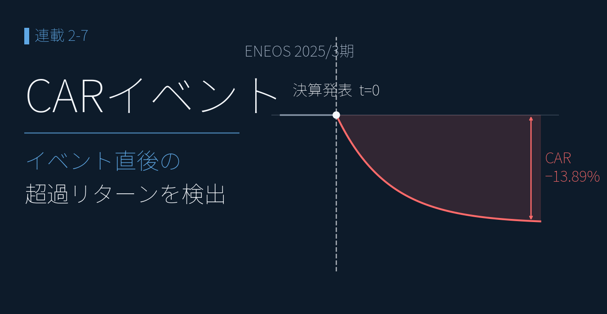
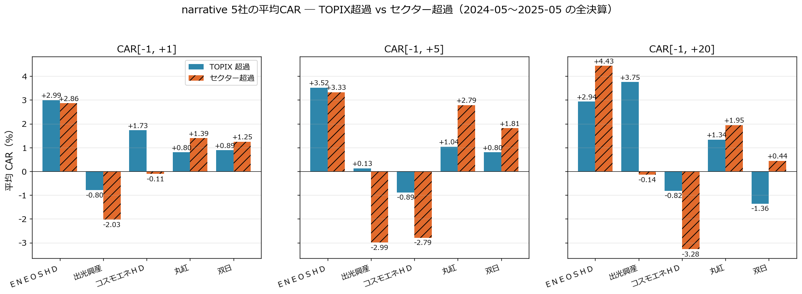
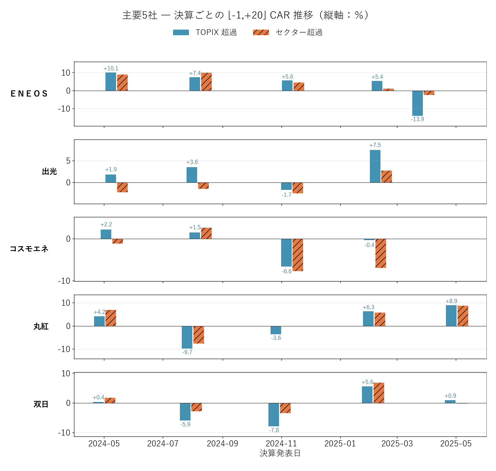

# 二重 CAR で「個別決算の効き」を確認する ― 業界の動きを除いた 5社の超過リターン

{width="1280"}

決算発表ごとの株価の反応を市場全体でならすと、**サプライズの方向へじわじわ動き続ける**傾向 ― 決算後ドリフト（PEAD）― が見えます。ただし平均では見えても、個別の決算では大きく散ります（全体像は[前編](09_car_event_study.md)）。では、ファンダ分析で「良い」と評価した個別銘柄は、実際に市場で報われたのか ―

本記事はエネルギー・商社の主要 5社（ＥＮＥＯＳ／出光／コスモエネＨＤ／丸紅／双日）について、TOPIX 超過に加えてセクター ETF 超過も併記する **「二重 CAR」** で、業界の追い風を除いた **個別決算の効き** を検証します。

<!-- more -->

## 二重 CAR（ハイブリッドベンチマーク）の概要

PEAD は平均では見えても個別では散る ― だからこそ個別決算の効きを測るには、**業界全体のショックを差し引く** 必要があります。

⬛ **二重 CAR = TOPIX 超過 CAR ＋ セクター ETF 超過 CAR**

TOPIX（1306.T）超過に加え、**エネルギー資源 ETF（1618.T）・商社卸売 ETF（1629.T）** 超過を併記。「**業界全体が好調だから上がっただけ**」と「**個別決算が本当に効いた**」を分離できるのがハイブリッドベンチマークの威力です。集計ウィンドウは [-1,+1] / [-1,+20]（1306.T / 1629.T は連続株式分割があり、価格スケールを再補正して使用）。

## 5社の二重 CAR で「個別決算の効き」を確認

5 社を二重 CAR で比べると、**ＥＮＥＯＳ が際立ちます ― セクター超過 +4.43%**。エネルギー業界全体の動きを差し引いても個別決算で +4.4% 上乗せ。対照的にコスモエネは **セクター超過 −3.28%** で業界に劣後します。

| 銘柄 | [-1,+1] TOPIX | [-1,+20] TOPIX | [-1,+1] セクター | [-1,+20] セクター |
|---|---|---|---|---|
| **ＥＮＥＯＳ（5020）** | **+2.99%** | **+2.94%** | +2.86% | **+4.43%** |
| 出光興産（5019） | -0.68% | +2.81% | -2.23% | -0.87% |
| コスモエネＨＤ（5021） | +1.73% | -0.82% | -0.11% | -3.28% |
| **丸紅（8002）** | +0.80% | **+1.34%** | +1.39% | **+1.95%** |
| 双日（2768） | +0.89% | -1.36% | +1.25% | +0.44% |

<small style="color: var(--md-link-color);"><i class="fa-solid fa-expand"></i> クリックで拡大できます</small>
<small style="color: var(--md-link-color);">2026.05.31作成</small>

{width="1200"}

- **ＥＮＥＯＳ**：TOPIX 超過 +2.94%、セクター超過 +4.43%。ファンダ総合評価で最上位とした見立てとおおむね整合（5 回平均、業績予想修正含む）
- **丸紅**：TOPIX 超過 +1.34%、セクター超過 +1.95%。「利益の質が健全・予想の信頼性も高い・次世代事業が +127% 成長」という評価が市場でも裏付け
- **出光**は業界連動で上昇（TOPIX +2.81%）も個別では業界平均並み（セクター −0.87%）、**コスモエネ**は業界対比で劣後、**双日**は地味 ― いずれもサンプル小（各 5 回前後）で継続観察が必要

## 決算ごとの CAR 推移で「評価との一致」を確認

イベント単位で見ると、事前のファンダ評価が CAR にそのまま表れます ― **ＥＮＥＯＳ は 4 連続プラスののち業績予想修正で −13.89%、丸紅は直近通期 +8.94%**。

<small style="color: var(--md-link-color);"><i class="fa-solid fa-expand"></i> クリックで拡大できます</small>
<small style="color: var(--md-link-color);">2026.05.31作成</small>

{width="1200"}

**ＥＮＥＯＳ（5020）**：2024-05 通期から 2025-02 Q3 まで **4 連続 CAR プラス**（[-1,+20] = +10.09% → +7.44% → +5.62% → +5.43%、ファンダ最上位の見立てと完全整合）。ところが **2025-03-28 の業績予想修正で [-1,+20] = −13.89%（セクター超過 −2.42%）** と急転しました。

ただしこの下方修正の主因は **のれん減損（非現金）＋ 在庫影響（油価連動）＋ JX金属 IPO 関連** という構造／会計要因です。市場の初期反応は大きかったものの、「利益の質が劣化した証拠」と断定するのは早計 ― 営業 CF が 3 年累積で純利益の 114%（おおむね回収済み）だった点や、2026/3 期通期の急回復と併せて多面的に評価する必要があります。

**丸紅（8002）**：直近通期（2025-05-02）で **TOPIX 超過 +8.94%、セクター超過 +8.76%**。「業界ではなく個別決算が効いた」と明確に切り分けられ、次世代事業の高成長（+127%）が市場で評価されたタイミングです。一方 **双日** は健全な評価ながら市場反応はバラつき、丸紅ほどクリアな上昇トレンドにはなっていません。

## 各評価軸で「市場反応との一致」を確認

事前のファンダ評価は、本記事の CAR でおおむね裏付けられました ― **丸紅は「健全」評価どおり直近通期 +8.94%、ＥＮＥＯＳ は最上位評価どおり 4 連続プラス → 業績予想修正で −13.89%**。

| 評価軸 | 評価 | 銘柄 | CAR での確認 |
|---|---|---|---|
| マルチファクター総合 | ＥＮＥＯＳ 1 位 | 5020 | 4 連続 CAR プラス → 2025-03 で −13.89% |
| 利益の質（アクルーアル） | 丸紅 健全 | 8002 | 直近通期 CAR +8.94% で裏付け |
| 予想の信頼性（三角検証） | 丸紅 良好 | 8002 | 二重 CAR で市場も肯定 |
| セグメント成長 | 丸紅 次世代 +127% | 8002 | 直近通期 CAR +8.94% で裏付け |
| セグメント成長 | 双日 ヘルスケア +79% | 2768 | 市場反応はバラつき |
| （評価対象外） | コスモエネ | 5021 | セクター超過 −3.28% で業界劣後 |

セクター超過の併記で「業界全体で上がっただけ」と「個別決算が効いた」を分離できる ― これが二重 CAR の核心です。ＥＮＥＯＳ の急落も、短期の市場反応はネガティブなファンダ・シグナルと整合しつつ、主因が構造／会計要因のため断定は避け、2025-05 以降のイベントで継続観察します。

## まとめ

- 主要 5社を **二重 CAR（TOPIX × セクター ETF）** で検証 ― 業界ショックを除いてもなお効いた個別決算反応を切り分け
- **ＥＮＥＯＳ**：4 連続 +5% 超 → 2025-03-28 業績予想修正で [-1,+20] = −13.89%。主因は のれん減損・在庫影響・JX金属 IPO の構造／会計要因のため、利益の質劣化の確証とまでは断定せず継続観察
- **丸紅**：直近通期 +8.94%（セクター超過 +8.76%）で「利益の質が健全 ＋ 次世代事業が成長」という評価と明確に整合
- 事前のファンダ評価は CAR でおおむね的中 ― 評価軸と市場反応の対応を一覧化

ここまでで **決算データ分析編が一区切り** です。この先は決算短信 JSON に機械学習を組み合わせ、**類似決算検索** で「この決算に最も似た過去の決算」を探し、ここで見た CAR と接続して値動きの手がかりにします。

---

*データ出典: TOPIX / セクター ETF は yfinance（1306.T / 1618.T / 1629.T）で取得・分割補正済み。5社の二重 CAR は自前のデータパイプラインの決算開示ログと株価日足から算出*
