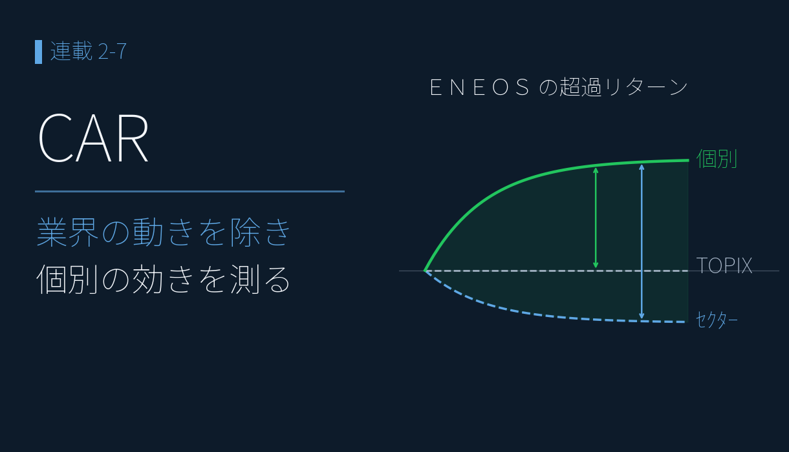

# CARで見る「決算の効き」 ― 元売・商社 主要5社の市場反応を検証

{width="1280"}

決算の評価について視点を逆転し、決算発表後に市場がどう反応したか ― 超過リターン（CAR）― を測ります。決算サプライズの方向へ株価がじわじわ動き続ける傾向は **PEAD（Post-Earnings-Announcement Drift）** と呼ばれますが、平均では見えても個別の決算では大きく散ります。

そこで本記事では、ファンダ分析で「良い」と評価したエネルギー・商社の主要 5社（ＥＮＥＯＳ／出光／コスモエネＨＤ／丸紅／双日）について、TOPIX 超過に加えてセクター ETF 超過も併記する **CAR** で、業界の追い風を除いた **個別決算の効き** を検証します。

データ出典: 決算短信の開示ログ、株価日足 1,580 銘柄。TOPIX / セクター ETF は yfinance（1306.T / 1618.T / 1629.T）で取得・分割補正済み。主要5社の CAR は自前のデータパイプラインで算出

<a class="ref-card ref-card--quiet" href="https://glossary.hub.hit-u.ac.jp/faq/show/171/" target="_blank" rel="noopener">

CAR（累積異常リターン）とは
イベント前後の異常リターンを累積した指標（イベントスタディ）― 一橋大学 ファイナンス用語集

</a>

<!-- more -->

## CAR の概要

**CAR（累積超過リターン）= Σ（個別リターン − ベンチマークリターン）** ― 市場全体の動きを除いた「個別決算が生んだ余分なリターン」

PEAD は平均では見えても個別では散ります。だからこそ個別決算の効きを測るには、**業界全体のショックも差し引く** こと ― すなわち **TOPIX 超過に加えてセクター ETF 超過も併記する** ことが要点です。「業界全体が好調だから上がっただけ」と「個別決算が本当に効いた」を分離できます。

計算条件は次のとおりです。

- **ベンチマーク**：TOPIX（1306.T）＋ **エネルギー資源 ETF（1618.T）・商社卸売 ETF（1629.T）**
- **集計ウィンドウ**：発表日（t=0）の 1 営業日前を起点に、2 本で集計
    - **[-1,+1]** ＝ 初動
    - **[-1,+20]** ＝ 約 1 ヶ月（即時反応 → 決算後ドリフト＝PEAD まで段階的に）

**手法のポイント**：発表が場中（15:00 前）か引け後かで起点 t=0 が 1 営業日ズレるため、開示時刻で場中/引け後を判定して t=0 を決めています。一律「当日 = t=0」では半数のイベントで起点が 1 日ズレ、**平気で符号が反転** します（1306.T / 1629.T は連続株式分割があり、価格スケールを再補正して使用）。

## 5社の CAR で「個別決算の効き」を確認

5 社を CAR で比べると、**ＥＮＥＯＳ が際立ちます ― セクター超過 +4.43%**。エネルギー業界全体の動きを差し引いても個別決算で +4.4% 上乗せ。対照的にコスモエネは **セクター超過 −3.28%** で業界に劣後します。

| 銘柄 | [-1,+1] TOPIX | [-1,+20] TOPIX | [-1,+1] セクター | [-1,+20] セクター |
|---|---|---|---|---|
| **ＥＮＥＯＳ（5020）** | **+2.99%** | **+2.94%** | +2.86% | **+4.43%** |
| 出光興産（5019） | -0.80% | +3.75% | -2.03% | -0.14% |
| コスモエネＨＤ（5021） | +1.73% | -0.82% | -0.11% | -3.28% |
| **丸紅（8002）** | +0.80% | **+1.34%** | +1.39% | **+1.95%** |
| 双日（2768） | +0.89% | -1.36% | +1.25% | +0.44% |

<i class="fa-solid fa-expand"></i> クリックで拡大 ・ 2026.05.31作成

{width="1200"}

- **ＥＮＥＯＳ**：TOPIX 超過 +2.94%、セクター超過 +4.43%。ファンダ総合評価で最上位とした見立てとおおむね整合（5 回平均、業績予想修正含む）
- **丸紅**：TOPIX 超過 +1.34%、セクター超過 +1.95%。「利益の質が健全・予想の信頼性も高い・次世代事業が +127% 成長」という評価が市場でも裏付け
- **出光**は業界連動で上昇（TOPIX +3.75%）も個別では業界平均並み（セクター −0.14%）、**コスモエネ**は業界対比で劣後、**双日**は地味 ― いずれもサンプル小（各 5 回前後）で継続観察が必要

## 決算ごとの CAR 推移で「評価との一致」を確認

イベント単位で見ると、事前のファンダ評価が CAR にそのまま表れます ― **ＥＮＥＯＳ は 4 連続プラスののち業績予想修正で −13.89%、丸紅は直近通期 +8.94%**。

<i class="fa-solid fa-expand"></i> クリックで拡大 ・ 2026.05.31作成

{width="1200"}

- **ＥＮＥＯＳ（5020）**：2024-05〜2025-02 で **4 連続 CAR プラス**（[-1,+20] = +10.09 → +7.44 → +5.62 → +5.43%、ファンダ最上位の見立てと完全整合）。ところが **2025-03-28 の業績予想修正で −13.89%（セクター超過 −2.42%）** と急転
- ただし下方修正の主因は **のれん減損（非現金）＋在庫影響（油価連動）＋JX金属 IPO 関連** の構造／会計要因 ― 「利益の質が劣化した証拠」と断定するのは早計（営業 CF は 3 年累積で純利益の 114%＝おおむね回収済み、2026/3 期通期の急回復と併せ多面的に評価）
- **丸紅（8002）**：直近通期（2025-05-02）で **TOPIX 超過 +8.94% / セクター超過 +8.76%** ― 「業界ではなく個別決算が効いた」と明確に切り分けられ、次世代事業 +127% が評価されたタイミング
- **双日（2768）**：健全評価ながら市場反応はバラつき、丸紅ほどクリアな上昇トレンドにはなっていない

## 各評価軸で「市場反応との一致」を確認

事前のファンダ評価は、本記事の CAR でおおむね裏付けられました ― **丸紅は「健全」評価どおり直近通期 +8.94%、ＥＮＥＯＳ は最上位評価どおり 4 連続プラス → 業績予想修正で −13.89%**。

| 評価軸 | 評価 | 銘柄 | CAR での確認 |
|---|---|---|---|
| マルチファクター総合 | ＥＮＥＯＳ 1 位 | 5020 | 4 連続 CAR プラス → 2025-03 で −13.89% |
| 利益の質（アクルーアル） | 丸紅 健全 | 8002 | 直近通期 CAR +8.94% で裏付け |
| 予想の信頼性（予想検証） | 丸紅 良好 | 8002 | CAR で市場も肯定 |
| セグメント成長 | 丸紅 次世代 +127% | 8002 | 直近通期 CAR +8.94% で裏付け |
| セグメント成長 | 双日 ヘルスケア +79% | 2768 | 市場反応はバラつき |
| （評価対象外） | コスモエネ | 5021 | セクター超過 −3.28% で業界劣後 |

セクター超過の併記で「業界全体で上がっただけ」と「個別決算が効いた」を分離できる ― これが 2 つのベンチマークを併記する核心です。ＥＮＥＯＳ の急落も、短期の市場反応はネガティブなファンダ・シグナルと整合しつつ、主因が構造／会計要因のため断定は避け、2025-05 以降のイベントで継続観察します。

## まとめ

- 決算分析の多くが **「決算データの中身」** を見るのに対し、本記事は **「市場での反応」** を CAR で測定 ― PEAD は平均では見えても個別では散るため、業界ショックを差し引く **CAR（TOPIX × セクター ETF）** で主要5社の個別決算の効きを切り分けた
- **ＥＮＥＯＳ**：4 連続 +5% 超 → 2025-03-28 業績予想修正で [-1,+20] = −13.89%。主因は のれん減損・在庫影響・JX金属 IPO の構造／会計要因のため、利益の質劣化の確証とまでは断定せず継続観察
- **丸紅**：直近通期 +8.94%（セクター超過 +8.76%）で「利益の質が健全 ＋ 次世代事業が成長」という評価と明確に整合

## <i class="fa-brands fa-github"></i> Python コード

本記事のチャート画像・データ取得・成形スクリプトは、すべて **GitHub に公開**しています。**CAR 計算の実装**（開示時刻からの t=0 判定・TOPIX/セクター ETF 超過の併記・連続株式分割の補正）は、リポジトリの README にまとめています。データは提供元の利用規約により再配布できませんが、データを各自取得すれば、本連載と同じものが再現できます。

<a class="repo-link" href="https://github.com/minnanosaiban/blog/tree/main/09_car" target="_blank" rel="noopener">
github.com/minnanosaiban/blog/09_car
<i class="repo-link-arrow fa-solid fa-arrow-up-right-from-square"></i>
</a>

---
