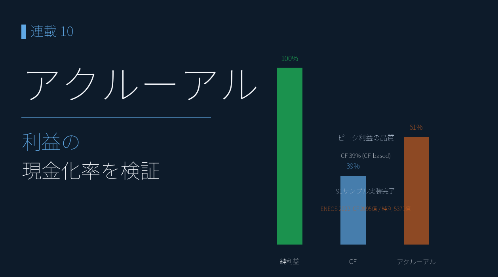
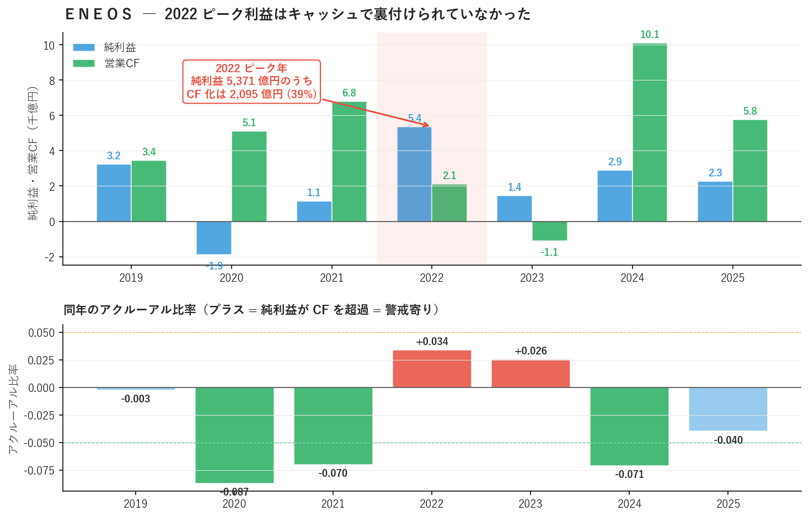
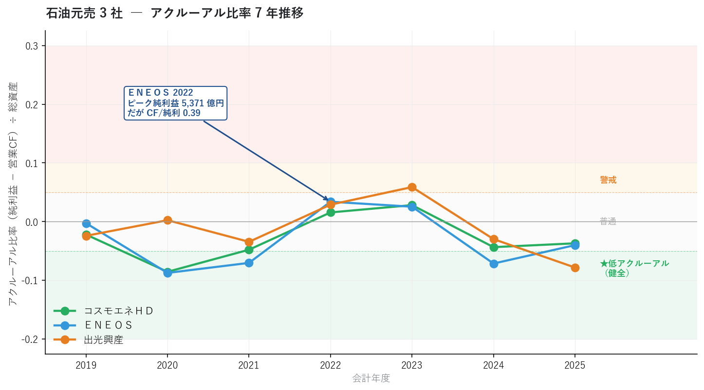
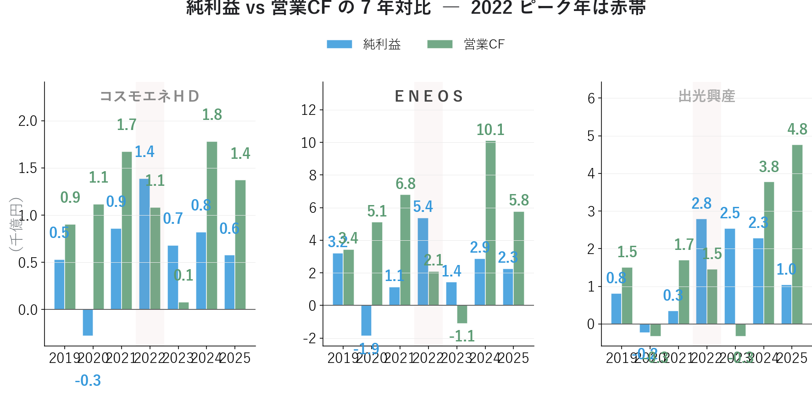
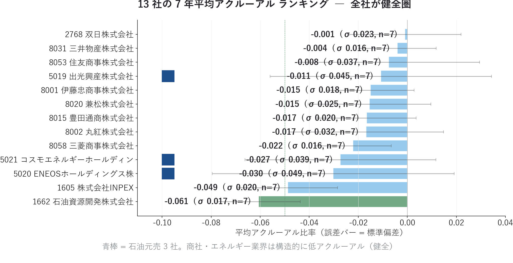
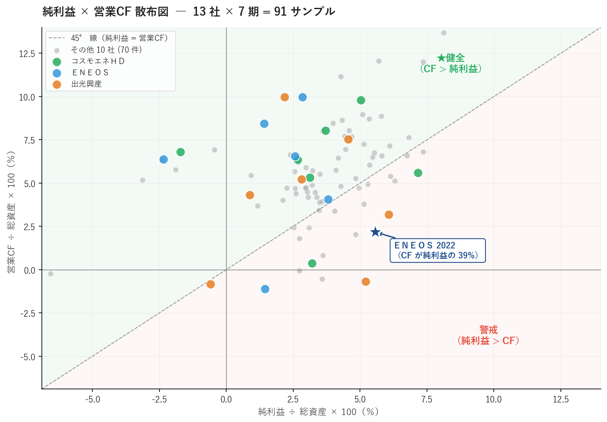

# アクルーアル分析で「利益の質」を見抜く ― ＥＮＥＯＳ 2022 ピーク利益のキャッシュ実態を検証する

{width="1280"}

連載06 で示した **ＥＮＥＯＳ の 2022 純利益 5,371 億円ピーク**。連載01〜05 の "業績モメンタム" 分析では「特需」と片付けていたこの数字を、本記事は決定的に違う角度から検証します。

**2022 年の純利益 5,371 億円のうち、営業 CF として実際に流入したのは 2,095 億円（39%）**。残りの 3,276 億円は在庫評価益・運転資本拡大で「キャッシュを伴わない利益」になっていました。

ただし **3 年累積（2022-2024）で見ると、純利益 9,690 億 vs 営業 CF 11,093 億 ― CF が純利益を 14% 上回って回収済み**。在庫評価益の反転や原油価格下落に伴う運転資本の解消で、過去のキャッシュ遅延が後年に追いついた姿が読み取れます。「2022 単年の質」と「3 年累積の質」のどちらを採用するかが解釈の分かれ目です。

これが本記事で扱う **アクルーアル分析**（Sloan 1996）です。連載01〜05 で見えた「2022 特需 → 2025 半減」の構図を、**「会計上の利益と CF が時期ズレで動く」** 観点から再解釈します。

<!-- more -->

---

## アクルーアル分析の概要

### 連載09 の早期警報を補う「利益の質」レンズ

連載09 で扱った進捗率 Z-score は、**「予想に対する実績の乖離」** を見るシグナルでした。しかし連載06 で見た ＥＮＥＯＳ 2022 ピークのように、**実績が良い決算でも「利益の中身が良いか」は別問題**です。

| 連載 | 何を見るか | 限界 |
|---|---|---|
| 03 リビジョン | アナリスト予想の修正 | 予想が低めなら好決算が出やすい |
| 04 サプライズ | 修正 × EPS 超過 × 経常変化 | 利益の絶対水準しか見ない |
| 09 進捗率 | 累積実績 ÷ 通期予想 | 純利益が伸びていれば OK と判定 |
| **10 アクルーアル** | **純利益と営業 CF の乖離** | **利益の "質" まで踏み込む** |

「業績モメンタム」の最後のレンズとして、**利益が本当にキャッシュとして手元に入っているか** を確認します。

### Sloan (1996) のアクルーアル戦略

ペンシルベニア大学 Richard Sloan 教授が 1996 年に発表した古典論文 *"Do Stock Prices Fully Reflect Information in Accruals and Cash Flows about Future Earnings?"* で実証された戦略です。

```
アクルーアル比率 = (純利益 − 営業 CF) ÷ 総資産
                 = 純利益のうち「キャッシュ化されていない部分」が総資産に対してどれだけか

例: 純利益 5,371 億円 / 営業CF 2,095 億円 / 総資産 96,482 億円
    → (5,371 − 2,095) ÷ 96,482 = +0.034
    → 純利益のうち約 3.4% 相当（総資産比）が「会計上の利益」として残っている
```

Sloan の発見は **「アクルーアル比率が低い銘柄（CF 裏付け強）は、高い銘柄を年率約 10% アウトパフォーム」** でした。30 年経っても有効性が認められる古典戦略です。

### なぜキャッシュで裏付けられた利益が良いのか

会計上の純利益は **発生主義** で記録されます。「売れた瞬間に売上計上」「コストの発生時点で費用計上」が原則。一方で営業 CF は **現金主義** で、「現金が動いた時だけ計上」されます。両者がずれるのが正常ですが、ずれが大きい時には次のような原因が潜みます。

| 純利益 > 営業CF の典型例 | 原因 |
|---|---|
| 売掛金が膨らんでいる | 売れたが回収されていない |
| 棚卸資産が増えている | 仕入れたが売れていない |
| 在庫評価益（時価評価上の利益） | 原油・商品在庫の時価が上がった |
| 引当金の過少計上 | 将来の損失を先送り |

これらは **「将来反転するリスク」** を抱えた利益。1〜3 年で正常化する過程で **利益が剥落** し、決算でネガティブサプライズになりやすい。

### 判定の目安

| アクルーアル比率 | 解釈 |
|---|---|
| ≤ −0.05 | ★非常に健全（CF が純利益を上回る） |
| −0.05 〜 +0.00 | 健全 |
| 0.00 〜 +0.05 | 普通 |
| +0.05 〜 +0.10 | 警戒（純利益 > CF が大きい） |
| ≥ +0.10 | 重大警戒（利益操作疑い） |

### 本記事の実装スコープ

```
本記事で扱うこと:
  ・有報 XBRL JSON 91 期分（13 社 × 7 期）からアクルーアル比率を計算
  ・石油元売 3 社の 7 年推移とＥＮＥＯＳ 2022 ピークの "質" の分析
  ・13 社全体のランキングと業種特性
  ・純利益 × 営業CF 散布図でゾーン判定

本記事で扱わないこと:
  ・モディファイドジョーンズ・モデル（DA / NDA 分離、フェーズ 4 で扱う）
  ・アクルーアル × 業種補正（同業種内で正規化、サンプル拡大後に扱う）
```

---

## 分析で分かったこと

連載07 で構築した自前パイプラインから、有報 XBRL JSON 91 期分（EDINET 13 銘柄 × 7 期）を読み込み、アクルーアル比率を計算しました。

### ＥＮＥＯＳ ― 2022 ピーク利益はキャッシュで裏付けられていなかった

連載06 で示した「ＥＮＥＯＳ 2022 ピーク純利益 5,371 億円」を、純利益と営業 CF の両方で見直すと、根本的に違う景色が見えてきます。

{width="1200"}

| 年度 | 純利益（千億円） | 営業 CF（千億円） | CF/純利 | アクルーアル | 解釈 |
|---|---|---|---|---|---|
| 2019 | +3.2 | +3.4 | 1.07 | −0.003 | 普通 |
| 2020 | **−1.9** | +5.1 | −2.72 | **−0.087** | 赤字なのに CF はプラス（健全） |
| 2021 | +1.1 | +6.8 | 5.96 | **−0.070** | CF が純利益の 6 倍（健全） |
| **2022** | **+5.4** | **+2.1** | **0.39** | **+0.034** | **★ピーク利益の CF 化は 39% のみ** |
| 2023 | +1.4 | −1.1 | −0.77 | +0.026 | **CF はマイナス、純利益はプラス** |
| 2024 | +2.9 | +10.1 | 3.51 | **−0.071** | CF が大幅プラス（健全） |
| 2025 | +2.3 | +5.8 | 2.55 | −0.040 | CF が純利益を超過 |

**核心となる発見** :

- **2022 年純利益 5,371 億円のうち、営業 CF として実際に流入したのは 2,095 億円**。残りの 3,276 億円は「在庫評価益」「運転資本拡大による売掛・在庫の増加」など、**キャッシュを伴わない利益**だった可能性が高い
- **2023 年は CF がマイナス（−1,102 億円）なのに純利益はプラス（+1,438 億円）**。アクルーアル比率 +0.026 と "普通圏" にギリギリ留まったが、CF/純利 比率はマイナスで質は最低
- **2024-2025 年は CF が純利益の 2.5〜3.5 倍**。在庫の現金化が進み、過去の "キャッシュを伴わなかった利益" の回収局面に入った可能性

連載01〜05 で観察された **「2022 特需 → 2025 半減」のサイクル** は、アクルーアル分析の視点から見ると：

```
2022年:  純利益 5,371 億円（ピーク） / CF 化は 39% のみ
            ↓
2023年:  CF -1,102 億円（マイナス！） / 在庫評価益の反転や運転資本の縮小
            ↓
2024-25年: CF が純利益を超過 / 過去の在庫を現金化する局面
```

つまり、**2022 年の「特需」は CF として現実化していなかった** ことが、有報 XBRL のキャッシュフロー計算書から定量的に示せます。連載01-05 の無料データではここまで踏み込めず、有報 XBRL でこそ見える「利益の質」の真実です。

<div class="margin01">
<div class="card-bule">
<p class="small"><b>📝 単年 39% vs 3 年累積 114% ― どちらが「質」か</b></p>
<p class="small pad2">同じ 2022 ピーク利益でも、観察スパンを変えると評価が逆転します。</p>
<p class="small pad2">
・<b>2022 単年</b>: CF / 純利 = <b>39%</b>（在庫評価益が利益を膨らませ、CF はまだ流入していない状態）<br>
・<b>2022-2024 累積</b>: 純利 9,690 億 vs CF 11,093 億 ＝ <b>114%</b>（CF が純利益を超過、回収済み）<br>
・<b>2021-2025 累積</b>: 純利 13,091 億 vs CF 23,661 億 ＝ <b>181%</b>（サイクル全体で大幅 CF 超過）
</p>
<p class="small pad2">石油元売は <b>原油価格の上下サイクルで在庫評価損益が反転する構造</b>。高油価年（2022）に在庫評価益で純利が膨らみ → 油価下落年（2023）に CF がマイナス → 2024-2025 で在庫を現金化、という流れは <b>利益操作ではなく、業態固有のサイクル</b> です。</p>
<p class="small pad2">ENEOS自身も「在庫影響を除いた実質営業利益」で本業の継続収益力を主張しています（連載01 4 基準試算 / 連載06 構造要因解説参照）。本記事のアクルーアル分析は <b>単年の質を測る強力なレンズ</b> ですが、市況連動セクターでは <b>サイクル累積</b> での再検証が不可欠です。</p>
</div>
</div>

### 石油元売 3 社の 7 年推移

3 社のアクルーアル比率を並べると、共通の構造的パターンが見えます。

{width="1200"}

| 銘柄 | 7 年平均アクルーアル | 解釈 |
|---|---|---|
| **ＥＮＥＯＳ** | **−0.030** | 3 社中最も健全（ただし 2022/2023 は警戒寄り） |
| コスモエネＨＤ | −0.027 | 7 年平均は健全。2022/2023 で警戒寄り |
| 出光興産 | −0.011 | 平均は健全だが 2022/2023 で警戒寄り |

3 社とも 2022 ピーク年は **アクルーアル比率がプラス（純利益 > CF）** に振れています。これは原油価格高騰局面で **「在庫を高値で評価し直した利益」** が共通発生したことを示唆します。

### 純利益 vs 営業 CF の年次対比

{width="1200"}

3 社の純利益と営業 CF を並べると、**ＥＮＥＯＳ 2022 だけ営業 CF が純利益を大きく下回る** 異常パターンが目立ちます。

- **コスモエネＨＤ 2022**: 純利益 1,389 億 / 営業CF 1,084 億（CF/純利 0.78）
- **ＥＮＥＯＳ 2022**: 純利益 5,371 億 / 営業CF **2,095 億**（CF/純利 **0.39**）
- **出光興産 2022**: 純利益 2,795 億 / 営業CF 1,461 億（CF/純利 0.52）

ＥＮＥＯＳ の 2022 はピーク利益の絶対額が大きい分、**CF とのギャップ（=「会計利益のうち実現しなかった額」）も最大の 3,276 億円**。これが翌年 2023 の CF マイナス転落の伏線になりました。

### 13 社全体のランキング ― 商社・エネルギーは構造的健全

{width="1200"}

13 社全社が **平均アクルーアル比率マイナス（CF が純利益を上回る）** という結果。これは商社・エネルギー業界の構造的特性によります。

- 設備投資や在庫の運転資本サイクルが定常的にプラス CF を生む
- 配当政策で過去の利益を着実に CF として認識する文化
- IFRS 採用企業が多く（13 社中 12 社）、会計上の保守性が比較的高い

特に **石油資源開発（1662）が −0.061 でトップ**、**INPEX が −0.049 で 2 位**。エネルギー上流（資源開発）はさらに健全なアクルーアル構造を持つことが分かります。連載06 で扱った「石油元売 3 社」より、さらに健全な比較対象が存在します。

### 純利益 × 営業 CF 散布図 ― 警戒ゾーンの可視化

{width="1200"}

91 サンプルを 45° 線（純利益 = 営業 CF）で 2 ゾーンに分けると、**ＥＮＥＯＳ 2022（★マーク）が警戒ゾーンの奥に位置** しています。

| ゾーン | 銘柄群 |
|---|---|
| 線上（健全） | 大半の銘柄。営業 CF が純利益を上回る |
| 線下（警戒） | ＥＮＥＯＳ 2022 / 出光 2022, 2023 / コスモエネＨＤ 2022, 2023 など |

注目すべきは、**2020 年（コロナ・原油急落）は赤字（純利益マイナス）でも CF はプラス** の銘柄が多く、これも「会計利益 < キャッシュ実態」という意味で健全に分類されます。逆に **2022 年の特需局面で全 3 社が警戒ゾーンに集中** したのは、原油価格急騰による在庫評価益が共通発生した結果です。

### 連載01〜09 と 10 の narrative 接続

ＥＮＥＯＳ の構図が、連載 ごとに角度を変えて見えてきます。

| 連載 | 観察 | 解釈 |
|---|---|---|
| 01 (PEG×ROE) | バリュー候補 / +29.7% 上昇 | 短期では市場が評価 |
| 02 (7 ファクター) | Cons 13 / Mom 60 | 業績は弱いが直近モメンタムは強かった |
| 03 (リビジョン) | 修正率 −3.7%（下方修正） | アナリストは慎重に転換 |
| 04 (サプライズ) | 経常変化(予想) −0.6% / 方向バラつき | 来期わずかに減益予想 |
| 06 (XBRL 概観) | 2022 純利益 5,371 億 → 2025 2,261 億半減 | 構造的ピークアウト |
| **10 (アクルーアル)** | **2022 単年 CF/純利 0.39 / 3 年累積 1.14** | **単年では CF 化遅れだが、サイクル累積では回収済み** |

これで **「ＥＮＥＯＳ 2022 ピーク利益は単年 CF 化率 39% だった」** ことまで定量化できました。ただし上で見た通り、3 年累積では CF が純利益を上回って回収されているため、「2022 から質が低かった」と断定するのは早計 ― **「単年の質」を重視するか「サイクル累積の質」を重視するかで判断が分かれます**。連載01〜04 で観察された業績低下シグナルは、ここでも「単年の質を疑うアナリスト」vs「サイクル累積で本業実態を読む個人投資家」というレンズの違いとして再解釈できます。

---

## アクルーアル比率の計算方法

### 1. 基本式（Sloan 1996）

```
アクルーアル比率 = (純利益 − 営業 CF) ÷ 総資産

例: ＥＮＥＯＳ 2022 (連結, IFRS, 単位: 千円)
  純利益:    537,117,000,000
  営業CF:    209,509,000,000
  総資産:  9,648,219,000,000

  (537,117 − 209,509) ÷ 9,648,219 = +0.034
```

連載06 で示したように、必要なのは有報 JSON の `financials.net_income` / `financials.operating_cf` / `financials.total_assets` の **3 項目だけ**。連載07 のパイプラインで JSON 化された時点で、計算は 1 行です。

### 2. 補助指標 CF/純利益 比率

```
CF/純利益 比率 = 営業 CF ÷ 純利益

例: ＥＮＥＯＳ 2022 → 209,509 ÷ 537,117 = 0.39
```

「純利益のうち、営業 CF として手元に流入したのは何 %」を直感的に示します。**1.0 に近いほど健全、0.5 を下回ると要注意**。ただし純利益が極端に小さい・マイナスの年は発散・反転するため、補助指標として使うのが安全です。

### 3. 業種特性の考慮

| 業種 | アクルーアル分析の注意点 |
|---|---|
| 不動産業 | 大型物件売却で一時的に純利益急増 → アクルーアル悪化（一過性） |
| 建設業 | 工事完成基準で売掛金が積み上がりやすい |
| 銀行業 | 営業 CF の意味が他業種と大きく異なる（参考程度に） |
| 商社・エネルギー | 構造的に健全（運転資本サイクルがプラス） |

本記事の対象 13 社はエネルギー・商社中心のため、業界横断比較ではなく **同一銘柄の時系列変化** で異常を捉えるのが正攻法です。

### 4. ノイズフィルタの推奨

| 条件 | 目的 |
|---|---|
| 純利益の絶対値 ≥ 10 億円 | CF/純利 比率の発散を防止 |
| 総資産 ≥ 100 億円 | 小型銘柄の特殊要因を除外 |
| 連結ベース | 単独ベースは事業会社間取引で歪む |
| 同業他社比較 | 業種特性の影響を相対化 |

### 5. Sloan 戦略の運用

```
ロング (健全銘柄):  アクルーアル比率 < -0.05
ショート (警戒銘柄): アクルーアル比率 > +0.10

保有期間: 12 ヶ月（年次決算後にリバランス）
期待リターン: 年率 8〜10%（Sloan 1996 の検証）
```

実運用では、本記事の早期警報（連載09 進捗率 Z-score）と組み合わせて **「業績が伸びているがキャッシュで裏付けされていない銘柄」** を抽出するアプローチが現実的です。

---

## Python コードの紹介

アクルーアル分析の核となるコードを紹介します。

### 有報 JSON からアクルーアル計算

連載06-08 で構築した独自スキーマのおかげで、計算ロジックは数行で済みます。

```python
import json
from pathlib import Path
import pandas as pd

def load_accrual(yuho_root: Path = Path("data/yuho")) -> pd.DataFrame:
    """全 EDINET 銘柄の有報 JSON からアクルーアル指標を計算。"""
    rows = []
    for ed_dir in yuho_root.iterdir():
        if not ed_dir.is_dir():
            continue
        for f in sorted(ed_dir.glob("*.json")):
            with open(f, encoding="utf-8") as fp:
                d = json.load(fp)
            meta = d.get("metadata", {})
            fin = d.get("financials", {}) or {}
            rows.append({
                "edinet": ed_dir.name,
                "fy_end": meta.get("fiscal_year_end", ""),
                "net_income":   fin.get("net_income"),
                "op_cf":        fin.get("operating_cf"),
                "total_assets": fin.get("total_assets"),
            })

    df = pd.DataFrame(rows)
    # Sloan (1996) のアクルーアル比率
    df["accrual"] = (df["net_income"] - df["op_cf"]) / df["total_assets"]
    # 補助指標
    df["cf_ni_ratio"] = df["op_cf"] / df["net_income"].where(
        df["net_income"].abs() >= 1e9
    )
    return df
```

### 警報レベル判定

```python
def classify_accrual(df: pd.DataFrame) -> pd.Series:
    """アクルーアル比率から警報レベルを分類。"""
    def _label(a):
        if pd.isna(a):
            return "—"
        if a <= -0.05:
            return "★非常に健全"
        if a <= 0.0:
            return "健全"
        if a <= 0.05:
            return "普通"
        if a <= 0.10:
            return "警戒"
        return "重大警戒"
    return df["accrual"].map(_label)


df["zone"] = classify_accrual(df)
print(df["zone"].value_counts())
```

### 同一銘柄の時系列異常検知

連続して悪化する銘柄は構造的な利益操作の疑い。**前年比でアクルーアル比率が +0.05 以上悪化** している銘柄を抽出します。

```python
def find_accrual_deterioration(df: pd.DataFrame,
                                threshold: float = 0.05) -> pd.DataFrame:
    """前年比でアクルーアル比率が悪化している銘柄を抽出。"""
    df = df.sort_values(["edinet", "fy_end"]).copy()
    df["accrual_prev"] = df.groupby("edinet")["accrual"].shift(1)
    df["accrual_delta"] = df["accrual"] - df["accrual_prev"]

    deteriorated = df[df["accrual_delta"] >= threshold]
    return deteriorated[["edinet", "fy_end", "accrual_prev",
                         "accrual", "accrual_delta"]]
```

### 連載09 早期警報との結合

進捗率 Z-score の早期警報銘柄について、アクルーアル比率を確認するのが実運用の標準フロー。

```python
def combine_with_progress_warning(accrual_df: pd.DataFrame,
                                   progress_df: pd.DataFrame) -> pd.DataFrame:
    """連載09 の早期警報銘柄に、本記事のアクルーアルを付与。"""
    merged = progress_df.merge(
        accrual_df[["code", "accrual", "cf_ni_ratio"]],
        on="code", how="left"
    )
    # 二重警報: 進捗率 Z-score 低い AND アクルーアル悪化
    merged["double_warning"] = (
        (merged["z_prog_op_income"] <= -1.5)
        & (merged["accrual"] >= 0.05)
    )
    return merged
```

「進捗率異常 + 利益の質悪化」が同時に起きている銘柄は、**決算後の急落リスクが極めて高い** と判定できます。

---

## まとめ

- 連載09 の進捗率は「予想 vs 実績」のシグナル。本記事の **アクルーアル比率は「純利益 vs 営業 CF」のシグナル** ― 業績モメンタム分析の最後のレンズ
- Sloan (1996) の古典戦略を有報 XBRL JSON 91 サンプル（13 社 × 7 期）で実装。**アクルーアル比率 = (純利益 − 営業 CF) ÷ 総資産** の 1 式
- **ＥＮＥＯＳ 2022 純利益 5,371 億円のうち、営業 CF として実現したのは 2,095 億円（39%）**。残り 3,276 億円は在庫評価益・運転資本拡大による「キャッシュを伴わない利益」
- 翌 2023 年は **CF がマイナス（−1,102 億円）に転落、純利益はプラス**。在庫評価益の反転局面
- ただし **3 年累積（2022-2024）では純利益 9,690 億 vs 営業 CF 11,093 億 ― CF が純利益を上回って回収済み**。原油市況の上下サイクルが原因で、構造的な利益操作ではない
- 石油元売 3 社のアクルーアル比率は平均健全（−0.011〜−0.027）だが、**全社 2022 ピーク年で警戒ゾーン入り** ― 原油価格高騰局面で共通発生した在庫評価益が原因
- 13 社全体ランキング: 商社・エネルギー業界は構造的に健全（全 13 社が平均マイナス）。**石油資源開発（1662）が −0.061 でトップ**
- 連載01〜04 で観察された ＥＮＥＯＳ の業績低下シグナルは、**「2022 ピーク利益の CF 化は単年 39%、3 年累積では 114% に追いついた」** という有報 XBRL の事実と組み合わせて、より深く解釈できる。連載01 4 基準試算と併せて読むのが正確

連載01〜04（業績軸）→ 連載06〜08（XBRL 基盤）→ 連載09〜10（進捗率 × 利益の質）と、**「業績の量と質を独立に検証する」フレームワーク** が完成しました。次回連載11 は **三角検証** に進みます。同じ会社の同じ指標について、**有報 XBRL（連結）× 決算短信 XBRL × 証券会社の無料データ** の 3 ソースを突き合わせ、データの信頼性を多角的に検証します。

---

*データ出典: 連載07 で構築した自前パイプラインの `data/yuho/{EDINETコード}/*.json` 91 ファイル（13 社 × 7 期）。アクルーアル比率は Sloan (1996) の定義に従う*
