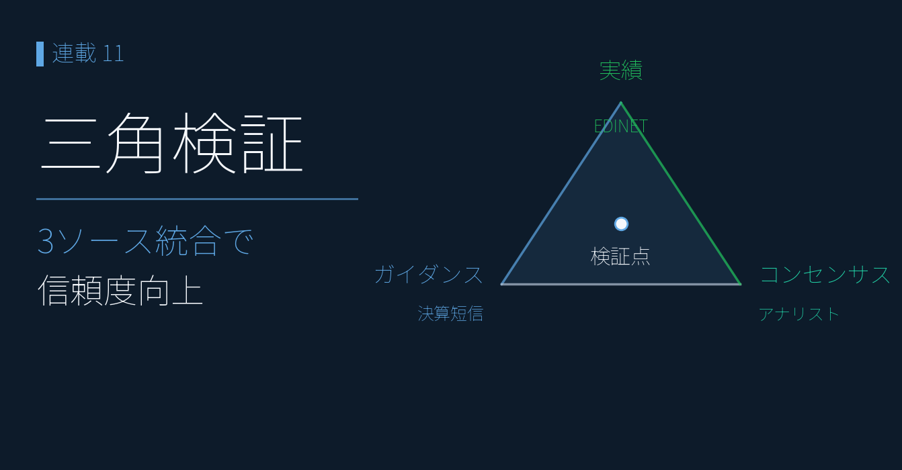
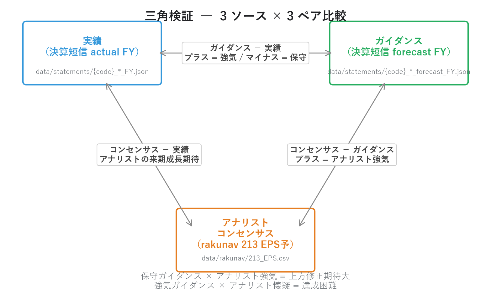
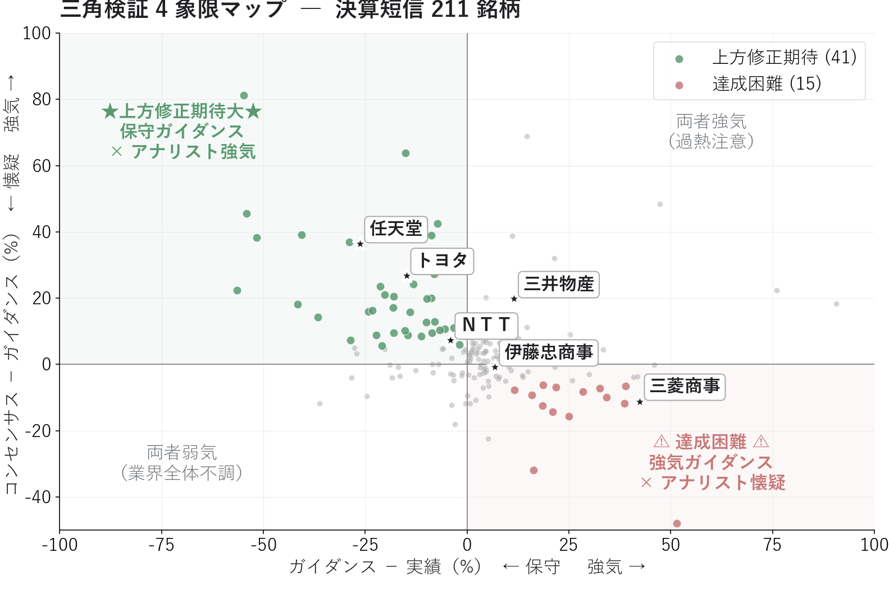
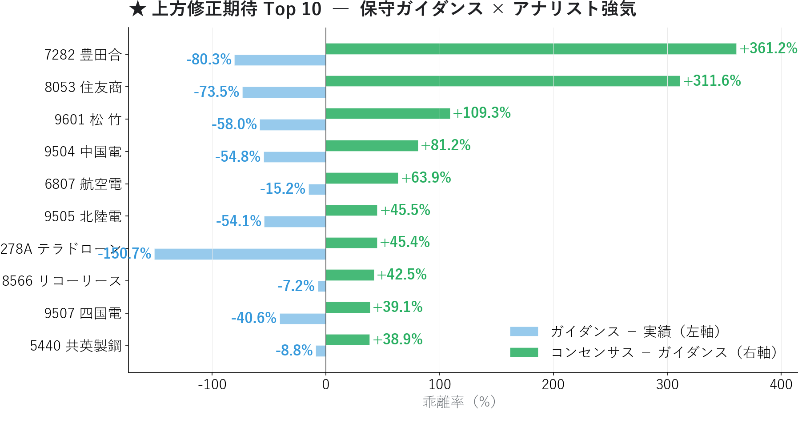
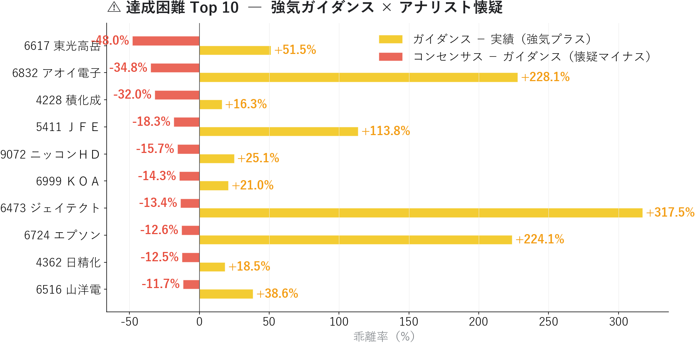
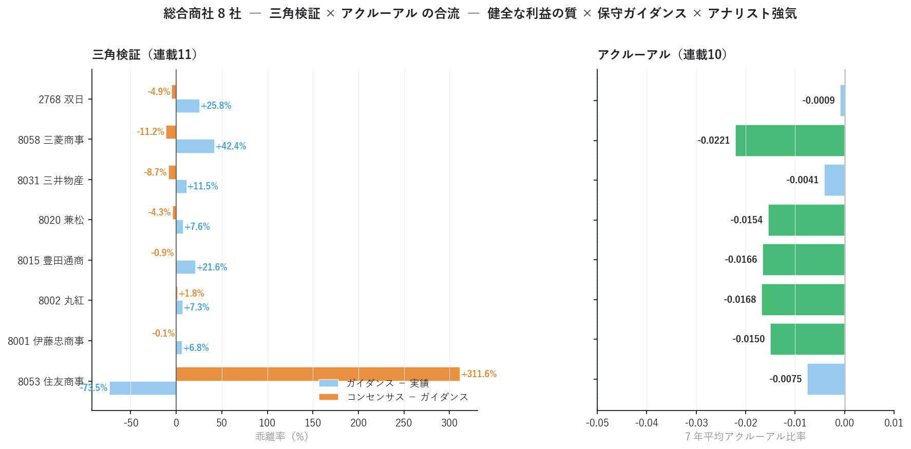

# 三角検証 ― コンセンサス × 企業ガイダンス × 実績から業績予想の信頼性を見抜く

{width="1280"}

業績予想は **常に 3 つの数値が並んでいます**。

1. **実績**（決算で確定した数値）
2. **企業ガイダンス**（企業自身が出す来期予想）
3. **アナリストコンセンサス**（複数アナリストの平均予想）

連載01〜10 では、これらを **個別に** 扱ってきました。連載06 のリビジョン、連載08 の進捗率、連載09 のアクルーアル。本記事ではそれを **三角形で同時に比較** することで、企業とアナリストの認識ギャップ、保守ガイダンスによる上方修正サプライズ候補、強気ガイダンスの達成困難リスクを可視化します。

連載01〜10 で構築した 3 つのデータソース（証券会社が無料で提供するコンセンサス EPS予想 / 決算短信 actual JSON / 決算短信 forecast JSON）が、ここで初めて **同一銘柄について同時参照** されます。**住友商事の「ガイダンス −74% 保守 + コンセンサス +312% 強気」** のような典型的な上方修正期待パターンが、211 銘柄から定量抽出できます。

<!-- more -->

---

## 三角検証の概要

### 3 つのデータソースを「同じ銘柄について」並べる意味

連載01〜10 で各データソースは別々の文脈で登場しました。

| データソース | 使った連載 | 役割 |
|---|---|---|
| **アナリストコンセンサス**（証券会社が無料で提供するコンセンサス EPS予想） | 02, 03, 04 | 市場の業績予想 |
| **企業ガイダンス**（決算短信 forecast JSON） | 09 | 企業自身の業績予想 |
| **実績**（決算短信 actual JSON） | 09, 10 | 確定数値 |

これらを **同一銘柄 × 同一会計年度** で並べると、**「企業とアナリストの認識ギャップ」** という新しいシグナルが見えてきます。

```
三角形の頂点:
  ① 実績 EPS（直近通期）
  ② 企業ガイダンス EPS（来期、企業発表）
  ③ コンセンサス EPS（来期、アナリスト平均）

三角形の辺（3 つのペア比較）:
  ・ガイダンス − 実績     → 企業の自己評価（強気か保守か）
  ・コンセンサス − ガイダンス → アナリストの企業評価（強気か懐疑か）
  ・コンセンサス − 実績   → アナリストの来期成長期待
```

{width="1200"}

### 4 象限の戦略マップ

ガイダンス vs 実績（X 軸）× コンセンサス vs ガイダンス（Y 軸）の 4 象限で銘柄を分類します。

```
                コンセンサス − ガイダンス
                       ↑
                       │
   左上              │  右上
   保守ガイダンス×   │  強気ガイダンス×
   アナリスト強気    │  アナリスト強気
   ★上方修正期待大★ │  両者強気（過熱注意）
                       │
─ ─ ─ ─ ─ ─ ─ ─ ─ ─ ┼ ─ ─ ─ ─ ─ ─ ─ ─ ─ ─  ゼロ
                       │
   左下              │  右下
   両者弱気          │  強気ガイダンス×
   （業界不調）      │  アナリスト懐疑
                       │  ⚠ 達成困難 ⚠
                       ↓
                ガイダンス − 実績
```

**左上の "上方修正期待大"** は、日本企業の伝統的な **保守ガイダンス文化** を逆手に取った戦略。実績より低いガイダンスを出して後で上方修正でサプライズを演出するパターンに、アナリストが先回りして強気予想を出している銘柄です。

**右下の "達成困難"** は逆。強気ガイダンスを出したものの、アナリストは達成可能性に懐疑的 ― 下方修正と株価急落のリスクを抱えています。

### 本記事の実装スコープ

```
本記事で扱うこと:
  ・3 ソース統合: 決算短信 actual + forecast + 証券会社のコンセンサス EPS予想
  ・(code, fy_end) でマッチング → 211 銘柄の三角検証
  ・4 象限分布、上方修正期待 Top10、達成困難 Top10
  ・総合商社 8 社で連載09 アクルーアル × 連載10 三角検証 の接続

本記事で扱わないこと:
  ・三角検証後の株価リターン検証（連載12 CAR で扱う）
  ・複数四半期にわたる予想精度の追跡（週次蓄積必要）
  ・営業利益・経常利益の三角検証（EPS のみ扱う、本連載のスキーマカバレッジに依存）
```

---

## 分析で分かったこと

連載07-08 のパイプラインから 決算短信 actual 841 件（FY）と forecast 327 件を取得し、(code) でマッチした 327 ペアを証券会社のコンセンサス EPS予想（1,457 銘柄）と結合。EPS の絶対値が 1 円以上で発散しない **211 銘柄** で三角検証が可能になりました。

### 全体分布 ― 「市場全体は保守ガイダンス + アナリスト強気」

|  | 中央値 | 平均 |
|---|---|---|
| ガイダンス − 実績 | **+3.9%** | +16.4% |
| コンセンサス − ガイダンス | **+3.8%** | +10.2% |
| コンセンサス − 実績 | （来期成長期待） | +23.3% |

中央値で見ると、**多くの企業はガイダンスを実績より +3.9% 程度の "微強気" で出す** が、**アナリストはさらに +3.5% 上乗せ** して見ています。この「企業ガイダンスより上乗せ」が **アナリストの平均的な楽観バイアス**。連載07 で見た「アナリストの楽観バイアス」が、ここでも確認できます。

### 4 象限分布

{width="1200"}

| 象限 | 銘柄数 | 解釈 |
|---|---|---|
| **左上**（保守 × 強気） | **45** | ★上方修正期待大 |
| 右上（強気 × 強気） | 44 | 両者強気（過熱注意） |
| 左下（保守 × 懐疑） | 5 | 業界全体不調 |
| **右下**（強気 × 懐疑） | **19** | ⚠ 達成困難 |
| 中立（境界線付近） | 98 | どちらの傾向も示さない |

主要銘柄の位置を確認すると、**典型的な保守ガイダンス文化** がはっきり出ています。

| 銘柄 | ガイダンス − 実績 | コンセンサス − ガイダンス | 解釈 |
|---|---|---|---|
| **トヨタ（7203）** | **−14.9%** | **+26.8%** | 典型的保守 + アナリスト強気 |
| **任天堂（7974）** | **−26.2%** | **+36.4%** | 保守ガイダンスの極致 |
| ＮＴＴ（9432） | −4.0% | +7.3% | 微保守 + アナリストやや強気 |
| ソニーＧ（6758） | -- | -- | 該当データなし |

トヨタは 2025 年実績 EPS 295.2 円に対し、2026 年ガイダンス 251.2 円（−14.9% の保守）。一方アナリストコンセンサスは 318.5 円（ガイダンス比 +26.8% 強気）。**「企業は固く出す、アナリストは強気で見る」という日本市場の伝統的構図** がデータで裏付けられます。

### ★上方修正期待 Top 10（左上ゾーン）

{width="1200"}

| 銘柄 | 実績EPS | ガイダンス | コンセンサス | G − A | C − G |
|---|---|---|---|---|---|
| 7282 | 494 | 97 | 449 | −80.3% | **+361.2%** |
| **住友商事（8053）** | 499 | 132 | 543 | **−73.5%** | +311.6% |
| 松竹（9601） | 381 | 160 | 335 | −58.0% | +109.3% |
| 9504 | 191 | 86 | 156 | −54.8% | +81.2% |
| 大日本印刷（6807） | 105 | 89 | 146 | −15.2% | +63.9% |
| 9505 | 261 | 120 | 174 | −54.1% | +45.5% |
| 278A | 260 | −132 | −72 | −150.7% | +45.4% |
| 8566 | 416 | 386 | 550 | −7.2% | +42.5% |
| 9507 | 247 | 147 | 205 | −40.6% | +39.1% |
| 5440 | 227 | 207 | 288 | −8.8% | +38.9% |

チャート最上位は **7282**（GA −80.3% / CG +361.2%）ですが、ストーリーとして最も典型的なのが **住友商事**。実績 EPS 499 円に対し、**会社ガイダンス 132 円（実績比 −74%）** という極端な保守ガイダンス。それに対しアナリストコンセンサスは **543 円（ガイダンス比 +312%）** と強気。これは典型的な「ガイダンスは在庫評価益などの一時的要因を除いた基底値、アナリストは実態を見て強気」というパターンです。

この銘柄群は **次の決算で上方修正が出る蓋然性が極めて高い** ため、エントリーの絶好のタイミング候補。連載06 の出遅れ買い候補と組み合わせて使うと精度がさらに上がります。

### ⚠ 達成困難 Top 10（右下ゾーン）

{width="1200"}

| 銘柄 | 実績EPS | ガイダンス | コンセンサス | G − A | C − G |
|---|---|---|---|---|---|
| 6617 | 411 | **623** | 324 | +51.5% | **−48.0%** |
| 6832 | 6.3 | 20.5 | 13.4 | +228% | −34.8% |
| 4228 | 47 | 55 | 37 | +16.3% | −32.0% |
| 5411 | 110 | 236 | 193 | +113.8% | −18.3% |
| 9072 | 153 | 191 | 161 | +25.1% | −15.7% |
| 6999 | 106 | 129 | 110 | +21.0% | −14.3% |
| 6473 | 38 | 157 | 136 | +317.5% | −13.4% |
| 6724 | 57 | 184 | 161 | +224.1% | −12.6% |
| 4362 | 202 | 240 | 210 | +18.5% | −12.5% |
| 6516 | 244 | 338 | 299 | +38.6% | −11.7% |

**6617** が筆頭で、ガイダンス +51% 強気に対しアナリストは −48% 懐疑。**6473（NSK）** や **6832（アオキ）** は実績 vs ガイダンスが +200% を超える極端な強気ガイダンス（特殊要因の可能性）に対し、アナリストはより冷静な見方。これらは **次の決算で下方修正が出るリスクが高い** 警戒銘柄群です。

### 総合商社 8 社の三角検証 × アクルーアルの合流

連載09 のアクルーアル分析で扱った 13 社のうち、**総合商社 8 社（伊藤忠 / 丸紅 / 豊田通商 / 兼松 / 三井物産 / 三菱商事 / 住友商事 / 双日）** は本記事の三角検証可能 211 銘柄にも全社含まれます。**連載09 と連載10 が同じ銘柄群でクロス分析できる初の機会** です。

{width="1200"}

| 銘柄 | G − A | C − G | アクルーアル | 統合解釈 |
|---|---|---|---|---|
| **住友商事（8053）** | **−73.5%** | **+311.6%** | −0.0075 | 健全 + 極端な保守 + アナリスト強気 |
| 三菱商事（8058） | **+42.4%** | −11.2% | **−0.0221** | 最も健全 + FY2026 強気ガイダンス |
| 三井物産（8031） | +11.5% | +19.8% | −0.0041 | 強気ガイダンス + アナリスト強気 |
| 双日（2768） | +25.8% | −4.9% | −0.0009 | FY2026 強気ガイダンス |
| 兼松（8020） | +7.6% | −4.3% | −0.0154 | 微強気ガイダンス |
| 豊田通商（8015） | +21.6% | −0.9% | −0.0166 | 強気ガイダンス + 中立 |
| 丸紅（8002） | +7.3% | +1.8% | −0.0168 | 微強気ガイダンス + 中立 |
| 伊藤忠商事（8001） | +6.8% | −0.9% | −0.0150 | 微強気ガイダンス |

FY2025 の本決算発表後、総合商社 8 社の三角検証は様相が変わりました。**利益の質（アクルーアル < 0）は全社引き続き健全** ですが、三角検証では **住友商事（8053）のみが保守ガイダンス × アナリスト強気** のパターンを維持。他 7 社は FY2025 実績に対し FY2026 ガイダンスを強気に設定し、アナリストはやや懐疑的または中立な姿勢に転換しています。これは個別銘柄の判定として：

1. **連載09 のアクルーアル**: 利益の質が高いか？ → 全社 OK
2. **連載10 の三角検証**: 上方修正期待があるか？ → 住友商事のみ明確。他社は強気ガイダンス × アナリスト中立〜懐疑に転換

この **「2 連載のクロス検証」** は、機関投資家のファンダメンタル・スコアリングの基本構造そのものです。

### 連載01-10 と 11 の narrative 接続

ＥＮＥＯＳ は決算短信 XBRL 未取得（466 銘柄カバレッジ外）のため完全な三角検証はできませんが、**有報 XBRL の実績 + 証券会社のコンセンサス** で **二角検証** は可能です。

- ＥＮＥＯＳ 実績 EPS（連載03）: **79.96 円**（2025 年）
- ＥＮＥＯＳ コンセンサス EPS（証券会社提供）: **138.26 円**
- コンセンサス − 実績 = **+72.9%**（アナリストの来期成長期待）

連載07 で観察された「ＥＮＥＯＳ EPS 予想超過率 +48.5%」は、**この +72.9% という来期成長期待の現れ**。同時に「経常利益変化率(予想) −0.6%（来期わずかに減益予想）」も併存しており、一見「EPS は伸びるが経常は減益」と矛盾するように見えます。

しかし、これは構造的に整合的に説明可能です ― **EPS（純利益ベース）はのれん減損足し戻し効果 + JX金属 IPO 売却益（非継続事業損益 +1,750 億）+ 自社株買い（分母減）で増、経常利益（営業損益ベース）は在庫影響 + のれん減損で減**。連載04 4 基準試算で示した「営業利益 ▲94% vs 純利益 ▲2.27% vs 実質営業利益 +4.76%」の構造が、ここでも EPS と 経常のレベル差として作用しています。連載09 のアクルーアル分析（単年 vs 累積）と合わせて、この複層構造を **全体として読む** 必要があります。

「ＥＮＥＯＳ の決算短信 XBRL を取得すれば完全な三角検証が可能になり、企業ガイダンスがアナリスト予想に追いついているか否かが分かる」 ― これが次のステップです。

---

## 三角検証の計算方法

### 1. 3 ソースの読み込みと統合

```python
import json
from pathlib import Path
import pandas as pd

def load_triangulation() -> pd.DataFrame:
    """決算短信 actual + forecast + rakunav 213 を 1 つの DataFrame に。"""
    rows = []
    for f in Path("data/statements").glob("*_FY.json"):
        d = json.load(open(f, encoding="utf-8"))
        meta = d.get("metadata", {})
        perf = d.get("performance", {}).get("current") or {}
        rows.append({
            "code": meta.get("code"),
            "fy_end": meta.get("fiscal_year_end"),
            "is_forecast": meta.get("kind") == "forecast",
            "eps": perf.get("eps"),
        })
    df = pd.DataFrame(rows)

    # 実績の最新 FY と forecast の最新 FY を結合
    actual = df[~df["is_forecast"]].sort_values("fy_end").groupby("code").tail(1)
    forecast = df[df["is_forecast"]].sort_values("fy_end").groupby("code").tail(1)
    m = actual.merge(forecast, on="code", suffixes=("_a", "_f"))

    # アナリストコンセンサス（rakunav 213 EPS予）
    rk = pd.read_csv("data/rakunav/213_EPS.csv",
                     encoding="utf-8-sig", dtype=str)
    rk["コード"] = rk["コード"].str.strip()
    rk["eps_consensus"] = rk["EPS(予想)(一株あたり当期利益)"].map(_to_float)

    m = m.merge(rk[["コード", "eps_consensus"]].rename(columns={"コード": "code"}),
                on="code", how="left")
    return m.dropna(subset=["eps_a", "eps_f", "eps_consensus"])
```

### 2. 3 ペアの乖離率計算

```python
def compute_triangulation_metrics(m: pd.DataFrame) -> pd.DataFrame:
    """ガイダンス vs 実績、コンセンサス vs ガイダンス、コンセンサス vs 実績。"""
    m = m.copy()
    m["guide_vs_actual_pct"] = (m["eps_f"] - m["eps_a"]) / m["eps_a"].abs() * 100
    m["consensus_vs_guide_pct"] = (
        (m["eps_consensus"] - m["eps_f"]) / m["eps_f"].abs() * 100
    )
    m["consensus_vs_actual_pct"] = (
        (m["eps_consensus"] - m["eps_a"]) / m["eps_a"].abs() * 100
    )
    return m
```

### 3. 4 象限分類

```python
def classify_quadrant(m: pd.DataFrame) -> pd.Series:
    """ガイダンス vs 実績 と コンセンサス vs ガイダンス から 4 象限分類。"""
    zone = pd.Series("中立", index=m.index)
    ga = m["guide_vs_actual_pct"]
    cg = m["consensus_vs_guide_pct"]

    zone[(ga < 0) & (cg > 5)]    = "上方修正期待"        # 左上
    zone[(ga >= 0) & (cg > 5)]   = "両者強気（過熱注意）"  # 右上
    zone[(ga < 0) & (cg <= -5)]  = "両者弱気（業界不調）"  # 左下
    zone[(ga > 10) & (cg < -5)]  = "達成困難"            # 右下
    return zone
```

### 4. 連載09 アクルーアル × 連載10 三角検証 のクロス

機関投資家のスコアリングは、複数の独立シグナルを組み合わせます。

```python
def cross_with_accrual(triangulation_df: pd.DataFrame,
                        accrual_df: pd.DataFrame) -> pd.DataFrame:
    """三角検証 × アクルーアル の合成スコア。"""
    merged = triangulation_df.merge(
        accrual_df[["code", "mean_accrual"]],
        on="code", how="left"
    )
    # 4 象限スコア（簡易版）
    merged["composite_score"] = (
        # 上方修正期待ボーナス
        (merged["zone"] == "上方修正期待").astype(int) * 30
        # アクルーアル健全度
        + np.clip(-merged["mean_accrual"] * 500, 0, 30)
        # アナリスト強気度
        + np.clip(merged["consensus_vs_guide_pct"] * 0.5, 0, 40)
    )
    return merged.sort_values("composite_score", ascending=False)
```

### 5. 投資判断への組み込み方

| シグナル | 判定 | アクション |
|---|---|---|
| 上方修正期待（左上）+ アクルーアル健全 | **最強買い** | 新規エントリー候補 |
| 上方修正期待 + アクルーアル悪化 | やや慎重 | 利益の質を再確認 |
| 達成困難（右下） + アクルーアル悪化 | **回避** | 保有銘柄なら売却検討 |
| 両者強気（右上） | **やや警戒** | 既に織り込み済みの可能性 |
| 両者弱気（左下） | 業界全体の調査 | セクター回避 |

---

## Python コードの紹介

実装の核となるコードを示します。

### 完全な三角検証パイプライン

```python
def build_triangulation_dashboard(stmts_dir: Path = Path("data/statements"),
                                   rakunav_213: Path = Path("data/rakunav/213_EPS.csv"),
                                   filter_eps_abs: float = 1.0) -> pd.DataFrame:
    """3 ソースから三角検証 DataFrame を構築。"""
    m = load_triangulation()
    m = compute_triangulation_metrics(m)

    # EPS 極小値による発散を除外
    m = m[(m["eps_a"].abs() > filter_eps_abs) &
          (m["eps_f"].abs() > filter_eps_abs) &
          (m["eps_consensus"].abs() > filter_eps_abs)]

    m["zone"] = classify_quadrant(m)
    return m


# 使用例
dash = build_triangulation_dashboard()
print(f"三角検証可能: {len(dash)} 銘柄")
print(dash["zone"].value_counts())

# 上方修正期待 Top 10
upside = dash[dash["zone"] == "上方修正期待"].nlargest(10, "consensus_vs_guide_pct")
```

### 二角検証（決算短信 XBRL なし銘柄向け）

決算短信 XBRL が未取得な銘柄（ＥＮＥＯＳ 等）でも、**有報 XBRL の実績 + 証券会社のコンセンサス** で部分的な検証が可能です。

```python
def dual_verification(edinet_code: str,
                       sec_code: str) -> dict:
    """有報の実績 EPS + rakunav の コンセンサス EPS で二角検証。"""
    yuho_dir = Path(f"data/yuho/{edinet_code}")
    latest_yuho = sorted(yuho_dir.glob("*.json"))[-1]
    yuho_d = json.load(open(latest_yuho, encoding="utf-8"))
    eps_actual = yuho_d.get("financials", {}).get("eps")

    rk = pd.read_csv("data/rakunav/213_EPS.csv",
                     encoding="utf-8-sig", dtype=str)
    rk["コード"] = rk["コード"].str.strip()
    eps_consensus = _to_float(
        rk.loc[rk["コード"] == sec_code, "EPS(予想)(一株あたり当期利益)"].values[0]
    )

    return {
        "code": sec_code,
        "eps_actual": eps_actual,
        "eps_consensus": eps_consensus,
        "consensus_vs_actual_pct": (eps_consensus - eps_actual) / abs(eps_actual) * 100,
        "note": "ガイダンス情報なし。決算短信 XBRL を取得すれば完全な三角検証が可能",
    }


# ENEOS の例
result = dual_verification("E24050", "5020")
# → eps_actual: 79.96, eps_consensus: 138.26, +72.9% の来期成長期待
```

---

## まとめ

- 連載01〜10 で個別に扱った 3 つの業績データソース（コンセンサス・ガイダンス・実績）を **同一銘柄で同時参照** することで、新しい次元のシグナルが見える
- **三角検証可能 211 銘柄** で、4 象限分布は左上（上方修正期待）45 銘柄 / 右上（両者強気）44 銘柄 / 左下（両者弱気）5 銘柄 / 右下（達成困難）19 銘柄 / 中立 98 銘柄
- 市場全体の中央値: **ガイダンス − 実績 +3.9%**（微強気）/ **コンセンサス − ガイダンス +3.8%**（アナリスト上乗せ）
- 主要銘柄では **トヨタ（保守 −14.9% + 強気 +26.8%）/ 任天堂（保守 −26.2% + 強気 +36.4%）** が典型的な保守ガイダンス文化
- **上方修正期待 Top1（CG 最大）= 7282**（GA −80.3% × CG +361.2%）。ストーリー筆頭は **住友商事**（GA −73.5% × CG +311.6%）
- 達成困難 Top には **6473（NSK）/ 6724（リコー）** など、ガイダンス +200% 超の極端な強気銘柄が並ぶ ― 下方修正リスク要警戒
- **総合商社 8 社で連載09 アクルーアル × 連載10 三角検証 が初接続**: アクルーアル健全は全社維持。ただし FY2025 本決算後、住友商事を除く 7 社が強気ガイダンス × アナリスト中立〜懐疑に転換
- ＥＮＥＯＳ は決算短信 XBRL 未取得のため二角検証（実績 80 円 × コンセンサス 138 円 = +72.9% 来期期待）。EPS 来期 +72.9% と 経常変化(予想) ▲0.6% の併存は、**のれん減損 / JX金属IPO 益 / 自社株買い** で構造的に説明可能（連載04 4 基準試算参照）。完全な三角検証には決算短信 XBRL の追加取得が必要

次回連載11 は **セグメント発進力スコア** に進みます。有価証券報告書のセグメント情報を時系列分析し、**「全社業績は伸び悩むが特定セグメントが急成長している銘柄」** を発掘します。連載03 で確認した有報 XBRL のセグメントデータ（現在 3 社で空欄）を改善する parser 拡張も含めて扱います。

---

*データ出典: 連載03 で構築した自前パイプラインの `data/statements/*_FY.json` 841 件（actual） + 327 件（forecast）から (code) マッチ 327 ペアを構築し、`data/rakunav/213_EPS.csv` を結合した 211 銘柄サンプル*
