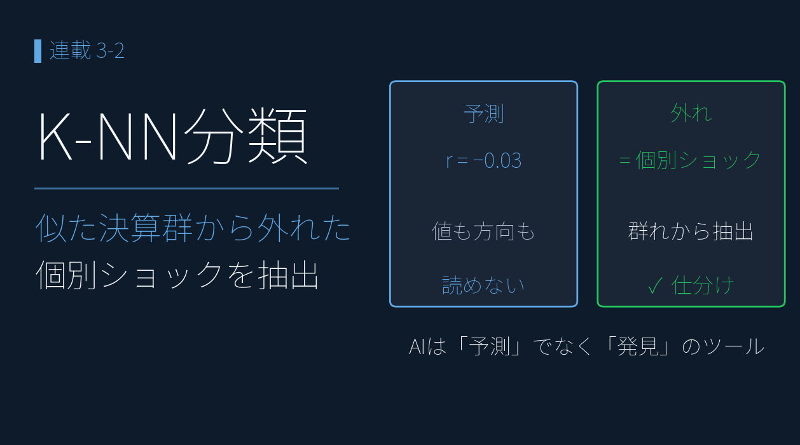
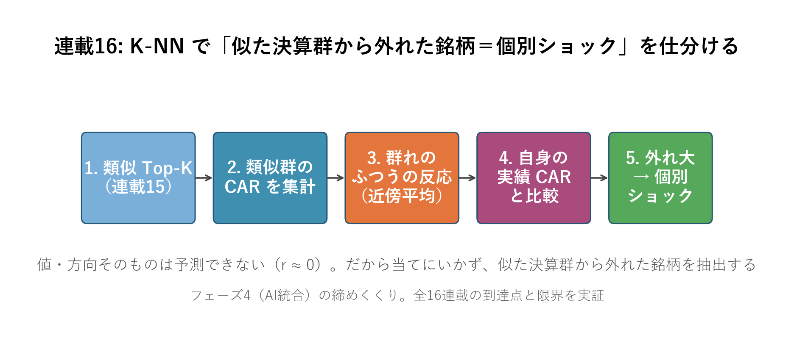
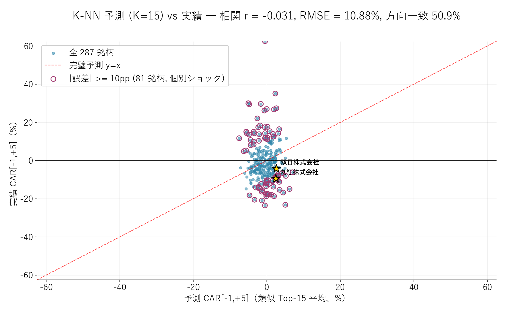
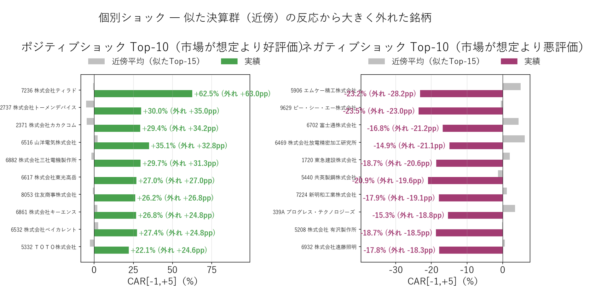
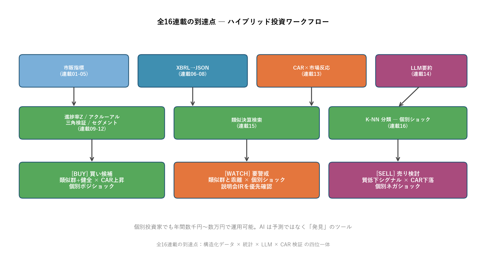

# K-NN 分類 ― 似た決算群から外れた「個別ショック」を抽出

{width="1280"}

前回（3-1）見つけた「似た決算」を、こんどは **物差し** に使います。ある銘柄の決算後の株価反応（CAR）が、**似た者たちと同じ（典型）か、大きく外れたか（個別ショック）** を、**K-NN**（近くにある似たデータで判断する手法）で仕分けます。

先に断っておくと、**株価の反応そのもの（値も方向も）は、数字からは予測できません**。だから本記事は「当てる」ことを狙わず、**「似た決算の群れから外れた銘柄」を抜き出して、真っ先に IR・説明会を確認すべきリストにする** ― そういう使い方をします。

データ出典: 前回生成した `data/blog15/features.parquet`（287 銘柄）と `events_2026.parquet`（2026/3 期 CAR）。実装は `scripts/blog16_prediction.py`（K-NN 計算 + 個別ショック抽出）と `scripts/blog16_generate_images.py`。実 embedding API・LLM API は本連載全体を通して呼んでいません（要約・embedding は Claude が代理出力）。実 API での 8,049 イベント全要約 + embedding 化は番外編で追加実行可能（Haiku 4.5 で約 3,100 円見積もり）

<a class="ref-card ref-card--quiet" href="https://www.elastic.co/jp/what-is/knn" target="_blank" rel="noopener">

K近傍法（K-NN）とは
近くにある既知データの多数決で予測する機械学習手法 ― Elastic

</a>

<!-- more -->

## K-NN で「典型 / 個別ショック」を仕分ける

これまでは「**1 銘柄を深く分析する**」アプローチでした。本記事は **287 銘柄をまとめて**、ひとつの問いに答えます ― **「この銘柄の反応は、似た決算の群れの中で典型的か、それとも外れ値か」**。

仕組みはシンプルです。ある銘柄の「似た決算 Top-K」を集め、**その群れの反応（CAR）を "ふつうの目安"** とする。自身がその目安に **近ければ「典型」、大きく外れれば「個別ショック」** と仕分けます。

<i class="fa-solid fa-expand"></i> クリックで拡大 ・ 2026.05.31作成

{width="1200"}

対象は特徴量が 7 個以上そろう **287 銘柄**で、2026/3 期の実績 CAR と突き合わせます（287 × 287 = 82,369 ペアの類似度を計算）。

**なぜ "当てにいかない" のか** ― 似た決算 Top-15 の平均 CAR を「予測値」とみなして自身の CAR を当てにいくと、**相関 r ≈ −0.03**、**方向一致率 50.9%（コイン投げ）**、しかも全銘柄の平均で答えるだけの単純な方法より誤差が大きい。K を 5/15/30 と変えても同じです。**値も方向も予測できない** ― だから「当てる」のは捨て、**「外れの大小」だけ**を使います。

<i class="fa-solid fa-expand"></i> クリックで拡大 ・ 2026.05.31作成

{width="1200"}

散布図でも、群れの平均（横軸）と実績（縦軸）に関係は見えません。完璧予測線 y=x とは似ても似つかない散らばり ― **だからこそ、線から大きく外れた点＝個別ショックが意味を持ちます**。

## なぜ似た決算でも反応が割れるのか

「数字が似ていれば反応も似る」とは限りません。むしろ **外れる方が当たり前** で、理由は 4 つあります。

| # | 理由 | 具体例 |
|---|---|---|
| 1 | **数字に表れない個別事象**（M&A、減損、ガイダンス、説明会IR） | 丸紅 −9.39% を特徴量からは予知できなかった |
| 2 | **織り込むタイミングが銘柄ごとにバラバラ**（全体では "決算後にじわじわ動く" 傾向＝PEAD があるが、個別差が大きい） | CAR 全体相関 r=+0.69 でも、短期と長期で符号が逆転する銘柄が 30% |
| 3 | **同業の決算が同じ日に集中** → 直近の他社決算で市場ムードが変わり、後続発表が影響受ける | 5/14, 5/15 に決算集中（TDnet 統計） |
| 4 | **特徴量が決算時点の静的指標のみ** ― 経営の物語・経営者の質・業界トレンドは捕捉できない | 数値特徴量は事実ベースで、物語までは捉えられない |

裏を返せば、**「数字は同業並みなのに、群れから大きく外れた銘柄」には、数字に表れない事情がある**。それを拾うのが、この仕分けの狙いです。

## 抽出された「個別ショック」 ― ポジ / ネガ Top-10

群れ（近傍 Top-15）の反応から大きく外れた銘柄を、上下それぞれ並べます。**数字の上では同業並みなのに、市場が予想外の評価をした銘柄** ― 投資判断で **真っ先に IR・説明会を確認すべき** 群れです。

<i class="fa-solid fa-expand"></i> クリックで拡大 ・ 2026.05.31作成

{width="1200"}

**ポジティブショック Top-5（市場が想定より大幅好評価）**：

| コード | 会社名 | 近傍平均 | 実績 | 外れ |
|---|---|---|---|---|
| 7236 | ティラド | -0.5% | **+62.5%** | +63.0pp |
| 2737 | トーメンデバイス | -5.0% | +30.0% | +35.0pp |
| 2371 | カカクコム | -4.8% | +29.4% | +34.2pp |
| 6516 | サンデン | +2.3% | +35.1% | +32.8pp |
| 6882 | 三電機 | -1.6% | +29.7% | +31.3pp |

いずれも **数字は平凡（YoY +5〜+20%）なのに、市場は +30〜60% で歓迎** した銘柄。M&A 期待・新製品・業界転換の本命視など、**数字に表れない "物語"** が背後にある可能性が高い ― 類似検索だけでは見つからない「**説明会・追加 IR で初めて見える買い材料**」です。

**ネガティブショック Top-5（市場が想定より大幅悪評価）**：

| コード | 会社名 | 近傍平均 | 実績 | 外れ |
|---|---|---|---|---|
| 5906 | エンケイ | +5.0% | **-23.2%** | -28.2pp |
| 9629 | PCA | -0.5% | -23.5% | -23.0pp |
| 6469 | 放電精密加工研究所 | +6.4% | -14.9% | -21.1pp |
| 6702 | 富士通 | +4.4% | -16.8% | -21.2pp |
| 1720 | 東急建設 | +2.1% | -18.7% | -20.6pp |

逆に、**数字は平凡〜やや良いのに、市場が大きく売った** 銘柄。ガイダンス下方修正・減損・説明会での慎重コメント・コンセンサス割れなど、**「資料を読み込まないと見えない警戒材料」** が反映された可能性が高い。

## 主要銘柄の仕分け ― 丸紅・双日・ＥＮＥＯＳ

| 銘柄 | 実績 CAR | 窓 | 近傍平均 | 外れ | 仕分け |
|---|---|---|---|---|---|
| 丸紅（8002） | **−9.39%** | [−1, +5] | +2.43% | **−11.82pp** | **個別ショック（ネガ）** |
| 双日（2768） | −4.25% | [−1, +5] | +2.54% | −6.79pp | **軽いネガショック** |
| **ＥＮＥＯＳ（5020）** | **−4.68%** | [−1, +5] | −2.30% | **−2.37pp** | **典型に近い（初動 +1.36% 後 5 日で反転）** |

- **丸紅・双日は「数字より市場の評価がネガティブ」** ― 利益の質・予想・セグメントで「健全」と評価した銘柄が、2026/3 期は市場で売られた。丸紅は 2-6 で見た「次世代事業 +127% × 金融 −54.7% の二極化」や、その利益化までの時間を、市場が説明会で問い直した可能性
- **ＥＮＥＯＳの外れ −2.37pp は小さく**、個別ショック上位（外れ ±10pp 以上）にも入らない＝**典型寄り**。初動 +1.36% が 5 日で −4.68% に反転したのは、2-6 で見た「高収益セグメントの正常化」が後追いで認識されたため。**数字でおおむね説明がつく事例**

ここに本記事の芯があります ― 大事なのは値を当てることではなく、**群れからどれだけ外れたか**。外れが小さければ「数字で読める＝AI に足す情報は薄い」、大きければ「数字の外の材料を急いで集めよ」。この **2 つに振り分ける** のが、次の到達点につながります。

## 「予測」ではなく「仕分け」として使う

機械学習の常識 ―**「予測精度が低いモデルでも、極端なケースの検出には使える」**。

| 用途 | 適性 |
|---|---|
| 「銘柄 X の今後 5 営業日リターンは何 %？」 | ❌ 不可（r ≈ 0） |
| 「銘柄 X の方向（+ or -）は？」 | △ 50.9% でほぼランダム |
| 「**似た決算群から大きく外れた銘柄を抽出**」 | ◎ 個別ショック銘柄を即座に仕分け |
| 「説明会 IR を優先確認すべき銘柄リスト」 | ◎ 同上 |

本記事のスクリプトを毎日決算シーズンに回せば、**「数値だけ見ると同業並みだが市場が大きく動かした銘柄」をその日のうちに自動で仕分け** できます。これは個別投資家の **時間配分の最適化** に直結します。

---

## 本連載の到達点 ― ハイブリッド投資ワークフロー

データ取得 → XBRL 活用 → CAR 実測 → 類似検索 → 個別ショックの仕分け、という各分析を、買い候補・要警戒・売り検討の判断につなぐ全体像が次の図です。

{width="1200"}

| フェーズ | ステップ | 役割 |
|---|---|---|
| **データ層** | 無料データ分析 | 証券会社のアプリで第 1 次絞り込み |
| | XBRL 活用 | XBRL → JSON 化（独自スキーマ）・アクルーアル / 予想検証 / セグメント |
| **分析層** | CAR 実測 | CAR で市場反応を実測 |
| | 類似決算検索 | 類似決算検索（業種クラスタリング） |
| | K-NN 分類（本記事） | 似た決算群から外れた **個別ショックを仕分け** |
| **判断層** | 統合 | 買い候補 / 要警戒 / 売り検討 の三段判定 |

**買い候補**：類似群健全（類似決算検索）× CAR 上昇（市場反応の実測）× 個別ポジショック（本記事）の三拍子。

**要警戒**：類似群と乖離（類似決算検索）× 個別ショック発生（本記事）。**説明会・追加 IR を優先確認**。アクルーアル・予想検証・セグメント情報で質を再評価。

**売り検討**：質低下シグナル（利益の質・予想・セグメント）× CAR 下落（市場反応）× 個別ネガショック（本記事）。

運用コストは、データ取得（EDINET / TDnet / yfinance）も Python 実行もほぼ 0 円、LLM 要約を足しても年間数千円〜数万円。**本格クオンツ並みの分析が、個人の手元で回ります。**

最大の学びは、**AI と機械学習は「価格を当てる魔法」ではなく「決算データを整理し、異変を見つける道具」** だということ。限界を理解して使えば、投資家の時間配分を最適化できます。

---

## まとめ

- **K-NN で銘柄を「典型 / 個別ショック」に仕分ける** ― 似た決算 Top-K の反応を "ふつうの目安" にして、そこから大きく外れた銘柄を抽出する
- **値や方向そのものは当てない** ― 近傍平均を予測値にしても 相関 r=−0.03・方向 50.9%・単純平均にも負ける。数字の特徴だけで CAR を予測するのは構造的に無理。だから「当てる」のではなく「外れを拾う」
- ポジ例 ティラド +63pp・カカクコム +34pp（物語で動いた）／ネガ例 エンケイ −28pp・PCA −23pp（資料で見える警戒材料）。主要銘柄では 丸紅 −9.39% / 双日 −4.25% が **個別ショック**、ＥＮＥＯＳ −4.68%（外れ −2.37pp）は **典型寄り**
- 使い方は **外れ大＝要 IR 確認、外れ小＝数字で読める** の二分。AI は予言の魔法ではなく、**異変を見つける仕分け器**

機械学習分析編は今後も手法を追加していく予定です。データ駆動投資の差別化要素は「データを使う」から「データを持つ・整理する・AI と組み合わせる」へ ― 本連載がそのスタート地点になれば幸いです。

---

### 連載の全体像

| フェーズ | 内容 | 連載 | キー指標 |
|---|---|---|---|
| **1. データ取得編** | 取得・整形・XBRL→JSON 化 | 1-1〜1-3 | yfinance / EDINET・TDnet / XBRL |
| **2. 銘柄分析編** | スクリーニング・利益の質・予想・セグメント・市場反応 | 2-1〜2-7 | GARP・マルチファクター / アクルーアル・予想検証・セグメント / CAR |
| **3. 機械学習分析編** | 類似検索・分類・クラスタリング（実験的トライ） | 3-1〜3-4 | cosine 類似度 / K-NN / クラスタリング / ランダムフォレスト |

## <i class="fa-brands fa-github"></i> Python コード

本記事のチャート画像・データ取得・成形スクリプトは、すべて **GitHub に公開**しています。**K-NN 分類の実装（似た決算 Top-K・近傍平均からの外れ量・個別ショック抽出・K=5/15/30 比較）**は、リポジトリの README にまとめています。データは提供元の利用規約により再配布できませんが、データを各自取得すれば、本連載と同じものが再現できます。

<a class="repo-link" href="https://github.com/minnanosaiban/blog/tree/main/11_knn" target="_blank" rel="noopener">
github.com/minnanosaiban/blog/11_knn
<i class="repo-link-arrow fa-solid fa-arrow-up-right-from-square"></i>
</a>

---
