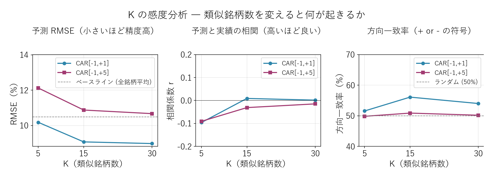

# K-NN 回帰で「類似群からの値動き」を予測する ― 失敗が生んだ個別ショック検出器

{width="1280"}

本記事では、機械学習の **K-Nearest Neighbors（K-NN）回帰** で「**類似決算群の CAR から自身の CAR を予測**」する実装を回します。

結論を先に書くと：**K-NN 予測は失敗** しました（全銘柄平均で予測する単純なベースラインにも勝てません）。しかしこの失敗の中に **本連載全体の最も重要な洞察** が含まれています ― 「**機械学習による事前予測は本質的に困難だが、予測との乖離は『個別ショック検出器』として極めて有用**」。本記事はその実証と、**本連載の到達点としてのハイブリッド投資ワークフロー** を提示します。

データ出典: 前回生成した `data/blog15/features.parquet`（286 銘柄）と `events_2026.parquet`（2026/3 期 CAR）。実装は `scripts/blog16_prediction.py`（K-NN 計算 + 個別ショック抽出）と `scripts/blog16_generate_images.py`。実 embedding API・LLM API は本連載全体を通して呼んでいません（要約・embedding は Claude が代理出力）。実 API での 8,049 イベント全要約 + embedding 化は番外編で追加実行可能（Haiku 4.5 で約 3,100 円見積もり）

<a class="ref-card ref-card--quiet" href="https://www.elastic.co/jp/what-is/knn" target="_blank" rel="noopener">

K近傍法（K-NN）とは
近くにある既知データの多数決で予測する機械学習手法 ― Elastic

</a>

<!-- more -->

## K-NN 回帰の概要

### これまでの分析では届かなかった視点

ここまでは「**1 銘柄を深く分析する**」アプローチでした。本記事は **「機械学習で値動きを予測できるか」** を 232 銘柄全体で検証します。

| アプローチ | 視点 | 銘柄数 |
|---|---|---|
| スコア化 | 全銘柄ランキング | スクリーニング |
| CAR 集計 | 8,049 イベント CAR 集計 | 統計 |
| 類似決算検索 | 1 銘柄 vs 類似 Top-K | 個別 + 比較 |
| **K-NN 予測（本記事）** | **全 287 銘柄予測 vs 実績** | **全体検証** |

### パイプライン全体図

類似 Top-K の CAR を平均して自身の CAR を予測し、予測と実績の誤差が大きい銘柄を「個別ショック」として抽出する ― という流れです。

<i class="fa-solid fa-expand"></i> クリックで拡大 ・ 2026.05.31作成

{width="1200"}

これは機械学習の **K-Nearest Neighbors 回帰** を決算データに応用したものです。「**最近傍 K 件の目的変数の平均値で予測する**」という最も古典的な手法。

### 集計対象とイベント数

| データ | 件数 |
|---|---|
| 特徴量データ features.parquet（10 次元） | 287 銘柄（特徴量 ≥7 個揃う） |
| 2026/3 期 announcement の実績 CAR | 同 287 銘柄 |
| ペアワイズ cosine 類似度 | 287 × 287 = 82,369 ペア |
| 予測 vs 実績 ペア（評価サンプル） | 287 |

---

## 分析で分かったこと

### 結論その1: K-NN 予測は失敗した

予測 CAR（K=15、類似 Top-15 の平均）と実績 CAR の散布図：

<i class="fa-solid fa-expand"></i> クリックで拡大 ・ 2026.05.31作成

{width="1200"}

| 指標 | 値 |
|---|---|
| 相関係数 r | **-0.03**（事実上ゼロ） |
| RMSE | **10.88%** |
| MAE | 7.93% |
| 方向一致率（+/- 符号一致） | **50.9%** |
| ベースライン（全銘柄平均で予測） RMSE | 10.46% |

**読み解き**：

- 相関係数 r = -0.03 ― **完璧予測 y=x の線とほぼ無関係に分布**
- RMSE 10.88% は **ベースライン（10.46%）より悪い** ― K-NN による予測価値はマイナス
- 方向一致率 50.9% ― ランダム（50%）とほぼ同等で統計的有意性なし

つまり「**類似決算群の平均 CAR は、自身の CAR の予測値として使えない**」。前回見た「丸紅 -9.39% vs 類似群 +2.43%」は **特殊事例ではなく一般的な構図** だったわけです。

### 結論その2: K を変えても改善しない

K=5/15/30 で精度を比較：

<i class="fa-solid fa-expand"></i> クリックで拡大 ・ 2026.05.31作成

{width="1200"}

| K | RMSE [-1,+5] | 相関 r | 方向一致率 |
|---|---|---|---|
| 5 | 12.12 | -0.091 | 49.8% |
| **15** | 10.88 | -0.031 | **50.9%** |
| 30 | 10.67 | -0.015 | 50.2% |

K=15 が方向一致率では最高（50.9%）、K=30 が RMSE では最低（10.67）だが、**いずれもベースライン（RMSE 10.46）に届かない**。**K を増やすほど予測は全銘柄平均に近づく** ため、根本的に「数値特徴量だけでは予測不可」という事実が変わりません。

### なぜ予測できないのか ― 4 つの理由

| # | 理由 | 具体例 |
|---|---|---|
| 1 | **数字に表れない個別事象**（M&A、減損、ガイダンス、説明会IR） | 丸紅 -9.39% を特徴量からは予知できなかった |
| 2 | **市場の織り込みタイミングのずれ**（全市場ではクラシック PEAD はあるが個別差大） | CAR 全体相関 r=+0.69 でも短期と長期の符号が逆転する銘柄が 30% |
| 3 | **同業の決算が同じ日に集中** → 直近の他社決算で市場ムードが変わり、後続発表が影響受ける | 5/14, 5/15 に決算集中（TDnet 統計） |
| 4 | **特徴量が決算時点の静的指標のみ** ― 経営の物語・経営者の質・業界トレンドは捕捉できない | 数値特徴量は事実ベースで、物語までは捉えられない |

### 結論その3: しかし失敗の中に個別ショック検出器がある

予測との乖離 |err| が大きい銘柄は、**「数字パターン上は同業並みなのに、市場が予期せぬ評価をした銘柄」**。これは投資判断で **真っ先に IR・説明会を確認すべき銘柄群** です。

<i class="fa-solid fa-expand"></i> クリックで拡大 ・ 2026.05.31作成

{width="1200"}

**ポジティブショック Top-5（市場が想定より大幅好評価）**：

| コード | 会社名 | 予測 | 実績 | 誤差 |
|---|---|---|---|---|
| 7236 | ティラド | -0.5% | **+62.5%** | +63.0pp |
| 2737 | トーメンデバイス | -5.0% | +30.0% | +35.0pp |
| 2371 | カカクコム | -4.8% | +29.4% | +34.2pp |
| 6516 | サンデン | +2.3% | +35.1% | +32.8pp |
| 6882 | 三電機 | -1.6% | +29.7% | +31.3pp |

これらは **数値特徴量が中庸（YoY +5〜+20%）にも関わらず、市場が +30〜60% で歓迎した** 銘柄。M&A 期待、新製品リリース、業界転換期の本命視 など、**プロンプト化されていない物語** が背後にある可能性が高い。類似検索だけでは見つけられない、**「説明会・追加 IR で初めて見える買い材料」** が反映された可能性。

**ネガティブショック Top-5（市場が想定より大幅悪評価）**：

| コード | 会社名 | 予測 | 実績 | 誤差 |
|---|---|---|---|---|
| 5906 | エンケイ | +5.0% | **-23.2%** | -28.2pp |
| 9629 | PCA | -0.5% | -23.5% | -23.0pp |
| 6469 | 放電精密加工研究所 | +6.4% | -14.9% | -21.1pp |
| 6702 | 富士通 | +4.4% | -16.8% | -21.2pp |
| 1720 | 東急建設 | +2.1% | -18.7% | -20.6pp |

これらは **数値特徴量が中庸〜やや良いにも関わらず、市場が大きく売った** 銘柄。ガイダンス下方修正、減損計上、説明会での慎重コメント、市場予想を大きく下回るコンセンサス との乖離など、**「資料を熟読しないと見えない警戒材料」** が反映された可能性が高い。

### 主要銘柄の最終確認 ― 丸紅・双日・ＥＮＥＯＳ

| 銘柄 | 実績 CAR | 窓 | 予測 CAR | 誤差 | 個別ショック判定 |
|---|---|---|---|---|---|
| 丸紅（8002） | **−9.39%** | [−1, +5] | +2.43% | **−11.82pp** | **ネガティブショック** |
| 双日（2768） | −4.25% | [−1, +5] | +2.54% | −6.79pp | **軽いネガショック** |
| **ＥＮＥＯＳ（5020）** | **−4.68%** | [−1, +5] | −2.30% | **−2.37pp** | **軽いネガ（初動 +1.36% 後 5 日で反転）** |

丸紅・双日は **数字パターンより市場の評価がネガティブ** ― 利益の質・予想・セグメントの分析で「健全な質の高い決算」と評価した銘柄が、2026/3 期では市場で売られた事実。丸紅については、セグメント分析で観察された **「次世代事業 +127% × 金融・リース・不動産 −54.7% の二極化」** や **次世代事業の利益化までの時間軸** を市場が決算説明会で再評価した可能性が示唆されます（ＥＮＥＯＳ のピークアウト議論は 2025-03-28 業績予想修正発表への反応であり、丸紅とは別）。

一方、**ＥＮＥＯＳの誤差 −2.37pp は丸紅・双日より小さく**、shocks.csv の Top-30（誤差 ±10pp 以上）にも入りません。初動 [-1,+1] の +1.36% はポジティブだったものの、**5 営業日で −4.68% に反転**。これはセグメント分析で観察した「高 OPM セグメントの正常化局面」が後追いで市場に認識されたとも読めます。AI 予測フレームからは **「数値特徴量で概ね説明できる範囲」** ― ある意味「予測がほぼ機能した事例」にあたります。

| 銘柄群 | 予測の状態 | 含意 |
|---|---|---|
| 丸紅・双日 | 予測が失敗（誤差 大） | 数値外の個別事象（説明会・追加 IR）が市場を動かした → **要 IR 確認** |
| ＥＮＥＯＳ | 予測がほぼ的中（誤差 小） | 営業利益急回復という数字パターンが概ね市場反応と一致、ただし初動↑→5日で反転 → **数字で読めるが継続観察必要** |

これは本記事のメッセージをさらに精緻化します。**AI 予測の "精度そのもの" ではなく、"予測との乖離の大きさ" が情報** であり、乖離が小さい銘柄では「AI に追加情報は無い」、乖離が大きい銘柄では「数字外の判断材料を急いで集めるべき」という、**二分された投資ワークフロー** が見えてきます。

ＥＮＥＯＳ の [−1, +5] は確定し **−4.68%** ― 初動 +1.36% が 5 日で反転した事実は、セグメント分析で観察した「高 OPM セグメントの正常化局面」と整合します。[−1, +20] が確定する 2026 年 6 月以降に再評価すれば、「セグメント情報を読まないと見えない、後追いネガショック」のシグナルとして更に評価できます。

### 結論その4: 予測としてではなく「検出器」として使う

機械学習の常識：**「予測精度の低いモデルでも、極端ケースの検出には使える」**。

| 用途 | 適性 |
|---|---|
| 「銘柄 X の今後 5 営業日リターンは何 %？」 | ❌ 不可（r ≈ 0） |
| 「銘柄 X の方向（+ or -）は？」 | △ 50.9% でほぼランダム |
| 「**類似群と大きく乖離する銘柄を検出**」 | ◎ 個別ショック銘柄を即座に抽出 |
| 「説明会 IR を優先確認すべき銘柄リスト」 | ◎ 同上 |

本記事のスクリプトを毎日決算シーズンに回せば、**「数値だけ見ると同業並みだが市場が大きく動かした銘柄」をその日のうちに自動抽出** できます。これは個別投資家の **時間配分の最適化** に直結します。

---

## 本連載の到達点 ― ハイブリッド投資ワークフロー

データ取得 → XBRL 活用 → CAR 実測 → 類似検索 → 個別ショック検出、という各分析を、買い候補・要警戒・売り検討の判断につなぐ全体像が次の図です。

{width="1200"}

| フェーズ | ステップ | 役割 |
|---|---|---|
| **データ層** | 無料データ分析 | 証券会社のアプリで第 1 次絞り込み |
| | XBRL 活用 | XBRL → JSON 化（独自スキーマ）・アクルーアル / 予想検証 / セグメント |
| **分析層** | CAR 実測 | CAR で市場反応を実測 |
| | 類似決算検索 | 類似決算検索（業種クラスタリング） |
| | K-NN 予測（本記事） | K-NN 予測（**失敗**） + **個別ショック検出（成功）** |
| **判断層** | 統合 | 買い候補 / 要警戒 / 売り検討 の三段判定 |

**買い候補**：類似群健全（類似決算検索）× CAR 上昇（市場反応の実測）× 個別ポジショック（本記事）の三拍子。

**要警戒**：類似群と乖離（類似決算検索）× 個別ショック発生（本記事）。**説明会・追加 IR を優先確認**。アクルーアル・予想検証・セグメント情報で質を再評価。

**売り検討**：質低下シグナル（利益の質・予想・セグメント）× CAR 下落（市場反応）× 個別ネガショック（本記事）。

運用コストは、データ取得（EDINET / TDnet / yfinance）・ストレージ・Python 実行がほぼ 0 円、LLM 要約を足しても **年間数千円〜数万円**。本格クオンツ並みの分析が個人の手元で回ります。

最大の学びは、**AI と機械学習は「価格予測の魔法」ではなく「決算データを整理・発見する道具」** だということ。類似検索は業種を自動発見し、K-NN は予測ではなく個別ショック検出に効く ― 限界を理解して使えば、**投資家の時間配分を最適化** できます。

---

## まとめ

- K-NN 回帰（K=5/15/30）で類似群の平均 CAR から自身の CAR を予測 ― **相関 r=-0.03 / RMSE 10.88% で全銘柄平均ベースライン（10.46%）に負け、K を変えても改善せず**。数値特徴量だけでは決算 CAR の予測は構造的に不可能
- **失敗の中に発見**：予測との乖離（|err| 大）は **個別ショック検出器** として有用 ― ポジ例 ティラド +63pp・カカクコム +34pp（物語で動いた）／ネガ例 エンケイ −28pp・PCA −23pp（資料で見える警戒材料）
- 主要銘柄：**丸紅 −9.39% / 双日 −4.25%** は「健全」評価でも市場が売った **ネガショック**。**ＥＮＥＯＳ −4.68%（誤差 −2.37pp）は予測ほぼ的中の「軽いネガ」**（初動 +1.36% → 5 日で反転、高 OPM セグメント正常化の後追い）
- AI 予測は "精度" ではなく **"予測との乖離の大きさ" が情報** ― 乖離大＝要 IR 確認、乖離小＝数字で読める、の二分ワークフロー

機械学習分析編は今後も手法を追加していく予定です。データ駆動投資の差別化要素は「データを使う」から「データを持つ・整理する・AI と組み合わせる」へ ― 本連載がそのスタート地点になれば幸いです。

---

### 連載の全体像

| フェーズ | 内容 | 連載 | キー指標 |
|---|---|---|---|
| **1. データ取得編** | 取得・整形・XBRL→JSON 化 | 1-1〜1-3 | yfinance / EDINET・TDnet / XBRL |
| **2. 銘柄分析編** | スクリーニング・利益の質・予想・セグメント・市場反応 | 2-1〜2-7 | GARP・マルチファクター / アクルーアル・予想検証・セグメント / CAR |
| **3. 機械学習分析編** | 類似検索・予測・分類（実験的トライ） | 3-1〜3-4 | cosine 類似度 / K-NN / クラスタリング / ランダムフォレスト |

## <i class="fa-brands fa-github"></i> Python コード

本記事のチャート画像・データ取得・成形スクリプトは、すべて **GitHub に公開**しています。**K-NN 予測の実装（K=5/15/30 の交差検証・精度評価・個別ショック抽出・ベースライン比較）**は、リポジトリの README にまとめています。データは提供元の利用規約により再配布できませんが、データを各自取得すれば、本連載と同じものが再現できます。

<a class="repo-link" href="https://github.com/minnanosaiban/blog/tree/main/11_knn" target="_blank" rel="noopener">
github.com/minnanosaiban/blog/11_knn
<i class="repo-link-arrow fa-solid fa-arrow-up-right-from-square"></i>
</a>

---
