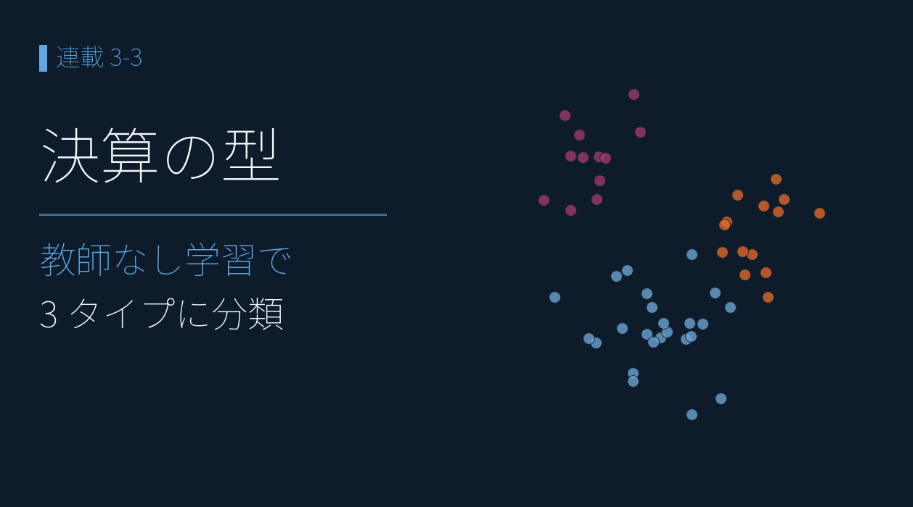
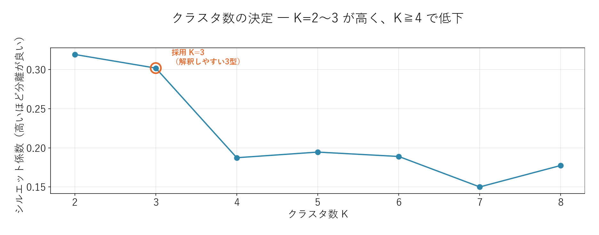
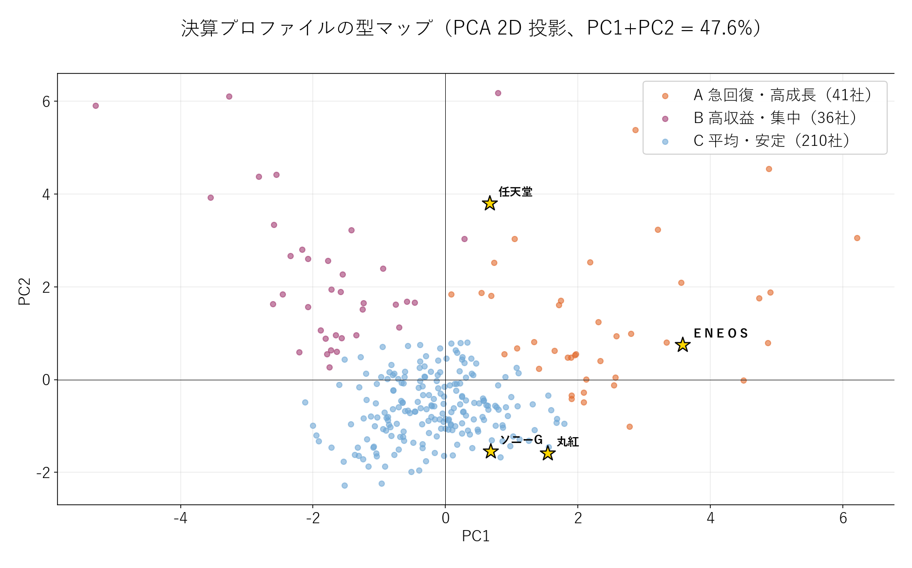
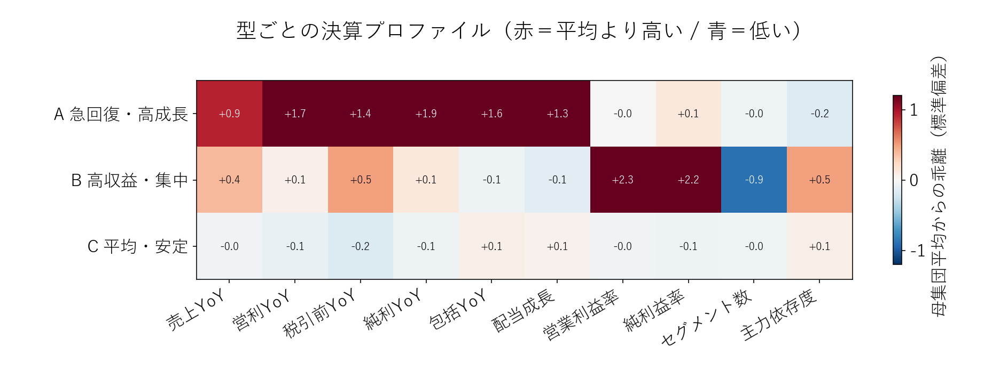

# K-means クラスタリング ― 教師なし学習が分けた「決算の型」

{width="1280"}

「商社っぽい決算」「いかにも成長株らしい数字」。決算の "型" は、つい主観で語ってしまいます。では、銘柄名も業種も伏せて **10 個の数値だけ** を機械に渡し、「似た者どうし」に勝手に分類させたら、どんな型が出てくるでしょうか。

本記事は **k-means クラスタリング**（正解を教えずに、似たものを機械が勝手にまとめる＝**教師なし学習**）で 287 銘柄の決算を分類し、データだけが描く「決算の型」を発見します。そして本連載の中核 **ＥＮＥＯＳ** が、どの型に入るのかを見ます。

データ出典: 自前パイプラインの `data/blog15/features.parquet`（決算 10 次元特徴量、特徴量 7 個以上揃う 287 銘柄）。実装は `scripts/blog17_clustering.py`（k-means + シルエット + PCA）と `scripts/blog17_generate_images.py`。クラスタ番号は乱数依存のため、純利益 YoY 最大の群を型A、営業利益率最大の群を型B と意味で固定

<a class="ref-card ref-card--quiet" href="https://zero2one.jp/ai-word/k-means-method/" target="_blank" rel="noopener">

k-means（k平均法）とは
データを重心からの近さで K 個に分ける教師なしクラスタリング ― zero to one AI用語集

</a>

<!-- more -->

## K-means で「決算の型」を見つける

連載 3-1 で設計した **10 次元の数値特徴量**（売上・営利・税引前・純利・包括の YoY、配当成長、営業利益率、純利益率、セグメント数、主力依存度）をそのまま使います。z-score で正規化し、**k-means** で似た決算どうしを自動でグループ分けします（正解ラベルは与えません）。

**クラスタ数 K**（いくつの型に分けるか）は、**シルエット係数**（型の分かれ具合の良さを 0〜1 で測る指標）で決めます。

<i class="fa-solid fa-expand"></i> クリックで拡大 ・ 2026.06.03作成

{width="1200"}

- シルエットは **K=2 と K=3 がほぼ同じくらい良く（0.30 前後）、K≧4 で 0.19 以下に低下** ― 決算は本質的に「少数の型」に分かれる
- ほぼ互角の 2 と 3 のうち、本記事は **K=3 を採用**。2 つだと「高収益 vs その他」で終わるが、3 つにすると型がもう一段見えるため

## 型マップで「3 つの決算プロファイル」を観測

10 次元の特徴量を、PCA（多くの次元を 2 次元に圧縮して見る手法）で平面に映します。軸そのものに決まった意味はありませんが、**近い決算ほど近くに置かれる** ので、型のまとまりが見えます。

<i class="fa-solid fa-expand"></i> クリックで拡大 ・ 2026.06.03作成

{width="1200"}

| 型 | 社数 | 性格（実数値の平均） |
|---|---|---|
| **A 急回復・高成長** | 41 | 純利 YoY **+147%**・包括 +234%・営利 +124% ／ 利益率は中位（営利 8.6%） |
| **B 高収益・集中** | 36 | **営業利益率 31.8%・純利益率 24.7%** が突出 ／ 単一セグメント（1.2） |
| **C 平均・安定** | 210 | 1 桁成長・平均的マージン・多角化（2.9 セグメント）＝ 大多数 |

- 業種コードを一切使っていないのに、**右に「急回復」・上に「高収益」・中央に「平均」** という構造が自動で現れます
- **決算の 73%（210/287）は "平均型"**。突出するのは「急回復」と「高収益」の **2 つの裾** だけ ― これ自体が発見です
- ＥＮＥＯＳ は右端の **型A（急回復）**、任天堂も型A、丸紅・双日・ソニーG は中央の型C に位置します

## 型プロファイルで「各型の正体」を確認

各型が 10 指標で **母集団平均からどれだけ離れているか**（標準偏差）を見ると、型の正体がくっきりします。

<i class="fa-solid fa-expand"></i> クリックで拡大 ・ 2026.06.03作成

{width="1200"}

- **型A 急回復**：YoY 系がすべて赤（純利 +1.9σ・営利 +1.7σ…）。利益率は平均並み ― 「水準は普通だが伸び率が突出」
- **型B 高収益**：**営業利益率 +2.3σ・純利益率 +2.2σ** が突出し、セグメント数 −0.9σ（単一事業）。「専業で稼ぐ高マージン型」
- **型C 平均**：全指標がほぼ 0σ。市場の大多数を占める "ふつうの決算"

## ＥＮＥＯＳ ― 機械学習が下した「急回復型」の判定

ＥＮＥＯＳ は型A（急回復）、しかも **右端の極端な位置** に置かれました。背景は 2026/3 期の **継続事業ベース営業利益 +339.8%** という急回復です。

連載 1-3 で見た「純利益 **5,371 → 2,261 億の半減**（ピークアウト）」の、ちょうど **反転局面** を、k-means が **教師なしで「急回復型」と分類** した形です。「ピーク → 反落 → 急回復」という市況循環（シクリカル）の波が、銘柄名を伏せた数値だけから "型" として浮かび上がります。

ただし **型A = 次も安泰、ではありません**。急回復は在庫評価差益や特需など **一過性要因** で起きることも多く、ＥＮＥＯＳ も利益の質（連載 2-3 アクルーアル）やセグメント（連載 2-6 で見た高 OPM 事業の正常化）と併せて読む必要があります。クラスタリングは「型を当てる」道具であって、「未来を当てる」道具ではありません。

## まとめ

- 10 次元の決算特徴量を **k-means（教師なし学習）** で分類。シルエット係数から **K=3** を採用
- 287 銘柄は **A 急回復・高成長（41）/ B 高収益・集中（36）/ C 平均・安定（210）** の 3 型に分かれた ― 業種コード不使用でも構造が自動的に現れる
- **決算の 73% は "平均型"**。投資妙味のある裾は「急回復」と「高収益」の 2 つだけ、という地図が描けた
- **ＥＮＥＯＳ は急回復型の右端**。1-3 で見たピークアウトの反転局面を、データだけが "型" として捉えた。ただし急回復の持続性は利益の質・セグメントと併読が必須

## <i class="fa-brands fa-github"></i> Python コード

本記事のチャート画像・データ取得・成形スクリプトは、すべて **GitHub に公開**しています。**クラスタリングの計算方法**（特徴量の正規化・シルエットによる K 決定・k-means・PCA 可視化）は、リポジトリの README にまとめています。データは提供元の利用規約により再配布できませんが、データを各自取得すれば、本連載と同じものが再現できます。

<a class="repo-link" href="https://github.com/minnanosaiban/blog/tree/main/12_clustering" target="_blank" rel="noopener">
github.com/minnanosaiban/blog/12_clustering
<i class="repo-link-arrow fa-solid fa-arrow-up-right-from-square"></i>
</a>

---
