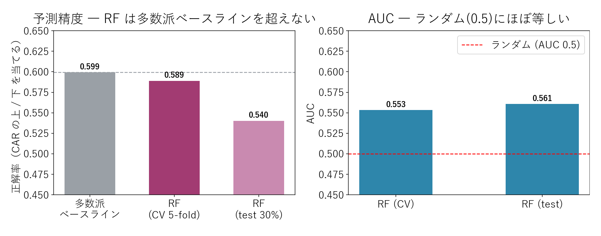
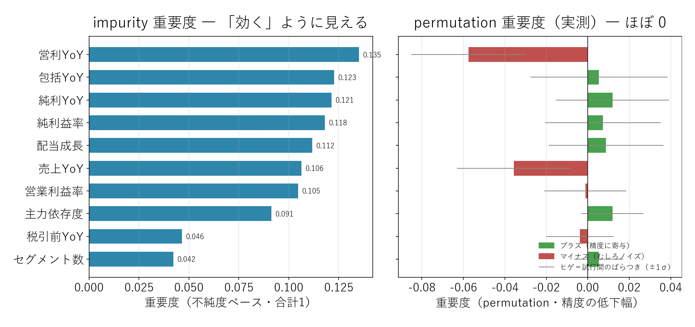

# ランダムフォレストで「決算指標の効き」を検証する ― 予測は失敗、重要度の落とし穴

{width="1280"}

「機械学習を使えば、決算の良し悪しから株価の反応を予測できるはず」。そう期待したくなります。前回（3-2）は K-NN 回帰でそれを試し、見事に失敗しました。本記事は **ランダムフォレスト** という別の手法で、もう一度「決算 10 指標から CAR（決算前後の超過リターン）の上下を当てられるか」を検証します。

結論を先に書くと **当てられません**。しかもその過程で、**「特徴量重要度」という指標そのものの落とし穴** が見えてきます。

データ出典: 自前パイプラインの `data/blog15/features.parquet`（決算 10 次元特徴量）と `events_2026.parquet`（2026/3 期 CAR、287 銘柄でマッチ）。実装は `scripts/blog18_random_forest.py`（RF + 交差検証 + permutation 重要度）と `scripts/blog18_generate_images.py`。乱数シードは 42 固定

<a class="ref-card ref-card--quiet" href="https://zero2one.jp/ai-word/random-forest/" target="_blank" rel="noopener">

ランダムフォレスト とは
多数の決定木の多数決で予測するアンサンブル学習 ― zero to one AI用語集

</a>

<!-- more -->

## ランダムフォレストの概要

ランダムフォレストは、多数の決定木の多数決で予測する定番の機械学習手法です。連載 3-1／3-2 と同じ **決算 10 指標**（YoY 各種・利益率・配当成長・セグメント情報）を入力に、**CAR[-1,+5] の符号（上 / 下）を分類** させます。

対象 287 銘柄のうち **上昇は 40%、下落は 60%**。つまり **「常に下と言うだけで 59.9% 当たる**（＝多数派ベースライン）」。モデルはこれを超えて初めて「予測できた」と言えます。評価は **5-fold 交差検証 ＋ 30% ホールドアウト** で行います。

## 予測精度で「当たらないこと」を確認

<i class="fa-solid fa-expand"></i> クリックで拡大 ・ 2026.06.03作成

{width="1200"}

- **交差検証の正解率 0.589 < ベースライン 0.599** ― ランダムフォレストは「常に下」と言うだけのルールにすら勝てません
- ホールドアウト（test）では **0.540** とさらに低下。**AUC も 0.55 前後** で、ランダム（0.5）にほぼ等しい
- **別手法でも予測は失敗** ― 3-2 の K-NN（相関 r ≈ 0）と独立に、「数値特徴量だけで市場反応は当てられない」が裏付けられました

## 特徴量重要度で「効く指標の罠」を観測

「当たらない」のは分かった。では **どの決算指標が効いているのか**？ ここで重要度の測り方が落とし穴になります。

{width="1200"}

- **左（impurity 重要度）** では、営利 YoY・包括 YoY・純利 YoY が上位に並び、いかにも「効いている」ように見えます
- しかし **右（permutation 重要度＝その指標をシャッフルして精度がどれだけ落ちるかの実測）** で測ると、**どれもほぼ 0**。それどころか **営利 YoY・売上 YoY はマイナス**（シャッフルした方が精度が上がる＝ただのノイズ）
- impurity 重要度は、分岐に使われた回数を数えるだけで **連続値・高分散の指標を過大評価** します。**"効いて見える" 指標も、実際には効いていない** ― 重要度は permutation で確かめるのが鉄則です

## ＥＮＥＯＳ ― モデルの予測はコイン投げ

本連載の中核 ＥＮＥＯＳ について、ランダムフォレストが出した上昇確率は **0.53**（ほぼ五分五分）。一方、実際の CAR[-1,+5] は **−4.68%（下落）** でした。

つまりモデルは「分からない」と言ったに等しく、結果も外しています。ＥＮＥＯＳ を動かしたのは決算の数値ではなく、連載 2-7（CAR）で見た **業績予想修正への市場反応** や、のれん減損・在庫影響といった **数値外の構造要因** でした。数字のパターンからは、やはり読めません。

## まとめ

- ランダムフォレストでも CAR の方向は当てられない（**CV 正解率 0.589 < ベースライン 0.599**、AUC 0.55）。K-NN（3-2）と独立に同じ結論
- **impurity 重要度は「効く」ように見せるが、permutation で測るとほぼ 0** ― 重要度指標そのものの過大評価バイアスという発見
- 数値だけで市場反応は予測できない。機械学習は **予測の魔法ではなく、整理・発見の道具**（本連載を貫く結論）
- ＥＮＥＯＳ も予測はコイン投げ。株価を動かすのは数値外の材料（構造要因・IR・市場の解釈）

## <i class="fa-brands fa-github"></i> Python コード

本記事のチャート画像・データ取得・成形スクリプトは、すべて **GitHub に公開**しています。**ランダムフォレストの実装**（交差検証・ホールドアウト・permutation importance・impurity との比較）は、リポジトリの README にまとめています。データは提供元の利用規約により再配布できませんが、データを各自取得すれば、本連載と同じものが再現できます。

<a class="repo-link" href="https://github.com/minnanosaiban/blog/tree/main/13_random_forest" target="_blank" rel="noopener">
github.com/minnanosaiban/blog/13_random_forest
<i class="repo-link-arrow fa-solid fa-arrow-up-right-from-square"></i>
</a>

---
