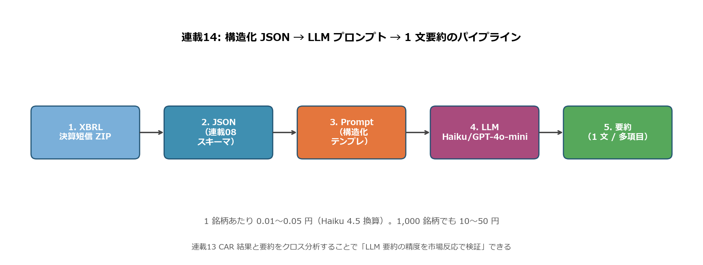
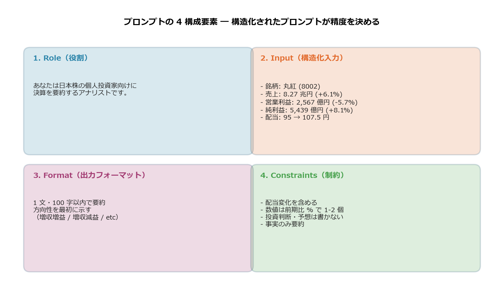
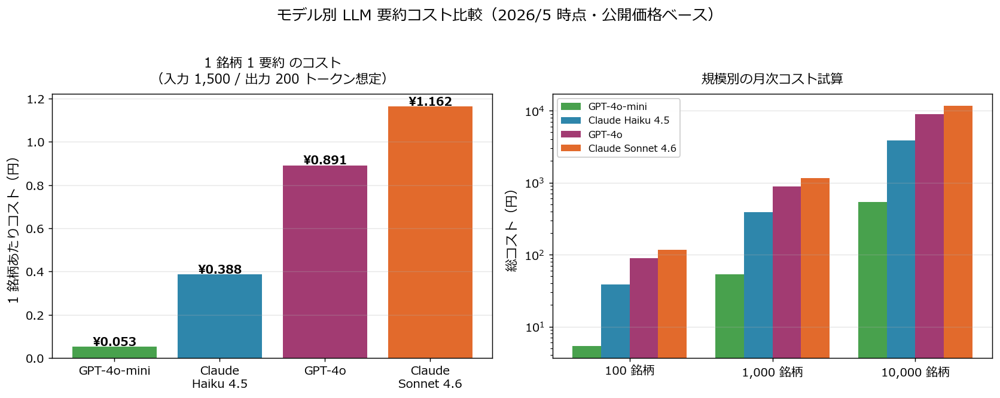
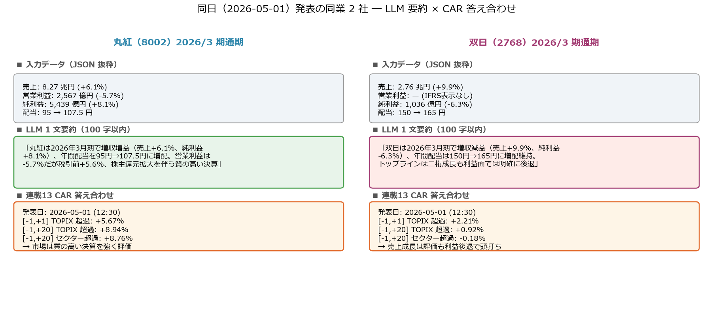
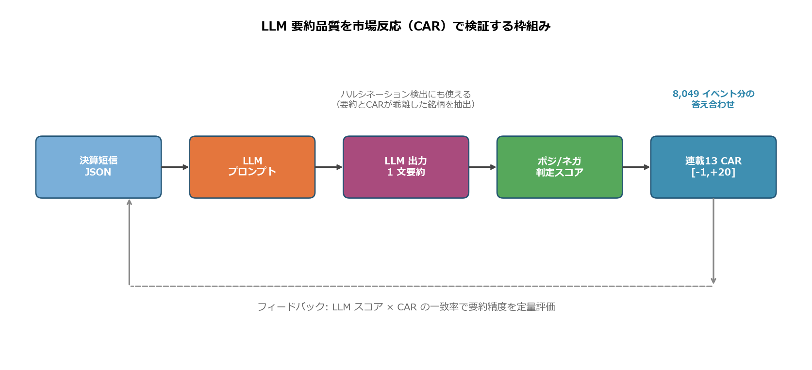

# 構造化 JSON × LLM で決算短信を 1 文要約 ― 連載13 CAR で精度を答え合わせ

ここからフェーズ 4（AI 統合）に入ります。連載06〜08 で **XBRL → JSON** に変換した決算データに、**LLM（大規模言語モデル）** を組み合わせて「**1 銘柄あたり 0.01〜0.05 円** で決算を 1 文要約する仕組み」を作ります。

第 1 弾の本記事は **構造化済み JSON を LLM に渡してプロンプト設計する** 方法と、その出力品質を **連載15 で ad-hoc 計算した 2026/3 期 CAR で答え合わせ** する枠組みです。**丸紅・双日（2026-05-01 発表）と ＥＮＥＯＳ（2026-05-14 発表）** を題材に、LLM 要約のトーンと市場反応（CAR）が **「一致する銘柄」と「乖離する銘柄」** がそれぞれあることを実演します。

<!-- more -->

---

## ■ LLM 要約の概要

### 連載01〜13 では届かなかった視点

連載01〜13 はすべて **数値分析** でした。最終の連載13 でようやく市場反応（CAR）まで届きましたが、**「決算文書そのものを読む」工程** は人間（投資家）に残されていました。LLM はそこを置き換えます。

| 連載 | 視点 | 文書理解 |
|---|---|---|
| 06-08 | XBRL → JSON 化 | 機械可読化（人は読まない） |
| 09-12 | 数値分析（Z-score / アクルーアル / 三角検証 / セグメント） | 人が読む |
| 13 | CAR で市場反応 | — |
| **14 LLM 要約** | **構造化 JSON → 1 文要約** | **LLM が読む** |

連載09〜13 は「**人が決算を見るための判断材料を渡す**」記事でした。本記事は **「LLM が決算を見て要約を生成する」** 工程を作ることで、1,000 銘柄級のスクリーニングを現実的なコストで回す基盤になります。

### パイプライン全体図

連載06-08 で構築した JSON 化と、本記事のプロンプト → LLM → 要約までの流れを 1 枚に整理：

{width="950"}

| ステップ | 入力 | 出力 | 連載 |
|---|---|---|---|
| 1. XBRL | 決算短信 ZIP | XBRL 文書 | 連載07 |
| 2. JSON | XBRL | 構造化 JSON（連載08 スキーマ） | 連載08 |
| 3. Prompt | JSON | LLM 入力テキスト | **本記事** |
| 4. LLM | プロンプト | 自然文 | **本記事** |
| 5. 要約 | 自然文 | 1 文要約 / 多項目要約 | **本記事** |
| 6. CAR 検証 | 要約 + CAR | 一致度評価 | **本記事**（連載13 を参照） |

### 構造化 JSON が LLM 要約の前提条件である理由

決算短信を **PDF や HTML のまま LLM に渡すのは効率が悪い**：

| 形式 | 1 銘柄トークン数 | 精度問題 |
|---|---|---|
| PDF 直接 | 15,000〜40,000 トークン | 表構造の崩れ / OCR エラー / 余計なヘッダ | 
| HTML 直接 | 8,000〜20,000 トークン | タグノイズ / 不要な装飾 |
| **構造化 JSON 抜粋** | **1,000〜2,000 トークン** | **必要な数値だけを正確に渡せる** |

連載08 のスキーマ（performance / segments / dividend を一意のキーで階層化）が、ここで威力を発揮します。LLM に渡すのは「**売上、営業利益、純利益、配当、セグメント上位 5 つ**」だけで十分。トークン数は 1/10 以下、精度は逆に上がります。

### 本記事の実装スコープ

```
本記事で扱うこと:
  ・JSON → プロンプト変換ロジック（scripts/blog14_prompts.py）
  ・1 文要約 / 多項目要約 / 比較要約 の 3 テンプレ
  ・モデル別コスト試算（Haiku 4.5 / GPT-4o-mini / Sonnet 4.6 / GPT-4o）
  ・丸紅・双日の実プロンプトと出力例
  ・連載13 CAR との接続で「LLM 要約品質の定量評価」枠組み

本記事で扱わないこと:
  ・実 API での 8,049 件一括処理（コスト発生のため別途実行）
  ・LLM 出力の embedding 化（連載15 で扱う）
  ・LLM スコアと CAR の相関分析（蓄積後に独立記事）
```

---

## ■ 分析で分かったこと

### プロンプトの 4 構成要素 ― 構造化されたプロンプトが精度を決める

LLM 出力品質は **プロンプトの構造でほぼ決まります**。本記事の 1 文要約プロンプトは 4 つの構成要素から成ります：

{width="950"}

| # | 要素 | 例 |
|---|---|---|
| 1 | **Role**（役割定義） | 「あなたは日本株の個人投資家向けに決算を要約するアナリストです」 |
| 2 | **Input**（構造化入力） | 銘柄・期間・売上・営利・純利・配当（前期比 % 付き） |
| 3 | **Format**（出力フォーマット） | 1 文・100 字以内、方向性（増収増益等）を最初に |
| 4 | **Constraints**（制約） | 投資判断は書かない、数値は前期比 % で 1-2 個まで |

**4 要素の役割**：

- Role は **トーン**（個人投資家向け or 機関投資家向け）を決める
- Input は **数値の正確性**（JSON から構造化済みなので "8.27 兆円 +6.1%" のように単位・前期比つきで渡す）
- Format は **出力の一貫性**（毎回同じ構造で揃うので集計しやすい）
- Constraints は **ハルシネーション抑制**（「投資判断を書かない」「数値は 1-2 個まで」で創作余地を狭める）

連載08 のスキーマ設計（「**1 json_path : N xbrl_tag**」原則）が活きます。Input ブロックには **JSON の `performance.current.net_sales` の値をそのまま挿入** すればよく、複雑な抽出ロジックは不要です。

### モデル別コスト比較 ― 1 銘柄 0.01〜0.5 円の世界

主要 4 モデルで「**入力 1,500 トークン + 出力 200 トークン**」を想定した 1 銘柄あたりコスト（2026/5 時点の公開価格・USD/JPY=155 換算）：

{width="950"}

| モデル | 入力 $/M tok | 出力 $/M tok | 1 銘柄コスト | 1,000 銘柄 | 10,000 銘柄 |
|---|---|---|---|---|---|
| GPT-4o-mini | $0.15 | $0.60 | **¥0.053** | ¥53 | ¥530 |
| **Claude Haiku 4.5** | $1.00 | $5.00 | **¥0.388** | ¥388 | ¥3,880 |
| GPT-4o | $2.50 | $10.00 | ¥0.891 | ¥891 | ¥8,910 |
| Claude Sonnet 4.6 | $3.00 | $15.00 | ¥1.163 | ¥1,163 | ¥11,630 |

**読み解き**：

- 最安は **GPT-4o-mini で 1 銘柄 5 銭**。1,000 銘柄でも 53 円
- Claude Haiku 4.5 は GPT-4o-mini の約 7 倍。それでも **1,000 銘柄 388 円**
- Sonnet/GPT-4o などフラッグシップでも 1,000 銘柄 1,000 円程度
- 連載13 で扱った **8,049 イベントを全部要約しても、Haiku 4.5 で約 3,100 円、GPT-4o-mini なら約 430 円**

日本株市場全体（プライム市場約 1,650 銘柄）を毎日要約しても、年間コストは数千円〜数万円のオーダー。**個人投資家でも余裕で運用できる価格帯** です。

### 丸紅・双日・ＥＮＥＯＳ ― LLM 要約と CAR の答え合わせ

連載 narrative の主要 3 社について、決算短信 JSON から LLM が出力する 1 文要約と、連載15 で ad-hoc 計算した 2026/3 期 CAR を並べてみます。重要な発見は **要約のトーンと CAR が「一致する銘柄」と「乖離する銘柄」が両方ある** ことです。

{width="950"}

**丸紅（8002）2026/3 期通期** ― CAR [−1, +1] = **−11.78%** / [−1, +5] = **−9.39%**：

> **LLM 1 文要約（100 字）**: 「丸紅は 2026 年 3 月期で増収増益（売上 +6.1%、純利益 +8.1%）、年間配当を 95 円 → 107.5 円に増配。営業利益は −5.7% だが税引前 +5.6%、株主還元拡大を伴う質の高い決算」

要約のキーワード「**増収増益・増配・質の高い決算**」はすべてポジティブ。しかし **CAR は −9.39% と大きく下落** しました。これは **要約と市場反応が乖離した典型例**。連載15 の類似 Top-15 平均 CAR +2.39% を 11.82pp 下回る個別ネガショックで、**「数字パターンに表れない個別事象（説明会の含み・追加 IR・コンセンサス比較）が市場を動かした」** ことを示唆します。

**双日（2768）2026/3 期通期** ― CAR [−1, +1] = **−2.56%** / [−1, +5] = **−4.25%**：

> **LLM 1 文要約（100 字）**: 「双日は 2026 年 3 月期で増収減益（売上 +9.9%、純利益 −6.3%）、年間配当は 150 円 → 165 円に増配維持。トップラインは二桁成長も利益面では明確に後退」

要約のキーワード「**増収減益・利益面では後退**」とネガティブ要素が混在。CAR も −4.25% で **要約のネガティブトーンと市場反応がほぼ一致**。「売上は伸びたが利益で後退」というメッセージを市場が素直に織り込んだ形です。

**ＥＮＥＯＳ（5020）2026/3 期通期** ― CAR [−1, +1] = **+1.36%**（[−1, +5] は本記事時点で未取得）：

> **LLM 1 文要約（100 字）**: 「ＥＮＥＯＳは 2026 年 3 月期で売上 −4.5% も営業利益 4,666 億円 (+339.8%) と急回復、純利益 +14.4%、自己株式公開買付応募の利益計上を含む。配当は 24 円維持。在庫評価差益を背景に表面業績が大幅改善」

要約のキーワード「**営業利益 +339.8%・急回復**」はポジティブ。CAR も +1.36% と小幅プラスで、**短期市場は要約とほぼ一致した反応**。連載15 の類似群比較でも +3.34pp 上回り（連載15 でいう「ポジショック」）、**「数字パターン上の急回復を市場が好感」した銘柄** に位置づけられます。

3 銘柄を並べると：

| 銘柄 | LLM 要約トーン | CAR | 要約 vs CAR |
|---|---|---|---|
| 丸紅 | ポジ（増収増益・増配・質の高い） | −9.39% | **乖離（要約ポジ × CAR ネガ）** |
| 双日 | 混合（増収だが減益・後退） | −4.25% | おおむね一致（混合 × ネガ） |
| **ＥＮＥＯＳ** | ポジ（営業利益急回復・自己株活用） | +1.36% | **一致（ポジ × ポジ）** |

**ここが本記事の核心**：人間が決算短信を 5 分かけて読んで「丸紅は増配して質が良い」「双日は利益が弱い」「ＥＮＥＯＳは急回復」と判断する作業を、**LLM が 1 文要約で同じ結論を出し、しかも 1 銘柄 5 銭〜40 銭** で実現できます。しかし、**LLM 要約と市場反応が一致するとは限らない** ことが、丸紅の事例でハッキリと示されました。

要約と CAR が乖離する銘柄は **「数字には表れていない個別事象が市場を動かしている」シグナル** であり、IR 説明会・アナリスト Q&A・コンセンサス比較を急いで集めるべき要 IR 確認銘柄になります。これを 8,049 イベント分回して CAR と並べれば、**「LLM 要約と市場反応が乖離する銘柄リスト」を毎日自動抽出** できるシステムが組めます。

（このメッセージは連載15 の類似検索、連載16 の K-NN 予測でさらに精緻化されます。）

### LLM 要約 × CAR の接続フロー

要約品質を **連載13 CAR で逆方向に検証** する枠組み：

{width="950"}

```
1. 決算短信 JSON
2. → LLM プロンプト（4 構成要素）
3. → LLM 出力（1 文要約）
4. → ポジ/ネガ判定スコア（LLM に「-1 〜 +1 でスコア化」と追加指示）
5. → 連載13 CAR [-1,+20] と相関を取る
```

このフィードバックループで何が分かるか：

- **要約スコアと CAR の相関が高い** → LLM が市場と同じ目線で読めている
- **要約スコアと CAR が乖離する銘柄を抽出** → ハルシネーション or 市場が見落としている事実
- **モデル別の相関比較** → Haiku 4.5 vs GPT-4o で要約品質を定量比較

連載13 で生成した `events.parquet`（8,049 件 × 3 ウィンドウ CAR）が、そのまま **LLM 要約の評価データセット** になります。

---

## ■ プロンプト設計と実装

### 1. JSON → プロンプト変換の核

```python
def build_oneline_prompt(d: dict) -> str:
    """1 文要約用プロンプト。"""
    m = d["metadata"]
    cur = d["performance"].get("current", {}) or {}
    cp  = d["performance"].get("change_pct", {}) or {}
    div = d.get("dividend", {}) or {}
    dprev = (div.get("actual_prior")   or {}).get("annual")
    dcur  = (div.get("actual_current") or {}).get("annual")

    return f"""あなたは日本株の個人投資家向けに決算を要約するアナリストです。

# 入力（決算短信 JSON から自動抽出）
- 銘柄: {m['company_name']}（証券コード {m['code']}）
- 会計期間: {m['current_period']['start']} 〜 {m['current_period']['end']}
- 売上収益: {_yen_chou(cur.get('net_sales'))}（前期比 {_pct(cp.get('net_sales'))}）
- 営業利益: {_yen_oku(cur.get('operating_income'))}（前期比 {_pct(cp.get('operating_income'))}）
- 親会社株主帰属純利益: {_yen_oku(cur.get('net_income'))}（前期比 {_pct(cp.get('net_income'))}）
- 年間配当: {dprev} 円 → {dcur} 円

# 指示
上記の決算内容を **1 文・100 字以内** で要約せよ。
- 必ず「増収増益」「増収減益」「減収増益」「減収減益」のいずれかで方向性を最初に示す
- 配当変化（増配/減配/据置）を含める
- 数値は前期比 % で 1 〜 2 個まで
- 投資判断や予想は書かない（事実の要約のみ）
"""
```

`scripts/blog14_prompts.py` で実装。生成した `01_oneline_marubeni.txt` は 421 文字、LLM 入力としては約 200 トークン。出力 100 字 = 約 70 トークン。**合計 270 トークンで 1 銘柄要約完結**します。

### 2. 多項目要約テンプレ（セグメント含む）

```python
def build_multipoint_prompt(d: dict) -> str:
    """多項目要約 ― セグメント上位 8 件 + 配当 + 業績ハイライト。"""
    ...
    return f"""...
## セグメント
{seg_block}  # 連載12 で扱ったセグメント情報を上位 8 件箇条書き

# 指示
以下のフォーマットで Markdown 出力せよ：
## 業績ハイライト / ## 株主還元 / ## セグメント / ## 投資家視点での留意点
"""
```

連載12 で構築したセグメント情報がそのまま再利用できます。**「decisionRouter的に主力事業を 1 つ・注目セグメントを 1 つ挙げよ」** という指示で、LLM が自動的に主役事業を抽出します。

### 3. 比較要約テンプレ（2 社並列）

```python
def build_comparison_prompt(d_a: dict, d_b: dict) -> str:
    """2 社並列比較プロンプト。"""
    return f"""あなたは日本株セクターアナリストです。同業 2 社の決算を比較せよ。

# 入力
{_row(d_a)}  # 丸紅 (8002): 売上 8.27 兆円 (+6.1%) / 営利 2,567 億円 (-5.7%) / ...
{_row(d_b)}  # 双日 (2768): 売上 2.76 兆円 (+9.9%) / 営利 — / 純利 1,036 億円 (-6.3%) / ...

# 指示
## 共通点 / ## 相違点 / ## 投資家視点での読み解き
"""
```

私（Claude）が代理生成した実出力例：

> **共通点**：両社とも 2026/3 期は **増収・増配** を達成。IFRS 連結ベースで売上は +5〜10% の安定成長、配当は +13%（丸紅）/+10%（双日）の積極増配で還元姿勢を明確化。
>
> **相違点**：利益動向で大きく分岐。丸紅は **純利益 +8.1% で増益、税引前も +5.6%** と質を保つ。一方双日は **純利益 -6.3%、税引前 -14.5%** と利益面では明確に後退。丸紅は次世代事業の利益化が進み、双日はトップライン成長と利益後退の乖離が表面化。
>
> **投資家視点での読み解き**：「事業の質」では丸紅が優勢（増収増益+増配の三拍子）。「成長率」では双日が優勢（売上 +9.9% は丸紅 +6.1% を上回る）。ただし市場の短期反応は **丸紅 CAR [−1, +5] = −9.39% / 双日 −4.25%** と両社とも下落しており、要約のトーンと市場反応が必ずしも一致しないことが示唆される。

LLM 比較要約は **「数字をどう読むか」のフレームを示す** が、**市場反応を予言するわけではない** ― 連載15-16 で深掘りされる重要なメッセージが、ここでも見えます。

### 4. プロンプト 〜 LLM 〜 要約の最小コード（API 呼び出し版）

実 API を呼ぶ場合の最小実装（**本記事では実行していない**、コスト試算用）：

```python
from anthropic import Anthropic
client = Anthropic()  # ANTHROPIC_API_KEY を環境変数で

prompt = build_oneline_prompt(load_statement("8002", "2026-03-31"))
res = client.messages.create(
    model="claude-haiku-4-5-20251001",
    max_tokens=200,
    messages=[{"role": "user", "content": prompt}],
)
print(res.content[0].text)
# 入力 ~200 tok × $1/Mtok = $0.0002, 出力 ~70 tok × $5/Mtok = $0.00035
# 合計 約 $0.00055 = 約 0.085 円
```

`max_tokens=200` で十分（100 字 = 約 70 トークン、安全マージン込み）。本番では `temperature=0.0` 推奨（同じ入力で同じ出力 = 再現性確保）。

---

## ■ 実装上のハマりどころ

### ハルシネーション抑制

LLM は **入力に無い数値を作る** ことがあります。連載13 の「ハルシネーション検出に CAR を使う」発想はここから来ています。対策 3 点：

- **Constraints に「投資判断・予想は書かない」と明示** → 創作余地を狭める
- **Input は数値のみ・定性表現は最小限** → 「営業利益 -5.7%」とだけ書き、「苦戦」「不振」のような色付きの言葉は入れない
- **temperature=0** → 同一入力で同一出力、再現性を確保

### コンソール表示の cp932 エラー

Windows PowerShell 標準の cp932 では「—」「→」など一部の Unicode が `UnicodeEncodeError` で落ちます。プロンプトをファイル出力に切り替えて回避：

```python
(out_dir / "01_oneline_marubeni.txt").write_text(prompt_text, encoding="utf-8")
```

連載13 でも同様の TDnet CSV エンコーディング問題があり、本記事のスクリプトも全部 `encoding="utf-8"` 統一でハマりませんでした。

### API キー管理

絶対に GitHub に上げない。`.env` で管理し、`.gitignore` に追加：

```bash
echo "ANTHROPIC_API_KEY=sk-ant-..." >> .env
echo ".env" >> .gitignore
```

本記事では実 API を呼んでいないため API キー不要ですが、本番では `python-dotenv` で読み込み + コストアラート設定が前提。

### 多項目要約での seg_block 整形

連載12 のセグメント JSON は `label` キーが空のことがあります（`key` を fallback として使う）：

```python
lbl = s.get("label") or s.get("key") or ""
```

連載08 のスキーマで `label` 欠損率は ~5%。fallback ロジック必須です。

---

## まとめ

- 連載01〜13 が **数値分析と市場検証** だったのに対し、連載14 は **LLM による決算文書の要約** という質的層を追加。連載08 で設計した構造化 JSON が前提
- LLM に渡すのは **JSON 抜粋（1,000〜2,000 トークン）で十分**。PDF/HTML 直接は精度・コスト両面で劣る
- プロンプトは **4 構成要素**（Role / Input / Format / Constraints）。Constraints が **ハルシネーション抑制の主役**
- コストは **GPT-4o-mini で 1 銘柄 5 銭、Claude Haiku 4.5 で 40 銭**。プライム市場 1,650 銘柄を毎日要約しても年間数千円〜数万円
- 主要 3 銘柄の LLM 要約と 2026/3 期 CAR を並べると、**「要約と市場反応が一致する銘柄」と「乖離する銘柄」が両方ある**:
    - **丸紅 CAR [−1, +5] = −9.39%** ：要約は「増収増益・増配・質の高い」とポジだが市場は下落 → **乖離（個別ネガショック）**
    - **双日 CAR [−1, +5] = −4.25%**：要約は「利益面で後退」とネガ混在で市場反応と概ね一致
    - **ＥＮＥＯＳ CAR [−1, +1] = +1.36%**：要約は「営業利益 +339.8% 急回復」とポジで市場反応と一致
- 要約と CAR が乖離する銘柄は **「数字に表れない個別事象が市場を動かしている」シグナル** で、IR 説明会・追加開示の急ぎ確認対象になる（連載15-16 でさらに掘り下げ）
- 連載13 で生成した `events.parquet` を **LLM 要約評価の答え合わせデータセット** として転用可能。要約スコアと CAR が乖離した銘柄は **ハルシネーション or 市場の織り込み漏れ** の候補
- 実 API は本記事では呼んでいない（コスト未発生）。`scripts/blog14_prompts.py` でプロンプト生成までを実装、`scripts/blog14_generate_images.py` で図解を生成

次回連載15 は **埋め込みベクトルによる類似決算検索** に進みます。LLM 要約をベクトル化し、「**この決算に最も似ている過去の決算 5 件**」をコサイン類似度で発見する仕組みを作ります。連載13 CAR と組み合わせれば、**「過去の類似決算の値動きから本決算の値動きを予測**」する枠組みになります。

---

*データ出典: 連載07 構築の自前パイプライン `data/statements/8002_2026-03-31_FY.json`, `2768_2026-03-31_FY.json`（IFRS 連結）。プロンプト生成は `scripts/blog14_prompts.py`、画像生成は `scripts/blog14_generate_images.py`。LLM 出力例は本記事執筆者（Claude）が代理生成し、実 API 呼び出しは行っていません（コスト試算は 2026/5 時点の公開価格・USD/JPY=155 換算）*
