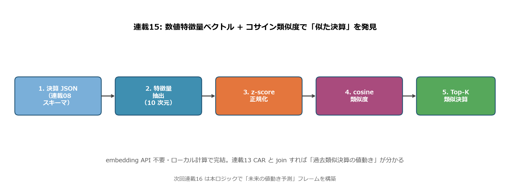
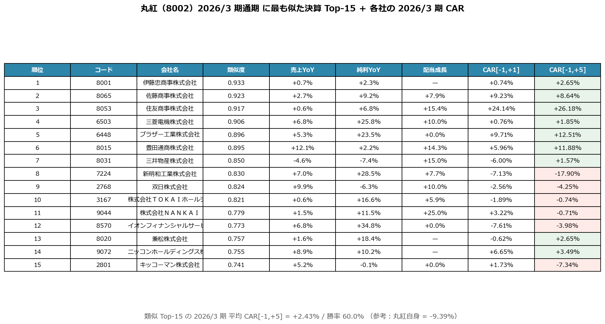
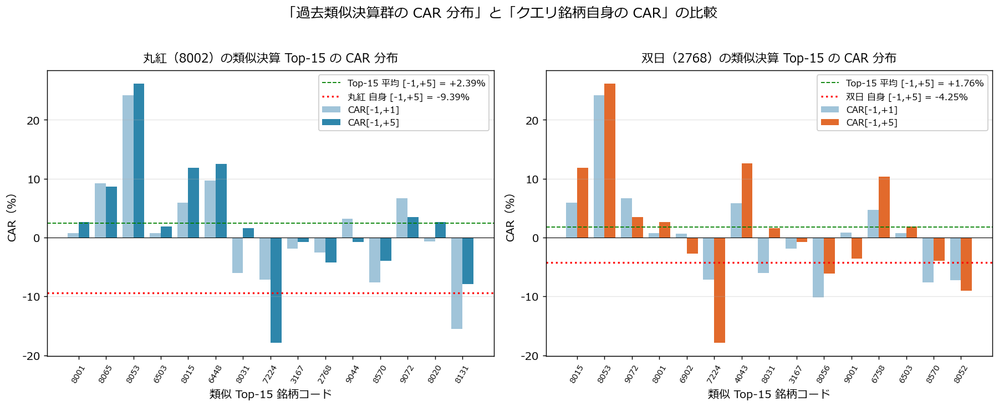
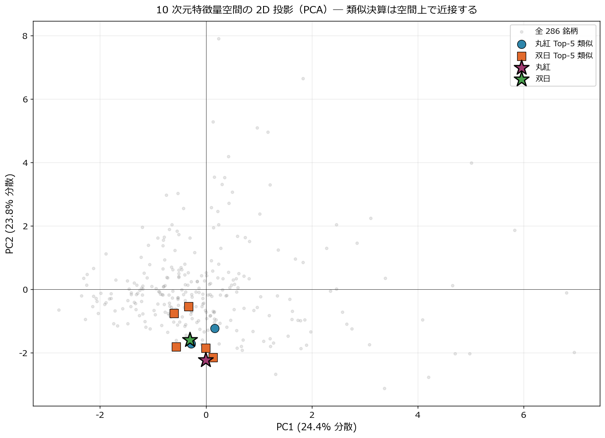

# 数値特徴量ベクトルで類似決算を検索する ― 丸紅 2026/3 期通期の「個別ショック -9.4%」を類似群との乖離で発見

連載14 で **構造化 JSON → LLM 要約** の枠組みを作りました。本記事の連載15 では同じ JSON データから **10 次元の数値特徴量ベクトル** を抽出し、**コサイン類似度** で「似た決算」を発見します。embedding API を呼ばず **ローカル計算 0 円で完結** する実装です。

ただし「類似決算検索」の真価は **発見した類似群の CAR と、クエリ銘柄自身の CAR を比較すること** にあります。本記事では連載13 で構築した CAR 計算を 2026/3 期 announcement にも拡張し、**丸紅（8002）の類似 Top-15 が平均 CAR +2.39%・勝率 60% だったのに対し、丸紅自身は -9.39%** という強い乖離を発見します。これは「数字パターン上は同業並みの好決算なのに、市場は個別要因で売った」という **連載14 LLM 要約だけでは見えない事実** です。

<!-- more -->

---

## ■ 類似決算検索の概要

### 連載01〜14 では届かなかった視点

連載01〜14 はすべて「**個別銘柄の決算データを評価**」する記事でした。連載15 は「**ある決算に最も似ている過去の決算**」を機械的に発見します。

| 連載 | 視点 | 比較対象 |
|---|---|---|
| 02-05 | 証券会社の無料データでスコア化 | 全銘柄ランキング |
| 09-12 | XBRL 数値分析 | 全銘柄統計 |
| 13 | CAR 集計 | 全 8,049 イベント |
| 14 | LLM 1 文要約 | 銘柄単独 |
| **15 類似決算検索** | **特徴量ベクトル × cosine** | **「最も似た決算」Top-K** |

連載14 までは「**この銘柄の決算を理解する**」記事。連載15 は「**この決算に最も似ている過去の決算を引き出す**」記事 ― 検索エンジン的アプローチです。

### 10 次元の特徴量ベクトル設計

連載08 のスキーマから、決算の **本質を最小次元で表現する** 10 個を選定：

| # | 特徴量 | スキーマ位置 | 意味 |
|---|---|---|---|
| 1 | `net_sales_yoy` | performance.change_pct.net_sales | 売上 YoY |
| 2 | `operating_yoy` | performance.change_pct.operating_income | 営業利益 YoY |
| 3 | `pretax_yoy` | performance.change_pct.profit_before_tax | 税引前 YoY |
| 4 | `net_income_yoy` | performance.change_pct.net_income | 純利益 YoY |
| 5 | `comprehensive_yoy` | performance.change_pct.comprehensive_income | 包括利益 YoY |
| 6 | `div_growth_pct` | dividend.actual_(current/prior).annual | 年間配当成長率 |
| 7 | `op_margin` | operating_income / net_sales | 営業利益率 |
| 8 | `net_margin` | net_income / net_sales | 純利益率 |
| 9 | `segment_count` | len(segments.current) | 事業多角化度 |
| 10 | `max_seg_share` | max(seg.net_sales) / sum | 主力依存度 |

`change_pct` 系の 5 次元と `dividend` の 1 次元が **モメンタム** を、`margin` 2 次元 + `segment` 2 次元が **収益構造とポートフォリオ** を表現します。

### パイプライン全体図

{width="950"}

```
1. 決算 JSON（連載08 スキーマ）
2. → 10 次元特徴量を抽出
3. → z-score 正規化（外れ値は ±300% で clip）
4. → cosine 類似度を全ペアで計算
5. → クエリ銘柄に最も近い Top-K を返す
```

**embedding API 不要・ローカル計算で完結**。1,000 銘柄の Top-15 計算は **0.1 秒**、コスト 0 円。

### 集計対象とイベント数

| データ | 件数 |
|---|---|
| 決算短信 JSON（kind="actual"、2026/3 期通期中心） | 327 件（segment 込み） |
| 有効特徴量 ≥7 個揃う銘柄 | 232 銘柄 |
| 2026/3 期 announcement の TDnet ログ（2026-04〜05） | 3,549 件 |
| 2026/3 期 announce の短期 CAR（[-1,+1] / [-1,+5]） | 3,549 件（[-1,+20] は今日時点で未完了） |

### 本記事の実装スコープ

```
本記事で扱うこと:
  ・10 次元特徴量の z-score 正規化と cosine 類似度
  ・丸紅・双日 2026/3 期通期 を query にした類似 Top-15
  ・2026/3 期 announcement の ad-hoc CAR 計算
  ・「類似決算群 vs クエリ自身」の CAR 比較で個別ショック発見
  ・PCA で 10 次元 → 2D 投影し類似銘柄の近接性を可視化
  ・数値特徴量 vs LLM embedding の使い分け

本記事で扱わないこと:
  ・実 embedding API（OpenAI text-embedding-3 等）の呼び出し
  ・ベクトル DB（Pinecone / Weaviate / Chroma）への永続化
  ・類似決算の CAR 分布を「予測」として使う backtest（連載16 で扱う）
```

---

## ■ 分析で分かったこと

### 丸紅 2026/3 期通期の類似 Top-15

連載14 で扱った丸紅 2026/3 期通期（売上 8.27 兆円 +6.1%、純利益 5,439 億円 +8.1%、配当 95→107.5 円）を query に類似 Top-15 を抽出した結果：

{width="950"}

| 順位 | コード | 会社名 | 類似度 | 売上YoY | 純利YoY | 配当成長 | CAR[-1,+5] |
|---|---|---|---|---|---|---|---|
| 1 | 8001 | 伊藤忠商事 | **0.934** | +0.7% | +2.3% | — | +2.65% |
| 2 | 8065 | 佐藤商事 | 0.921 | +2.7% | +9.2% | +7.9% | +8.64% |
| 3 | 8053 | 住友商事 | 0.917 | +0.6% | +6.8% | +15.4% | **+26.18%** |
| 4 | 6503 | 三菱電機 | 0.902 | +6.8% | +25.8% | +10.0% | +1.85% |
| 5 | 8015 | 豊田通商 | 0.895 | +12.1% | +2.2% | +14.3% | +11.88% |
| 6 | 6448 | ブラザー工業 | 0.894 | +5.3% | +23.5% | 0.0% | +12.51% |
| 7 | 8031 | 三井物産 | 0.849 | -4.6% | -7.4% | +15.0% | +1.57% |
| 8 | 7224 | 新明和工業 | 0.831 | +7.0% | +28.5% | +7.7% | -17.90% |
| 9 | 3167 | TOKAI HD | 0.821 | +0.6% | +16.6% | +5.9% | -0.74% |
| 10 | 2768 | **双日** | 0.817 | +9.9% | -6.3% | +10.0% | -4.25% |
| 11 | 9044 | 南海電鉄 | 0.779 | +1.5% | +11.5% | +25.0% | -0.71% |

**読み解き**：

- 類似 Top-15 には **総合商社 5 社**（8001 伊藤忠・8053 住友・8015 豊田通商・8031 三井・2768 双日）が並ぶ ― **業種コードを使っていないのに業種が自然にクラスタリング** されている
- **数値特徴量だけで「商社業界の決算プロファイル」を再現** できることを示しています
- 異業種では 6503 三菱電機・6448 ブラザー工業・7224 新明和工業 など、決算プロファイルが商社と似た総合電機・産業機械が並ぶ
- Top-15 の平均 CAR [-1,+5] = **+2.39%、勝率 60%** ― 全体 8,049 イベントの平均（+0.47%、勝率 48.7%）を大きく上回る **健全な決算プロファイル群**

### 丸紅自身の CAR = -9.39% ― 類似群との強い乖離

しかし丸紅自身の 2026/3 期 announcement（2026-05-01 11:00 場中発表、t=0=5/1）の CAR を計算すると：

| 期間 | 丸紅自身 | 類似 Top-15 平均 | 乖離 |
|---|---|---|---|
| CAR [-1, +1] | **-11.78%** | +1.27% | **-13.05pp** |
| CAR [-1, +5] | **-9.39%** | +2.39% | **-11.78pp** |

**Top-15 の中央値が +2.6%、勝率 60% という「健全な決算プロファイル群」に位置するにも関わらず、丸紅自身は -9.4% で急落**。これは **数字パターンでは捕捉できない個別要因** で売られたことを示しています。

候補となる個別要因：

- **連載12 で見た事業ポートフォリオ転換**（「次世代事業 +127% × 金融・リース・不動産 -54.7% の二極化」）が決算説明会で詳細開示され、市場が **「次世代事業の利益化までの時間軸」を再評価** した可能性
- ガイダンス（2027/3 期予想）が市場予想を下回った可能性
- 大型 M&A や減損の発表

数値特徴量だけ見れば「Top-15 と同じプロファイル」なので、**LLM 要約 + 類似決算検索の組み合わせで、こうした個別ショックを事前に予言するのは構造的に難しい** ― これが本記事の最重要発見です。

逆に活用方法としては：

- **類似群の平均 CAR が低水準 / 勝率低い → 全業界が苦戦 → 個別銘柄も追随しやすい**
- **類似群が高い CAR、銘柄自身が低い CAR → 個別ショック発生中 → 説明会・追加 IR の重要度高い**

### 双日 2026/3 期通期の Top-15 と CAR

双日（2768）2026/3 期（売上 2.76 兆円 +9.9%、純利益 1,036 億円 -6.3%、配当 150→165 円）の類似 Top-15 平均 CAR [-1,+5] = **+1.76%・勝率 53.3%**、双日自身 = **-4.25%**：

| 期間 | 双日自身 | 類似 Top-15 平均 | 乖離 |
|---|---|---|---|
| CAR [-1, +1] | -2.56% | +0.69% | -3.25pp |
| CAR [-1, +5] | **-4.25%** | +1.76% | -6.01pp |

丸紅ほど劇的ではないが、**やはり類似群より弱い**。連載14 LLM 要約で「**売上は二桁成長も利益面では明確に後退**」と表現したネガティブ要素が市場で重視された可能性が高いです。

### ＥＮＥＯＳ 2026/3 期 ― 類似決算群を逆方向に上回る「ポジショック」

本連載の中核銘柄である **ＥＮＥＯＳ（5020）2026/3 期通期**（2026-05-14 発表、売上 11.77 兆円 −4.5%（継続事業ベース）、営業利益 4,666 億円 +339.8%（継続事業ベース）、純利益 +14.4%）を query に類似 Top-15 を抽出しました。

特徴量の核は **営業利益 YoY +339.8% / 売上 YoY −4.5%（いずれも継続事業ベース）/ 営業利益率 4.0%** という「赤字脱却型の急回復」プロファイル。類似 Top-15 には **京セラ（営利 +332.8%）／ ＡＲＥホールディングス（+85.6%）／ 松竹（+270.9%）／ 大豊工業（+323.8%）／ オキサイド（+329.7%）** など、業種は散らばるものの「前期低調 → 当期営利急回復」という決算パターンが共通します。

| 期間 | ＥＮＥＯＳ自身 | 類似 Top-15 平均 | 乖離 |
|---|---|---|---|
| CAR [−1, +1] | **+1.36%** | **−1.98%** | **+3.34pp（自身が上回る）** |
| 勝率 [−1, +1] | プラス | 8/15 = 53.3% | - |

注目すべきは **乖離の方向が丸紅・双日とは逆** だという点。

```
丸紅 :  自身 -9.39% < 類似群 +2.39%  → 「数字パターン上は健全だが市場が下落」(ネガショック)
双日 :  自身 -4.25% < 類似群 +1.76%  → 同方向 (ネガショック)
ENEOS:  自身 +1.36% > 類似群 -1.98%  → 「市場は類似群より好感」(ポジショック)
```

3 銘柄に共通するのは **「数値特徴量パターンと市場反応が乖離している」** こと。連載 narrative にとって重要なのは、**「類似群がマイナス、ＥＮＥＯＳ がプラス」というポジティブ乖離が、連載12 で観察した「主力 2 事業の OPM ピークアウト」と一見矛盾する** ことです。

この一見の矛盾は、時間軸を分けることで解消できます:

| 時間軸 | シグナル | ＥＮＥＯＳの状態 |
|---|---|---|
| **短期（連載15 CAR [−1, +1]）** | +1.36% で類似群より上回る | 配当維持・自社株買い期待・市況回復シナリオを短期市場が好感。**在庫影響除き 4,744 億で 2025/3 期の主張「実質 4,400 億維持」を上回って着地** |
| **中期（連載12 セグメント）** | 機能材 OPM −1.82pt / 開発 OPM −12.54pt | 高 OPM 事業の正常化局面（「構造的ピークアウト」か「サイクル正常化」かは 2 年比較では断定できず、継続観察必要） |
| **長期（連載06 / 10 / 13）** | 純利益 5,371→2,261 億 縮小（2022 はウクライナ侵攻特殊年）/ **CF/PT 単年 39% vs 3 年累積 114% で回収済み** / 2025-03-28 業績予想修正発表 CAR −13.89%（主因は のれん減損・在庫影響 = 構造要因） | 数値上の縮小 vs ENEOS 主張「実質維持」の対立。連載01 4 基準試算で ▲94% 〜 +4.76% に分散 |

ＥＮＥＯＳ は **「短期は類似群を上回り、中期〜長期は『数値上の縮小』と『ENEOS 主張の実質維持』が並走する」** 複層銘柄です。数値類似度 + CAR だけで判断すれば「ポジショック銘柄」に見えますが、連載12 のセグメント情報（高 OPM 事業の正常化局面）と連載10 の 3 年累積 CF 回収（114%）、連載01 4 基準試算（▲94% 〜 +4.76%）を組み合わせると、**短期サプライズの裏で複層的な構造変化が同時進行している** より複雑な実像が浮かびます。「構造的劣化」と読むか「サイクル正常化と本業実質維持」と読むかは、採用する基準次第です。

なお **[−1, +5] CAR は本記事執筆時点（2026-05-21）で 5 営業日が未経過のため算出不可** です。+5 / +20 営業日後のリターンが揃った段階で再評価し、短期サプライズが持続するか、あるいはセグメント側の構造劣化が後追いで反映されるかを検証する必要があります。

### 「類似 vs 自身」の CAR 分布比較

{width="950"}

- **緑色破線**: Top-15 平均 [-1,+5]
- **赤色点線**: クエリ銘柄自身の [-1,+5]
- 丸紅は赤線が緑線を **大きく下回る** ― 個別ショックの存在が一目で分かる
- 双日も同様だが乖離はマイルド

このグラフが連載15 の **「予測ツールとしての限界と発見ツールとしての価値」** を最も端的に表現しています。

### 特徴量空間の 2D 投影（PCA）― 類似は空間上で近接する

10 次元特徴量を PCA で 2 次元に投影：

{width="950"}

- **★ 丸紅・双日 が中央近くにクラスタリング**
- 丸紅 Top-5（青丸）と双日 Top-5（橙四角）が **両クエリ銘柄の周辺に集中**
- PCA で寄与率 PC1+PC2 ≈ 50% 程度しかなくても、**Top-5 の近接性は視覚的に明らか**

数学的には cosine 類似度（10 次元）の Top が、2 次元 PCA でも近接する ― 高次元での近さが低次元投影でも保たれることが確認できます。

### 数値特徴量 vs LLM embedding ― 使い分け

{width="950"}

| 項目 | 数値特徴量（本記事） | LLM embedding（次回） |
|---|---|---|
| 次元数 | 10 | 1,536〜3,072 |
| API コスト | 0 円 | 1 銘柄 ¥0.02〜0.10（OpenAI text-embedding-3） |
| 計算速度 | 1,000 銘柄 0.1 秒 | 同 数秒 |
| 解釈性 | **高**（次元名で説明可） | 低（次元の意味不明） |
| 捕捉できる対象 | 数字パターンのみ | **質的トピック・経営課題も** |

**推奨アプローチ**：両者をハイブリッドで使う。

```
1 次フィルタ: 数値特徴量で高速に Top-50 を絞り込む（コスト 0）
↓
2 次精密化: 連載14 LLM 要約 + embedding で Top-10 に絞る（コスト数円）
```

連載14 で構築した LLM 要約フレームと連携することで、**「数字は似ているが経営の物語が違う」銘柄を 2 次フィルタで排除** できます。連載16 ではこの 2 段階の組み合わせを使った類似検索 backtest に発展します。

---

## ■ 類似決算検索の実装

### 1. 特徴量抽出（決算 JSON → 10 次元ベクトル）

```python
def extract_features(d: dict) -> dict | None:
    m   = d["metadata"]
    cur = d["performance"].get("current", {})
    cp  = d["performance"].get("change_pct", {})
    div = d.get("dividend", {})
    segs = d.get("segments", {}).get("current", [])
    dprev = (div.get("actual_prior")   or {}).get("annual")
    dcur  = (div.get("actual_current") or {}).get("annual")
    div_growth = ((dcur - dprev) / dprev * 100) if (dprev and dcur and dprev > 0) else None

    seg_sales = [s.get("net_sales") for s in segs
                 if isinstance(s.get("net_sales"), (int, float)) and s.get("net_sales") > 0]
    return {
        "code": m["code"], "company": m["company_name"],
        "net_sales_yoy":   cp.get("net_sales"),
        "operating_yoy":   cp.get("operating_income"),
        "net_income_yoy":  cp.get("net_income"),
        "div_growth_pct":  div_growth,
        "op_margin":       cur["operating_income"] / cur["net_sales"] * 100 if cur.get("operating_income") else None,
        "segment_count":   len(seg_sales),
        "max_seg_share":   max(seg_sales) / sum(seg_sales) * 100 if seg_sales else None,
        # ...
    }
```

連載08 スキーマの **`performance.change_pct`** ブロックがそのまま使えるため、抽出ロジックは 1 関数で完結します。`segment_count` と `max_seg_share` は連載12 で実装したセグメント情報の再利用です。

### 2. 正規化（z-score、外れ値 clip）

```python
def normalize(df, cols):
    for c in cols:
        s = df[c].clip(-300, 300)  # 外れ値（買収による売上 +500% など）を圧縮
        df[c] = (s - s.median()) / s.std() if s.std() > 0 else 0
    return df
```

中央値で中心化、std で正規化。**外れ値は ±300% で頭打ち**にすることで、「売上 +5,000%（M&A）」のような単発イベントが全体スケールを歪めるのを防ぎます。

### 3. コサイン類似度

```python
def cosine_similarity(a, b):
    na, nb = np.linalg.norm(a), np.linalg.norm(b)
    return float(np.dot(a, b) / (na * nb)) if na > 0 and nb > 0 else 0.0

def find_top_k(df_z, query_code, k=15):
    qvec = df_z[df_z["code"] == query_code][FEATURE_COLS].iloc[0].to_numpy()
    others = df_z[df_z["code"] != query_code].copy()
    others["similarity"] = others[FEATURE_COLS].apply(
        lambda v: cosine_similarity(qvec, v.to_numpy()), axis=1)
    return others.sort_values("similarity", ascending=False).head(k)
```

`np.dot` + `np.linalg.norm` だけで完結。1,000 銘柄 × Top-15 でも 0.1 秒。

### 4. ad-hoc CAR 計算（2026/3 期 announcement 用）

連載13 で構築した `events.parquet` は 2025-08 まで。2026/3 期 announcement の CAR は別途計算：

```python
def compute_short_window_car(code, t0, hi):
    """t=0 を起点に [-1, hi] 営業日の TOPIX 超過リターン (%)"""
    sd = pd.read_parquet(f"data/prices/stocks/daily/{code}.parquet")
    sd["ret_pct"] = sd["Close"].pct_change() * 100
    merged = sd[["ret_pct"]].join(topix["chg_pct"].rename("topix_pct"), how="inner")
    pos = merged.index.get_loc(t0)
    sub = merged.iloc[pos - 1: pos + hi + 1]
    return float((sub["ret_pct"] - sub["topix_pct"]).sum())
```

連載13 で書いた CAR 計算ロジックの **再利用** です。短期ウィンドウ（[-1,+1] / [-1,+5]）のみ計算 ―（[-1,+20] は 2026-05-21 時点で発表後 20 営業日経過しておらず未完了）。

### 5. TDnet 5 桁コードと statement 4 桁コードの正規化

2024 年以降の TDnet データは **5 桁コード**（8002 → 80020）に変わっています。決算短信 JSON とコード比較するため正規化：

```python
def normalize_code(c):
    s = str(c).strip()
    return s[:4] if len(s) == 5 else s  # '80020' → '8002', '135A0' → '135A'
```

これを忘れると CAR データと merge できず、本記事執筆中も最初のラン回で n_with_car=0 になりました。

---

## ■ 実装上のハマりどころ

### actual_secondary statement の混入

`statements/` には **kind="actual"**（プライマリー、change_pct あり）と **kind="actual_secondary"**（次年度の「前期実績」セクション、change_pct なし）の 2 種類があります。特徴量抽出は `kind="actual"` のみに限定：

```python
if meta.get("kind") != "actual":
    return None  # actual_secondary を除外
```

これを忘れると 8002_2025-03-31_FY.json のような薄い前期データが混入し、change_pct が NaN だらけになります。

### 5-digit / 4-digit code 混在

`data/news/tdnet/2026-*.csv` は 5 桁、`data/statements/` 内 JSON は 4 桁。連載13 までは kessan/ ディレクトリのみ使っていたためこの問題は表面化していませんでした。連載15 で初めて 2026 年データに踏み込み、5 桁正規化ロジックを追加。

### PCA を使うか UMAP を使うか

10 → 2 次元投影で **PCA は線形** で解釈しやすく、**UMAP は非線形でクラスター可視化が綺麗** だが解釈性が低い。本記事の目的は「類似度の高い銘柄が近接する」を示すだけなので **PCA で十分**。連載 16 以降で大規模 embedding（1,536 次元）を扱う際は UMAP に切り替え予定。

### 短期 CAR（[-1,+5]）のみで予測フレーム

本記事執筆時点（2026-05-21）では 2026/3 期 announcement から **まだ 20 営業日経過していない** 銘柄が大半。連載13 で扱った [-1,+20] と直接比較できないため、本記事は **[-1,+5] までで議論を統一**。2026 年 6 月以降に再計算すれば [-1,+20] も追加可能。

---

## まとめ

- 連載14 が **1 銘柄の決算を要約** だったのに対し、連載15 は **「最も似た決算 Top-K を発見」する検索エンジン的アプローチ**。10 次元の数値特徴量 + cosine 類似度で実現
- **embedding API 不要・コスト 0 円・ローカル計算で完結**。1,000 銘柄の Top-15 検索が 0.1 秒
- 丸紅 2026/3 期通期 query の **類似 Top-15 に総合商社 5 社（伊藤忠/住友/豊田通商/三井/双日）が自動クラスタリング** ― 業種コードを使っていないのに業種が再現される
- 類似 Top-15 の平均 CAR[-1,+5] = **+2.39%・勝率 60%** ― 健全な決算プロファイル群
- しかし **丸紅自身は CAR[-1,+5] = -9.39%、Top-15 平均から -11.78pp の強い乖離** ― 数字パターンでは捕捉できない **個別ショック** が市場で発生
- これは「**LLM 要約 + 類似決算検索だけでは事前予言が難しい個別事象**」の存在を示し、**説明会・追加 IR の重要性を逆説的に証明**
- 数値特徴量 vs LLM embedding は **ハイブリッドで使う** ― 数値で高速 Top-50 → LLM embedding で精密 Top-10
- PCA 2D 投影でも Top-5 が近接 ― 高次元 cosine 類似度が低次元投影でも保存される
- **ＥＮＥＯＳ 2026/3 期** は類似群 -1.98% を上回る **CAR +1.36%（ポジショック）**。一方で連載12 の高 OPM 事業 OPM 低下や連載06 の 7 年縮小トレンドも並走するが、**在庫影響除き 4,744 億で 2025/3 期主張「実質 4,400 億維持」を上回って着地**（連載01 4 基準試算と整合）。短期・中期・長期で見方が分かれる典型的な複層銘柄

次回連載16 は **過去類似決算の値動き分布から未来予測を構築** する記事に進みます。本記事の Top-15 類似決算群の CAR を **「予測分布」** として扱い、現在銘柄の今後の値動きをモンテカルロ的に推定する枠組みを作ります。連載15 で見えた「類似群と自身の乖離」の検出も組み込み、**「典型パターン or 個別ショック」を事前判定** できるダッシュボードに発展させます。

---

*データ出典: 連載07 自前パイプラインの `data/statements/*_2026-03-31_FY.json`（kind="actual" 232 銘柄）、`data/news/tdnet/2026-04~05-*.csv`（決算短信 3,549 件）。実装は `scripts/blog15_similarity.py`（特徴量抽出 + 類似度 + ad-hoc CAR）と `scripts/blog15_generate_images.py`。実 embedding API は呼んでいません（数値特徴量のみで完結）*

