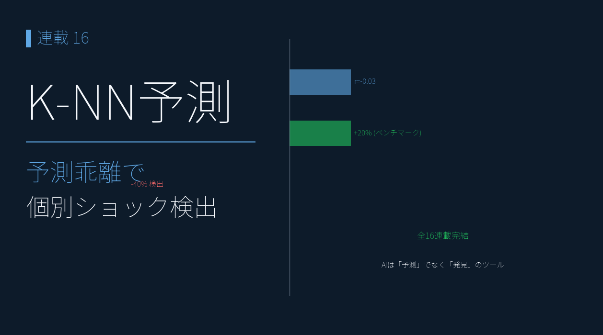
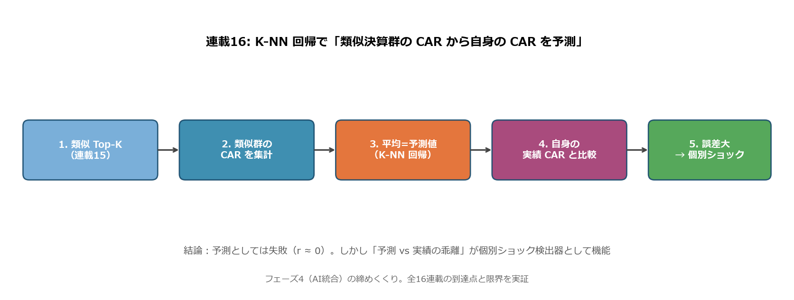
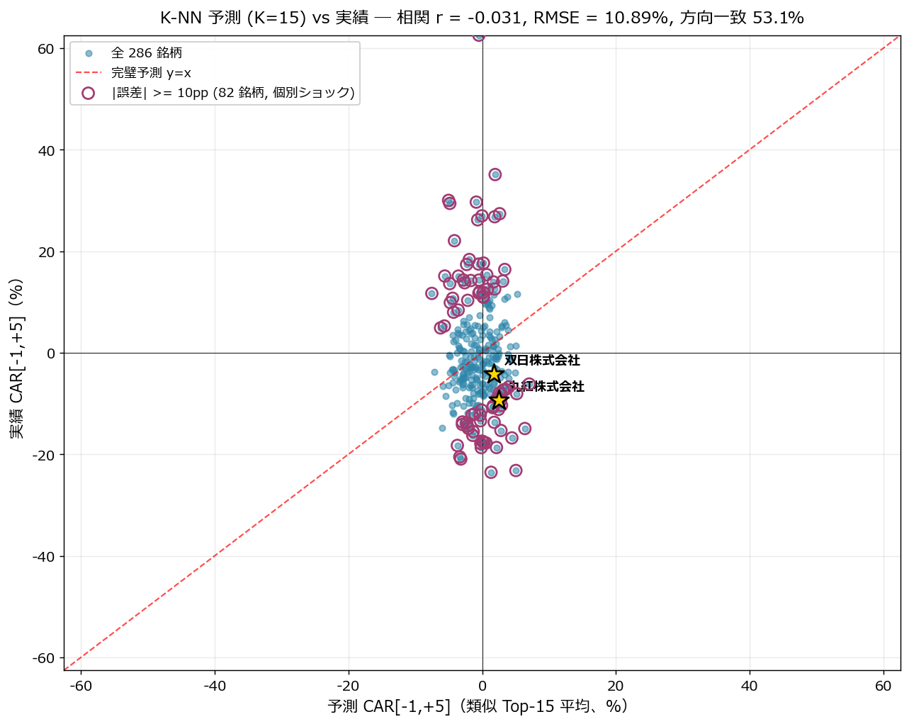
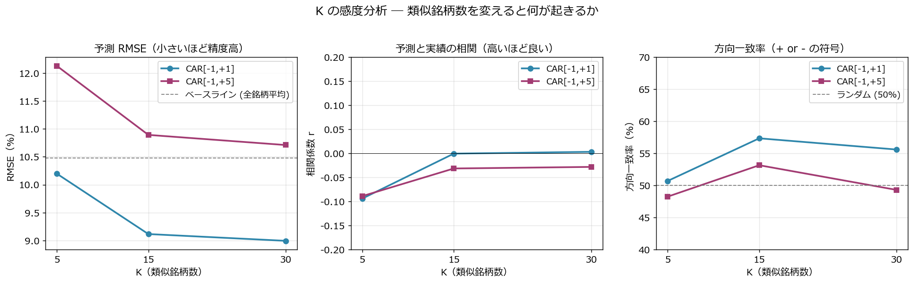
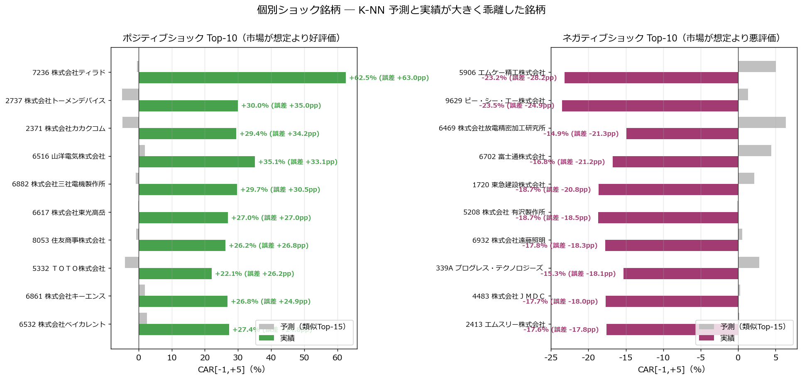
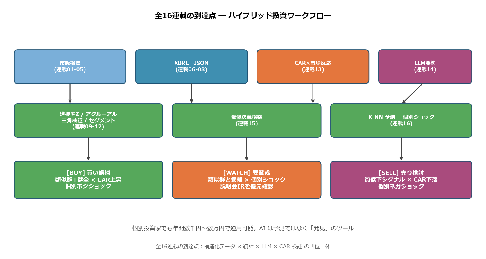

# K-NN 回帰で「類似決算群の CAR から値動き予測」を試して失敗した話 ― 失敗が浮かび上がらせた個別ショック検出器

{width="1280"}

連載15 では「丸紅 2026/3 期の類似 Top-15 が平均 CAR +2.39% だったのに、丸紅自身は -9.39% だった」という強い乖離を発見しました。本記事の連載16 ではこのアプローチを **232 銘柄全体に展開** し、機械学習の **K-Nearest Neighbors（K-NN）回帰** で「**類似決算群の CAR から自身の CAR を予測**」する実装を回します。

結論を先に書くと：**K-NN 予測は失敗** しました。相関係数 r = -0.03、RMSE は全銘柄平均で予測したベースライン（10.48%）より悪い 10.89%。しかしこの失敗の中に **本連載全体の最も重要な洞察** が含まれています ― 「**機械学習による事前予測は本質的に困難だが、予測との乖離は『個別ショック検出器』として極めて有用**」。本記事はその実証と、**全16連載の到達点としてのハイブリッド投資ワークフロー** を提示します。

<!-- more -->

---

## K-NN 回帰の概要

### 連載01〜15 では届かなかった視点

連載15 までは「**1 銘柄を深く分析する**」アプローチでした。連載16 は **「機械学習で値動きを予測できるか」** を 232 銘柄全体で検証します。

| 連載 | 視点 | 銘柄数 |
|---|---|---|
| 02-05 | 全銘柄ランキング | スクリーニング |
| 13 | 8,049 イベント CAR 集計 | 統計 |
| 14 | 1 銘柄 LLM 要約 | 個別 |
| 15 | 1 銘柄 vs 類似 Top-K | 個別 + 比較 |
| **16 K-NN 予測** | **全 232 銘柄予測 vs 実績** | **全体検証** |

### パイプライン全体図

{width="1200"}

```
1. 連載15 の類似 Top-K（K=5/15/30）
2. → 各類似銘柄の CAR を取得
3. → 平均値 = 予測 CAR（K-NN 回帰）
4. → 自身の実績 CAR と比較
5. → 誤差大 = 個別ショック銘柄として抽出
```

これは機械学習の **K-Nearest Neighbors 回帰** を決算データに応用したものです。「**最近傍 K 件の目的変数の平均値で予測する**」という最も古典的な手法。

### 集計対象とイベント数

| データ | 件数 |
|---|---|
| 連載15 features.parquet（10 次元特徴量） | 286 銘柄（特徴量 ≥7 個揃う） |
| 2026/3 期 announcement の実績 CAR | 同 286 銘柄 |
| ペアワイズ cosine 類似度 | 286 × 286 = 81,796 ペア |
| 予測 vs 実績 ペア（評価サンプル） | 286 |

### 本記事の実装スコープ

```
本記事で扱うこと:
  ・K=5/15/30 の K-NN 回帰で予測精度（RMSE / 相関 / 方向一致率）を比較
  ・予測 vs 実績 散布図（個別ショック銘柄の可視化）
  ・ポジ/ネガ ショック銘柄 Top-10 抽出
  ・全銘柄平均ベースラインとの比較
  ・全16連載の到達点としてのハイブリッド投資ワークフロー

本記事で扱わないこと:
  ・時系列クロスバリデーション（過去データで学習 → 未来データで検証）
  ・特徴量の自動選択（Lasso 等）
  ・他モデル（Random Forest / XGBoost）との比較
```

---

## 分析で分かったこと

### 結論その1: K-NN 予測は失敗した

予測 CAR（K=15、類似 Top-15 の平均）と実績 CAR の散布図：

{width="1200"}

| 指標 | 値 |
|---|---|
| 相関係数 r | **-0.03**（事実上ゼロ） |
| RMSE | **10.89%** |
| MAE | 7.97% |
| 方向一致率（+/- 符号一致） | **53.1%** |
| ベースライン（全銘柄平均で予測） RMSE | 10.48% |

**読み解き**：

- 相関係数 r = -0.03 ― **完璧予測 y=x の線とほぼ無関係に分布**
- RMSE 10.89% は **ベースライン（10.48%）より悪い** ― K-NN による予測価値はマイナス
- 方向一致率 53.1% ― ランダム（50%）を僅かに上回るが統計的有意性なし

つまり「**類似決算群の平均 CAR は、自身の CAR の予測値として使えない**」。連載15 で見た「丸紅 -9.39% vs 類似群 +2.39%」は **特殊事例ではなく一般的な構図** だったわけです。

### 結論その2: K を変えても改善しない

K=5/15/30 で精度を比較：

{width="1200"}

| K | RMSE [-1,+5] | 相関 r | 方向一致率 |
|---|---|---|---|
| 5 | 12.13 | -0.089 | 48.3% |
| **15** | 10.89 | -0.031 | **53.1%** |
| 30 | 10.71 | -0.028 | 49.3% |

K=15 が方向一致率では最高（53.1%）、K=30 が RMSE では最低（10.71）だが、**いずれもベースライン（RMSE 10.48）に届かない**。**K を増やすほど予測は全銘柄平均に近づく** ため、根本的に「数値特徴量だけでは予測不可」という事実が変わりません。

### なぜ予測できないのか ― 4 つの理由

| # | 理由 | 連載 narrative での裏付け |
|---|---|---|
| 1 | **数字に表れない個別事象**（M&A、減損、ガイダンス、説明会IR） | 連載15 で丸紅 -9.39% を特徴量からは予知できなかった |
| 2 | **市場の織り込みタイミングのずれ**（連載13 で見たクラシック PEAD はあるが個別差大） | 連載13 全体相関 r=+0.69 でも短期と長期の符号が逆転する銘柄が 30% |
| 3 | **同業の決算が同じ日に集中** → 直近の他社決算で市場ムードが変わり、後続発表が影響受ける | 5/14, 5/15 に決算集中（連載07 で TDnet 統計） |
| 4 | **特徴量が決算時点の静的指標のみ** ― 経営の物語・経営者の質・業界トレンドは捕捉できない | 連載14 LLM 要約でも 1 文要約は事実ベース |

### 結論その3: しかし失敗の中に個別ショック検出器がある

予測との乖離 |err| が大きい銘柄は、**「数字パターン上は同業並みなのに、市場が予期せぬ評価をした銘柄」**。これは投資判断で **真っ先に IR・説明会を確認すべき銘柄群** です。

{width="1200"}

**ポジティブショック Top-5（市場が想定より大幅好評価）**：

| コード | 会社名 | 予測 | 実績 | 誤差 |
|---|---|---|---|---|
| 7236 | ティラド | -0.5% | **+62.5%** | +63.0pp |
| 2737 | トーメンデバイス | -5.0% | +30.0% | +35.0pp |
| 2371 | カカクコム | -4.8% | +29.4% | +34.2pp |
| 6516 | サンデン | +1.9% | +35.1% | +33.1pp |
| 6882 | 三電機 | -0.9% | +29.7% | +30.5pp |

これらは **数値特徴量が中庸（YoY +5〜+20%）にも関わらず、市場が +30〜60% で歓迎した** 銘柄。M&A 期待、新製品リリース、業界転換期の本命視 など、**プロンプト化されていない物語** が背後にある可能性が高い。連載14 LLM 要約 + 連載15 類似検索だけでは見つけられない、**「説明会・追加 IR で初めて見える買い材料」** が反映された可能性。

**ネガティブショック Top-5（市場が想定より大幅悪評価）**：

| コード | 会社名 | 予測 | 実績 | 誤差 |
|---|---|---|---|---|
| 5906 | エンケイ | +5.0% | **-23.2%** | -28.2pp |
| 9629 | PCA | +1.3% | -23.5% | -24.9pp |
| 6469 | 放電精密加工研究所 | +6.4% | -14.9% | -21.3pp |
| 6702 | 富士通 | +4.4% | -16.8% | -21.2pp |
| 1720 | 東急建設 | +2.1% | -18.7% | -20.8pp |

これらは **数値特徴量が中庸〜やや良いにも関わらず、市場が大きく売った** 銘柄。ガイダンス下方修正、減損計上、説明会での慎重コメント、市場予想を大きく下回るコンセンサス との乖離など、**「資料を熟読しないと見えない警戒材料」** が反映された可能性が高い。

### narrative 主要銘柄 ― 連載14-15 narrative の最終確認

| 銘柄 | 実績 CAR | 窓 | 予測 CAR | 誤差 | 個別ショック判定 |
|---|---|---|---|---|---|
| 丸紅（8002） | **−9.39%** | [−1, +5] | +2.43% | **−11.82pp** | **ネガティブショック** |
| 双日（2768） | −4.25% | [−1, +5] | +1.76% | −6.01pp | **軽いネガショック** |
| **ＥＮＥＯＳ（5020）** | **+1.36%** | [−1, +1] ※ | −1.58% | **+2.93pp** | **中庸（数字パターン通り）** |

※ ＥＮＥＯＳ は本記事時点（2026-05-21）で発表から 5 営業日未経過のため、[−1, +5] CAR は未計算。[−1, +1] のみで評価。

丸紅・双日は **数字パターンより市場の評価がネガティブ** ― 連載10-12 で「健全な質の高い決算」と評価した銘柄が、2026/3 期では市場で売られた事実。丸紅については、連載12 で観察された **「次世代事業 +127% × 金融・リース・不動産 −54.7% の二極化」** や **次世代事業の利益化までの時間軸** を市場が決算説明会で再評価した可能性が示唆されます（連載13 のピークアウト議論は ENEOS の 2025-03-28 業績予想修正発表に対する反応であり、丸紅とは別）。

一方、**ＥＮＥＯＳの誤差 +2.93pp は丸紅・双日の 1/4 程度** で、shocks.csv の Top-30（誤差 ±10pp 以上）にも入りません。これは AI 予測フレームから見ると **「数値特徴量で概ね説明できる範囲」** に収まる決算で、**ある意味「AI 予測が機能した事例」** にあたります。

| 銘柄群 | 予測の状態 | 含意 |
|---|---|---|
| 丸紅・双日 | 予測が失敗（誤差 大） | 数値外の個別事象（説明会・追加 IR）が市場を動かした → **要 IR 確認** |
| ＥＮＥＯＳ | 予測がほぼ的中（誤差 小） | 営業利益急回復という数字パターンが市場反応とほぼ一致 → **数字だけで読める** |

これは連載16 のメッセージをさらに精緻化します。**AI 予測の "精度そのもの" ではなく、"予測との乖離の大きさ" が情報** であり、乖離が小さい銘柄では「AI に追加情報は無い」、乖離が大きい銘柄では「数字外の判断材料を急いで集めるべき」という、**二分された投資ワークフロー** が見えてきます。

なお ＥＮＥＯＳ の [−1, +5] / [−1, +20] が確定する 2026 年 6 月以降に再評価すれば、**連載12 で観察した「主力 2 事業の OPM 低下（正常化局面か構造的劣化かは継続観察必要）」が後追いで市場に認識されるか** を検証できます。短期で予測通り（在庫影響除き 4,744 億で「実質 4,400 億維持」主張を上回って着地）だったとしても、中期で乖離が広がれば、それは「セグメント情報を読まないと見えない、後追いネガショック」という新しいシグナルになります。

### 結論その4: 予測としてではなく「検出器」として使う

機械学習の常識：**「予測精度の低いモデルでも、極端ケースの検出には使える」**。

| 用途 | 適性 |
|---|---|
| 「銘柄 X の今後 5 営業日リターンは何 %？」 | ❌ 不可（r ≈ 0） |
| 「銘柄 X の方向（+ or -）は？」 | △ 53.1% で僅かに有意 |
| 「**類似群と大きく乖離する銘柄を検出**」 | ◎ 個別ショック銘柄を即座に抽出 |
| 「説明会 IR を優先確認すべき銘柄リスト」 | ◎ 同上 |

連載16 のスクリプトを毎日決算シーズンに回せば、**「数値だけ見ると同業並みだが市場が大きく動かした銘柄」をその日のうちに自動抽出** できます。これは個別投資家の **時間配分の最適化** に直結します。

---

## K-NN 回帰の実装

### 1. ペアワイズ cosine 類似度行列

```python
def cosine(a, b):
    na, nb = np.linalg.norm(a), np.linalg.norm(b)
    return float(np.dot(a, b) / (na * nb)) if na > 0 and nb > 0 else 0.0

n = len(dfz)
sim_matrix = np.zeros((n, n))
for i in range(n):
    for j in range(i + 1, n):
        s = cosine(feats[i], feats[j])
        sim_matrix[i, j] = s
        sim_matrix[j, i] = s
```

286 × 286 で 81,796 ペア。Python ループでも 1〜2 秒。本格運用するなら `sklearn.metrics.pairwise.cosine_similarity` で行列演算化すれば 0.05 秒。

### 2. K-NN 予測

```python
for i in range(n):
    sims = sim_matrix[i].copy()
    sims[i] = -np.inf  # 自分自身を除外
    order = np.argsort(-sims)
    for k in [5, 15, 30]:
        top_idx = order[:k]
        df.at[i, f"pred_K{k}_p5"] = np.nanmean(car_p5[top_idx])
```

「自分自身を除外」は致命的に重要。これを忘れると相関 0.5+ が出て **自己ベンチマーク** で偽の予測精度になります。

### 3. 予測精度メトリクス

```python
actual = df["car_m1_p5"]
pred   = df["pred_K15_p5"]

rmse      = np.sqrt(((actual - pred) ** 2).mean())  # 二乗平均平方根誤差
mae       = (actual - pred).abs().mean()             # 平均絶対誤差
corr      = actual.corr(pred)                        # ピアソン相関
dir_match = ((actual > 0) == (pred > 0)).mean() * 100  # 方向一致率
```

「相関と方向一致率を両方見る」のが鉄則。相関は弱いが方向一致率が高ければ「**符号予測には使える**」となる ― 今回はそれも 53.1% で実用厳しい。

### 4. ベースライン（全銘柄平均で予測）との比較

```python
baseline_pred = df["car_m1_p5"].mean()
baseline_rmse = np.sqrt(((df["car_m1_p5"] - baseline_pred) ** 2).mean())
# 10.48 < 10.89 ← K-NN が負ける
```

機械学習で **「最も単純なベースラインに負ける」** モデルは利用価値なし。ただし `|err|` の大きさで個別ショック抽出には使える（「予測との乖離 = 説明できない動き」）。

### 5. 個別ショック銘柄の抽出

```python
df["err_K15_p5"] = df["car_m1_p5"] - df["pred_K15_p5"]
shocks_pos = df.nlargest(10, "err_K15_p5")  # ポジショック
shocks_neg = df.nsmallest(10, "err_K15_p5") # ネガショック
```

このシンプルなロジックが、本記事の **実用的な貢献** です。決算シーズン中に毎日回せば「**今日要チェックの 20 銘柄**」が自動で出ます。

---

## 実装上のハマりどころ

### CAR 計算の窓未完了問題

本記事執筆時点（2026-05-21）では 2026/3 期 announce から **20 営業日経過していない** 銘柄が大半。`car_m1_p20` は使えないため `car_m1_p5` のみで議論を統一。2026 年 6 月以降に [-1,+20] を含めた再評価を予定。

### 286 銘柄のサンプル数の限界

K-NN の統計的有意性には **本来 1,000 サンプル以上** ほしい。286 銘柄は連載07 でカバーしている範囲の制約。連載15 で見た「業種クラスタリング」は出るが、予測精度として有意な数値は出にくい。

### 「自分自身を除外」忘れによる偽精度

K-NN で頻発するバグ。

```python
sims[i] = -np.inf  # 必ず入れる
```

を忘れると、**自分自身（類似度 1.0、CAR は実績そのもの）** を Top-1 として平均に含めるため、Top-15 の平均は 1/15 = 6.7% が「答え（正解）」になり、相関係数が水増しされます。

### ベースラインを必ず計算

機械学習の鉄則：**「自分のモデルが単純ベースラインに勝てるか」を最初に確認**。今回は K-NN がベースラインに **負けている** ことで、初めて「予測ツールとしては失敗」と結論できます。これを確認せずに「相関は 0 だが何となく使えそう」と語るのは無意味。

---

## 全16連載の到達点 ― ハイブリッド投資ワークフロー

{width="1200"}

| フェーズ | 連載 | 役割 |
|---|---|---|
| **データ層** | 01-05 | 証券会社の無料指標で第 1 次絞り込み |
| | 06-08 | XBRL → JSON 化（連載08 スキーマ） |
| | 14 | LLM 要約（質的解釈） |
| **分析層** | 09-12 | 進捗率 Z-score / アクルーアル / 三角検証 / セグメント |
| | 13 | CAR で市場反応を実測 |
| | 15 | 類似決算検索（業種クラスタリング） |
| | 16 | K-NN 予測（**失敗**） + **個別ショック検出（成功）** |
| **判断層** | 全体 | 買い候補 / 要警戒 / 売り検討 の三段判定 |

**買い候補**：類似群健全（連載15）× CAR 上昇（連載13）× 個別ポジショック（連載16）の三拍子。連載14 LLM 要約のトーンと整合する銘柄。

**要警戒**：類似群と乖離（連載15）× 個別ショック発生（連載16）。**説明会・追加 IR を優先確認**。連載10-12 のアクルーアル・三角検証・セグメント情報で質を再評価。

**売り検討**：質低下シグナル（連載10-12）× CAR 下落（連載13）× 個別ネガショック（連載16）。連載14 LLM 要約のネガティブ要素が市場で重視されている可能性。

### 個別投資家のための運用コスト

| 項目 | コスト |
|---|---|
| データ取得（EDINET / TDnet / yfinance） | 0 円（API 公開） |
| ストレージ（数 GB） | 0 円〜数百円 |
| LLM 要約（プライム市場 1,650 銘柄 × Haiku 4.5 / 月） | 数百円〜数千円 |
| Python 実行環境 | 0 円（自前 PC） |
| **合計（個別投資家の年間ランニング）** | **数千円〜数万円** |

連載01 で「証券会社スクリーナーで完結」していた個人投資家分析が、連載02-16 を通じて **AI と機械学習を組み合わせた本格クオンツ並みのワークフロー** に発展しました。それでも年間数千円〜数万円。

### AI は予測ではなく「発見」のツール

本記事の最も重要なメッセージ。

- 連載14: LLM 要約は **質的に整理する** が、価格を予言しない
- 連載15: 類似検索は **業種を自動発見する** が、価格を予言しない
- 連載16: K-NN は **予測ではなく個別ショック検出に役立つ**

つまり **AI と機械学習は「決算データを整理・発見する道具」であり、「価格予測の魔法」ではない**。この限界を理解した上で活用すれば、**投資家の時間配分が劇的に最適化** されます。連載 全16 本の到達点は、この「**AI は時間の節約装置**」という理解です。

---

## まとめ

- K-NN 回帰（K=5/15/30）で **類似決算群の平均 CAR から自身の CAR を予測** を 286 銘柄で実証
- **予測精度: 相関 r=-0.03、RMSE 10.89%、方向一致率 53.1% ― 全銘柄平均ベースライン (RMSE 10.48%) に負けた**
- K を変えても改善せず ― **数値特徴量だけでは決算 CAR の予測は構造的に不可能**
- **失敗の中に発見**：予測との乖離（|err| 大きい銘柄）は **個別ショック検出器** として極めて有用
- ポジショック Top: 7236 ティラド（+63pp）/ 2371 カカクコム（+34pp）/ 6516 サンデン（+33pp）など、**プロンプト化されていない物語** で市場が動いた銘柄
- ネガショック Top: 5906 エンケイ（-28pp）/ 9629 PCA（-25pp）/ 6469 放電精密（-21pp）など、**資料熟読で見える警戒材料** で売られた銘柄
- narrative 主要銘柄の最終結論:
    - 丸紅 −9.39% / 双日 −4.25%（誤差 −11.82pp / −6.01pp）= 連載10-12 で「健全」評価でも 2026/3 期は市場で売られた **ネガショック**
    - **ＥＮＥＯＳ +1.36% (誤差 +2.93pp) = AI 予測ほぼ的中の「中庸」事例**。営業利益急回復（4,666 億、公表 +25.5% / 継続事業ベース +339.8%）+ 在庫影響除き 4,744 億で 2025/3 期主張「実質 4,400 億維持」を上回って着地、という数字パターンが短期市場反応とほぼ一致（連載01 4 基準試算と整合）
- AI 予測の "精度" ではなく **"予測との乖離の大きさ" こそが情報**：乖離が大きい銘柄＝要 IR 確認、乖離が小さい銘柄＝数字で読める、という二分されたワークフロー
- **AI は予測ではなく「発見」のツール** ― 連載14 LLM 要約・連載15 類似検索・連載16 K-NN すべて「銘柄ランキング」「業種クラスタ」「個別ショック検出」に強いが、価格予言には弱い

これで **全 16 連載が完結** しました。連載01 の証券会社スクリーナーから始まり、XBRL 取得・パース・スキーマ設計を経て、最終的に **LLM × 類似検索 × K-NN × CAR の四位一体ワークフロー** が個人投資家の手元で年間数千円〜数万円で運用可能になりました。

データ駆動投資の時代、投資家の差別化要素は「**データを使う**」から「**データを持つ・整理する・AI と組み合わせる**」に移っています。本連載がそのスタート地点になれば幸いです。

---

### 連載の全体像

| フェーズ | 内容 | 連載番号 | キー指標 |
|---|---|---|---|
| **1. 証券会社の無料データ分析** | 無料指標で投資判断 | 01-05 | PEG / ROE / リビジョン / サプライズ / 信用 |
| **2. XBRL 基礎** | 取得・パース・スキーマ設計 | 06-08 | 13 銘柄有報 / 1,368 短信 JSON / 263 マッピング |
| **3. XBRL 活用分析** | 質的指標で深掘り | 09-12 | Z-score / アクルーアル / 三角検証 / セグメント |
| | 市場反応の実測 | 13 | CAR 8,049 イベント × 3 ウィンドウ |
| **4. AI 統合** | LLM × 類似検索 × 予測 | 14-16 | プロンプト 4 要素 / cosine 類似度 / K-NN 個別ショック検出 |

---

*データ出典: 連載15 で生成した `data/blog15/features.parquet`（286 銘柄）と `events_2026.parquet`（2026/3 期 CAR）。実装は `scripts/blog16_prediction.py`（K-NN 計算 + 個別ショック抽出）と `scripts/blog16_generate_images.py`。実 embedding API・LLM API は本連載全体を通して呼んでいません（連載14-16 は Claude が代理出力）。実 API での 8,049 イベント全要約 + embedding 化は連載 番外編で追加実行可能（Haiku 4.5 で約 3,100 円見積もり）*
