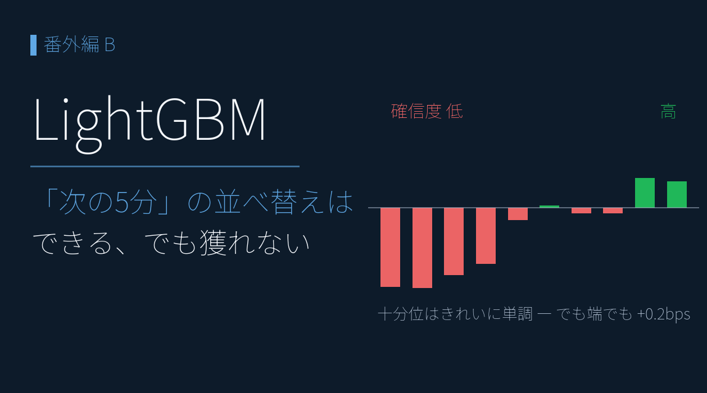
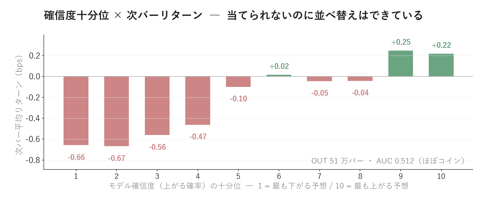
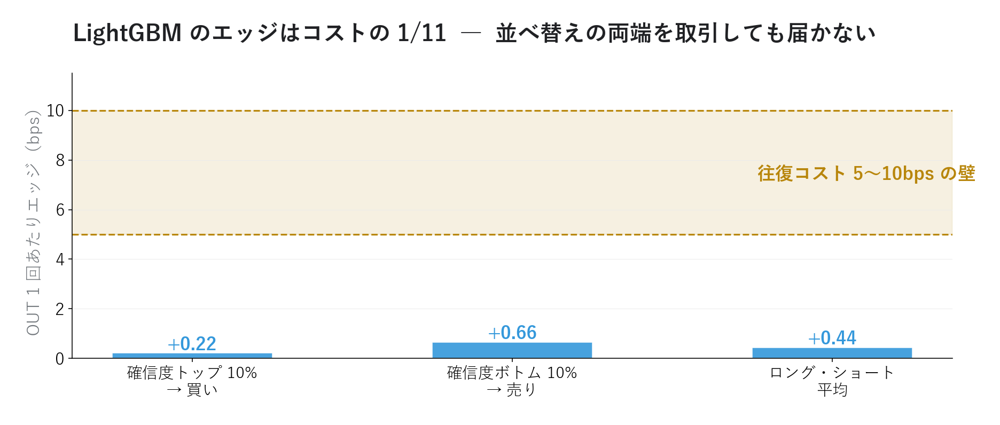

# LightGBM で「次の5分」を当てられるか ― 111万バーで検証

{width="1280"}

前回（番外編A）、超短期の定番シグナルを 1 本ずつ検証すると、コスト控除後に残ったのは場中開示のドリフトだけでした。では「**個別ルールで弱いなら、機械学習に全部まとめて学習させればいいのでは？**」― 実務でも定番の発想です。本記事は LightGBM（勾配ブースティングの定番ライブラリ）にその仕事をさせ、**何ができて、何ができないか** を数字で確かめます。

データ出典: 番外編A と同じ 5 分足・流動性上位 300 銘柄（2025-11-21〜2026-05-29）。学習 111 万バー（〜2026-03-31）→ 検証 51 万バー（2026-04-01〜、境界 1 日はパージ）。実装は `blog21_scalping_ml.py`

<a class="ref-card ref-card--quiet" href="https://lightgbm.readthedocs.io/en/stable/" target="_blank" rel="noopener">

LightGBM とは
決定木ベースの高速な勾配ブースティング・フレームワーク ― 公式ドキュメント

</a>

<!-- more -->

## LightGBM で「次の 5 分の上下」を分類する

問題設定は素直な 2 値分類です ― **「次の 5 分バーは上がるか、下がるか」**。

- **特徴量は 8 個**：直近リターン 4 本（5 分・15 分・30 分・1 時間）、直近 1 時間のボラ、出来高の偏り、時間帯（バー位置）、当日の寄りギャップ
- 学習は前半 4 ヶ月の **111 万バー**、答え合わせは後半 2 ヶ月の **51 万バー**（学習に未来は混ぜない）
- 評価は AUC・的中率に加え、**確信度上位だけ取引した場合のコスト控除後損益** を主役に

## 結果 ― 並べ替えはできる、的中はコイン並み

<i class="fa-solid fa-expand"></i> クリックで拡大 ・ 2026.06.13作成

{width="1200"}

- **AUC 0.512・的中率 50.9%** ― 多数派に張るだけ（50.5%）とほぼ同じ、実質コイン投げ
- ところが、モデルの確信度で 51 万バーを 10 グループに割ると、次バーの平均リターンは **−0.66bps → +0.22bps へおおむね右上がり**（凸凹はあるが両端の差は明瞭）
- つまり LightGBM は **「どちらに転びやすいか」の並べ替えには成功している**。ランダムなら十分位はフラットになるはず

「当てられないのに並べ替えはできる」― 矛盾ではありません。1 バーごとの上下はほぼノイズでも、**ごくわずかな傾きを 51 万バー集めれば形になる**。それが上の階段です。

## それでも獲れない ― エッジはコストの 1/11

では、その階段の両端だけ取引したら勝てるのか。

<i class="fa-solid fa-expand"></i> クリックで拡大 ・ 2026.06.13作成

{width="1200"}

- 確信度トップ 10% を買い・ボトム 10% を売り ― 1 回あたり **+0.44bps**
- 往復コスト 5bps を払うと **−4.6bps**。エッジは **コストの 1/11** しかない
- モデルが最重要視した特徴量は **時間帯（重要度 19%）** ― 番外編A で「再現しない」と確認した時間帯の癖を、機械学習も主要な手がかりに選び、同じ薄さに行き着いた

## 連載 3-4 と同じ構図

実はこの結末、見覚えがあります。連載 3-4（ランダムフォレスト × 日次 CAR）の結論は「方向の的中はコイン並み、ただし並べ替え（ランキング）には情報がある」でした。**日次でも 5 分足でも、機械学習が返す答えは同じ**です。

- 価格の方向を「当てる」道具としては機能しない ― ノイズが支配的
- 一方で **構造の発見**（どこに傾きがあるか・どの特徴が効くか）には機能する ― 今回は「時間帯」と「直近リターンの逆張り」を自力で見つけてきた
- 番外編A の結論と合わせると、超短期で残るのは **モデルの賢さではなく、イベント（場中開示）という構造**

## 正直な限界

- **約定の仮定が甘い**：バー終値で売買できた前提。確信度上位のバーは値動きが激しく、実際のスリッページはエッジをさらに削る
- **期間は 6 ヶ月・1 分割のみ**：ウォークフォワードの繰り返し検証はデータが溜まってから
- **特徴量は価格・出来高だけ**：板の偏り（OBI）や歩み値は 5 分足に写らない。秒スケールの検証は板データ取得後の課題

## まとめ

- LightGBM に 111 万バー学習させても、次の 5 分の的中は **50.9%（コイン並み）**
- ただし確信度十分位は **−0.66 → +0.22bps とおおむね右上がり** ― 並べ替え（構造の発見）はできている
- その両端を取引しても **+0.44bps/回でコスト 5bps の 1/11** ― 経済的には獲れない
- 結論は連載 3-4 と同じ：**機械学習は「当てる魔法」ではなく「構造を見つける道具」**。超短期で実際に残る構造は、番外編A の場中開示ドリフトだった

## <i class="fa-brands fa-github"></i> Python コード

本記事の検証スクリプト（特徴量生成・パージ付き IN/OUT 分割・十分位分析）は、すべて **GitHub に公開**しています。データは提供元の利用規約により再配布できませんが、データを各自取得すれば、本記事と同じものが再現できます。

<a class="repo-link" href="https://github.com/minnanosaiban/blog/tree/main/17_intraday_ml" target="_blank" rel="noopener">
github.com/minnanosaiban/blog/17_intraday_ml
<i class="repo-link-arrow fa-solid fa-arrow-up-right-from-square"></i>
</a>

---
