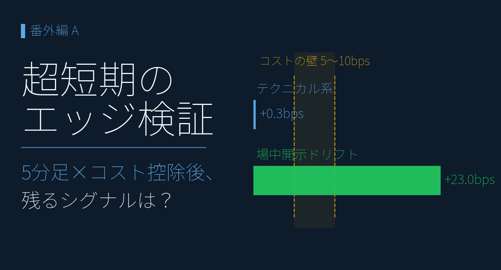
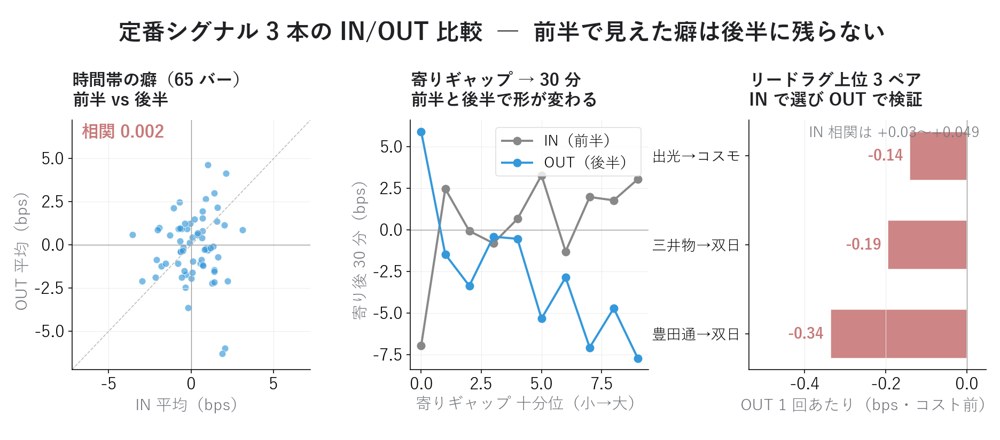
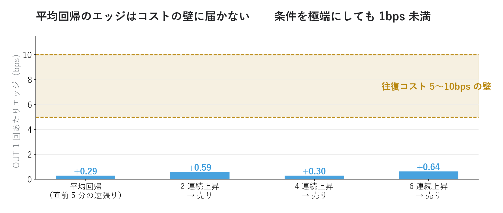
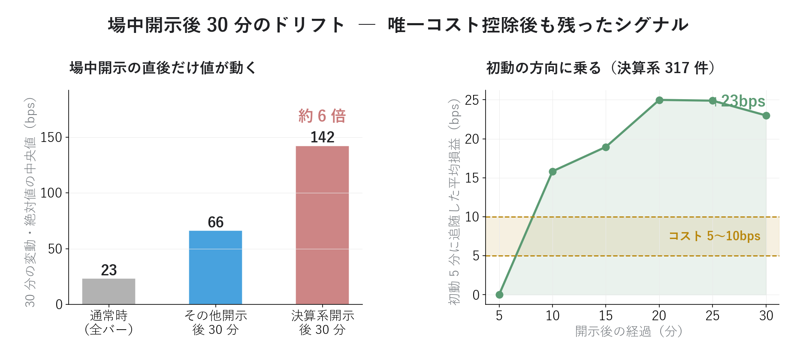

# 超短期のエッジを統計で探す ― 5分足、コスト控除後に何が残るか

{width="1280"}

「中長期が予測できないなら、数分先なら読めるはず」― 値動きの癖（時間帯・ギャップ・連れ高）は誰もが感じるところです。ただ、超短期の勝負では **予測が当たることと、コストを払って勝てることは別問題** です。本記事は、定番シグナル 5 本を同じ物差しに載せ、**往復コスト控除後に何が残るか** だけを見ます。

データ出典 自前パイプラインの 5 分足 1,525 銘柄（2025-11-21〜2026-05-29、65 本/日）から流動性上位 300 銘柄、TDnet 開示ログ（時刻付き）。検証期間は前半（〜2026-03-31）でルールを決め、後半（2026-04-01〜）で答え合わせ。実装は `blog20_scalping_stats.py` ほか

<a class="ref-card ref-card--quiet" href="https://www.asymmetrysignal.com/finance/archives/490" target="_blank" rel="noopener">

PEAD（決算発表後の株価ドリフト）とは
決算後もサプライズと同方向へ動き続けるアノマリー ― The Asymmetry Signal

</a>

<!-- more -->

## 検証の物差し ― 「コスト控除後」だけを見る

ルールはすべて共通です。

- **IN/OUT 分割**：前半 4 ヶ月（IN）でルールを決め、後半 2 ヶ月（OUT）のデータだけで成績を測る（カンニング防止）
- **主指標は往復コスト控除後の 1 回あたり損益**。大型株の実効スプレッド＋手数料として **往復 5〜10bps**（1bps = 0.01%）を仮定
- 参考スケール：5 分バー 1 本の平均変動は **約 24bps**。つまりコストはバー 1 本の変動の 2〜4 割を食う

> ⚠️ 本記事は 5 分足での検証です。秒単位のスキャルピングで主役になる板情報（気配の偏り）は 5 分足には写らないため、対象外です（→ 正直な限界）。

## 定番シグナル 3 本 ― 後半 2 ヶ月で消えた

時間帯の癖・寄りギャップ・連れ高（リードラグ）。よく聞く 3 本を IN で測り、OUT で答え合わせした結果です。

<i class="fa-solid fa-expand"></i> クリックで拡大

使用データ 5分足（流動性上位300銘柄、2025年11月〜2026年5月）

{width="1200"}

| シグナル | IN（前半）で見えたもの | OUT（後半）の答え合わせ |
|---|---|---|
| 時間帯の癖 | 寄り直後はマイナス・後場寄りに反発 等 | パターンの相関 **0.002** ＝ 再現せず |
| 寄りギャップ順張り | ギャップと寄り後 30 分に弱い正相関（+0.02） | 相関が **符号反転**（−0.04）、1 回 **−4.9bps** |
| リードラグ（元売・商社 90 ペア） | 最大でも相関 0.05（出光→コスモ） | 上位 3 ペアすべて **マイナス**（コスト前で） |

- 前半で「ありそう」に見えた癖は、後半にはもう無い ― 超短期の癖は **移ろいが速く、気づいた頃には消えている**
- リードラグは元売どうし・商社どうしでも最大 0.05。「連れ高は 5 分も待ってくれない」が実態

ギャップには続きがあります。「**寄りで 1% 以上上がったら売り**」のように閾値で絞ると、**OUT だけ見れば +7.0bps/回（+3% 超なら +8.2bps）と勝てたように見える** ― ところが同じルールは IN では **−2.4bps の負け**。直近 2 ヶ月だけ検証して「勝てるルール発見！」と思う、**バックテストの典型的な罠**がそのまま観察できました。符号が期間で反転するルールは、事前には選べません。

## 平均回帰は「ある」― それでも獲れない

唯一、統計として頑健だったのが **平均回帰**（直前 5 分の逆を張る）です。

<i class="fa-solid fa-expand"></i> クリックで拡大

使用データ 5分足（流動性上位300銘柄、2025年11月〜2026年5月）

{width="1200"}

- 7 割の銘柄で「上がった次のバーは下がりやすい」（自己相関がマイナス）
- OUT でも逆張りの的中率 **55%**、64 万回の取引で安定 ― **シグナルとしては本物**
- ところが 1 回あたりのエッジは **+0.3bps**。往復コスト 5bps の **17 分の 1** で、控除すると **−4.7bps**
- 「**連続で 2 回・4 回・6 回上がった後**」と条件を極端にしてもエッジは **0.3〜0.6bps** から濃くならない。しかも逆張りの的中率は 47〜50% ― 「下がる**回数**が増える」のではなく「下がるときの**幅**がやや大きい」だけで、体感の "そろそろ下がる" は回数の偏りではありません

「当たる」と「勝てる」の差がここに出ます。的中率 55% は立派でも、**1 回 0.003% のエッジは、スプレッドを 1 回払うだけで 17 回分消えます**。

## 場中開示だけが生き残った

最後に、テクニカルではなく **イベント** を物差しにします。TDnet の開示時刻を使い、**場中（9:00〜15:00）に決算系の開示が出た 317 件** について、直後 30 分の値動きを測りました。

<i class="fa-solid fa-expand"></i> クリックで拡大

使用データ 5分足＋TDnet開示ログ（流動性上位300銘柄、2025年11月〜2026年5月）

{width="1200"}

- 開示後 30 分の変動（絶対値の中央値）は **142bps ― 通常時（23bps）の約 6 倍**。場中開示は 5 分足ではっきり見える
- 方向は開示内容しだいでまちまち。しかし **最初の 5 分の方向に乗って残り 25 分保有** すると平均 **+23bps/回**
- 往復コスト 10bps を払っても **+13bps 残る** ― 本記事で唯一、コスト控除後にプラスが残ったシグナル
- 決算以外の開示（749 件）でも同様（+22bps/回）

これは連載 2-7 で見た「決算サプライズの方向へじわじわ動く」（PEAD）の **場中・分単位版** です。テクニカルの癖は消えても、**新情報の消化には時間がかかる** ― この構造だけは 5 分足にも残っていました。

## 正直な限界

- **約定の仮定が甘い**：5 分足の終値で売買できた前提。開示直後の急変時は不利約定・スリッページで **+13bps はさらに削られる**
- **期間は 6 ヶ月・1 区切りだけ**。決算イベントは 317 件で、地合いが変われば結果も変わりうる
- **秒の世界は未検証**：本当のスキャルピング（数秒〜数分、板の偏りで方向を読む）には板・ティックデータが必要で、5 分足では原理的に検証できない。これは次の課題

## まとめ

- 定番シグナル 3 本（時間帯・ギャップ・リードラグ）は、前半で見えても **後半 2 ヶ月で再現せず**。閾値ギャップ逆張りは「直近だけ見れば勝てたように見える」**バックテストの罠の実例**
- 平均回帰だけは統計的に本物（的中 55%）― だが **エッジ 0.3bps はコスト 5bps の 1/17** で、獲れない
- **唯一の生き残りは場中開示後のドリフト**：変動 6 倍、初動追随で **コスト控除後も +13bps/回**。PEAD の分単位版
- 超短期の主戦場は「予測」より **「コストに勝てる構造があるか」**。テクニカルには無く、イベントにはあった

次回（番外編B）は、この 5 本を個別ルールでなく **機械学習（LightGBM）にまとめて学習させたらどうなるか** を試します。

## <i class="fa-brands fa-github"></i> Python コード

本記事の検証スクリプト（5 分足キャッシュ・IN/OUT 分割・コスト控除の枠組みと 5 実験＋条件付きパターン検証）は、すべて **GitHub に公開**しています。データは提供元の利用規約により再配布できませんが、データを各自取得すれば、本記事と同じものが再現できます。

<a class="repo-link" href="https://github.com/minnanosaiban/blog/tree/main/EX-01_intraday_stats" target="_blank" rel="noopener">
github.com/minnanosaiban/blog/EX-01_intraday_stats
<i class="repo-link-arrow fa-solid fa-arrow-up-right-from-square"></i>
</a>

---
