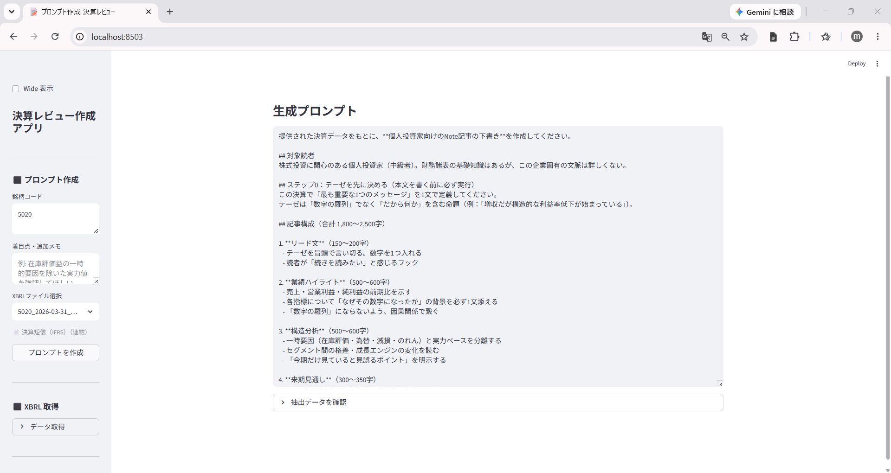

# 番外編：決算データで「Note記事の下書き」を作る ― XBRL→プロンプト生成アプリ

[1-3](01-03_xbrl_to_json.md) では決算 XBRL を JSON に正規化し、チャートで読むところまで扱いました。本番外編は、その **データ活用の延長**として、JSON から「文章（記事の下書き）」を作るステップを体験します。

決算短信・有報の JSON を所定フォルダに保存し、銘柄コードを入力するだけで **Note 記事の下書きプロンプト**を生成する Streamlit アプリです。「JSON から数字を読む」その先の「JSON から文章へ」を、手作業ゼロでつなぎます。

## 使い方 ― 4 ステップ

**― 決算 Note 記事プロンプト生成アプリ ―**

1. 決算 XBRL を取得・パースして JSON を保存（`fetch_kessan.py` / `fetch_yuho.py`）
2. 銘柄コードを入力・期を選択
3. 着目点を一言メモ（例：在庫評価益の一時要因を除いた実力値を強調）
4. 生成されたプロンプトをコピーして Claude などに貼り付ける

<i class="fa-solid fa-expand"></i> クリックで拡大

{width="1200"}

## PDF を AI に渡す方法との違い

> 「決算短信 PDF を直接 AI に貼り付ければ同じでは？」という疑問は自然です。1 社・1 回の記事作成なら PDF で十分です。ただし **社数・頻度が増えるほど差が開きます**。
>
> | | PDF → AI（手作業） | XBRL アプリ |
> | --- | --- | --- |
> | **取得** | TDnet で 1 社ずつ DL → AI にアップロード | `fetch_kessan.py` でコードを指定して自動 DL |
> | **数値の正確性** | AI の PDF 読み取りに依存 | XBRL 構造化データから取得・計算済み |
> | **前期比・予算比** | AI が推算（小数点で誤差が出ることがある） | 計算値をそのまま渡すため誤差ゼロ |
> | **後発事象・ガイダンス前提** | PDF 全体を渡さないと抜けることがある | `qualitative.htm` から自動抽出 |
> | **複数社の定点観測** | 毎期、全社分の DL → UL を繰り返す | JSON が蓄積されるため追加取得のみ |
> | **記事の自動化** | 手動コピペが前提 | API（Claude 等）を呼べばバッチ処理も可能 |
>
> PDF 方式は「今すぐ 1 社だけ」に最適です。XBRL 方式は **連載で 10 社以上を毎期追う** ような用途で真価を発揮します。また Claude API を組み込めば、取得 → 変換 → 記事生成までをスクリプト 1 本で完結させることもできます。

## <i class="fa-brands fa-github"></i> Python コード

本アプリ・データ取得・成形スクリプトは、すべて **GitHub に公開**しています。データは提供元の利用規約により再配布できませんが、データを各自取得すれば、本連載と同じものが再現できます（動かし方はリポジトリの README 参照）。

<a class="repo-link" href="https://github.com/minnanosaiban/blog/tree/main/EX-03_kessan_note_app" target="_blank" rel="noopener">
github.com/minnanosaiban/blog/EX-03_kessan_note_app
<i class="repo-link-arrow fa-solid fa-arrow-up-right-from-square"></i>
</a>

---
