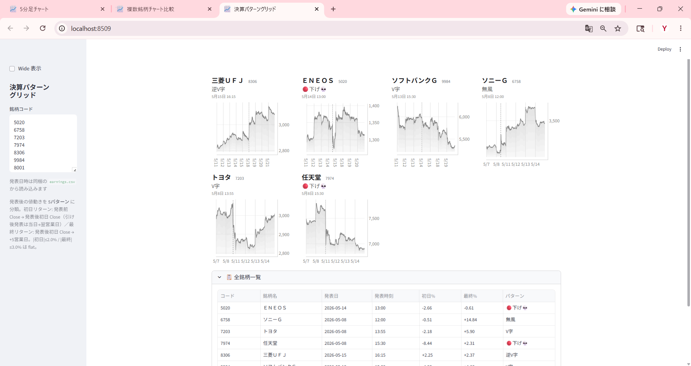

<!--
========================================================================
【再構成ドラフト】新・連載02（フェーズ1 データ取得編）
  旧05 の TDnet/CSV 部分 + 旧06/07 の「XBRL取得」部分 + app3 を再編
  最終ファイル名（番号振り直し後）: 02_collect_other_data.md
  画像の最終置き場: img/02_collect/（暫定で img/05_charts, img/07_pipeline を参照）
========================================================================
-->
---
date: 2026-05-19
categories:
  - データ取得
tags:
  - TDnet
  - EDINET
  - XBRL
  - 決算短信
  - コンセンサス
---

# 株価以外も取得しよう ― 決算発表日時・無料指標・XBRL

{width="1280"}

株価だけでは決算は語れません。**いつ決算が出たか（発表日時）**、**証券会社が無料で配る業績指標**、そして **決算書そのもの＝ XBRL**。この 3 系統がそろえば、後半の分析の材料が出そろいます。

本記事では株価以外のデータの取り方を一通り押さえ、最後に「**取得したデータだけで作れる**」決算チャートまで作ります。

<!-- more -->


## 概要 ― 4 つのデータソース

| ソース | 取得元 | 形式 | 主な用途 |
| --- | --- | --- | --- |
| 決算発表日時 | TDnet 適時開示 | HTML | 決算イベントの起点（t=0） |
| 業績指標 | 証券会社の無料銘柄情報シート | CSV | EPS / ROE / 業績予想修正率(予) など |
| 有価証券報告書 | EDINET 公式 API | XBRL | 過去 5〜7 年の時系列 |
| 決算短信 | TDnet | XBRL | 発表直後の速報値 |

- **EDINET** ＝ 金融庁公式。長期時系列の有報。公式 API で取得（無料登録）
- **TDnet** ＝ 取引所。決算短信・適時開示。公式 API がないのでスクレイピング
- XBRL の中身（→ JSON 変換と分析）は次回連載03 で扱います。本記事は **取り方** に集中します


## 決算発表日時 ― TDnet

決算が **いつ出たか** は、後半のイベント分析（連載12 CAR イベントスタディなど）の起点になります。TDnet の適時開示ページから、決算短信のリンクと発表日時を拾います。

```python
import re, requests
from bs4 import BeautifulSoup

url = f"https://www.release.tdnet.info/inbs/I_list_001_{target_date}.html"
soup = BeautifulSoup(requests.get(url, headers={"User-Agent": "Mozilla/5.0"}).text, "html.parser")
# 決算短信のリンクと発表時刻を抽出し、date, time, code の3列で earnings.csv に保存
```

> ⚠️ TDnet は商用利用・データ転売が禁止です。個人の投資判断目的に限り、アクセス間隔を 1 秒以上空けるなどマナーを守って使用してください。


## 証券会社が無料で提供する業績指標

連載04〜07（PEG × ROE・マルチファクターなど）で「予想」「コンセンサス」として使う指標は、証券会社が無料で提供する **銘柄情報シート** から CSV でエクスポートできます。

- EPS / BPS / 配当 / ROE / ROA / EV/EBITDA / **業績予想修正率(予)** / 経常利益変化率(予) など
- 楽天証券・マネックス証券・SBI 証券・会社四季報などが同等の指標を提供
- 指標番号付きのファイル（例: `113_EPS実績.csv`、`213_EPS予想.csv`）で保存される

> 本記事以降の「予想」は **アナリストのコンセンサス値** で、企業公式の業績予想とは異なります。


## 決算書そのもの ― XBRL を取る

決算短信・有報には、人間用の PDF と並んで **必ず XBRL**（タグ付きデータ）が同時提出されています。これが「決算書そのもの」です。

XBRL は **2 経路 × 3 ステップ**（ZIP 取得 → 解凍 → JSON 化）で入手します。

{width="1200"}

**EDINET（有報）** は公式 API の 2 ステップです。

```python
# 1) 指定日の書類インデックス → 2) XBRL ZIP を取得（type=5）
res = requests.get(f"https://disclosure.edinet-fsa.go.jp/api/v2/documents/{doc_id}",
                   params={"type": 5, "Subscription-Key": API_KEY})
```

| type | 内容 |
| --- | --- |
| 1 | 本文 PDF |
| 2 | XBRL（旧形式） |
| **5** | **XBRL_TO_CSV**（パース済み CSV を同梱）← 本連載で採用 |

**TDnet（短信）** は PDF の URL を ZIP の URL に変換して取得します（公式 API がないため）。

最新の有報 1 つに **過去 5 期分の要約**が入っているのも EDINET の強力な仕様です。ＥＮＥＯＳ の 7 年データは、たった **3 つの書類**から組み立てられます。

{width="1200"}


## 取得データを可視化する ― 決算パターングリッド

ここまでで取れた **発表日時（本記事）** と **5分足株価（連載01）** だけで、決算後の値動きを可視化できます。発表後の動きを 5 パターン（🟢上げ / 逆 V 字 / 無風 / V 字 / 🔴下げ）に自動分類するアプリです。

<small style="color: var(--md-link-color);"><i class="fa-solid fa-expand"></i> クリックで拡大できます</small>

{width="1200"}

- **初日リターン**（発表前 Close → 発表後初日 Close）と **最終リターン**（+5 営業日）で分類
- 引け後発表は当日 Close → 翌営業日 Close、場中・寄り前発表は前営業日 Close → 当日 Close で **起点を切替**
- 各カードの 5分足チャートに、発表時刻の **縦点線**

> 💡 ここで直感的に眺めた「決算後の値動き」を、連載12 では TOPIX・セクター調整した **異常リターン（CAR）** として定量化します。


## まとめ

- 株価以外は **発表日時（TDnet）・業績指標 CSV（証券会社）・XBRL（EDINET / TDnet）** の 3 系統
- EDINET ＝ 公式 API / 長期有報、TDnet ＝ スクレイピング / 速報短信。XBRL は `type=5` で **パース済み CSV 同梱**
- 最新有報 1 つに 5 期分内包 ― ＥＮＥＯＳ の 7 年は **3 書類**で揃う
- 取得済みの **発表日時 ＋ 5分足** だけで、**決算パターングリッド**まで作れる

次回は取得した **XBRL を JSON に変換して分析** します。既存サービスにない切り口を作ります。


## Appendix ― Python コード <i class="fa-brands fa-github"></i>

取得スクリプト（TDnet スクレイピング・EDINET API・XBRL ダウンロード）と決算パターングリッドを **GitHub に公開**しています。

> <i class="fa-brands fa-github"></i> **リポジトリ** [`github.com/minnanosaiban/blog/05_charts`](https://github.com/minnanosaiban/blog/tree/main/05_charts)

#### Chart 3 ― 決算パターングリッド（app3.py + earnings.csv）

ローカル保存の 5分足 parquet と発表日時 `earnings.csv` を組み合わせて、発表後の値動きを 5 パターン分類。発表時刻ベースで起点を切り替えます。

> 🔗 [`github.com/minnanosaiban/blog/05_charts/app3.py`](https://github.com/minnanosaiban/blog/blob/main/05_charts/app3.py)

<!-- TODO: EDINET/TDnet 取得スクリプト（collectors）の公開リポジトリのパスを確定して差し替え -->

---

*データ出典: TDnet 適時開示（発表日時）/ 証券会社が無料で提供する銘柄情報シート CSV / EDINET API（金融庁）の有報 XBRL / TDnet の決算短信 XBRL*
